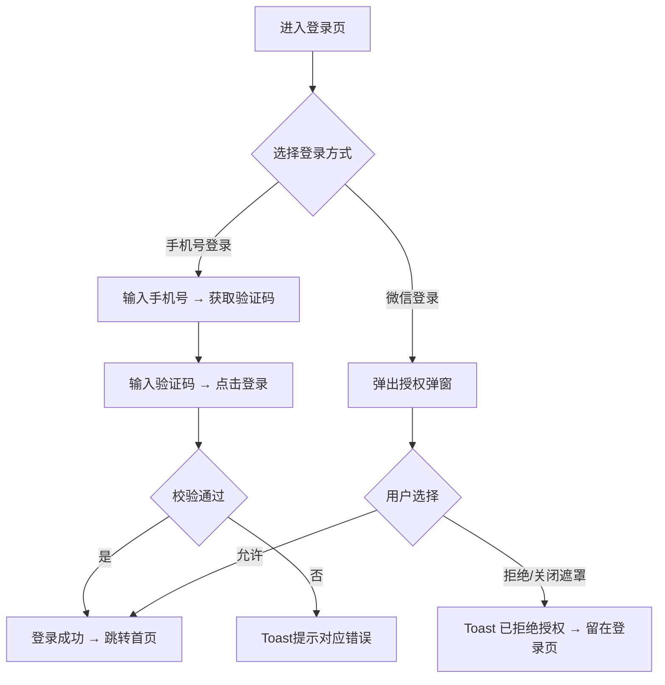
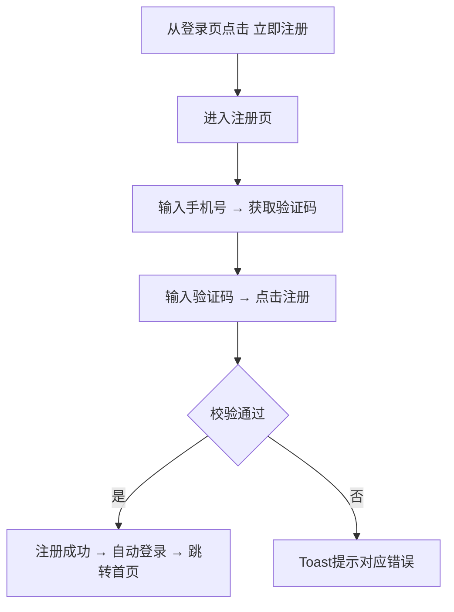

# 苏银豆商城小程序 - 产品需求文档

# 1. 需求背景

---

# 2. 需求分析

---

# 3. 系统流程图

---

# 4. 详细需求

## 4.1. 苏银豆商城小程序

### 4.1.1. 用户登录注册模块

---

#### 4.1.1.1. 登录页

##### 1. 功能概述

登录页是商城的唯一身份认证入口，提供手机号验证码登录和微信授权登录两种方式。用户在未登录状态下点击"我的"Tab、或从设置页退出登录后，会跳转到此页面。登录成功后自动跳转首页。页面底部提供"立即注册"入口，引导新用户完成注册。

##### 2. 页面结构

页面从上到下分为四个区域：品牌标识区、登录表单区、第三方登录区和底部引导区。

| 区域 | 说明 |
|------|------|
| 品牌标识区 | 渐变背景卡片，展示星形图标、"苏银豆商城"标题和"江苏银行专属积分商城"副标题 |
| 登录表单区 | 手机号输入框 + 验证码输入框（含获取验证码按钮）+ 协议勾选 + 登录按钮 |
| 第三方登录区 | "其他登录方式"分隔线 + 微信登录图标按钮 |
| 底部引导区 | "还没有账号？立即注册"链接，跳转注册页 |

此外包含一个微信授权弹窗（默认隐藏）：半透明遮罩 + 居中白色卡片，展示微信图标、"微信授权登录"标题、授权说明文案、用户头像预览，以及"拒绝"和"允许"两个按钮。点击弹窗外部遮罩可关闭。

##### 3. 操作流程

用户可选择手机号登录或微信登录两种方式：

验证码按钮点击后进入60秒倒计时，按钮文案变为"{n}s后重试"，倒计时结束恢复"获取验证码"。登录校验按顺序执行：手机号格式 → 验证码非空 → 协议勾选，任何一步不通过即停止并弹出对应 Toast。

##### 4. 字段与交互

| 字段名称 | 字段标识 | 字段类型 | 必填 | 数据类型 | 长度限制 | 默认值 | 校验规则 | 取值范围 | 来源 | 错误提示 |
|----------|----------|----------|------|----------|----------|--------|----------|----------|------|----------|
| 手机号 | phone_number | 文本输入(tel) | 是 | String | 11位 | 空 | 11位纯数字 | 0-9 | 用户输入 | 为空：请输入手机号；格式错：请输入正确的手机号 |
| 验证码 | verify_code | 文本输入 | 是 | String | 6位 | 空 | 6位数字，非空 | 0-9 | 用户输入 | 请输入验证码 |
| 获取验证码 | send_code | 按钮 | - | - | - | "获取验证码" | 先校验手机号格式，通过后发送并进入60s倒计时，显示"{n}s后重试" | - | - | 手机号格式错：请输入正确的手机号 |
| 协议勾选 | agreement | 复选框 | 是 | Boolean | - | 勾选 | 必须为true，文案含"用户协议"和"隐私政策"可点击链接 | true/false | 用户操作 | 请同意用户协议和隐私政策 |
| 登录 | login_btn | 按钮 | - | - | - | - | 按顺序校验：手机号→验证码→协议，通过后写入登录态跳转首页 | - | - | 显示第一个未通过字段的错误提示 |
| 微信登录 | wechat_login | 按钮 | - | - | - | - | 点击弹出授权弹窗（含遮罩关闭） | - | - | - |
| 拒绝授权 | auth_reject | 按钮 | - | - | - | - | 关闭弹窗，Toast提示后留在当前页 | - | - | 已拒绝授权 |
| 允许授权 | auth_allow | 按钮 | - | - | - | - | 关闭弹窗，模拟登录成功，写入登录态跳转首页 | - | - | - |

##### 5. 业务规则

| 规则编号 | 规则描述 |
|----------|----------|
| RULE-LOGIN-001 | 登录成功后写入本地登录态，后续页面请求携带用户身份信息 |
| RULE-LOGIN-002 | 微信授权弹窗当前为模拟流程（静态原型阶段），点击"允许"直接模拟登录成功，未对接真实微信API |
| RULE-LOGIN-003 | 验证码发送后60秒内不可重复请求，倒计时结束才可再次获取 |

##### 6. 页面跳转

**入口**：
- 未登录态点击底部Tab"我的"
- 设置页退出登录后自动跳转

**出口**：
- 手机号登录成功 → 首页（home_page.html）
- 微信授权成功 → 首页（home_page.html）
- 点击"立即注册" → 注册页（register.html）

---

#### 4.1.1.2. 注册页

##### 1. 功能概述

注册页提供手机号验证码快速注册流程，无需设置密码。注册成功后自动登录并跳转首页，不需要再回到登录页重新登录。用户从登录页点击"立即注册"进入此页面。

##### 2. 页面结构

页面顶部是导航栏（返回按钮 + "注册账号"标题），下方是注册表单区和底部引导区。

| 区域 | 说明 |
|------|------|
| 导航栏 | 返回按钮（跳转登录页）+ 标题"注册账号" + 副标题"注册成为苏银豆商城会员" |
| 注册表单区 | 手机号输入框 + 验证码输入框（含获取验证码按钮）+ 协议勾选 + 注册按钮 |
| 底部引导区 | "已有账号？立即登录"链接，跳转登录页 |

##### 3. 操作流程

校验逻辑与登录页一致：手机号格式 → 验证码非空 → 协议勾选。注册成功后弹出 Toast "注册成功"，然后自动写入登录态并跳转首页。

##### 4. 字段与交互

| 字段名称 | 字段标识 | 字段类型 | 必填 | 数据类型 | 长度限制 | 默认值 | 校验规则 | 取值范围 | 来源 | 错误提示 |
|----------|----------|----------|------|----------|----------|--------|----------|----------|------|----------|
| 手机号 | phone_number | 文本输入(tel) | 是 | String | 11位 | 空 | 11位纯数字 | 0-9 | 用户输入 | 为空：请输入手机号；格式错：请输入正确的手机号 |
| 验证码 | verify_code | 文本输入 | 是 | String | 6位 | 空 | 6位数字，非空 | 0-9 | 用户输入 | 请输入验证码 |
| 获取验证码 | send_code | 按钮 | - | - | - | "获取验证码" | 先校验手机号格式，通过后发送并进入60s倒计时 | - | - | 手机号格式错：请输入正确的手机号 |
| 协议勾选 | agreement | 复选框 | 是 | Boolean | - | 勾选 | 必须为true，含"用户协议"和"隐私政策"可点击链接 | true/false | 用户操作 | 请同意用户协议和隐私政策 |
| 注册 | register_btn | 按钮 | - | - | - | - | 按顺序校验：手机号→验证码→协议，通过后Toast"注册成功"并自动登录跳转首页 | - | - | 显示第一个未通过字段的错误提示 |

##### 5. 业务规则

| 规则编号 | 规则描述 |
|----------|----------|
| RULE-REG-001 | 注册仅需手机号+验证码，不设置密码，降低注册门槛 |
| RULE-REG-002 | 注册成功即自动登录，直接跳转首页，不返回登录页 |
| RULE-REG-003 | 同一手机号不可重复注册（需后端校验，静态原型阶段不模拟此场景） |

##### 6. 页面跳转

**入口**：
- 登录页点击"还没有账号？立即注册"

**出口**：
- 注册成功 → 首页（home_page.html）
- 点击返回按钮 → 登录页（login.html）
- 点击"已有账号？立即登录" → 登录页（login.html）

