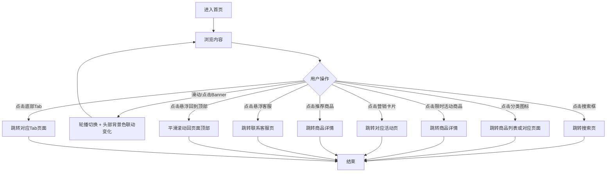

# PRD_02_首页.md

> 本文件为独立章节，最终合并至完整PRD文档。

---

### 4.1.2. 首页模块

---

#### 4.1.2.1. 首页

##### 1. 功能概述

首页是用户打开小程序后看到的第一个页面（登录/注册后自动跳转至此），承载商品发现和核心业务入口的功能。页面从上到下包含：头部搜索栏、Banner轮播（背景色随轮播切换）、公告通知、分类导航（两页滑动）、限时活动区、营销卡片、推荐商品列表，底部固定Tab导航栏。

##### 2. 页面结构

页面整体为单列滚动布局，顶部和底部有固定区域。

| 区域 | 说明 |
|------|------|
| 头部搜索栏 | 红/橙渐变背景，展示"苏银豆商城"标题+金色圆点图标、搜索框（点击跳转搜索页）、微信胶囊按钮。背景色随Banner轮播联动变化 |
| Banner轮播 | 3张运营位Banner，自动轮播4秒/张，支持左右滑动切换，底部圆点指示器。轮播时头部背景色同步切换 |
| 公告通知栏 | 橙色背景横条，喇叭图标+滚动文字（用户中奖、平台福利等信息自动轮播） |
| 分类导航 | 白色圆角卡片，10个分类图标分两页展示（5×2网格），支持左右滑动翻页，底部圆点分页指示 |
| 限时活动 | 白色卡片，标题"限时活动"+HOT标签+倒计时，横向滚动的商品卡片列表，每张卡片展示图片、折扣标签、名称、价格、原价 |
| 营销卡片 | 2×2网格布局，4张营销入口卡片（品质生活、新人专区、充值中心、企业福利），各自带背景图+渐变遮罩+标题+描述+标签 |
| 推荐商品 | 双列瀑布流商品网格，每张卡片展示图片、名称、标签、现价、原价、销量 |
| 底部Tab栏 | 固定底部5个Tab：首页（当前高亮）、分类、购物车（含角标3）、收藏、我的 |
| 悬浮客服按钮 | 左下角白色圆形按钮（44×44），消息气泡图标（橙色），点击跳转联系客服页 |
| 悬浮回到顶部按钮 | 右下角白色圆形按钮（44×44），向上箭头图标（灰色），点击平滑滚动回顶部 |

##### 3. 操作流程

首页核心交互是浏览→发现→跳转，流程如下：

Banner自动轮播每隔4秒切换下一张，用户也可手动左右滑动或点击底部圆点切换。轮播切换时头部背景色平滑过渡（transition 0.4s），三张Banner对应色值如下：

| Banner | 标题 | 头部背景色 |
|--------|------|-----------|
| 第1张 | 新人专享福利 | rgb(140, 138, 129) |
| 第2张 | 品质好货 限时特惠 | rgb(92, 67, 42) |
| 第3张 | 满200减50 | rgb(22, 22, 28) |

限时活动倒计时从02:35:48开始每秒递减，归零后停止。分类导航左右滑动翻页，通过底部圆点指示当前页。

##### 4. 字段与交互

| 字段名称 | 字段标识 | 字段类型 | 必填 | 数据类型 | 长度限制 | 默认值 | 校验规则 | 取值范围 | 来源 | 错误提示 |
|----------|----------|----------|------|----------|----------|--------|----------|----------|------|----------|
| 搜索框 | search_input | 文本输入(readonly) | 否 | - | - | placeholder"搜索商品、品牌" | 点击即跳转搜索页，不可直接输入 | - | 静态配置 | - |
| Banner轮播 | banner_swiper | 轮播组件 | - | - | - | 第1张 | 自动轮播4秒/张，手动滑动需>40px触发，循环播放 | 0-2（共3张） | 运营配置 | - |
| 轮播指示器 | banner_dots | 指示器 | - | - | - | 第1个高亮 | 当前Banner对应圆点变宽(16px)高亮，其余5px | - | 系统计算 | - |
| 头部背景色 | header_bg | 样式 | - | - | - | rgb(140,138,129) | 随Banner切换联动，transition 0.4s平滑过渡 | 3个预设色值 | 运营配置 | - |
| 公告滚动文字 | notice_text | 滚动文本 | - | - | - | 预设文案 | 自动横向滚动，速度0.5px/帧，滚到一半重置实现无缝循环 | - | 运营配置 | - |
| 分类导航 | category_grid | 滑动网格 | - | - | - | 第1页 | 10个图标分2页（5×2），左右滑动翻页，底部圆点指示 | 0-1（共2页） | 运营配置 | - |
| 限时活动倒计时 | countdown | 数字显示 | - | - | - | 02:35:48 | 每秒递减，归零停止，时/分/秒分别两位数显示 | 00:00:00~99:99:99 | 系统计算 | - |
| 限时活动商品 | flash_list | 横向滚动列表 | - | - | - | 5件商品 | 横向滚动，点击跳转商品详情 | - | 后端接口 | - |
| 营销卡片 | promo_cards | 2×2网格 | - | - | - | 4张卡片 | 点击跳转对应活动页 | - | 运营配置 | - |
| 推荐商品列表 | product_grid | 双列网格 | - | - | - | 6件商品 | 点击商品卡片跳转商品详情 | - | 后端接口 | - |
| 购物车角标 | cart_badge | 数字角标 | - | Number | - | 3 | 显示购物车商品数量，固定在购物车Tab图标右上角 | ≥0 | 购物车数据 | - |
| 底部Tab栏 | tab_bar | 导航栏 | - | - | - | 首页高亮 | 5个Tab，当前页高亮(橙色)，其余灰色，点击跳转对应页面 | 首页/分类/购物车/收藏/我的 | 系统状态 | - |
| 悬浮客服按钮 | fab_service | 悬浮按钮 | - | - | - | 隐藏 | 白色圆形44×44，橙色消息气泡图标，点击跳转联系客服页 | 显示/隐藏 | - | - |
| 悬浮回到顶部 | fab_top | 悬浮按钮 | - | - | - | 隐藏 | 白色圆形44×44，灰色向上箭头，点击平滑滚动回顶部（smooth行为） | 显示/隐藏 | - | - |

##### 5. 业务规则

| 规则编号 | 规则描述 |
|----------|----------|
| RULE-HOME-001 | Banner自动轮播间隔4秒，循环播放，最后一张后回到第一张 |
| RULE-HOME-002 | 头部背景色与Banner联动，切换时0.4s平滑过渡，不影响搜索栏和胶囊按钮的可见性 |
| RULE-HOME-003 | 分类导航分两页展示，每页10个（5列×2行），通过scroll事件计算当前页并更新圆点 |
| RULE-HOME-004 | 限时活动倒计时为纯前端计时器，页面刷新后重置（静态原型阶段） |
| RULE-HOME-005 | 公告滚动使用requestAnimationFrame驱动，内容复制两份实现无缝循环 |
| RULE-HOME-006 | 购物车角标数字来源于购物车商品总数，需与购物车页面数据同步 |
| RULE-HOME-007 | 两个悬浮按钮默认隐藏（opacity:0, scale:0.6），页面滚动超过300px时同时弹出显示（0.3s弹性动画），回到顶部时隐藏 |
| RULE-HOME-008 | 回到顶部按钮点击后使用smooth平滑滚动，不使用瞬间跳转 |

##### 6. 页面跳转

**入口**：
- 登录/注册成功后自动跳转
- 底部Tab"首页"
- 商品详情/购物车等页面点击"首页"入口
- 支付结果页点击"返回首页"

**出口**：
- 搜索框 → 搜索页（search.html）
- 分类图标 → 商品列表（product_list.html）或对应功能页（个人钱包、邀请有奖等）
- Banner → 运营活动页（当前为静态展示，无跳转）
- 限时活动商品/推荐商品 → 商品详情（product_detail.html）
- 营销卡片 → 对应活动页（当前为静态展示）
- 底部Tab → 分类（category.html）、购物车（cart.html）、收藏（favorites.html）、我的（profile.html）
- 悬浮客服按钮 → 联系客服页（customer_service.html）
