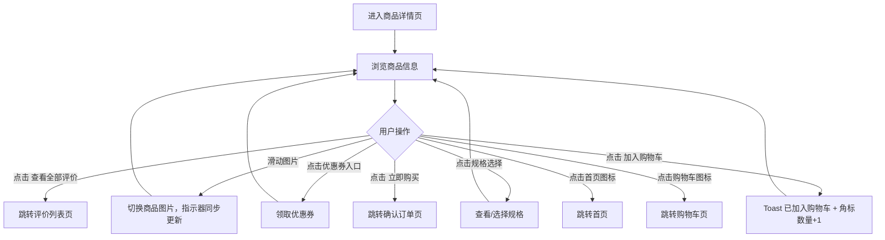

# PRD_03_商品详情页.md

> 本文件为独立章节，最终合并至完整PRD文档。

---

#### 4.1.3. 商品详情页

##### 1. 功能概述

商品详情页展示单个商品的完整信息，是用户做出购买决策的核心页面。用户从首页推荐、搜索结果、购物车、收藏、订单等多个入口均可进入此页面。页面包含商品图片轮播、价格与促销信息、规格选择、优惠券入口、用户评价、商品详情图文，底部固定操作栏提供"加入购物车"和"立即购买"两个核心操作。

##### 2. 页面结构

页面顶部为导航栏，中间为可滚动内容区，底部固定操作栏。部分模块支持条件显示（优惠券/评价区域可能不存在）。

| 区域 | 说明 |
|------|------|
| 导航栏 | 返回按钮 + "商品详情"标题 + 胶囊按钮 |
| 商品图片轮播 | 全宽1:1比例图片轮播，支持左右滑动切换，右下角显示"当前页/总数"指示（如"1/3"） |
| 价格区 | 现价（红色大字）+ 原价（灰色删除线）+ 折扣标签（如"4折"），下方显示销量与好评率 |
| 标题区 | 商品名称（最多2行截断）+ 服务标签（正品保障/7天无理由/极速退款） |
| 优惠券入口 | 点击可领取优惠券，显示可用券信息（如"满100减20 / 满200减50"）。无优惠券时此区域隐藏 |
| 规格选择 | 展示已选规格（如"白色，500ml"），点击可弹出规格选择器（当前为跳转提示） |
| 用户评价 | 展示1条热门评价（头像+昵称+星级+内容+日期），底部"查看全部评价"链接。无评价时此区域隐藏 |
| 商品详情图文 | "—— 商品详情 ——" 分隔标题 + 商品详情图片列表 |
| 底部操作栏 | 左侧：首页图标+购物车图标（含角标）；右侧：加入购物车（橙色）+ 立即购买（红橙渐变） |

##### 3. 操作流程

用户进入商品详情页后，核心操作路径如下：

图片轮播支持触摸滑动和鼠标拖拽（桌面预览），滑动距离超过40px触发切换。图片指示器实时显示当前序号。优惠券和评价区域通过JS变量控制显示/隐藏（`hasCoupon`和`hasReview`），无数据时整块隐藏。

##### 4. 字段与交互

| 字段名称 | 字段标识 | 字段类型 | 必填 | 数据类型 | 长度限制 | 默认值 | 校验规则 | 取值范围 | 来源 | 错误提示 |
|----------|----------|----------|------|----------|----------|--------|----------|----------|------|----------|
| 商品图片轮播 | product_images | 轮播组件 | - | - | - | 第1张 | 支持touch/mouse滑动，滑动>40px触发切换，循环播放 | 0-2（共3张） | 后端接口 | - |
| 图片指示器 | slide_indicator | 文本显示 | - | String | - | "1/3" | 显示"当前序号/总数"，随轮播切换实时更新 | - | 系统计算 | - |
| 现价 | current_price | 文本显示 | 是 | Number | - | - | 红色大字，¥符号缩小显示 | >0 | 后端接口 | - |
| 原价 | original_price | 文本显示 | 否 | Number | - | - | 灰色删除线，无原价时不显示 | ≥现价 | 后端接口 | - |
| 折扣标签 | discount_tag | 标签 | 否 | String | - | - | 渐变背景白字，如"4折"，无折扣时不显示 | - | 后端计算 | - |
| 销量与好评率 | sold_info | 文本显示 | - | String | - | - | 格式："已售X万件 · 好评率X%" | - | 后端接口 | - |
| 商品名称 | product_name | 文本显示 | 是 | String | - | - | 最多2行，超出截断省略 | - | 后端接口 | - |
| 服务标签 | service_tags | 标签组 | - | Array | - | - | 橙色背景小标签，如"正品保障""7天无理由""极速退款" | - | 运营配置 | - |
| 优惠券入口 | coupon_entry | 可点击区域 | 否 | - | - | 隐藏 | 当hasCoupon=true时显示，点击领取优惠券；hasCoupon=false时整块隐藏 | 显示/隐藏 | 后端接口 | - |
| 优惠券文案 | coupon_text | 文本显示 | - | String | - | - | 展示可用券信息，如"满100减20 / 满200减50" | - | 后端接口 | - |
| 规格选择 | spec_section | 可点击区域 | - | - | - | "白色，500ml" | 点击弹出规格选择器（静态原型为跳转提示） | - | 后端接口 | - |
| 评价区域 | review_section | 内容区 | 否 | - | - | 隐藏 | 当hasReview=true时显示1条热门评价；hasReview=false时整块隐藏 | 显示/隐藏 | 后端接口 | - |
| 评价用户头像 | reviewer_avatar | 图片 | - | String(URL) | - | 默认头像 | 圆形裁剪 | - | 后端接口 | - |
| 评价用户昵称 | reviewer_name | 文本显示 | - | String | - | - | 脱敏显示，如"用***8" | - | 后端接口 | - |
| 评价星级 | review_stars | 图标显示 | - | Number | - | 5 | 橙色星星，1-5颗 | 1-5 | 后端接口 | - |
| 评价内容 | review_content | 文本显示 | - | String | - | - | 评价正文 | - | 后端接口 | - |
| 评价日期 | review_date | 文本显示 | - | String | - | - | 格式"YYYY-MM-DD" | - | 后端接口 | - |
| 查看全部评价 | view_all_review | 链接 | - | - | - | - | 橙色文字"查看全部评价 >"，点击跳转评价列表页 | - | - | - |
| 商品详情图文 | detail_images | 图片列表 | - | Array(URL) | - | - | 分隔标题 + 图片纵向排列 | - | 后端接口 | - |
| 首页图标 | icon_home | 图标按钮 | - | - | - | - | 点击跳转首页 | - | - | - |
| 购物车图标 | icon_cart | 图标按钮 | - | - | - | 角标数字 | 右上角红色角标显示购物车数量 | ≥0 | 购物车数据 | - |
| 加入购物车 | btn_add_cart | 按钮 | - | - | - | - | 点击后Toast提示"已加入购物车"，购物车角标+1 | - | - | - |
| 立即购买 | btn_buy_now | 按钮 | - | - | - | - | 点击跳转确认订单页（order.html） | - | - | - |

##### 5. 业务规则

| 规则编号 | 规则描述 |
|----------|----------|
| RULE-PROD-001 | 优惠券区域和评价区域为条件显示模块，由后端数据决定是否存在，不存在时整块隐藏不留空白 |
| RULE-PROD-002 | 图片轮播自动播放间隔未设置（需手动滑动），不自动循环；滑动阈值40px |
| RULE-PROD-003 | 点击"加入购物车"仅显示Toast提示并更新角标，不跳转页面、不弹出弹窗 |
| RULE-PROD-004 | 点击"立即购买"直接跳转确认订单页，携带当前商品信息 |
| RULE-PROD-005 | 购物车角标数字为全局共享状态，需与购物车页面的商品总数保持一致 |

##### 6. 页面跳转

**入口**：
- 首页推荐商品列表点击
- 首页限时活动商品点击
- 购物车商品图片点击
- 收藏页商品点击
- 订单详情/订单列表商品点击
- 搜索结果点击

**出口**：
- 点击"立即购买" → 确认订单页（order.html）
- 点击"查看全部评价" → 评价列表页（review.html）
- 点击首页图标 → 首页（home_page.html）
- 点击购物车图标 → 购物车页（cart.html）
