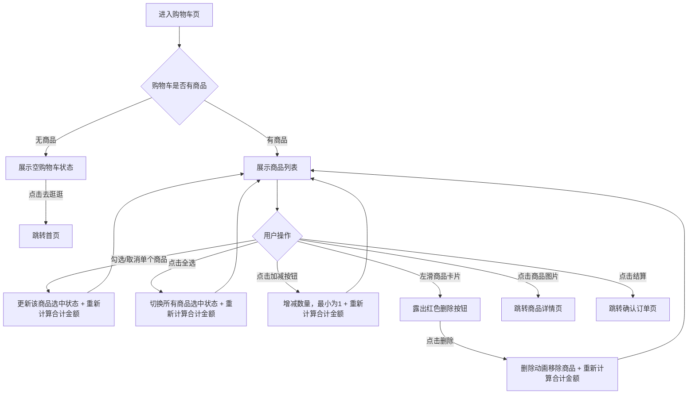

# PRD_04_购物车.md

> 本文件为独立章节，最终合并至完整PRD文档。

---

#### 4.1.4. 购物车页

##### 1. 功能概述

购物车页展示用户已添加的所有商品，支持商品选择、数量调整和滑动删除操作。用户可通过底部Tab栏"购物车"或商品详情页的购物车图标进入此页面。页面底部固定结算栏，显示全选开关、合计金额和结算按钮，结算栏下方为全局Tab导航栏。

##### 2. 页面结构

页面顶部为导航栏，中间为可滚动商品列表，底部依次固定结算栏和Tab导航栏。

| 区域 | 说明 |
|------|------|
| 导航栏 | 返回按钮 + "购物车"标题 + 胶囊按钮 |
| 商品计数栏 | 显示"共X件商品"，随增删操作实时更新 |
| 商品列表 | 每件商品为一行卡片：勾选框 + 商品图片 + 商品信息（名称、规格、价格、数量控制）。支持左滑露出删除按钮 |
| 结算栏 | 固定于Tab栏上方，包含：全选复选框 + "全选"文案 + 合计金额 + 结算按钮（显示已选件数） |
| 底部Tab栏 | 固定底部5个Tab，购物车Tab高亮，购物车图标右上角显示角标数字 |
| 空购物车 | 当购物车无商品时显示空状态图标 + "购物车空空如也" + "去逛逛"按钮（跳转首页） |

##### 3. 操作流程

用户进入购物车后的核心操作路径如下：

左滑删除支持触摸和鼠标拖拽两种方式：触摸滑动距离超过删除按钮宽度的一半（36px）时自动吸附露出删除区域，小于一半则回弹。点击删除后先执行高度收缩+透明度淡出动画（0.2s），动画结束后重新渲染列表。

##### 4. 字段与交互

| 字段名称 | 字段标识 | 字段类型 | 必填 | 数据类型 | 长度限制 | 默认值 | 校验规则 | 取值范围 | 来源 | 错误提示 |
|----------|----------|----------|------|----------|----------|--------|----------|----------|------|----------|
| 商品计数 | cart_count | 文本显示 | - | Number | - | 3 | 显示购物车商品总件数，随增删实时更新 | ≥0 | 购物车数据 | - |
| 商品勾选框 | item_checkbox | 复选框 | - | Boolean | - | 全选 | 点击切换选中/取消，圆形样式，选中时橙色填充+白色勾 | true/false | 用户操作 | - |
| 商品图片 | item_image | 图片链接 | - | String(URL) | - | - | 80×80圆角方形，点击跳转商品详情 | - | 后端接口 | - |
| 商品名称 | item_name | 文本显示 | 是 | String | - | - | 最多2行截断省略 | - | 后端接口 | - |
| 商品规格 | item_spec | 文本显示 | - | String | - | - | 灰色背景小标签，如"白色 500ml" | - | 后端接口 | - |
| 商品单价 | item_price | 文本显示 | 是 | Number | - | - | 红色加粗，¥符号缩小，保留2位小数 | >0 | 后端接口 | - |
| 数量控制 | qty_control | 步进器 | - | Number | - | 1 | 减号按钮在数量为1时置灰不可点；加号无上限；数量实时显示 | ≥1 | 用户操作 | - |
| 左滑删除 | swipe_delete | 滑动手势 | - | - | - | 隐藏 | 左滑距离>36px吸附显示删除按钮（红色72px宽），<36px回弹；同时只允许一个商品处于展开状态 | - | 用户操作 | - |
| 删除按钮 | delete_btn | 按钮 | - | - | - | 隐藏 | 红色背景白色文字"删除"，点击后动画移除商品并重新计算金额 | - | - | - |
| 全选复选框 | select_all | 复选框 | - | Boolean | - | 全选 | 点击切换全部商品选中/取消；当所有商品均已选中时自动变为选中态 | true/false | 用户操作 | - |
| 合计金额 | total_amount | 文本显示 | - | Number | - | "0.00" | 仅统计选中商品的价格×数量之和，保留2位小数 | ≥0 | 系统计算 | - |
| 结算按钮 | btn_checkout | 按钮 | - | - | - | - | 显示已选商品件数"结算(X)"，点击跳转确认订单页；无选中商品时仍可点击（金额为0） | - | - | - |
| 购物车角标 | cart_badge | 数字角标 | - | Number | - | 3 | 显示购物车商品总件数，固定在购物车Tab图标右上角 | ≥0 | 购物车数据 | - |
| 空状态按钮 | btn_go_shop | 按钮 | - | - | - | - | 购物车为空时显示"去逛逛"，点击跳转首页 | - | - | - |

##### 5. 业务规则

| 规则编号 | 规则描述 |
|----------|----------|
| RULE-CART-001 | 结算栏固定在Tab导航栏上方（bottom: 56px），页面滚动区域需为结算栏和Tab栏预留空间（padding-bottom: 128px） |
| RULE-CART-002 | 左滑删除同一时刻只允许一个商品卡片处于展开状态，新滑动一个商品时自动关闭上一个 |
| RULE-CART-003 | 数量减到1后，减号按钮置灰且不可点击（pointer-events: none），防止数量降至0 |
| RULE-CART-004 | 全选状态与单个商品勾选联动：所有商品均选中时全选自动勾选，任一取消则全选取消 |
| RULE-CART-005 | 合计金额仅计算已勾选商品的价格×数量之和，未勾选商品不参与计算 |
| RULE-CART-006 | 购物车角标数字为全局共享状态，需与首页及其他页面的购物车角标保持一致 |

##### 6. 页面跳转

**入口**：
- 底部Tab"购物车"
- 商品详情页点击购物车图标
- 首页购物车Tab

**出口**：
- 点击商品图片 → 商品详情页（product_detail.html）
- 点击结算按钮 → 确认订单页（order.html）
- 空状态点击"去逛逛" → 首页（home_page.html）
- 底部Tab → 首页（home_page.html）、分类（category.html）、收藏（favorites.html）、我的（profile.html）
