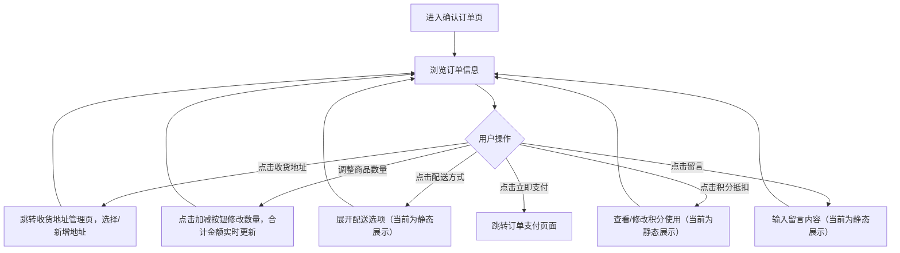

# PRD_05_确认订单.md

> 本文件为独立章节，最终合并至完整PRD文档。

---

#### 4.1.5. 确认订单页

##### 1. 功能概述

确认订单页是用户下单前的最后一站，展示待结算商品的完整订单信息。用户从购物车点击"结算"或从商品详情页点击"立即购买"进入此页面。页面包含收货地址、商品清单、配送方式、积分抵扣、留言、费用明细等模块，底部固定提交栏显示合计金额和"立即支付"按钮，点击后跳转订单支付页面。

##### 2. 页面结构

页面顶部为导航栏，中间为可滚动内容区，底部固定提交栏。

| 区域 | 说明 |
|------|------|
| 导航栏 | 返回按钮 + "确认订单"标题 + 胶囊按钮 |
| 收货地址 | 展示默认收货地址（收件人+手机号+详细地址），右侧右箭头指示可点击切换地址。底部有彩色锯齿分割线 |
| 商品清单 | 展示待购买商品列表，每项包含商品图片、名称、规格、单价和数量控制 |
| 配送方式 | 显示"快递 免邮"，右侧右箭头指示可展开选择 |
| 积分抵扣 | 显示可用积分抵扣金额（如"-¥5.00"），橙色高亮，右侧右箭头 |
| 留言 | 显示"选填：对本次交易的说明"占位文案，右侧右箭头指示可输入 |
| 费用明细 | 逐行列出商品金额、运费、积分抵扣，底部汇总行显示"实付金额"（红色大字） |
| 提交栏 | 固定底部，左侧显示"合计："+红色金额，右侧"立即支付"渐变按钮 |

##### 3. 操作流程

用户进入确认订单页后，确认信息并提交订单：

商品数量调整时，点击加号数量+1、减号数量-1（最小为1，减号置灰）。每次数量变化后，系统重新计算商品金额总和，减去积分抵扣后更新费用明细和底部合计金额，三处金额保持同步。

##### 4. 字段与交互

| 字段名称 | 字段标识 | 字段类型 | 必填 | 数据类型 | 长度限制 | 默认值 | 校验规则 | 取值范围 | 来源 | 错误提示 |
|----------|----------|----------|------|----------|----------|--------|----------|----------|------|----------|
| 收货地址 | address_section | 可点击区域 | 是 | - | - | 默认地址 | 展示收件人+手机号+详细地址，点击跳转地址管理页 | - | 后端接口/地址管理 | - |
| 收件人 | receiver_name | 文本显示 | 是 | String | - | "张三" | 与手机号同行显示，加粗 | - | 后端接口 | - |
| 手机号 | receiver_phone | 文本显示 | 是 | String | - | "138****8888" | 脱敏显示，中间四位用*替代 | - | 后端接口 | - |
| 详细地址 | address_detail | 文本显示 | 是 | String | - | - | 地址文本自动换行 | - | 后端接口 | - |
| 商品图片 | prod_image | 图片 | 是 | String(URL) | - | - | 72×72圆角方形 | - | 后端接口 | - |
| 商品名称 | prod_name | 文本显示 | 是 | String | - | - | 最多2行截断省略 | - | 后端接口 | - |
| 商品规格 | prod_spec | 文本显示 | - | String | - | - | 灰色小字，如"白色 500ml" | - | 后端接口 | - |
| 商品单价 | prod_price | 文本显示 | 是 | Number | - | - | 黑色加粗，保留2位小数 | >0 | 后端接口 | - |
| 商品数量 | prod_qty | 步进器 | 是 | Number | - | 1 | 加号无上限，减号最小为1时置灰不可点 | ≥1 | 用户操作 | - |
| 配送方式 | delivery_method | 可点击区域 | - | - | - | "快递 免邮" | 点击展开配送选项（静态原型阶段为展示） | - | 后端接口 | - |
| 积分抵扣 | points_deduction | 可点击区域 | - | Number | - | -¥5.00 | 橙色高亮显示抵扣金额，点击可修改积分使用数量 | ≥0 | 用户配置/后端计算 | - |
| 留言 | order_message | 可点击区域 | 否 | String | - | placeholder文案 | 显示"选填：对本次交易的说明"，点击可输入 | - | 用户输入 | - |
| 商品金额 | goods_amount | 文本显示 | - | Number | - | - | 所有商品单价×数量之和，保留2位小数 | ≥0 | 系统计算 | - |
| 运费 | shipping_fee | 文本显示 | - | Number | - | ¥0.00 | 当前固定为0（免邮），保留2位小数 | ≥0 | 后端计算 | - |
| 积分抵扣金额 | discount_amount | 文本显示 | - | Number | - | -¥5.00 | 橙色文字，显示实际抵扣金额 | ≥0 | 用户配置 | - |
| 实付金额 | final_amount | 文本显示 | 是 | Number | - | - | 红色大字，=商品金额-积分抵扣+运费，保留2位小数 | ≥0 | 系统计算 | - |
| 底部合计 | bottom_total | 文本显示 | 是 | Number | - | - | 与实付金额同步，红色加粗大号字体 | ≥0 | 系统计算 | - |
| 立即支付 | btn_submit | 按钮 | 是 | - | - | - | 红橙渐变胶囊按钮，点击跳转订单支付页面 | - | - | - |

##### 5. 业务规则

| 规则编号 | 规则描述 |
|----------|----------|
| RULE-ORDER-001 | 实付金额 = 商品金额总和 - 积分抵扣 + 运费，数量变化时三处金额（费用明细实付金额、底部合计）实时同步更新 |
| RULE-ORDER-002 | 收货地址区域底部有彩色锯齿分割线，由三种颜色（#ff6034、#ee0a24、#ff9800）循环重复组成 |
| RULE-ORDER-003 | 手机号中间四位脱敏显示（如138\*\*\*\*8888），保护用户隐私 |
| RULE-ORDER-004 | 商品数量在确认订单页仍可调整，调整后金额实时重新计算 |

##### 6. 页面跳转

**入口**：
- 购物车页点击"结算"按钮
- 商品详情页点击"立即购买"按钮

**出口**：
- 点击"立即支付" → 订单支付页（payment.html）
- 点击收货地址 → 收货地址管理页（address.html）
- 点击返回按钮 → 返回上一页
