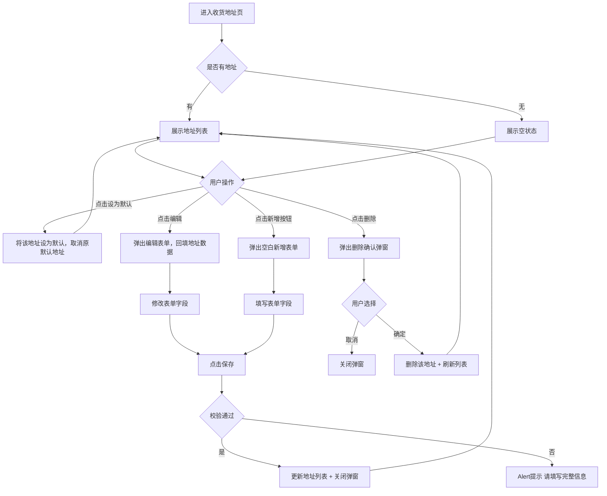

# PRD_06_收货地址管理.md

> 本文件为独立章节，最终合并至完整PRD文档。

---

#### 4.1.6. 收货地址管理页

##### 1. 功能概述

收货地址管理页展示用户的所有收货地址列表，支持新增、编辑、删除地址以及设置默认地址。用户从确认订单页点击收货地址区域进入此页面，选择或管理收货地址后返回订单页。页面底部固定"新增收货地址"按钮，新增和编辑操作通过弹窗表单完成，删除操作有二次确认弹窗。

##### 2. 页面结构

页面顶部为导航栏，中间为可滚动的地址列表，底部固定新增按钮。页面包含两个弹窗：删除确认弹窗和地址编辑表单弹窗。

| 区域 | 说明 |
|------|------|
| 导航栏 | 返回按钮 + "收货地址"标题 + 胶囊按钮 |
| 地址列表 | 每条地址为一行白色圆角卡片，包含：收件人+手机号+默认标签、详细地址、操作栏（设为默认+编辑+删除） |
| 新增按钮 | 固定底部居中，红橙渐变胶囊按钮"新增收货地址"，带加号图标和投影 |
| 空状态 | 无地址时显示地图定位图标 + "暂无收货地址"文案 |
| 删除确认弹窗 | 居中白色卡片，标题"删除地址"+提示文案+"取消"和"确定"按钮，点击遮罩可关闭 |
| 编辑表单弹窗 | 居中白色卡片，标题"新增/编辑收货地址"+ 表单（收货人、手机号、所在地区、详细地址）+ "取消"和"保存"按钮，点击遮罩可关闭 |

##### 3. 操作流程

设为默认地址为互斥操作：点击任一地址的"设为默认"后，该地址变为默认地址（圆形勾选变为渐变橙色填充），原默认地址自动取消。新增的第一条地址自动设为默认地址。编辑表单弹窗根据操作类型动态切换标题——新增时显示"新增收货地址"，编辑时显示"编辑收货地址"并回填已有数据。

##### 4. 字段与交互

| 字段名称 | 字段标识 | 字段类型 | 必填 | 数据类型 | 长度限制 | 默认值 | 校验规则 | 取值范围 | 来源 | 错误提示 |
|----------|----------|----------|------|----------|----------|--------|----------|----------|------|----------|
| 收件人 | input_name | 文本输入 | 是 | String | - | 空 | 非空 | - | 用户输入 | 请填写完整信息 |
| 手机号 | input_phone | 文本输入(tel) | 是 | String | - | 空 | 非空 | - | 用户输入 | 请填写完整信息 |
| 所在地区 | input_area | 文本输入 | 是 | String | - | 空 | 非空（实际应调用省市区三级选择器，静态原型阶段为文本输入） | - | 用户输入/选择器 | 请填写完整信息 |
| 详细地址 | input_detail | 文本域 | 是 | String | - | 空 | 非空，多行输入 | - | 用户输入 | 请填写完整信息 |
| 默认地址标签 | default_tag | 标签 | - | Boolean | - | 首条地址默认 | 默认地址显示橙色"默认"标签，非默认不显示 | true/false | 系统状态 | - |
| 设为默认 | set_default | 复选圆圈 | - | Boolean | - | - | 点击切换默认状态，同一时刻只有一个默认地址；默认地址圆形勾选为橙色渐变填充+白色勾 | true/false | 用户操作 | - |
| 编辑按钮 | edit_btn | 按钮 | - | - | - | - | 点击弹出编辑表单，回填该地址已有数据 | - | - | - |
| 删除按钮 | delete_btn | 按钮 | - | - | - | - | 点击弹出删除确认弹窗 | - | - | - |
| 删除确认-取消 | cancel_delete | 按钮 | - | - | - | - | 关闭弹窗，不执行删除 | - | - | - |
| 删除确认-确定 | confirm_delete | 按钮 | - | - | - | - | 从地址列表中移除该地址并刷新列表 | - | - | - |
| 保存按钮 | save_form | 按钮 | - | - | - | - | 校验所有字段非空，通过后新增或更新地址并关闭弹窗 | - | - | 请填写完整信息 |
| 取消按钮 | cancel_form | 按钮 | - | - | - | - | 关闭表单弹窗，不保存 | - | - | - |
| 新增按钮 | add_address_btn | 按钮 | - | - | - | - | 弹出空白新增表单弹窗 | - | - | - |

##### 5. 业务规则

| 规则编号 | 规则描述 |
|----------|----------|
| RULE-ADDR-001 | 默认地址为互斥状态，同一时刻仅允许一个默认地址。设为新默认时自动取消原默认 |
| RULE-ADDR-002 | 新增的第一条地址自动设为默认地址（isDefault: true） |
| RULE-ADDR-003 | 删除操作需二次确认弹窗，防止误删；删除后列表即时刷新 |
| RULE-ADDR-004 | 新增/编辑弹窗点击遮罩区域可关闭，等同于点击取消 |
| RULE-ADDR-005 | 编辑表单校验为全字段非空校验，任一字段为空弹出Alert提示"请填写完整信息" |

##### 6. 页面跳转

**入口**：
- 确认订单页点击收货地址区域
- 个人资料页或设置页的地址管理入口

**出口**：
- 点击返回按钮 → 返回上一页（确认订单页）
- 新增/编辑/删除操作完成后 → 留在当前页刷新列表
