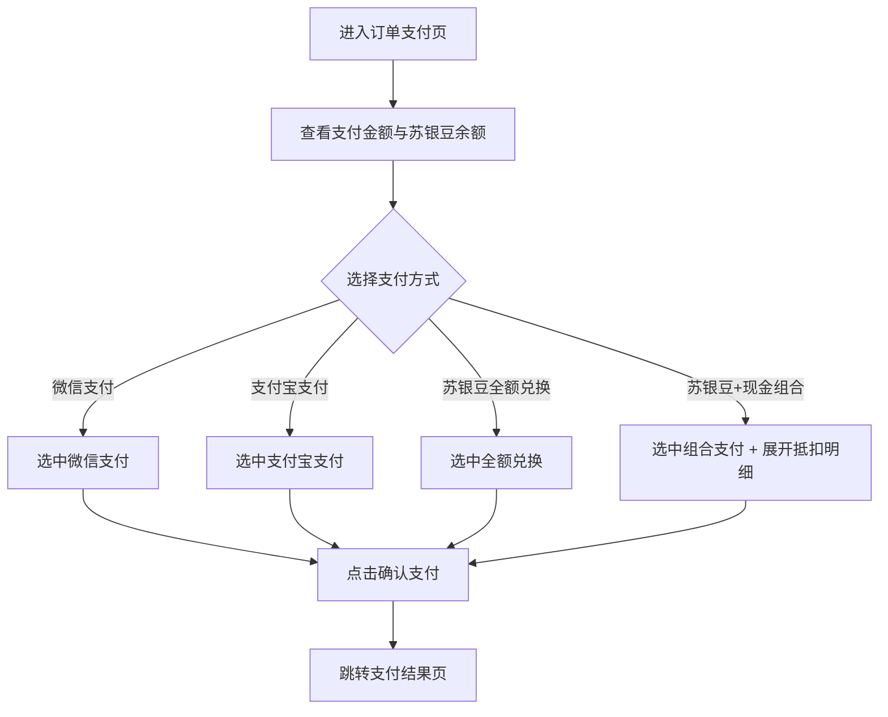
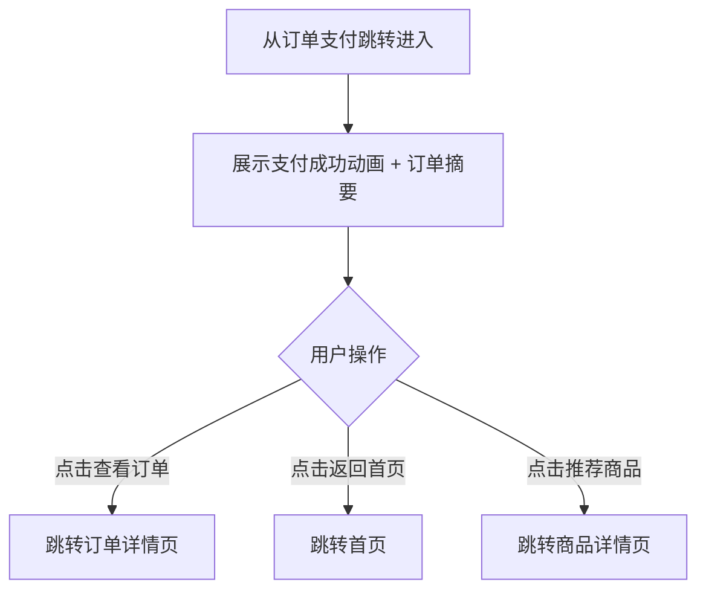

# PRD_07_订单支付与支付结果.md

> 本文件为独立章节，最终合并至完整PRD文档。

---

#### 4.1.7. 订单支付页

##### 1. 功能概述

订单支付页是用户完成支付的关键页面，展示待支付金额、可用苏银豆余额和四种支付方式供选择。用户从确认订单页点击"立即支付"进入此页面，选择支付方式并确认支付后跳转支付结果页。页面支持微信支付、支付宝、苏银豆全额兑换、苏银豆+现金组合支付四种方式，选择组合支付时展开抵扣明细。

##### 2. 页面结构

页面顶部为导航栏，中间为可滚动内容区，底部固定支付按钮。

| 区域 | 说明 |
|------|------|
| 导航栏 | 返回按钮 + "订单支付"标题 + 胶囊按钮 |
| 支付金额头部 | 居中展示"支付金额"标签 + 大号金额数字（黑色加粗） |
| 苏银豆余额 | 展示星形图标 + "可用苏银豆：1,280"（橙色数字）+ "1苏银豆=1元"换算提示 |
| 支付方式列表 | 标题"选择支付方式" + 4种支付方式卡片，每种包含图标、名称、描述和单选圆圈 |
| 组合支付明细 | 仅在选择"苏银豆+现金组合支付"时展开，显示苏银豆抵扣金额、现金支付金额和合计 |
| 底部支付按钮 | 固定底部，全宽红橙渐变胶囊按钮"确认支付 ¥171.90"，含锁图标 |

##### 3. 操作流程

用户进入订单支付后选择支付方式并确认支付：

支付方式为单选互斥：点击任一方式后，其他方式的选中状态自动取消，选中方式的单选圆圈变为橙色填充。选择"苏银豆+现金组合支付"时，下方自动展开橙色背景的抵扣明细卡片，显示苏银豆抵扣金额、现金补齐金额和合计；切换其他支付方式时该卡片自动收起。

##### 4. 字段与交互

| 字段名称 | 字段标识 | 字段类型 | 必填 | 数据类型 | 长度限制 | 默认值 | 校验规则 | 取值范围 | 来源 | 错误提示 |
|----------|----------|----------|------|----------|----------|--------|----------|----------|------|----------|
| 支付金额 | pay_amount | 文本显示 | 是 | Number | - | - | 黑色大字居中，¥符号缩小，与确认订单页实付金额一致 | >0 | 确认订单页传入 | - |
| 苏银豆余额 | points_balance | 文本显示 | - | Number | - | - | 橙色加粗数字，显示可用苏银豆数量 | ≥0 | 后端接口 | - |
| 换算提示 | points_rate | 文本显示 | - | String | - | "1苏银豆=1元" | 灰色小字，说明兑换比例 | - | 系统配置 | - |
| 微信支付 | method_wechat | 单选项 | - | - | - | 选中 | 绿色图标+名称+描述"推荐使用，安全便捷"，默认选中 | - | 静态配置 | - |
| 支付宝支付 | method_alipay | 单选项 | - | - | - | 未选中 | 蓝色图标+名称+描述"H5场景可用" | - | 静态配置 | - |
| 苏银豆全额兑换 | method_beans | 单选项 | - | - | - | 未选中 | 橙色图标+名称+描述"需消耗X苏银豆，当前余额不足"，余额不足时橙色高亮提示 | - | 后端计算 | - |
| 苏银豆+现金组合 | method_combo | 单选项 | - | - | - | 未选中 | 渐变图标+名称+描述"使用全部苏银豆抵扣，剩余现金补齐"，选中时展开明细 | - | 静态配置 | - |
| 组合抵扣明细 | combo_detail | 折叠面板 | - | - | - | 隐藏 | 仅combo选中时显示，橙色背景卡片，列出苏银豆抵扣金额、现金支付金额、合计 | 显示/隐藏 | 系统计算 | - |
| 确认支付 | btn_pay | 按钮 | 是 | - | - | - | 全宽渐变胶囊按钮，文案"确认支付 ¥X.XX"，点击跳转支付结果页 | - | - | - |

##### 5. 业务规则

| 规则编号 | 规则描述 |
|----------|----------|
| RULE-PAY-001 | 四种支付方式为单选互斥，同一时刻仅一种为选中状态，选中时圆圈变为橙色填充+白色勾 |
| RULE-PAY-002 | 苏银豆全额兑换方式展示所需豆数，余额不足时描述文案橙色高亮提示 |
| RULE-PAY-003 | 组合支付明细根据选中状态动态展开/收起，切换其他方式时自动收起 |
| RULE-PAY-004 | 底部支付按钮的金额文案与页面顶部支付金额保持一致 |

##### 6. 页面跳转

**入口**：
- 确认订单页点击"立即支付"

**出口**：
- 点击"确认支付" → 支付结果页（pay_success.html）
- 点击返回按钮 → 返回确认订单页

---

#### 4.1.8. 支付结果页

##### 1. 功能概述

支付结果页展示支付成功的确认信息，告知用户订单支付完成并引导后续操作。页面包含成功动画图标、订单摘要信息和"猜你喜欢"推荐商品。用户从订单支付确认支付后自动跳转至此页面，可通过底部按钮查看订单详情或返回首页继续购物。

##### 2. 页面结构

页面顶部为导航栏，中间为可滚动内容区，无底部固定栏。

| 区域 | 说明 |
|------|------|
| 导航栏 | 返回按钮 + "支付结果"标题 + 胶囊按钮 |
| 成功提示区 | 居中展示绿色对勾圆形图标（带缩放动画）+"支付成功"标题+感谢文案+两个操作按钮 |
| 订单信息卡片 | 白色圆角卡片，逐行列出订单编号、支付方式、苏银豆抵扣、现金支付、实付金额 |
| 猜你喜欢 | 标题"—— 猜你喜欢 ——" + 双列商品网格（4件推荐商品），点击跳转商品详情 |

##### 3. 操作流程

页面加载时成功图标执行缩放动画：从0放大至1.1倍再回落到1倍（scaleIn动画，0.4秒），形成弹性效果。

##### 4. 字段与交互

| 字段名称 | 字段标识 | 字段类型 | 必填 | 数据类型 | 长度限制 | 默认值 | 校验规则 | 取值范围 | 来源 | 错误提示 |
|----------|----------|----------|------|----------|----------|--------|----------|----------|------|----------|
| 成功图标 | success_icon | 动画图标 | - | - | - | - | 绿色渐变圆形（#4caf50→#2e7d32），白色对勾，scaleIn动画0.4s弹性缩放 | - | 系统展示 | - |
| 成功标题 | success_title | 文本显示 | - | String | - | "支付成功" | 黑色加粗18px | - | 系统配置 | - |
| 感谢文案 | success_desc | 文本显示 | - | String | - | "感谢您的购买，商品将尽快为您发出" | 灰色13px | - | 系统配置 | - |
| 查看订单 | btn_view_order | 按钮 | - | - | - | - | 橙色描边胶囊按钮，点击跳转订单详情页 | - | - | - |
| 返回首页 | btn_back_home | 按钮 | - | - | - | - | 红橙渐变实心胶囊按钮，点击跳转首页 | - | - | - |
| 订单编号 | order_no | 文本显示 | 是 | String | - | - | 格式如"JS2026040888001" | - | 系统生成 | - |
| 支付方式 | order_pay_method | 文本显示 | 是 | String | - | - | 如"苏银豆+现金组合" | - | 订单支付选择 | - |
| 苏银豆抵扣 | order_beans_deduct | 文本显示 | - | String | - | - | 格式"1,280豆 (¥1,280.00)" | - | 系统计算 | - |
| 现金支付 | order_cash_paid | 文本显示 | - | Number | - | - | 灰色常规字 | ≥0 | 系统计算 | - |
| 实付金额 | order_final_amount | 文本显示 | 是 | Number | - | - | 红色加粗16px，与订单支付支付金额一致 | >0 | 系统计算 | - |
| 推荐商品列表 | rec_products | 双列网格 | - | Array | - | 4件 | 点击商品卡片跳转商品详情页 | - | 后端接口 | - |

##### 5. 业务规则

| 规则编号 | 规则描述 |
|----------|----------|
| RULE-PAYOK-001 | 页面仅展示支付成功状态，当前静态原型不模拟支付失败场景 |
| RULE-PAYOK-002 | 实付金额需与订单支付确认支付的金额一致，确保金额链路完整 |
| RULE-PAYOK-003 | 成功图标使用scaleIn动画（0→1.1→1），页面加载时自动播放一次 |

##### 6. 页面跳转

**入口**：
- 订单支付页点击"确认支付"

**出口**：
- 点击"查看订单" → 订单详情页（order_detail.html）
- 点击"返回首页" → 首页（home_page.html）
- 点击推荐商品 → 商品详情页（product_detail.html）
