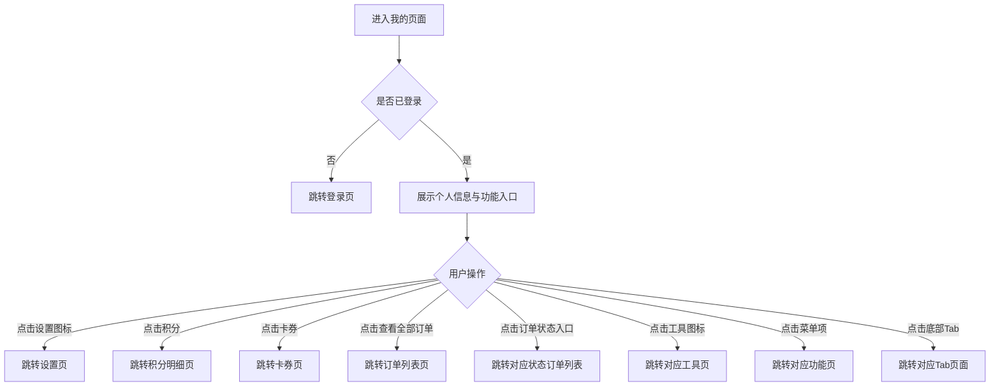

# PRD_08_我的.md

> 本文件为独立章节，最终合并至完整PRD文档。

---

#### 4.1.9. 我的页面

##### 1. 功能概述

"我的"页面是用户的个人中心入口，展示用户头像、昵称、会员等级、积分和卡券数量等个人信息，并提供订单快捷入口、常用工具和功能菜单。用户通过底部Tab栏"我的"进入此页面（未登录时跳转登录页）。页面包含个人资料区、订单状态快捷栏、工具网格和功能菜单列表，底部固定Tab导航栏。

##### 2. 页面结构

页面顶部为渐变背景的个人信息区，中间为可滚动的功能区域，底部固定Tab导航栏。

| 区域 | 说明 |
|------|------|
| 个人信息区 | 红/橙渐变背景（延伸至状态栏），展示头像、昵称、会员等级标签、右上角设置齿轮图标。下方展示积分和卡券两个数据统计项 |
| 我的订单 | 白色圆角卡片，标题行"我的订单"+右侧"查看全部"链接。下方5个订单状态图标入口（待付款/待发货/待收货/待评价/退换售后），待付款和待收货带红色角标数字 |
| 常用工具 | 白色圆角卡片，4×1网格布局，包含我的钱包、我的收藏、积分商城、邀请有奖4个工具入口，各带渐变色图标 |
| 功能菜单 | 白色圆角卡片列表，包含收货地址、卡券绑定、帮助中心、意见反馈、关于我们5个菜单项，每项前有橙色图标，后有右箭头 |
| 底部Tab栏 | 固定底部5个Tab，"我的"Tab高亮，购物车Tab含角标 |

##### 3. 操作流程

个人信息区渐变背景延伸至状态栏，底部通过圆角弧度过渡到灰色页面背景。订单状态入口支持带参数跳转（如 `order_list.html?status=pending`），直接进入对应状态的订单列表。待付款显示角标"1"、待收货显示角标"2"，角标数字来源于后端订单状态统计。

##### 4. 字段与交互

| 字段名称 | 字段标识 | 字段类型 | 必填 | 数据类型 | 长度限制 | 默认值 | 校验规则 | 取值范围 | 来源 | 错误提示 |
|----------|----------|----------|------|----------|----------|--------|----------|----------|------|----------|
| 用户头像 | user_avatar | 图片 | - | String(URL) | - | 默认头像 | 56×56圆形裁剪，白色半透明边框 | - | 后端接口 | - |
| 用户昵称 | user_name | 文本显示 | 是 | String | - | "悦享用户" | 白色加粗17px | - | 后端接口 | - |
| 会员等级 | user_level | 标签 | - | String | - | "黄金会员" | 半透明白色背景圆角标签，星形图标+等级文字 | - | 后端接口 | - |
| 设置按钮 | settings_btn | 图标按钮 | - | - | - | - | 齿轮图标，白色，点击跳转设置页 | - | - | - |
| 积分数 | points_num | 文本显示 | - | Number | - | "1,280" | 白色加粗，点击跳转积分明细页 | ≥0 | 后端接口 | - |
| 卡券数 | coupons_num | 文本显示 | - | Number | - | "5" | 白色加粗，点击跳转卡券页 | ≥0 | 后端接口 | - |
| 查看全部订单 | view_all_orders | 链接 | - | - | - | - | 灰色文字+右箭头，点击跳转订单列表页 | - | - | - |
| 待付款 | tab_pending | 图标入口 | - | - | - | - | 卡片图标+文字，右上角红色角标显示待付款数量，点击跳转待付款订单列表 | - | 后端接口 | - |
| 待发货 | tab_shipped | 图标入口 | - | - | - | - | 立方体图标+文字，无角标，点击跳转待发货订单列表 | - | - | - |
| 待收货 | tab_delivered | 图标入口 | - | - | - | - | 货车图标+文字，右上角红色角标显示待收货数量，点击跳转待收货订单列表 | - | 后端接口 | - |
| 待评价 | tab_review | 图标入口 | - | - | - | - | 点赞图标+文字，无角标，点击跳转评价页 | - | - | - |
| 退换/售后 | tab_refund | 图标入口 | - | - | - | - | 刷新图标+文字，无角标，点击跳转售后页 | - | - | - |
| 我的钱包 | tool_wallet | 工具入口 | - | - | - | - | 橙色渐变图标，点击跳转钱包页 | - | - | - |
| 我的收藏 | tool_favorites | 工具入口 | - | - | - | - | 粉色渐变图标，点击跳转收藏页 | - | - | - |
| 积分商城 | tool_points | 工具入口 | - | - | - | - | 绿色渐变图标，点击跳转积分商城页 | - | - | - |
| 邀请有奖 | tool_invite | 工具入口 | - | - | - | - | 蓝色渐变图标，点击跳转邀请有奖页 | - | - | - |
| 收货地址 | menu_address | 菜单项 | - | - | - | - | 定位图标+文字+右箭头，点击跳转地址管理页 | - | - | - |
| 卡券绑定 | menu_bind | 菜单项 | - | - | - | - | 卡券图标+文字+右箭头，点击跳转卡券绑定页 | - | - | - |
| 帮助中心 | menu_help | 菜单项 | - | - | - | - | 问号图标+文字+右箭头，点击跳转帮助页 | - | - | - |
| 意见反馈 | menu_feedback | 菜单项 | - | - | - | - | 邮件图标+文字+右箭头，点击跳转反馈页 | - | - | - |
| 关于我们 | menu_about | 菜单项 | - | - | - | - | 盾牌图标+文字+右箭头，点击跳转关于页 | - | - | - |
| 购物车角标 | cart_badge | 数字角标 | - | Number | - | 3 | 购物车Tab图标右上角显示购物车商品数量 | ≥0 | 购物车数据 | - |

##### 5. 业务规则

| 规则编号 | 规则描述 |
|----------|----------|
| RULE-PROFILE-001 | 未登录用户点击"我的"Tab时跳转登录页，登录成功后返回此页面 |
| RULE-PROFILE-002 | 订单状态角标数字来源于后端实时统计，仅待付款和待收货两个状态显示角标，无待处理订单时不显示角标 |
| RULE-PROFILE-003 | 个人信息区渐变背景延伸至状态栏，通过底部圆角弧度过渡到页面灰色背景 |

##### 6. 页面跳转

**入口**：
- 底部Tab"我的"
- 未登录时点击"我的"Tab先跳转登录页

**出口**：
- 点击设置图标 → 设置页（settings.html）
- 点击积分 → 积分明细页（points_detail.html）
- 点击卡券 → 卡券页（wallet.html）
- 点击查看全部订单 → 订单列表页（order_list.html）
- 点击订单状态入口 → 对应状态订单列表页（order_list.html?status=xxx）
- 点击我的钱包 → 钱包页（wallet.html）
- 点击我的收藏 → 收藏页（favorites.html）
- 点击积分商城 → 积分商城页（points_detail.html）
- 点击邀请有奖 → 邀请有奖页（invite_friends.html）
- 点击收货地址 → 地址管理页（address.html）
- 点击卡券绑定 → 卡券绑定页（coupon_bind.html）
- 底部Tab → 首页（home_page.html）、分类（category.html）、购物车（cart.html）、收藏（favorites.html）
