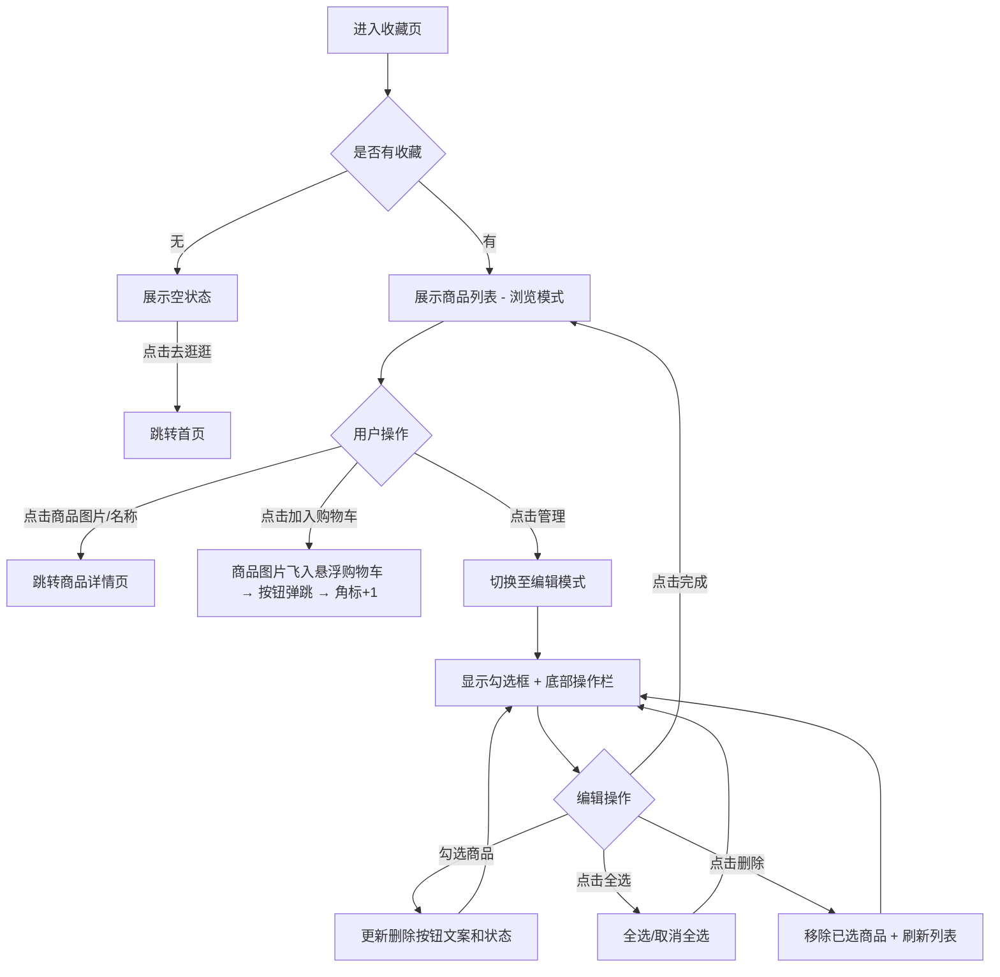

# PRD_09_我的收藏.md

> 本文件为独立章节，最终合并至完整PRD文档。

---

#### 4.1.10. 我的收藏页

##### 1. 功能概述

我的收藏页展示用户收藏的所有商品列表，支持管理模式下的批量选择和删除操作，以及每件商品的快速加入购物车。用户通过底部Tab栏"收藏"或"我的"页面的"我的收藏"工具入口进入此页面。页面默认为浏览模式，点击"管理"进入编辑模式，底部出现操作栏支持全选和批量删除。

##### 2. 页面结构

页面顶部为导航栏和编辑栏，中间为可滚动商品列表，底部固定Tab导航栏。编辑模式下在Tab栏上方显示操作栏。

| 区域 | 说明 |
|------|------|
| 导航栏 | 返回按钮 + "我的收藏"标题 + 胶囊按钮 |
| 编辑栏 | 左侧显示"共X件商品"计数，右侧"管理/完成"切换按钮（橙色文字） |
| 商品列表 | 每件商品为一行白色圆角卡片：勾选框（编辑模式显示）+ 商品图片 + 商品信息（名称、标签、现价、原价）+ 加入购物车按钮 |
| 操作栏 | 编辑模式时显示于Tab栏上方（bottom: 56px），包含：全选复选框 + "全选"文案 + 删除按钮（显示已选数量） |
| 空状态 | 无收藏时显示心形图标 + "暂无收藏商品" + "去逛逛"按钮（跳转首页） |
| 悬浮购物车按钮 | 右下角固定悬浮按钮（absolute定位），红橙渐变圆形50×50，购物车图标，黄色角标显示数量，点击跳转购物车页 |
| 底部Tab栏 | 固定底部5个Tab，"收藏"Tab高亮，购物车Tab含角标 |

##### 3. 操作流程

浏览模式与编辑模式互斥：点击"管理"进入编辑模式，商品卡片左侧出现圆形勾选框，底部操作栏滑出；点击"完成"退出编辑模式，勾选框隐藏（`display: none`），操作栏收起。删除按钮在无选中商品时置灰不可点击（灰色背景+`pointer-events: none`），有选中时变为红色并显示数量"删除(X)"。

点击"加入购物车"时触发飞入动画：从商品图片位置生成一个圆形缩略图克隆（40px，橙色边框），沿贝塞尔曲线飞向右下角悬浮购物车按钮（0.8s），飞行过程中逐渐缩小至20px并变透明。到达后悬浮按钮执行弹跳动画（scale 1→1.25→0.9→1.1→1，0.4s），角标数字+1。整个过程中不弹出任何提示。

##### 4. 字段与交互

| 字段名称 | 字段标识 | 字段类型 | 必填 | 数据类型 | 长度限制 | 默认值 | 校验规则 | 取值范围 | 来源 | 错误提示 |
|----------|----------|----------|------|----------|----------|--------|----------|----------|------|----------|
| 商品计数 | total_count | 文本显示 | - | Number | - | 4 | 显示"共X件商品"，删除后实时更新 | ≥0 | 系统计算 | - |
| 管理按钮 | edit_btn | 切换按钮 | - | - | - | "管理" | 浏览模式显示"管理"，编辑模式显示"完成"，点击切换模式 | 管理/完成 | 用户操作 | - |
| 商品勾选框 | item_checkbox | 复选框 | - | Boolean | - | 未选中 | 仅编辑模式显示，圆形样式，选中时渐变橙色填充+白色勾；浏览模式 `display: none` | true/false | 用户操作 | - |
| 商品图片 | fav_image | 图片链接 | 是 | String(URL) | - | - | 100×100圆角方形，点击跳转商品详情 | - | 后端接口 | - |
| 商品名称 | fav_name | 文本显示 | 是 | String | - | - | 最多2行截断省略，点击跳转商品详情 | - | 后端接口 | - |
| 商品标签 | fav_tag | 标签 | - | String | - | - | 橙色描边小标签，如"爆款""新品""限时" | - | 后端接口 | - |
| 现价 | price_now | 文本显示 | 是 | Number | - | - | 红色加粗，¥符号缩小 | >0 | 后端接口 | - |
| 原价 | price_old | 文本显示 | 否 | Number | - | - | 灰色删除线 | ≥现价 | 后端接口 | - |
| 加入购物车 | add_cart_btn | 按钮 | - | - | - | - | 红橙渐变胶囊，定位在卡片右下角，点击触发商品图片飞入悬浮购物车动画 | - | - | - |
| 悬浮购物车 | float_cart | 悬浮按钮 | - | - | - | - | absolute定位右下角，红橙渐变圆形50×50，购物车图标+黄色角标，点击跳转购物车页 | - | - | - |
| 全选 | select_all | 复选框 | - | Boolean | - | 未选中 | 所有商品均选中时自动勾选，任一取消则取消；点击切换全选/取消全选 | true/false | 用户操作 | - |
| 删除按钮 | delete_btn | 按钮 | - | - | - | - | 无选中时置灰不可点；有选中时红色背景显示"删除(X)"，点击移除已选商品 | - | - | - |
| 空状态按钮 | go_shopping | 按钮 | - | - | - | - | 无收藏时显示"去逛逛"，点击跳转首页 | - | - | - |

##### 5. 业务规则

| 规则编号 | 规则描述 |
|----------|----------|
| RULE-FAV-001 | 浏览模式和编辑模式互斥，管理按钮文案随之切换（"管理"/"完成"），勾选框和操作栏的显隐同步切换 |
| RULE-FAV-002 | 操作栏固定在Tab导航栏上方（bottom: 56px），仅编辑模式显示，浏览模式隐藏 |
| RULE-FAV-003 | 删除操作即时生效，从列表中移除商品并更新计数，无需二次确认 |
| RULE-FAV-004 | 勾选框在浏览模式下使用 `display: none` 彻底隐藏，不占用布局空间 |
| RULE-FAV-005 | 全选状态与单个勾选联动：所有商品选中时全选自动勾选，任一取消则全选取消 |
| RULE-FAV-006 | 点击"加入购物车"触发飞入动画（0.8s贝塞尔曲线），不弹出alert提示，动画结束后悬浮按钮弹跳+角标+1 |
| RULE-FAV-007 | 悬浮购物车按钮使用absolute定位在.phone-frame内，z-index:200，确保在小程序容器内正确显示 |

##### 6. 页面跳转

**入口**：
- 底部Tab"收藏"
- "我的"页面点击"我的收藏"工具入口

**出口**：
- 点击商品图片/名称 → 商品详情页（product_detail.html）
- 空状态点击"去逛逛" → 首页（home_page.html）
- 悬浮购物车按钮 → 购物车页（cart.html）
- 底部Tab → 首页（home_page.html）、分类（category.html）、购物车（cart.html）、我的（profile.html）
