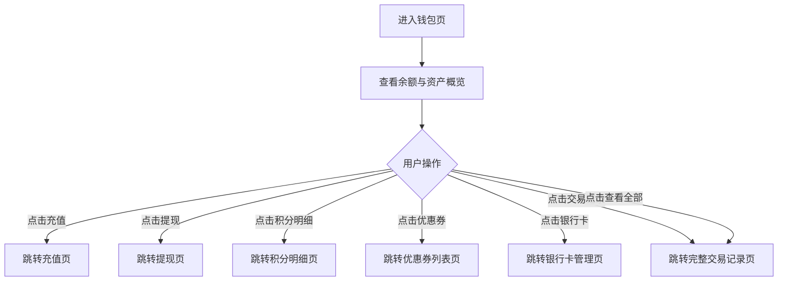

# PRD_10_卡券兑换与钱包.md

> 本文件为独立章节，最终合并至完整PRD文档。

---

#### 4.1.11. 我的钱包页（卡券兑换）

##### 1. 功能概述

我的钱包页是用户的资产和卡券管理中心，展示账户余额、苏银豆、优惠券和红包数量，并提供充值、提现操作入口。页面还包含快捷工具入口（银行卡、积分明细、优惠券、交易记录）和最近交易流水列表。用户从"我的"页面点击"我的钱包"或点击卡券数量进入此页面。

##### 2. 页面结构

页面顶部为导航栏，下方为渐变背景的钱包卡片，再往下依次为操作按钮、工具入口和交易流水。

| 区域 | 说明 |
|------|------|
| 导航栏 | 返回按钮 + "我的钱包"标题 + 胶囊按钮 |
| 钱包卡片 | 红/橙渐变背景，带半透明圆形装饰，展示账户余额（大号白色数字）、苏银豆数量、优惠券张数、红包个数 |
| 操作按钮 | 两列并排："充值"（白底橙字）和"提现"（透明底白边白字），各带图标 |
| 快捷工具 | 白色圆角卡片，4个等距工具入口（银行卡、积分明细、优惠券、交易记录），各带渐变色图标 |
| 最近交易 | 白色圆角卡片，标题行"最近交易"+右侧"全部"链接。下方为交易流水列表，每项包含类型图标、标题、时间和金额 |

##### 3. 操作流程

钱包卡片使用渐变背景，通过两个半透明圆形伪元素（`::before`、`::after`）营造层次感。交易流水中收入类条目图标为绿色渐变背景+加号，金额为绿色正数（如"+128"）；支出类条目图标为橙色渐变背景+减号，金额为黑色负数（如"-500"）。

##### 4. 字段与交互

| 字段名称 | 字段标识 | 字段类型 | 必填 | 数据类型 | 长度限制 | 默认值 | 校验规则 | 取值范围 | 来源 | 错误提示 |
|----------|----------|----------|------|----------|----------|--------|----------|----------|------|----------|
| 账户余额 | wallet_balance | 文本显示 | 是 | Number | - | "128.00" | 白色36px加粗，¥符号20px，保留2位小数 | ≥0 | 后端接口 | - |
| 苏银豆数量 | points_count | 文本显示 | - | Number | - | "1,280" | 白色20px加粗，千分位逗号分隔 | ≥0 | 后端接口 | - |
| 优惠券数量 | coupon_count | 文本显示 | - | Number | - | "3张" | 白色20px加粗 | ≥0 | 后端接口 | - |
| 红包数量 | redpacket_count | 文本显示 | - | Number | - | "2个" | 白色20px加粗 | ≥0 | 后端接口 | - |
| 充值按钮 | btn_recharge | 按钮 | - | - | - | - | 白底橙字胶囊按钮，加号图标，点击跳转充值页 | - | - | - |
| 提现按钮 | btn_withdraw | 按钮 | - | - | - | - | 透明底白边白字胶囊按钮，上箭头图标，点击跳转提现页 | - | - | - |
| 银行卡 | tool_bankcard | 工具入口 | - | - | - | - | 蓝色渐变图标，点击跳转银行卡管理页 | - | - | - |
| 积分明细 | tool_points | 工具入口 | - | - | - | - | 橙色渐变图标，点击跳转积分明细页 | - | - | - |
| 优惠券 | tool_coupon | 工具入口 | - | - | - | - | 粉色渐变图标，点击跳转优惠券列表页 | - | - | - |
| 交易记录 | tool_transaction | 工具入口 | - | - | - | - | 绿色渐变图标，点击跳转交易记录页 | - | - | - |
| 查看全部 | view_all_trans | 链接 | - | - | - | - | 灰色文字+右箭头，点击跳转完整交易记录页 | - | - | - |
| 交易类型图标 | trans_icon | 图标 | - | - | - | - | 收入：绿色渐变圆角方块+加号；支出：橙色渐变圆角方块+减号 | income/expense | 后端接口 | - |
| 交易名称 | trans_title | 文本显示 | 是 | String | - | - | 14px黑色，如"购物返积分""积分兑换商品" | - | 后端接口 | - |
| 交易时间 | trans_time | 文本显示 | 是 | String | - | - | 11px灰色，格式"YYYY-MM-DD HH:mm" | - | 后端接口 | - |
| 交易金额 | trans_amount | 文本显示 | 是 | String | - | - | 收入：绿色+"+"前缀；支出：黑色+"-"前缀；16px加粗 | - | 后端接口 | - |

##### 5. 业务规则

| 规则编号 | 规则描述 |
|----------|----------|
| RULE-WALLET-001 | 钱包卡片渐变背景含两个半透明圆形装饰（::before 150px右上、::after 100px左下），不遮挡文字内容 |
| RULE-WALLET-002 | 交易流水按时间倒序排列，最近交易列表默认展示5条，点击"全部"查看完整记录 |
| RULE-WALLET-003 | 收入和支出通过不同的图标颜色和金额颜色区分：收入绿色、支出橙色/黑色 |

##### 6. 页面跳转

**入口**：
- "我的"页面点击"我的钱包"工具入口
- "我的"页面点击"卡券"统计项

**出口**：
- 点击充值 → 充值页
- 点击提现 → 提现页
- 点击积分明细 → 积分明细页（points_detail.html）
- 点击优惠券 → 优惠券列表页
- 点击银行卡 → 银行卡管理页
- 点击交易记录/查看全部 → 交易记录页
- 点击返回按钮 → 返回上一页
