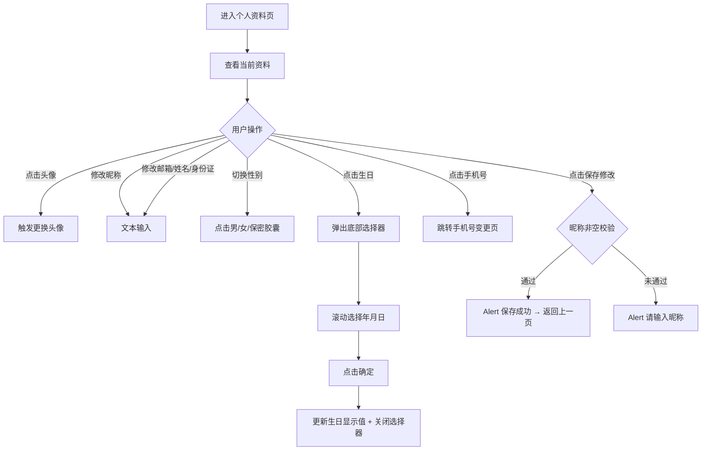

# PRD_11_个人资料.md

> 本文件为独立章节，最终合并至完整PRD文档。

---

#### 4.1.12. 个人资料页

##### 1. 功能概述

个人资料页展示和编辑用户的个人信息，包括头像、昵称、性别、生日、手机号、邮箱、真实姓名和身份证号。用户从设置页点击"个人资料"进入此页面，修改信息后点击"保存修改"提交。页面支持头像更换（点击触发）、性别选择（胶囊切换）、生日选择（底部滚动选择器弹窗）等交互方式。

##### 2. 页面结构

页面顶部为导航栏，中间为可滚动的表单内容区，底部无固定栏。包含一个生日选择器底部弹窗。

| 区域 | 说明 |
|------|------|
| 导航栏 | 返回按钮 + "个人资料"标题 + 胶囊按钮 |
| 头像区 | 居中展示80×80圆形头像，底部半透明遮罩层含"更换头像"文字，下方"点击更换头像"提示 |
| 基本信息 | 白色圆角卡片，包含昵称（文本输入）、性别（三选一胶囊切换）、生日（显示值+右箭头，点击弹出选择器） |
| 联系信息 | 白色圆角卡片，包含手机号（脱敏显示+右箭头）、邮箱（文本输入） |
| 身份信息 | 白色圆角卡片，包含真实姓名（文本输入）、身份证号（文本输入，18位限制） |
| 保存按钮 | 全宽红橙渐变胶囊按钮"保存修改" |
| 生日选择器 | 底部滑入弹窗，半透明遮罩+白色卡片，包含年/月/日三列滚动选择器+取消/确定按钮 |

##### 3. 操作流程

性别选择为三选一互斥：点击"男""女""保密"任一胶囊后，该项变为橙色边框+橙色背景高亮，其余两项恢复灰色。生日选择器从底部滑入（transform动画0.3s），包含年（1950-2010）、月（1-12）、日（1-31）三列滚动列表，选中项为橙色高亮。点击遮罩区域等同于点击取消。

##### 4. 字段与交互

| 字段名称 | 字段标识 | 字段类型 | 必填 | 数据类型 | 长度限制 | 默认值 | 校验规则 | 取值范围 | 来源 | 错误提示 |
|----------|----------|----------|------|----------|----------|--------|----------|----------|------|----------|
| 头像 | user_avatar | 图片+点击 | 否 | String(URL) | - | 默认头像 | 80×80圆形，底部半透明遮罩含"更换头像"文字，点击触发更换（当前为Alert） | - | 用户上传 | - |
| 昵称 | nickname | 文本输入 | 是 | String | - | "悦享用户" | 右对齐输入框，保存时校验非空 | - | 用户输入 | 请输入昵称 |
| 性别 | gender | 胶囊切换 | 否 | String | - | "男" | 三个胶囊选项：男/女/保密，互斥单选，选中项橙色边框+背景 | male/female/secret | 用户选择 | - |
| 生日 | birthday | 日期选择 | 否 | String | 10位 | "1990-01-01" | 点击弹出底部年月日选择器，确定后更新显示值，格式YYYY-MM-DD | 1950-2010年 | 用户选择 | - |
| 手机号 | phone_number | 文本显示 | 是 | String | - | "138****8888" | 脱敏显示中间四位，右侧右箭头，点击跳转手机号变更页 | - | 后端接口 | - |
| 邮箱 | email | 文本输入(email) | 否 | String | - | 空 | 右对齐输入框，placeholder"未绑定" | - | 用户输入 | - |
| 真实姓名 | realname | 文本输入 | 否 | String | - | 空 | 右对齐输入框，placeholder"未填写" | - | 用户输入 | - |
| 身份证号 | idcard | 文本输入 | 否 | String | 18位 | 空 | 右对齐输入框，maxlength=18，placeholder"未填写" | - | 用户输入 | - |
| 保存按钮 | btn_save | 按钮 | - | - | - | - | 校验昵称非空，通过后Alert"保存成功"并返回上一页 | - | - | 请输入昵称 |
| 选择器取消 | picker_cancel | 按钮 | - | - | - | - | 关闭生日选择器弹窗，不更新生日值 | - | - | - |
| 选择器确定 | picker_confirm | 按钮 | - | - | - | - | 将选中年月日更新到生日字段，关闭弹窗 | - | - | - |

##### 5. 业务规则

| 规则编号 | 规则描述 |
|----------|----------|
| RULE-PROFILEEDIT-001 | 保存时仅校验昵称非空，其他字段均为选填，不做强制校验 |
| RULE-PROFILEEDIT-002 | 性别选项为互斥单选，同一时刻仅一个胶囊为选中态 |
| RULE-PROFILEEDIT-003 | 手机号为脱敏只读展示，不可直接修改，需通过专门的手机号变更流程 |
| RULE-PROFILEEDIT-004 | 生日选择器弹窗从底部滑入，点击遮罩区域可关闭，等同于取消操作 |
| RULE-PROFILEEDIT-005 | 保存成功后自动返回上一页（history.back），无需用户手动返回 |

##### 6. 页面跳转

**入口**：
- 设置页点击"个人资料"

**出口**：
- 保存成功 → 返回上一页（设置页）
- 点击手机号 → 手机号变更页
- 点击返回按钮 → 返回上一页
