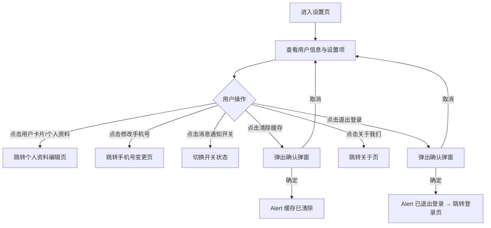

# PRD_12_设置.md

> 本文件为独立章节，最终合并至完整PRD文档。

---

#### 4.1.13. 设置页

##### 1. 功能概述

设置页是应用的系统配置入口，提供个人资料编辑、手机号修改、消息通知开关、缓存清理、关于我们和退出登录等功能。用户从"我的"页面右上角齿轮图标进入此页面。页面顶部展示用户信息卡片（头像+昵称+手机号），点击可跳转个人资料编辑页。退出登录需二次确认，确认后清除登录态并跳转登录页。

##### 2. 页面结构

页面顶部为导航栏，中间为可滚动的分组菜单列表，无底部固定栏。

| 区域 | 说明 |
|------|------|
| 导航栏 | 返回按钮 + "设置"标题 + 胶囊按钮 |
| 用户信息卡片 | 白色圆角卡片，展示头像（56×56圆形）+ 昵称（加粗）+ 手机号（脱敏）+ 右箭头，点击跳转个人资料页 |
| 账号设置 | 分组标题 + 两个菜单项：个人资料（蓝色渐变图标）、修改手机号（绿色渐变图标，右侧显示当前脱敏手机号） |
| 通用设置 | 分组标题 + 一个菜单项：消息通知（粉色渐变图标，右侧Toggle开关） |
| 其他 | 分组标题 + 两个菜单项：清除缓存（灰色渐变图标，右侧显示缓存大小"12.5 MB"）、关于我们（红色渐变图标） |
| 退出登录按钮 | 白色背景红色文字按钮"退出登录"，居中展示 |
| 版本信息 | 底部居中灰色小字"苏银豆商城 v1.0.0" |

##### 3. 操作流程

消息通知Toggle开关点击即切换：开启时橙色背景滑块右移，关闭时灰色背景滑块左移（0.2s过渡动画）。清除缓存和退出登录均使用浏览器原生 `confirm()` 弹窗二次确认。退出登录成功后清除本地登录态，跳转登录页。

##### 4. 字段与交互

| 字段名称 | 字段标识 | 字段类型 | 必填 | 数据类型 | 长度限制 | 默认值 | 校验规则 | 取值范围 | 来源 | 错误提示 |
|----------|----------|----------|------|----------|----------|--------|----------|----------|------|----------|
| 用户头像 | user_avatar | 图片 | - | String(URL) | - | 默认头像 | 56×56圆形 | - | 后端接口 | - |
| 用户昵称 | user_name | 文本显示 | 是 | String | - | "悦享用户" | 16px加粗 | - | 后端接口 | - |
| 用户手机号 | user_phone | 文本显示 | 是 | String | - | 脱敏显示 | 中间四位用*替代，灰色13px | - | 后端接口 | - |
| 个人资料 | menu_profile | 菜单项 | - | - | - | - | 蓝色渐变图标+文字+右箭头，点击跳转个人资料编辑页 | - | - | - |
| 修改手机号 | menu_phone | 菜单项 | - | - | - | - | 绿色渐变图标+文字+右侧脱敏手机号+右箭头，点击跳转手机号变更页 | - | - | - |
| 消息通知 | menu_notify | Toggle开关 | - | Boolean | - | 开启 | 粉色渐变图标+文字+右侧Toggle，点击切换开/关，橙色/灰色，0.2s过渡动画 | true/false | 用户操作 | - |
| 清除缓存 | menu_cache | 菜单项 | - | - | - | - | 灰色渐变图标+文字+右侧缓存大小+右箭头，点击弹出confirm确认，确定后Alert"缓存已清除" | - | 系统计算 | - |
| 缓存大小 | cache_size | 文本显示 | - | String | - | "12.5 MB" | 灰色文字，显示当前缓存占用量 | - | 系统计算 | - |
| 关于我们 | menu_about | 菜单项 | - | - | - | - | 红色渐变图标+文字+右箭头，点击跳转关于页 | - | - | - |
| 退出登录 | btn_logout | 按钮 | - | - | - | - | 白底红色文字，点击弹出confirm"确定要退出登录吗？"，确定后清除登录态跳转登录页 | - | - | - |
| 版本号 | version_info | 文本显示 | - | String | - | "苏银豆商城 v1.0.0" | 底部居中灰色12px | - | 系统配置 | - |

##### 5. 业务规则

| 规则编号 | 规则描述 |
|----------|----------|
| RULE-SETTINGS-001 | 退出登录需二次确认（confirm弹窗），确认后清除本地登录态并跳转登录页，取消则留在当前页 |
| RULE-SETTINGS-002 | 清除缓存需二次确认（confirm弹窗），确认后提示"缓存已清除"，缓存大小数值需重新计算 |
| RULE-SETTINGS-003 | 消息通知Toggle开关状态即时生效，无需保存操作 |
| RULE-SETTINGS-004 | 修改手机号菜单项右侧显示当前脱敏手机号，方便用户确认当前绑定号码 |

##### 6. 页面跳转

**入口**：
- "我的"页面点击右上角设置齿轮图标

**出口**：
- 点击用户卡片/个人资料 → 个人资料编辑页（profile_edit.html）
- 点击修改手机号 → 手机号变更页（change_phone.html）
- 点击关于我们 → 关于页（about.html）
- 退出登录成功 → 登录页（login.html）
- 点击返回按钮 → 返回"我的"页面
