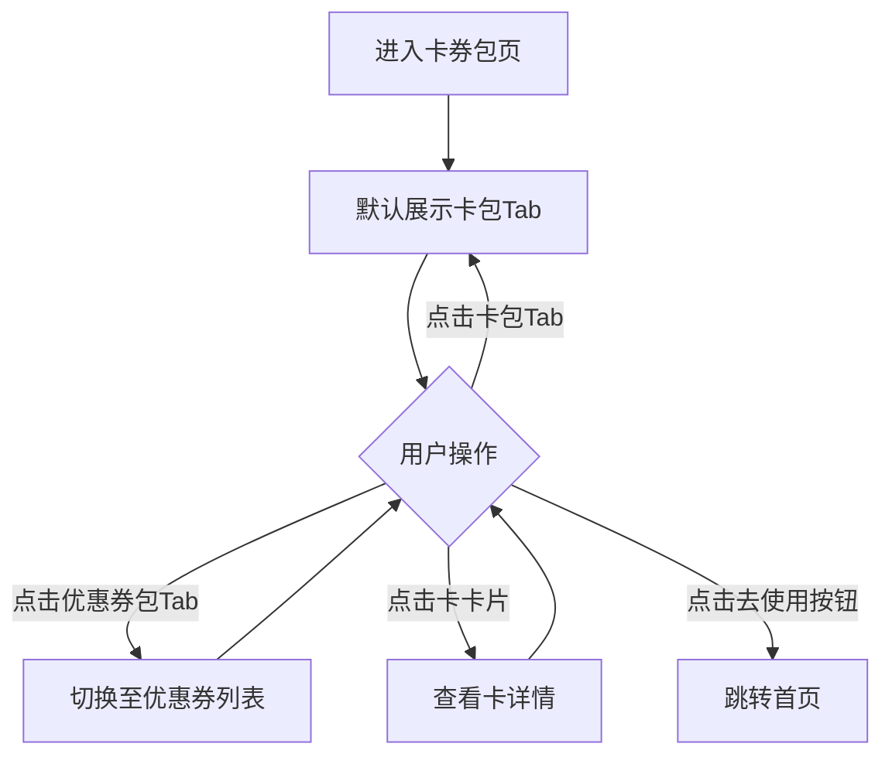
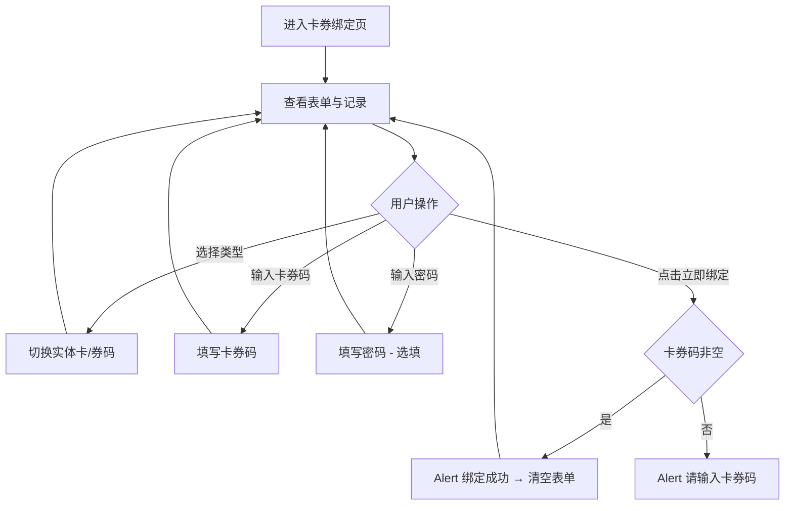

# PRD_13_卡券包.md

> 本文件为独立章节，最终合并至完整PRD文档。

---

#### 4.1.14. 卡券包页

##### 1. 功能概述

卡券包页展示用户的实体卡和优惠券，通过Tab切换"卡包"和"优惠券包"两个分区。卡包展示电影次卡、电影积分卡等实体卡，显示卡内余额或剩余次数；优惠券包展示满减券、折扣券等，显示面额、使用条件和有效期。用户从"我的钱包"点击"优惠券"工具入口或"我的"页面点击"卡券"统计项进入此页面。

##### 2. 页面结构

页面顶部为导航栏，下方为Tab切换栏，中间为可滚动的卡片列表。

| 区域 | 说明 |
|------|------|
| 导航栏 | 返回按钮 + "卡券包"标题 + 胶囊按钮 |
| Tab栏 | 两个Tab："卡包"和"优惠券包"，当前Tab橙色高亮，底部橙色渐变下划线指示（24px宽），点击切换 |
| 卡包列表 | 每张卡为白色圆角卡片，上部渐变背景区域（卡图标+卡名称+状态标签+余额/次数），下部虚线分割（卡号+到期时间） |
| 优惠券列表 | 每张券为白色圆角卡片，横向布局：左侧金额区（红色面额+使用条件）+ 虚线分隔 + 中间信息区（名称+适用范围+有效期）+ 右侧"去使用"按钮 |
| 空状态 | 无卡券时显示空图标 + 提示文案 |

##### 3. 操作流程

Tab切换为互斥状态：点击"卡包"显示卡包列表，点击"优惠券包"显示优惠券列表，同一时刻仅一个Tab为选中态。已使用和已过期的优惠券显示为灰色（金额文字、按钮均置灰），按钮文案分别显示"已使用"和"已过期"。

##### 4. 字段与交互

| 字段名称 | 字段标识 | 字段类型 | 必填 | 数据类型 | 长度限制 | 默认值 | 校验规则 | 取值范围 | 来源 | 错误提示 |
|----------|----------|----------|------|----------|----------|--------|----------|----------|------|----------|
| Tab切换 | coupon_tabs | Tab栏 | - | - | - | 卡包 | 两个Tab互斥切换，选中Tab橙色文字+渐变下划线 | 卡包/优惠券包 | 用户操作 | - |
| 卡图标 | card_icon | 图标 | - | - | - | - | 渐变背景圆角方块内的白色图标，不同卡类型不同图标 | - | 运营配置 | - |
| 卡名称 | card_name | 文本显示 | 是 | String | - | - | 白色15px加粗，渐变背景上 | - | 后端接口 | - |
| 卡状态标签 | card_tag | 标签 | - | String | - | - | 半透明白色背景圆角标签，如"可使用""已激活" | - | 后端接口 | - |
| 卡余额/次数 | card_balance | 文本显示 | 是 | String/Number | - | - | 白色24px加粗，苏银豆数量或次数或金额 | - | 后端接口 | - |
| 卡号 | card_no | 文本显示 | - | String | - | - | 灰色11px，格式"NO. XX000000000" | - | 系统生成 | - |
| 卡到期时间 | card_expire | 文本显示 | - | String | - | - | 灰色11px，格式"YYYY-MM-DD 到期"或"长期有效" | - | 后端接口 | - |
| 优惠券面额 | coupon_amount | 文本显示 | 是 | String | - | - | 红色28px加粗，¥符号14px；折扣券显示如"8折" | - | 后端接口 | - |
| 使用条件 | coupon_condition | 文本显示 | - | String | - | - | 灰色10px，如"满100可用" | - | 后端接口 | - |
| 券名称 | coupon_name | 文本显示 | 是 | String | - | - | 黑色14px加粗 | - | 后端接口 | - |
| 适用范围 | coupon_scope | 文本显示 | - | String | - | - | 灰色11px，如"全品类通用""仅限生活百货类" | - | 后端接口 | - |
| 券有效期 | coupon_date | 文本显示 | 是 | String | - | - | 浅灰10px，格式"YYYY.MM.DD - YYYY.MM.DD" | - | 后端接口 | - |
| 去使用按钮 | coupon_use_btn | 按钮 | - | - | - | - | 红橙渐变胶囊，点击跳转首页；已使用/已过期时灰色不可点 | - | - | - |

##### 5. 业务规则

| 规则编号 | 规则描述 |
|----------|----------|
| RULE-COUPON-001 | 卡包和优惠券包通过Tab互斥切换，选中Tab有橙色下划线指示 |
| RULE-COUPON-002 | 卡卡片上部使用不同颜色渐变区分卡类型，通过背景色和图标直观区分 |
| RULE-COUPON-003 | 已使用优惠券金额文字变灰色，按钮变为灰色"已使用"；已过期同理显示"已过期" |
| RULE-COUPON-004 | 卡卡片上下区域通过虚线分隔，优惠券列表左右区域通过竖向虚线分隔 |

##### 6. 页面跳转

**入口**：
- "我的钱包"页点击"优惠券"工具入口
- "我的"页面点击"卡券"统计项

**出口**：
- 点击"去使用" → 首页（home_page.html）
- 点击卡卡片 → 卡详情页（预留）
- 点击返回按钮 → 返回上一页

---

#### 4.1.15. 卡券绑定页

##### 1. 功能概述

卡券绑定页提供实体卡和优惠券码的绑定功能。用户选择卡券类型（实体卡或券码），输入卡券码和密码（选填），点击绑定后关联到账户。页面还包含使用须知和最近绑定记录列表。用户从"我的"页面"卡券绑定"菜单进入此页面。

##### 2. 页面结构

页面顶部为导航栏，中间为绑定表单区、温馨提示区和绑定记录区。

| 区域 | 说明 |
|------|------|
| 导航栏 | 返回按钮 + "卡券绑定"标题 + 胶囊按钮 |
| 绑定表单 | 白色圆角卡片，标题"绑定卡券"+说明文案，包含：类型选择器（实体卡/券码）、卡券码输入框、密码输入框（选填）、"立即绑定"按钮 |
| 类型选择器 | 两个等宽按钮横向排列，选中项橙色边框+淡橙背景，未选中灰色边框 |
| 温馨提示 | 白色圆角卡片，标题+4条提示（圆点列表） |
| 最近绑定记录 | 白色圆角卡片，标题行"最近绑定记录"，下方记录列表，每条包含类型图标+名称+时间+状态 |

##### 3. 操作流程

类型选择器为二选一互斥：点击"实体卡"或"券码"后，选中项变为橙色边框+淡橙背景，另一项恢复灰色。点击"立即绑定"时仅校验卡券码非空，密码为选填不校验。绑定成功后弹出Alert提示并清空表单。

##### 4. 字段与交互

| 字段名称 | 字段标识 | 字段类型 | 必填 | 数据类型 | 长度限制 | 默认值 | 校验规则 | 取值范围 | 来源 | 错误提示 |
|----------|----------|----------|------|----------|----------|--------|----------|----------|------|----------|
| 类型选择器 | type_selector | 切换按钮 | 是 | - | - | 实体卡 | 两个选项互斥，选中项橙色边框+淡橙背景+对应图标 | 实体卡/券码 | 用户操作 | - |
| 卡券码 | code_input | 文本输入 | 是 | String | 20位 | 空 | 非空校验，点击绑定时检查 | - | 用户输入 | 请输入卡券码 |
| 密码 | pwd_input | 密码输入 | 否 | String | - | 空 | 选填，placeholder"部分卡券需要输入密码" | - | 用户输入 | - |
| 立即绑定 | bind_btn | 按钮 | - | - | - | - | 全宽红橙渐变胶囊按钮，校验卡券码非空后Alert"绑定成功" | - | - | 请输入卡券码 |
| 记录类型图标 | record_icon | 图标 | - | - | - | - | 实体卡：红橙渐变背景；券码：橙色渐变背景 | card/coupon | 后端接口 | - |
| 记录名称 | record_name | 文本显示 | 是 | String | - | - | 黑色14px，如"电影次卡 MV2026***001" | - | 后端接口 | - |
| 记录时间 | record_time | 文本显示 | 是 | String | - | - | 灰色11px，格式"YYYY-MM-DD HH:mm" | - | 后端接口 | - |
| 记录状态 | record_status | 文本显示 | 是 | String | - | - | 绑定成功：绿色；失败：红色 | 成功/失败 | 后端接口 | - |

##### 5. 业务规则

| 规则编号 | 规则描述 |
|----------|----------|
| RULE-BIND-001 | 类型选择器为二选一互斥，同一时刻仅一个类型为选中态 |
| RULE-BIND-002 | 绑定时仅校验卡券码非空，密码为选填字段 |
| RULE-BIND-003 | 绑定成功后清空表单（卡券码和密码），保留当前类型选择 |
| RULE-BIND-004 | 绑定记录按时间倒序排列，状态通过颜色区分（成功绿色、失败红色） |

##### 6. 页面跳转

**入口**：
- "我的"页面点击"卡券绑定"菜单

**出口**：
- 绑定成功 → 留在当前页清空表单
- 点击返回按钮 → 返回"我的"页面
