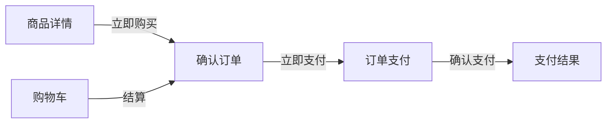
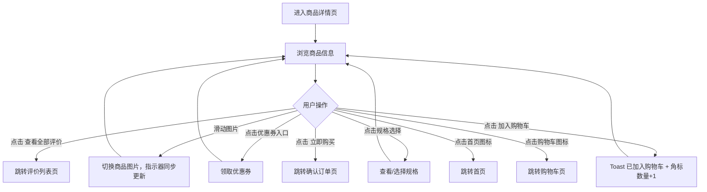
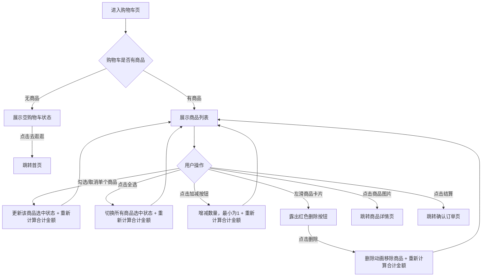
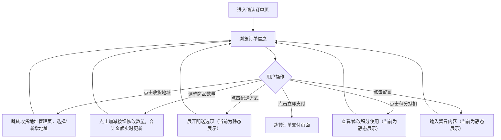
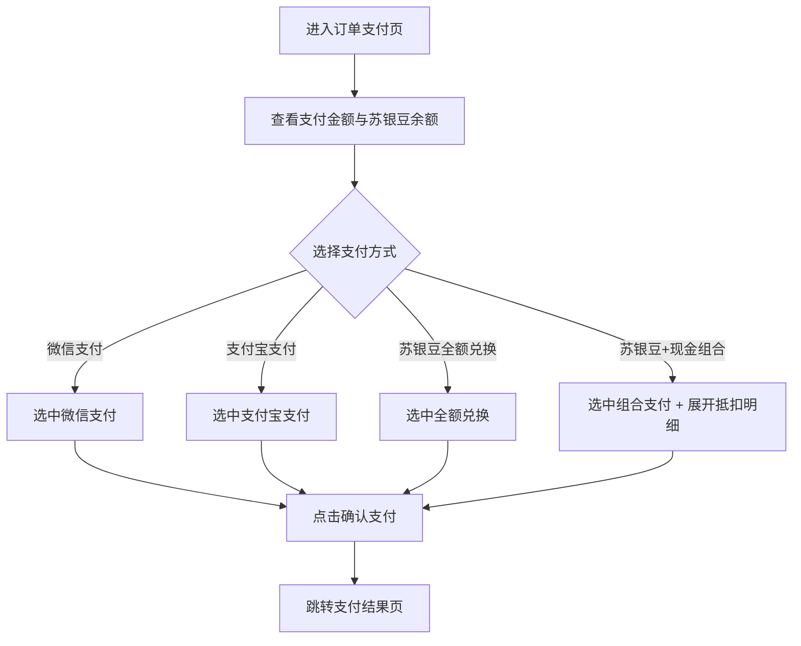
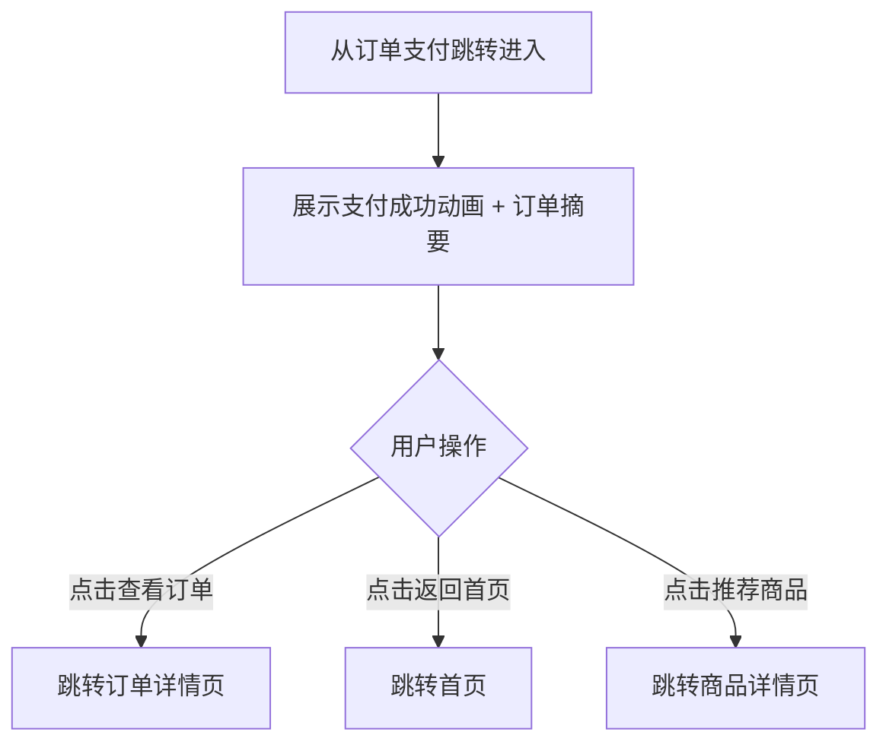

# 苏银豆商城小程序 - 下单流程需求文档

---

## 下单流程概览

下单流程覆盖用户从商品浏览到支付完成的完整购买链路，共5个页面：

---

#### 4.1.3. 商品详情页

##### 1. 功能概述

商品详情页展示单个商品的完整信息，是用户做出购买决策的核心页面。用户从首页推荐、搜索结果、购物车、收藏、订单等多个入口均可进入此页面。页面包含商品图片轮播、价格与促销信息、规格选择、优惠券入口、用户评价、商品详情图文，底部固定操作栏提供"加入购物车"和"立即购买"两个核心操作。

##### 2. 页面结构

页面顶部为导航栏，中间为可滚动内容区，底部固定操作栏。部分模块支持条件显示（优惠券/评价区域可能不存在）。

| 区域 | 说明 |
|------|------|
| 导航栏 | 返回按钮 + "商品详情"标题 + 胶囊按钮 |
| 商品图片轮播 | 全宽1:1比例图片轮播，支持左右滑动切换，右下角显示"当前页/总数"指示（如"1/3"） |
| 价格区 | 现价（红色大字）+ 原价（灰色删除线）+ 折扣标签（如"4折"），下方显示销量与好评率 |
| 标题区 | 商品名称（最多2行截断）+ 服务标签（正品保障/7天无理由/极速退款） |
| 优惠券入口 | 点击可领取优惠券，显示可用券信息（如"满100减20 / 满200减50"）。无优惠券时此区域隐藏 |
| 规格选择 | 展示已选规格（如"白色，500ml"），点击可弹出规格选择器（当前为跳转提示） |
| 用户评价 | 展示1条热门评价（头像+昵称+星级+内容+日期），底部"查看全部评价"链接。无评价时此区域隐藏 |
| 商品详情图文 | "—— 商品详情 ——" 分隔标题 + 商品详情图片列表 |
| 底部操作栏 | 左侧：首页图标+购物车图标（含角标）；右侧：加入购物车（橙色）+ 立即购买（红橙渐变） |

##### 3. 操作流程

用户进入商品详情页后，核心操作路径如下：

图片轮播支持触摸滑动和鼠标拖拽（桌面预览），滑动距离超过40px触发切换。图片指示器实时显示当前序号。优惠券和评价区域通过JS变量控制显示/隐藏（`hasCoupon`和`hasReview`），无数据时整块隐藏。

##### 4. 字段与交互

| 字段名称 | 字段标识 | 字段类型 | 必填 | 数据类型 | 长度限制 | 默认值 | 校验规则 | 取值范围 | 来源 | 错误提示 |
|----------|----------|----------|------|----------|----------|--------|----------|----------|------|----------|
| 商品图片轮播 | product_images | 轮播组件 | - | - | - | 第1张 | 支持touch/mouse滑动，滑动>40px触发切换，循环播放 | 0-2（共3张） | 后端接口 | - |
| 图片指示器 | slide_indicator | 文本显示 | - | String | - | "1/3" | 显示"当前序号/总数"，随轮播切换实时更新 | - | 系统计算 | - |
| 现价 | current_price | 文本显示 | 是 | Number | - | - | 红色大字，¥符号缩小显示 | >0 | 后端接口 | - |
| 原价 | original_price | 文本显示 | 否 | Number | - | - | 灰色删除线，无原价时不显示 | ≥现价 | 后端接口 | - |
| 折扣标签 | discount_tag | 标签 | 否 | String | - | - | 渐变背景白字，如"4折"，无折扣时不显示 | - | 后端计算 | - |
| 销量与好评率 | sold_info | 文本显示 | - | String | - | - | 格式："已售X万件 · 好评率X%" | - | 后端接口 | - |
| 商品名称 | product_name | 文本显示 | 是 | String | - | - | 最多2行，超出截断省略 | - | 后端接口 | - |
| 服务标签 | service_tags | 标签组 | - | Array | - | - | 橙色背景小标签，如"正品保障""7天无理由""极速退款" | - | 运营配置 | - |
| 优惠券入口 | coupon_entry | 可点击区域 | 否 | - | - | 隐藏 | 当hasCoupon=true时显示，点击领取优惠券；hasCoupon=false时整块隐藏 | 显示/隐藏 | 后端接口 | - |
| 优惠券文案 | coupon_text | 文本显示 | - | String | - | - | 展示可用券信息，如"满100减20 / 满200减50" | - | 后端接口 | - |
| 规格选择 | spec_section | 可点击区域 | - | - | - | "白色，500ml" | 点击弹出规格选择器（静态原型为跳转提示） | - | 后端接口 | - |
| 评价区域 | review_section | 内容区 | 否 | - | - | 隐藏 | 当hasReview=true时显示1条热门评价；hasReview=false时整块隐藏 | 显示/隐藏 | 后端接口 | - |
| 评价用户头像 | reviewer_avatar | 图片 | - | String(URL) | - | 默认头像 | 圆形裁剪 | - | 后端接口 | - |
| 评价用户昵称 | reviewer_name | 文本显示 | - | String | - | - | 脱敏显示，如"用***8" | - | 后端接口 | - |
| 评价星级 | review_stars | 图标显示 | - | Number | - | 5 | 橙色星星，1-5颗 | 1-5 | 后端接口 | - |
| 评价内容 | review_content | 文本显示 | - | String | - | - | 评价正文 | - | 后端接口 | - |
| 评价日期 | review_date | 文本显示 | - | String | - | - | 格式"YYYY-MM-DD" | - | 后端接口 | - |
| 查看全部评价 | view_all_review | 链接 | - | - | - | - | 橙色文字"查看全部评价 >"，点击跳转评价列表页 | - | - | - |
| 商品详情图文 | detail_images | 图片列表 | - | Array(URL) | - | - | 分隔标题 + 图片纵向排列 | - | 后端接口 | - |
| 首页图标 | icon_home | 图标按钮 | - | - | - | - | 点击跳转首页 | - | - | - |
| 购物车图标 | icon_cart | 图标按钮 | - | - | - | 角标数字 | 右上角红色角标显示购物车数量 | ≥0 | 购物车数据 | - |
| 加入购物车 | btn_add_cart | 按钮 | - | - | - | - | 点击后Toast提示"已加入购物车"，购物车角标+1 | - | - | - |
| 立即购买 | btn_buy_now | 按钮 | - | - | - | - | 点击跳转确认订单页（order.html） | - | - | - |

##### 5. 业务规则

| 规则编号 | 规则描述 |
|----------|----------|
| RULE-PROD-001 | 优惠券区域和评价区域为条件显示模块，由后端数据决定是否存在，不存在时整块隐藏不留空白 |
| RULE-PROD-002 | 图片轮播自动播放间隔未设置（需手动滑动），不自动循环；滑动阈值40px |
| RULE-PROD-003 | 点击"加入购物车"仅显示Toast提示并更新角标，不跳转页面、不弹出弹窗 |
| RULE-PROD-004 | 点击"立即购买"直接跳转确认订单页，携带当前商品信息 |
| RULE-PROD-005 | 购物车角标数字为全局共享状态，需与购物车页面的商品总数保持一致 |

##### 6. 页面跳转

**入口**：
- 首页推荐商品列表点击
- 首页限时活动商品点击
- 购物车商品图片点击
- 收藏页商品点击
- 订单详情/订单列表商品点击
- 搜索结果点击

**出口**：
- 点击"立即购买" → 确认订单页（order.html）
- 点击"查看全部评价" → 评价列表页（review.html）
- 点击首页图标 → 首页（home_page.html）
- 点击购物车图标 → 购物车页（cart.html）

---

#### 4.1.4. 购物车页

##### 1. 功能概述

购物车页展示用户已添加的所有商品，支持商品选择、数量调整和滑动删除操作。用户可通过底部Tab栏"购物车"或商品详情页的购物车图标进入此页面。页面底部固定结算栏，显示全选开关、合计金额和结算按钮，结算栏下方为全局Tab导航栏。

##### 2. 页面结构

页面顶部为导航栏，中间为可滚动商品列表，底部依次固定结算栏和Tab导航栏。

| 区域 | 说明 |
|------|------|
| 导航栏 | 返回按钮 + "购物车"标题 + 胶囊按钮 |
| 商品计数栏 | 显示"共X件商品"，随增删操作实时更新 |
| 商品列表 | 每件商品为一行卡片：勾选框 + 商品图片 + 商品信息（名称、规格、价格、数量控制）。支持左滑露出删除按钮 |
| 结算栏 | 固定于Tab栏上方，包含：全选复选框 + "全选"文案 + 合计金额 + 结算按钮（显示已选件数） |
| 底部Tab栏 | 固定底部5个Tab，购物车Tab高亮，购物车图标右上角显示角标数字 |
| 空购物车 | 当购物车无商品时显示空状态图标 + "购物车空空如也" + "去逛逛"按钮（跳转首页） |

##### 3. 操作流程

用户进入购物车后的核心操作路径如下：

左滑删除支持触摸和鼠标拖拽两种方式：触摸滑动距离超过删除按钮宽度的一半（36px）时自动吸附露出删除区域，小于一半则回弹。点击删除后先执行高度收缩+透明度淡出动画（0.2s），动画结束后重新渲染列表。

##### 4. 字段与交互

| 字段名称 | 字段标识 | 字段类型 | 必填 | 数据类型 | 长度限制 | 默认值 | 校验规则 | 取值范围 | 来源 | 错误提示 |
|----------|----------|----------|------|----------|----------|--------|----------|----------|------|----------|
| 商品计数 | cart_count | 文本显示 | - | Number | - | 3 | 显示购物车商品总件数，随增删实时更新 | ≥0 | 购物车数据 | - |
| 商品勾选框 | item_checkbox | 复选框 | - | Boolean | - | 全选 | 点击切换选中/取消，圆形样式，选中时橙色填充+白色勾 | true/false | 用户操作 | - |
| 商品图片 | item_image | 图片链接 | - | String(URL) | - | - | 80×80圆角方形，点击跳转商品详情 | - | 后端接口 | - |
| 商品名称 | item_name | 文本显示 | 是 | String | - | - | 最多2行截断省略 | - | 后端接口 | - |
| 商品规格 | item_spec | 文本显示 | - | String | - | - | 灰色背景小标签，如"白色 500ml" | - | 后端接口 | - |
| 商品单价 | item_price | 文本显示 | 是 | Number | - | - | 红色加粗，¥符号缩小，保留2位小数 | >0 | 后端接口 | - |
| 数量控制 | qty_control | 步进器 | - | Number | - | 1 | 减号按钮在数量为1时置灰不可点；加号无上限；数量实时显示 | ≥1 | 用户操作 | - |
| 左滑删除 | swipe_delete | 滑动手势 | - | - | - | 隐藏 | 左滑距离>36px吸附显示删除按钮（红色72px宽），<36px回弹；同时只允许一个商品处于展开状态 | - | 用户操作 | - |
| 删除按钮 | delete_btn | 按钮 | - | - | - | 隐藏 | 红色背景白色文字"删除"，点击后动画移除商品并重新计算金额 | - | - | - |
| 全选复选框 | select_all | 复选框 | - | Boolean | - | 全选 | 点击切换全部商品选中/取消；当所有商品均已选中时自动变为选中态 | true/false | 用户操作 | - |
| 合计金额 | total_amount | 文本显示 | - | Number | - | "0.00" | 仅统计选中商品的价格×数量之和，保留2位小数 | ≥0 | 系统计算 | - |
| 结算按钮 | btn_checkout | 按钮 | - | - | - | - | 显示已选商品件数"结算(X)"，点击跳转确认订单页；无选中商品时仍可点击（金额为0） | - | - | - |
| 购物车角标 | cart_badge | 数字角标 | - | Number | - | 3 | 显示购物车商品总件数，固定在购物车Tab图标右上角 | ≥0 | 购物车数据 | - |
| 空状态按钮 | btn_go_shop | 按钮 | - | - | - | - | 购物车为空时显示"去逛逛"，点击跳转首页 | - | - | - |

##### 5. 业务规则

| 规则编号 | 规则描述 |
|----------|----------|
| RULE-CART-001 | 结算栏固定在Tab导航栏上方（bottom: 56px），页面滚动区域需为结算栏和Tab栏预留空间（padding-bottom: 128px） |
| RULE-CART-002 | 左滑删除同一时刻只允许一个商品卡片处于展开状态，新滑动一个商品时自动关闭上一个 |
| RULE-CART-003 | 数量减到1后，减号按钮置灰且不可点击（pointer-events: none），防止数量降至0 |
| RULE-CART-004 | 全选状态与单个商品勾选联动：所有商品均选中时全选自动勾选，任一取消则全选取消 |
| RULE-CART-005 | 合计金额仅计算已勾选商品的价格×数量之和，未勾选商品不参与计算 |
| RULE-CART-006 | 购物车角标数字为全局共享状态，需与首页及其他页面的购物车角标保持一致 |

##### 6. 页面跳转

**入口**：
- 底部Tab"购物车"
- 商品详情页点击购物车图标
- 首页购物车Tab

**出口**：
- 点击商品图片 → 商品详情页（product_detail.html）
- 点击结算按钮 → 确认订单页（order.html）
- 空状态点击"去逛逛" → 首页（home_page.html）
- 底部Tab → 首页（home_page.html）、分类（category.html）、收藏（favorites.html）、我的（profile.html）

---

#### 4.1.5. 确认订单页

##### 1. 功能概述

确认订单页是用户下单前的最后一站，展示待结算商品的完整订单信息。用户从购物车点击"结算"或从商品详情页点击"立即购买"进入此页面。页面包含收货地址、商品清单、配送方式、积分抵扣、留言、费用明细等模块，底部固定提交栏显示合计金额和"立即支付"按钮，点击后跳转订单支付页面。

##### 2. 页面结构

页面顶部为导航栏，中间为可滚动内容区，底部固定提交栏。

| 区域 | 说明 |
|------|------|
| 导航栏 | 返回按钮 + "确认订单"标题 + 胶囊按钮 |
| 收货地址 | 展示默认收货地址（收件人+手机号+详细地址），右侧右箭头指示可点击切换地址。底部有彩色锯齿分割线 |
| 商品清单 | 展示待购买商品列表，每项包含商品图片、名称、规格、单价和数量控制 |
| 配送方式 | 显示"快递 免邮"，右侧右箭头指示可展开选择 |
| 积分抵扣 | 显示可用积分抵扣金额（如"-¥5.00"），橙色高亮，右侧右箭头 |
| 留言 | 显示"选填：对本次交易的说明"占位文案，右侧右箭头指示可输入 |
| 费用明细 | 逐行列出商品金额、运费、积分抵扣，底部汇总行显示"实付金额"（红色大字） |
| 提交栏 | 固定底部，左侧显示"合计："+红色金额，右侧"立即支付"渐变按钮 |

##### 3. 操作流程

用户进入确认订单页后，确认信息并提交订单：

商品数量调整时，点击加号数量+1、减号数量-1（最小为1，减号置灰）。每次数量变化后，系统重新计算商品金额总和，减去积分抵扣后更新费用明细和底部合计金额，三处金额保持同步。

##### 4. 字段与交互

| 字段名称 | 字段标识 | 字段类型 | 必填 | 数据类型 | 长度限制 | 默认值 | 校验规则 | 取值范围 | 来源 | 错误提示 |
|----------|----------|----------|------|----------|----------|--------|----------|----------|------|----------|
| 收货地址 | address_section | 可点击区域 | 是 | - | - | 默认地址 | 展示收件人+手机号+详细地址，点击跳转地址管理页 | - | 后端接口/地址管理 | - |
| 收件人 | receiver_name | 文本显示 | 是 | String | - | "张三" | 与手机号同行显示，加粗 | - | 后端接口 | - |
| 手机号 | receiver_phone | 文本显示 | 是 | String | - | "138****8888" | 脱敏显示，中间四位用*替代 | - | 后端接口 | - |
| 详细地址 | address_detail | 文本显示 | 是 | String | - | - | 地址文本自动换行 | - | 后端接口 | - |
| 商品图片 | prod_image | 图片 | 是 | String(URL) | - | - | 72×72圆角方形 | - | 后端接口 | - |
| 商品名称 | prod_name | 文本显示 | 是 | String | - | - | 最多2行截断省略 | - | 后端接口 | - |
| 商品规格 | prod_spec | 文本显示 | - | String | - | - | 灰色小字，如"白色 500ml" | - | 后端接口 | - |
| 商品单价 | prod_price | 文本显示 | 是 | Number | - | - | 黑色加粗，保留2位小数 | >0 | 后端接口 | - |
| 商品数量 | prod_qty | 步进器 | 是 | Number | - | 1 | 加号无上限，减号最小为1时置灰不可点 | ≥1 | 用户操作 | - |
| 配送方式 | delivery_method | 可点击区域 | - | - | - | "快递 免邮" | 点击展开配送选项（静态原型阶段为展示） | - | 后端接口 | - |
| 积分抵扣 | points_deduction | 可点击区域 | - | Number | - | -¥5.00 | 橙色高亮显示抵扣金额和消耗积分数（如"5豆"），附带"优先消耗即将过期积分"提示，点击可修改积分使用数量 | ≥0 | 用户配置/后端计算 | - |
| 留言 | order_message | 可点击区域 | 否 | String | - | placeholder文案 | 显示"选填：对本次交易的说明"，点击可输入 | - | 用户输入 | - |
| 商品金额 | goods_amount | 文本显示 | - | Number | - | - | 所有商品单价×数量之和，保留2位小数 | ≥0 | 系统计算 | - |
| 运费 | shipping_fee | 文本显示 | - | Number | - | ¥0.00 | 当前固定为0（免邮），保留2位小数 | ≥0 | 后端计算 | - |
| 积分抵扣金额 | discount_amount | 文本显示 | - | Number | - | -¥5.00 | 橙色文字，显示实际抵扣金额 | ≥0 | 用户配置 | - |
| 实付金额 | final_amount | 文本显示 | 是 | Number | - | - | 红色大字，=商品金额-积分抵扣+运费，保留2位小数 | ≥0 | 系统计算 | - |
| 底部合计 | bottom_total | 文本显示 | 是 | Number | - | - | 与实付金额同步，红色加粗大号字体 | ≥0 | 系统计算 | - |
| 立即支付 | btn_submit | 按钮 | 是 | - | - | - | 红橙渐变胶囊按钮，点击跳转订单支付页面 | - | - | - |

##### 5. 业务规则

| 规则编号 | 规则描述 |
|----------|----------|
| RULE-ORDER-001 | 实付金额 = 商品金额总和 - 积分抵扣 + 运费，数量变化时三处金额（费用明细实付金额、底部合计）实时同步更新 |
| RULE-ORDER-002 | 收货地址区域底部有彩色锯齿分割线，由三种颜色（#ff6034、#ee0a24、#ff9800）循环重复组成 |
| RULE-ORDER-003 | 手机号中间四位脱敏显示（如138\*\*\*\*8888），保护用户隐私 |
| RULE-ORDER-004 | 商品数量在确认订单页仍可调整，调整后金额实时重新计算 |
| RULE-ORDER-005 | 积分抵扣区域显示消耗积分数和"优先消耗即将过期积分"提示文案，消耗规则：按积分过期时间升序（FIFO），优先消耗最先过期的积分批次 |

##### 6. 页面跳转

**入口**：
- 购物车页点击"结算"按钮
- 商品详情页点击"立即购买"按钮

**出口**：
- 点击"立即支付" → 订单支付页（payment.html）
- 点击收货地址 → 收货地址管理页（address.html）
- 点击返回按钮 → 返回上一页

---

#### 4.1.7. 订单支付页

##### 1. 功能概述

订单支付页是用户完成支付的关键页面，展示待支付金额、可用苏银豆余额和四种支付方式供选择。用户从确认订单页点击"立即支付"进入此页面，选择支付方式并确认支付后跳转支付结果页。页面支持微信支付、支付宝、苏银豆全额兑换、苏银豆+现金组合支付四种方式，选择组合支付时展开抵扣明细（含积分批次消耗明细）；选择全额兑换且余额不足时，显示需补充的现金金额并建议使用组合支付。积分消耗按过期时间升序排列，优先消耗最先过期的积分批次。

##### 2. 页面结构

页面顶部为导航栏，中间为可滚动内容区，底部固定支付按钮。

| 区域 | 说明 |
|------|------|
| 导航栏 | 返回按钮 + "订单支付"标题 + 胶囊按钮 |
| 支付金额头部 | 居中展示"支付金额"标签 + 大号金额数字（黑色加粗） |
| 苏银豆余额 | 展示星形图标 + "可用苏银豆：1,280"（橙色数字）+ "1苏银豆=1元"换算提示 |
| 支付方式列表 | 标题"选择支付方式" + 4种支付方式卡片，每种包含图标、名称、描述和单选圆圈 |
| 组合支付明细 | 仅在选择"苏银豆+现金组合支付"时展开，显示苏银豆抵扣金额、积分消耗批次明细（按过期时间升序）、现金支付金额和合计 |
| 余额不足提示 | 仅在选择"苏银豆全额兑换"且余额不足时显示，橙色背景提示卡片，显示缺少积分数和需补充金额，建议使用组合支付 |
| 底部支付按钮 | 固定底部，全宽红橙渐变胶囊按钮"确认支付 ¥171.90"，含锁图标 |

##### 3. 操作流程

用户进入订单支付后选择支付方式并确认支付：

支付方式为单选互斥：点击任一方式后，其他方式的选中状态自动取消，选中方式的单选圆圈变为橙色填充。选择"苏银豆+现金组合支付"时，下方自动展开橙色背景的抵扣明细卡片，显示苏银豆抵扣金额、现金补齐金额和合计；切换其他支付方式时该卡片自动收起。

##### 4. 字段与交互

| 字段名称 | 字段标识 | 字段类型 | 必填 | 数据类型 | 长度限制 | 默认值 | 校验规则 | 取值范围 | 来源 | 错误提示 |
|----------|----------|----------|------|----------|----------|--------|----------|----------|------|----------|
| 支付金额 | pay_amount | 文本显示 | 是 | Number | - | - | 黑色大字居中，¥符号缩小，与确认订单页实付金额一致 | >0 | 确认订单页传入 | - |
| 苏银豆余额 | points_balance | 文本显示 | - | Number | - | - | 橙色加粗数字，显示可用苏银豆数量 | ≥0 | 后端接口 | - |
| 换算提示 | points_rate | 文本显示 | - | String | - | "1苏银豆=1元" | 灰色小字，说明兑换比例 | - | 系统配置 | - |
| 微信支付 | method_wechat | 单选项 | - | - | - | 选中 | 绿色图标+名称+描述"推荐使用，安全便捷"，默认选中 | - | 静态配置 | - |
| 支付宝支付 | method_alipay | 单选项 | - | - | - | 未选中 | 蓝色图标+名称+描述"H5场景可用" | - | 静态配置 | - |
| 苏银豆全额兑换 | method_beans | 单选项 | - | - | - | 未选中 | 橙色图标+名称+描述"需消耗X苏银豆，当前余额不足，需补充¥X.XX"，余额不足时橙色高亮提示补充金额 | - | 后端计算 | - |
| 苏银豆+现金组合 | method_combo | 单选项 | - | - | - | 未选中 | 渐变图标+名称+描述"使用全部苏银豆抵扣，剩余现金补齐"，选中时展开明细 | - | 静态配置 | - |
| 组合抵扣明细 | combo_detail | 折叠面板 | - | - | - | 隐藏 | 仅combo选中时显示，橙色背景卡片，列出苏银豆抵扣金额、积分消耗批次明细（按过期时间升序，每行显示积分数+到期日期+抵扣金额）、现金支付金额、合计 | 显示/隐藏 | 系统计算 | - |
| 余额不足提示 | beans_shortage | 提示卡片 | - | - | - | 隐藏 | 仅全额兑换选中且余额不足时显示，橙色背景，显示缺少积分数和需补充金额，建议使用组合支付 | 显示/隐藏 | 系统计算 | - |
| 确认支付 | btn_pay | 按钮 | 是 | - | - | - | 全宽渐变胶囊按钮，文案"确认支付 ¥X.XX"，点击跳转支付结果页 | - | - | - |

##### 5. 业务规则

| 规则编号 | 规则描述 |
|----------|----------|
| RULE-PAY-001 | 四种支付方式为单选互斥，同一时刻仅一种为选中状态，选中时圆圈变为橙色填充+白色勾 |
| RULE-PAY-002 | 苏银豆全额兑换方式展示所需豆数，余额不足时描述文案橙色高亮提示 |
| RULE-PAY-003 | 组合支付明细根据选中状态动态展开/收起，切换其他方式时自动收起 |
| RULE-PAY-004 | 底部支付按钮的金额文案与页面顶部支付金额保持一致 |
| RULE-PAY-005 | 选择"苏银豆全额兑换"时，若余额不足，描述文案显示需补充金额（补充金额=商品价格-现有积分价值），同时下方显示橙色提示卡片建议使用组合支付 |
| RULE-PAY-006 | 选择"苏银豆+现金组合支付"时，展开的抵扣明细包含"积分消耗明细"子区域，逐行列出按过期时间升序排列的积分批次（每批显示：积分数+到期日期+抵扣金额），现金支付金额=商品价格-全部积分抵扣金额 |
| RULE-PAY-007 | 积分消耗按过期时间升序排列（FIFO），优先消耗最先过期的积分批次。不同过期日期的积分视为不同批次，分别展示 |

##### 6. 页面跳转

**入口**：
- 确认订单页点击"立即支付"

**出口**：
- 点击"确认支付" → 支付结果页（pay_success.html）
- 点击返回按钮 → 返回确认订单页

---

#### 4.1.8. 支付结果页

##### 1. 功能概述

支付结果页展示支付成功的确认信息，告知用户订单支付完成并引导后续操作。页面包含成功动画图标、订单摘要信息和"猜你喜欢"推荐商品。用户从订单支付确认支付后自动跳转至此页面，可通过底部按钮查看订单详情或返回首页继续购物。

##### 2. 页面结构

页面顶部为导航栏，中间为可滚动内容区，无底部固定栏。

| 区域 | 说明 |
|------|------|
| 导航栏 | 返回按钮 + "支付结果"标题 + 胶囊按钮 |
| 成功提示区 | 居中展示绿色对勾圆形图标（带缩放动画）+"支付成功"标题+感谢文案+两个操作按钮 |
| 订单信息卡片 | 白色圆角卡片，逐行列出订单编号、支付方式、苏银豆抵扣、现金支付、实付金额 |
| 猜你喜欢 | 标题"—— 猜你喜欢 ——" + 双列商品网格（4件推荐商品），点击跳转商品详情 |

##### 3. 操作流程

页面加载时成功图标执行缩放动画：从0放大至1.1倍再回落到1倍（scaleIn动画，0.4秒），形成弹性效果。

##### 4. 字段与交互

| 字段名称 | 字段标识 | 字段类型 | 必填 | 数据类型 | 长度限制 | 默认值 | 校验规则 | 取值范围 | 来源 | 错误提示 |
|----------|----------|----------|------|----------|----------|--------|----------|----------|------|----------|
| 成功图标 | success_icon | 动画图标 | - | - | - | - | 绿色渐变圆形（#4caf50→#2e7d32），白色对勾，scaleIn动画0.4s弹性缩放 | - | 系统展示 | - |
| 成功标题 | success_title | 文本显示 | - | String | - | "支付成功" | 黑色加粗18px | - | 系统配置 | - |
| 感谢文案 | success_desc | 文本显示 | - | String | - | "感谢您的购买，商品将尽快为您发出" | 灰色13px | - | 系统配置 | - |
| 查看订单 | btn_view_order | 按钮 | - | - | - | - | 橙色描边胶囊按钮，点击跳转订单详情页 | - | - | - |
| 返回首页 | btn_back_home | 按钮 | - | - | - | - | 红橙渐变实心胶囊按钮，点击跳转首页 | - | - | - |
| 订单编号 | order_no | 文本显示 | 是 | String | - | - | 格式如"JS2026040888001" | - | 系统生成 | - |
| 支付方式 | order_pay_method | 文本显示 | 是 | String | - | - | 如"苏银豆+现金组合" | - | 订单支付选择 | - |
| 苏银豆抵扣 | order_beans_deduct | 文本显示 | - | String | - | - | 格式"1,280豆 (¥1,280.00)" | - | 系统计算 | - |
| 现金支付 | order_cash_paid | 文本显示 | - | Number | - | - | 灰色常规字 | ≥0 | 系统计算 | - |
| 实付金额 | order_final_amount | 文本显示 | 是 | Number | - | - | 红色加粗16px，与订单支付支付金额一致 | >0 | 系统计算 | - |
| 推荐商品列表 | rec_products | 双列网格 | - | Array | - | 4件 | 点击商品卡片跳转商品详情页 | - | 后端接口 | - |

##### 5. 业务规则

| 规则编号 | 规则描述 |
|----------|----------|
| RULE-PAYOK-001 | 页面仅展示支付成功状态，当前静态原型不模拟支付失败场景 |
| RULE-PAYOK-002 | 实付金额需与订单支付确认支付的金额一致，确保金额链路完整 |
| RULE-PAYOK-003 | 成功图标使用scaleIn动画（0→1.1→1），页面加载时自动播放一次 |

##### 6. 页面跳转

**入口**：
- 订单支付页点击"确认支付"

**出口**：
- 点击"查看订单" → 订单详情页（order_detail.html）
- 点击"返回首页" → 首页（home_page.html）
- 点击推荐商品 → 商品详情页（product_detail.html）
