# 苏银豆商城小程序 - 基础功能需求文档

---

## 基础功能概览

基础功能涵盖用户账号体系、首页浏览、地址管理、个人中心、收藏、钱包、资料编辑、系统设置和卡券管理共9个模块，14个页面：

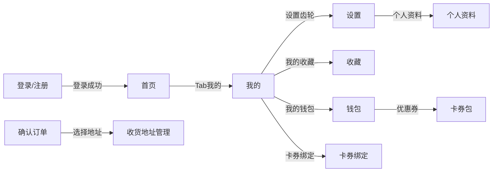

---

### 4.1.1. 用户登录注册模块

---

#### 4.1.1.1. 登录页

##### 1. 功能概述

登录页是商城的唯一身份认证入口，提供手机号验证码登录和微信授权登录两种方式。用户在未登录状态下点击"我的"Tab、或从设置页退出登录后，会跳转到此页面。登录成功后自动跳转首页。页面底部提供"立即注册"入口，引导新用户完成注册。

##### 2. 页面结构

页面从上到下分为四个区域：品牌标识区、登录表单区、第三方登录区和底部引导区。

| 区域 | 说明 |
|------|------|
| 品牌标识区 | 渐变背景卡片，展示星形图标、"苏银豆商城"标题和"江苏银行专属积分商城"副标题 |
| 登录表单区 | 手机号输入框 + 验证码输入框（含获取验证码按钮）+ 协议勾选 + 登录按钮 |
| 第三方登录区 | "其他登录方式"分隔线 + 微信登录图标按钮 |
| 底部引导区 | "还没有账号？立即注册"链接，跳转注册页 |

此外包含一个微信授权弹窗（默认隐藏）：半透明遮罩 + 居中白色卡片，展示微信图标、"微信授权登录"标题、授权说明文案、用户头像预览，以及"拒绝"和"允许"两个按钮。点击弹窗外部遮罩可关闭。

##### 3. 操作流程

用户可选择手机号登录或微信登录两种方式：

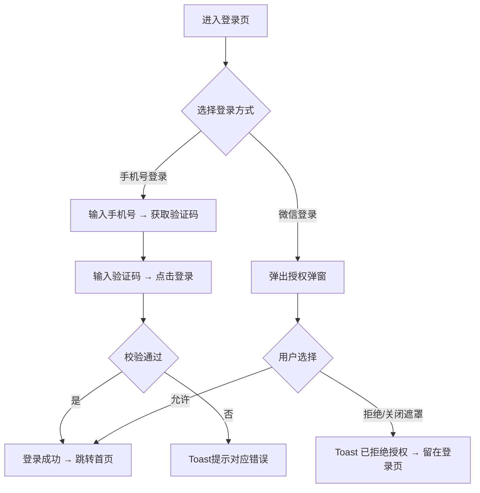

验证码按钮点击后进入60秒倒计时，按钮文案变为"{n}s后重试"，倒计时结束恢复"获取验证码"。登录校验按顺序执行：手机号格式 → 验证码非空 → 协议勾选，任何一步不通过即停止并弹出对应 Toast。

##### 4. 字段与交互

| 字段名称 | 字段标识 | 字段类型 | 必填 | 数据类型 | 长度限制 | 默认值 | 校验规则 | 取值范围 | 来源 | 错误提示 |
|----------|----------|----------|------|----------|----------|--------|----------|----------|------|----------|
| 手机号 | phone_number | 文本输入(tel) | 是 | String | 11位 | 空 | 11位纯数字 | 0-9 | 用户输入 | 为空：请输入手机号；格式错：请输入正确的手机号 |
| 验证码 | verify_code | 文本输入 | 是 | String | 6位 | 空 | 6位数字，非空 | 0-9 | 用户输入 | 请输入验证码 |
| 获取验证码 | send_code | 按钮 | - | - | - | "获取验证码" | 先校验手机号格式，通过后发送并进入60s倒计时，显示"{n}s后重试" | - | - | 手机号格式错：请输入正确的手机号 |
| 协议勾选 | agreement | 复选框 | 是 | Boolean | - | 勾选 | 必须为true，文案含"用户协议"和"隐私政策"可点击链接 | true/false | 用户操作 | 请同意用户协议和隐私政策 |
| 登录 | login_btn | 按钮 | - | - | - | - | 按顺序校验：手机号→验证码→协议，通过后写入登录态跳转首页 | - | - | 显示第一个未通过字段的错误提示 |
| 微信登录 | wechat_login | 按钮 | - | - | - | - | 点击弹出授权弹窗（含遮罩关闭） | - | - | - |
| 拒绝授权 | auth_reject | 按钮 | - | - | - | - | 关闭弹窗，Toast提示后留在当前页 | - | - | 已拒绝授权 |
| 允许授权 | auth_allow | 按钮 | - | - | - | - | 关闭弹窗，模拟登录成功，写入登录态跳转首页 | - | - | - |

##### 5. 业务规则

| 规则编号 | 规则描述 |
|----------|----------|
| RULE-LOGIN-001 | 登录成功后写入本地登录态，后续页面请求携带用户身份信息 |
| RULE-LOGIN-002 | 微信授权弹窗当前为模拟流程（静态原型阶段），点击"允许"直接模拟登录成功，未对接真实微信API |
| RULE-LOGIN-003 | 验证码发送后60秒内不可重复请求，倒计时结束才可再次获取 |

##### 6. 页面跳转

**入口**：
- 未登录态点击底部Tab"我的"
- 设置页退出登录后自动跳转

**出口**：
- 手机号登录成功 → 首页（home_page.html）
- 微信授权成功 → 首页（home_page.html）
- 点击"立即注册" → 注册页（register.html）

---

#### 4.1.1.2. 注册页

##### 1. 功能概述

注册页提供手机号验证码快速注册流程，无需设置密码。注册成功后自动登录并跳转首页，不需要再回到登录页重新登录。用户从登录页点击"立即注册"进入此页面。

##### 2. 页面结构

页面顶部是导航栏（返回按钮 + "注册账号"标题），下方是注册表单区和底部引导区。

| 区域 | 说明 |
|------|------|
| 导航栏 | 返回按钮（跳转登录页）+ 标题"注册账号" + 副标题"注册成为苏银豆商城会员" |
| 注册表单区 | 手机号输入框 + 验证码输入框（含获取验证码按钮）+ 协议勾选 + 注册按钮 |
| 底部引导区 | "已有账号？立即登录"链接，跳转登录页 |

##### 3. 操作流程

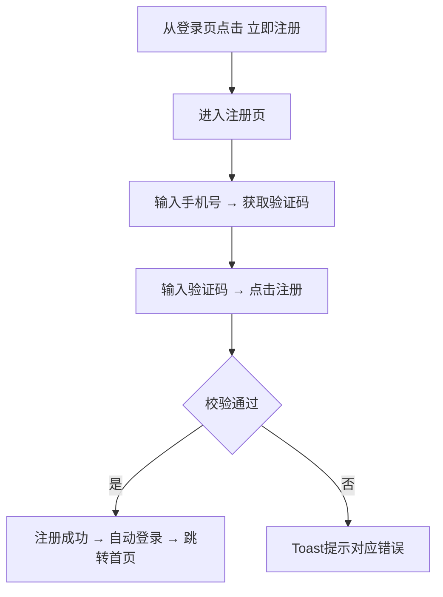

校验逻辑与登录页一致：手机号格式 → 验证码非空 → 协议勾选。注册成功后弹出 Toast "注册成功"，然后自动写入登录态并跳转首页。

##### 4. 字段与交互

| 字段名称 | 字段标识 | 字段类型 | 必填 | 数据类型 | 长度限制 | 默认值 | 校验规则 | 取值范围 | 来源 | 错误提示 |
|----------|----------|----------|------|----------|----------|--------|----------|----------|------|----------|
| 手机号 | phone_number | 文本输入(tel) | 是 | String | 11位 | 空 | 11位纯数字 | 0-9 | 用户输入 | 为空：请输入手机号；格式错：请输入正确的手机号 |
| 验证码 | verify_code | 文本输入 | 是 | String | 6位 | 空 | 6位数字，非空 | 0-9 | 用户输入 | 请输入验证码 |
| 获取验证码 | send_code | 按钮 | - | - | - | "获取验证码" | 先校验手机号格式，通过后发送并进入60s倒计时 | - | - | 手机号格式错：请输入正确的手机号 |
| 协议勾选 | agreement | 复选框 | 是 | Boolean | - | 勾选 | 必须为true，含"用户协议"和"隐私政策"可点击链接 | true/false | 用户操作 | 请同意用户协议和隐私政策 |
| 注册 | register_btn | 按钮 | - | - | - | - | 按顺序校验：手机号→验证码→协议，通过后Toast"注册成功"并自动登录跳转首页 | - | - | 显示第一个未通过字段的错误提示 |

##### 5. 业务规则

| 规则编号 | 规则描述 |
|----------|----------|
| RULE-REG-001 | 注册仅需手机号+验证码，不设置密码，降低注册门槛 |
| RULE-REG-002 | 注册成功即自动登录，直接跳转首页，不返回登录页 |
| RULE-REG-003 | 同一手机号不可重复注册（需后端校验，静态原型阶段不模拟此场景） |

##### 6. 页面跳转

**入口**：
- 登录页点击"还没有账号？立即注册"

**出口**：
- 注册成功 → 首页（home_page.html）
- 点击返回按钮 → 登录页（login.html）
- 点击"已有账号？立即登录" → 登录页（login.html）

---

### 4.1.2. 首页模块

---

#### 4.1.2.1. 首页

##### 1. 功能概述

首页是用户打开小程序后看到的第一个页面（登录/注册后自动跳转至此），承载商品发现和核心业务入口的功能。页面从上到下包含：头部搜索栏、Banner轮播（背景色随轮播切换）、公告通知、分类导航（两页滑动）、限时活动区、营销卡片、推荐商品列表，底部固定Tab导航栏。

##### 2. 页面结构

页面整体为单列滚动布局，顶部和底部有固定区域。

| 区域 | 说明 |
|------|------|
| 头部搜索栏 | 红/橙渐变背景，展示"苏银豆商城"标题+金色圆点图标、搜索框（点击跳转搜索页）、微信胶囊按钮。背景色随Banner轮播联动变化 |
| Banner轮播 | 3张运营位Banner，自动轮播4秒/张，支持左右滑动切换，底部圆点指示器。轮播时头部背景色同步切换 |
| 公告通知栏 | 橙色背景横条，喇叭图标+滚动文字（用户中奖、平台福利等信息自动轮播） |
| 分类导航 | 白色圆角卡片，10个分类图标分两页展示（5×2网格），支持左右滑动翻页，底部圆点分页指示 |
| 限时活动 | 白色卡片，标题"限时活动"+HOT标签+倒计时，横向滚动的商品卡片列表，每张卡片展示图片、折扣标签、名称、价格、原价 |
| 营销卡片 | 2×2网格布局，4张营销入口卡片（品质生活、新人专区、充值中心、企业福利），各自带背景图+渐变遮罩+标题+描述+标签 |
| 推荐商品 | 双列瀑布流商品网格，每张卡片展示图片、名称、标签、现价、原价、销量 |
| 底部Tab栏 | 固定底部5个Tab：首页（当前高亮）、分类、购物车（含角标3）、收藏、我的 |
| 悬浮客服按钮 | 左下角白色圆形按钮（44×44），消息气泡图标（橙色），点击跳转联系客服页 |
| 悬浮回到顶部按钮 | 右下角白色圆形按钮（44×44），向上箭头图标（灰色），点击平滑滚动回顶部 |

##### 3. 操作流程

首页核心交互是浏览→发现→跳转，流程如下：

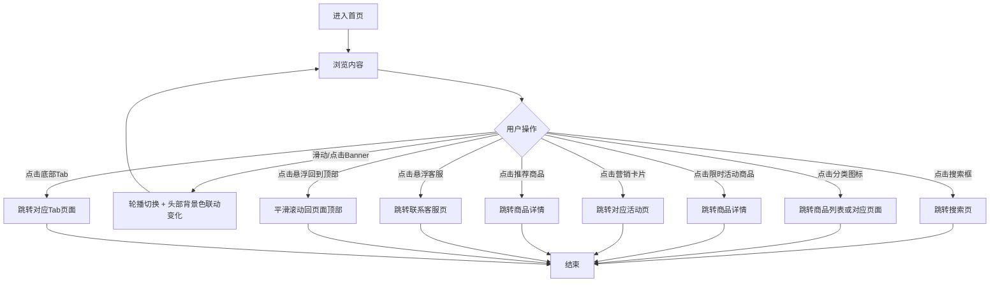

Banner自动轮播每隔4秒切换下一张，用户也可手动左右滑动或点击底部圆点切换。轮播切换时头部背景色平滑过渡（transition 0.4s），三张Banner对应色值如下：

| Banner | 标题 | 头部背景色 |
|--------|------|-----------|
| 第1张 | 新人专享福利 | rgb(140, 138, 129) |
| 第2张 | 品质好货 限时特惠 | rgb(92, 67, 42) |
| 第3张 | 满200减50 | rgb(22, 22, 28) |

限时活动倒计时从02:35:48开始每秒递减，归零后停止。分类导航左右滑动翻页，通过底部圆点指示当前页。

##### 4. 字段与交互

| 字段名称 | 字段标识 | 字段类型 | 必填 | 数据类型 | 长度限制 | 默认值 | 校验规则 | 取值范围 | 来源 | 错误提示 |
|----------|----------|----------|------|----------|----------|--------|----------|----------|------|----------|
| 搜索框 | search_input | 文本输入(readonly) | 否 | - | - | placeholder"搜索商品、品牌" | 点击即跳转搜索页，不可直接输入 | - | 静态配置 | - |
| Banner轮播 | banner_swiper | 轮播组件 | - | - | - | 第1张 | 自动轮播4秒/张，手动滑动需>40px触发，循环播放 | 0-2（共3张） | 运营配置 | - |
| 轮播指示器 | banner_dots | 指示器 | - | - | - | 第1个高亮 | 当前Banner对应圆点变宽(16px)高亮，其余5px | - | 系统计算 | - |
| 头部背景色 | header_bg | 样式 | - | - | - | rgb(140,138,129) | 随Banner切换联动，transition 0.4s平滑过渡 | 3个预设色值 | 运营配置 | - |
| 公告滚动文字 | notice_text | 滚动文本 | - | - | - | 预设文案 | 自动横向滚动，速度0.5px/帧，滚到一半重置实现无缝循环 | - | 运营配置 | - |
| 分类导航 | category_grid | 滑动网格 | - | - | - | 第1页 | 10个图标分2页（5×2），左右滑动翻页，底部圆点指示 | 0-1（共2页） | 运营配置 | - |
| 限时活动倒计时 | countdown | 数字显示 | - | - | - | 02:35:48 | 每秒递减，归零停止，时/分/秒分别两位数显示 | 00:00:00~99:99:99 | 系统计算 | - |
| 限时活动商品 | flash_list | 横向滚动列表 | - | - | - | 5件商品 | 横向滚动，点击跳转商品详情 | - | 后端接口 | - |
| 营销卡片 | promo_cards | 2×2网格 | - | - | - | 4张卡片 | 点击跳转对应活动页 | - | 运营配置 | - |
| 推荐商品列表 | product_grid | 双列网格 | - | - | - | 6件商品 | 点击商品卡片跳转商品详情 | - | 后端接口 | - |
| 购物车角标 | cart_badge | 数字角标 | - | Number | - | 3 | 显示购物车商品数量，固定在购物车Tab图标右上角 | ≥0 | 购物车数据 | - |
| 底部Tab栏 | tab_bar | 导航栏 | - | - | - | 首页高亮 | 5个Tab，当前页高亮(橙色)，其余灰色，点击跳转对应页面 | 首页/分类/购物车/收藏/我的 | 系统状态 | - |
| 悬浮客服按钮 | fab_service | 悬浮按钮 | - | - | - | 隐藏 | 白色圆形44×44，橙色消息气泡图标，点击跳转联系客服页 | 显示/隐藏 | - | - |
| 悬浮回到顶部 | fab_top | 悬浮按钮 | - | - | - | 隐藏 | 白色圆形44×44，灰色向上箭头，点击平滑滚动回顶部（smooth行为） | 显示/隐藏 | - | - |

##### 5. 业务规则

| 规则编号 | 规则描述 |
|----------|----------|
| RULE-HOME-001 | Banner自动轮播间隔4秒，循环播放，最后一张后回到第一张 |
| RULE-HOME-002 | 头部背景色与Banner联动，切换时0.4s平滑过渡，不影响搜索栏和胶囊按钮的可见性 |
| RULE-HOME-003 | 分类导航分两页展示，每页10个（5列×2行），通过scroll事件计算当前页并更新圆点 |
| RULE-HOME-004 | 限时活动倒计时为纯前端计时器，页面刷新后重置（静态原型阶段） |
| RULE-HOME-005 | 公告滚动使用requestAnimationFrame驱动，内容复制两份实现无缝循环 |
| RULE-HOME-006 | 购物车角标数字来源于购物车商品总数，需与购物车页面数据同步 |
| RULE-HOME-007 | 两个悬浮按钮默认隐藏（opacity:0, scale:0.6），页面滚动超过300px时同时弹出显示（0.3s弹性动画），回到顶部时隐藏 |
| RULE-HOME-008 | 回到顶部按钮点击后使用smooth平滑滚动，不使用瞬间跳转 |

##### 6. 页面跳转

**入口**：
- 登录/注册成功后自动跳转
- 底部Tab"首页"
- 商品详情/购物车等页面点击"首页"入口
- 支付结果页点击"返回首页"

**出口**：
- 搜索框 → 搜索页（search.html）
- 分类图标 → 商品列表（product_list.html）或对应功能页（个人钱包、邀请有奖等）
- Banner → 运营活动页（当前为静态展示，无跳转）
- 限时活动商品/推荐商品 → 商品详情（product_detail.html）
- 营销卡片 → 对应活动页（当前为静态展示）
- 底部Tab → 分类（category.html）、购物车（cart.html）、收藏（favorites.html）、我的（profile.html）
- 悬浮客服按钮 → 联系客服页（customer_service.html）

---

#### 4.1.6. 收货地址管理页

##### 1. 功能概述

收货地址管理页展示用户的所有收货地址列表，支持新增、编辑、删除地址以及设置默认地址。用户从确认订单页点击收货地址区域进入此页面，选择或管理收货地址后返回订单页。页面底部固定"新增收货地址"按钮，新增和编辑操作通过弹窗表单完成，删除操作有二次确认弹窗。

##### 2. 页面结构

页面顶部为导航栏，中间为可滚动的地址列表，底部固定新增按钮。页面包含两个弹窗：删除确认弹窗和地址编辑表单弹窗。

| 区域 | 说明 |
|------|------|
| 导航栏 | 返回按钮 + "收货地址"标题 + 胶囊按钮 |
| 地址列表 | 每条地址为一行白色圆角卡片，包含：收件人+手机号+默认标签、详细地址、操作栏（设为默认+编辑+删除） |
| 新增按钮 | 固定底部居中，红橙渐变胶囊按钮"新增收货地址"，带加号图标和投影 |
| 空状态 | 无地址时显示地图定位图标 + "暂无收货地址"文案 |
| 删除确认弹窗 | 居中白色卡片，标题"删除地址"+提示文案+"取消"和"确定"按钮，点击遮罩可关闭 |
| 编辑表单弹窗 | 居中白色卡片，标题"新增/编辑收货地址"+ 表单（收货人、手机号、所在地区、详细地址）+ "取消"和"保存"按钮，点击遮罩可关闭 |

##### 3. 操作流程

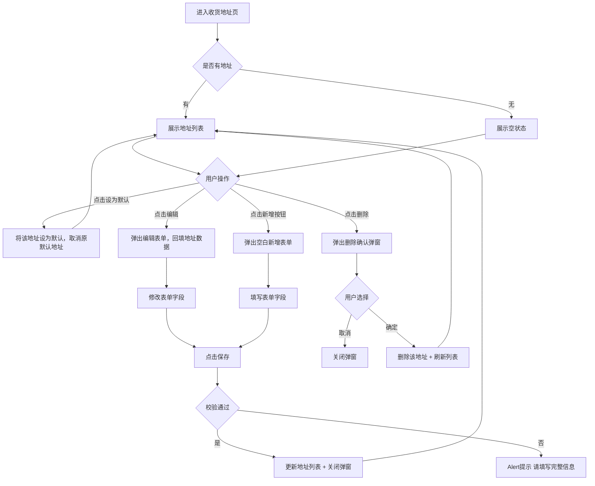

设为默认地址为互斥操作：点击任一地址的"设为默认"后，该地址变为默认地址（圆形勾选变为渐变橙色填充），原默认地址自动取消。新增的第一条地址自动设为默认地址。编辑表单弹窗根据操作类型动态切换标题——新增时显示"新增收货地址"，编辑时显示"编辑收货地址"并回填已有数据。

##### 4. 字段与交互

| 字段名称 | 字段标识 | 字段类型 | 必填 | 数据类型 | 长度限制 | 默认值 | 校验规则 | 取值范围 | 来源 | 错误提示 |
|----------|----------|----------|------|----------|----------|--------|----------|----------|------|----------|
| 收件人 | input_name | 文本输入 | 是 | String | - | 空 | 非空 | - | 用户输入 | 请填写完整信息 |
| 手机号 | input_phone | 文本输入(tel) | 是 | String | - | 空 | 非空 | - | 用户输入 | 请填写完整信息 |
| 所在地区 | input_area | 文本输入 | 是 | String | - | 空 | 非空（实际应调用省市区三级选择器，静态原型阶段为文本输入） | - | 用户输入/选择器 | 请填写完整信息 |
| 详细地址 | input_detail | 文本域 | 是 | String | - | 空 | 非空，多行输入 | - | 用户输入 | 请填写完整信息 |
| 默认地址标签 | default_tag | 标签 | - | Boolean | - | 首条地址默认 | 默认地址显示橙色"默认"标签，非默认不显示 | true/false | 系统状态 | - |
| 设为默认 | set_default | 复选圆圈 | - | Boolean | - | - | 点击切换默认状态，同一时刻只有一个默认地址；默认地址圆形勾选为橙色渐变填充+白色勾 | true/false | 用户操作 | - |
| 编辑按钮 | edit_btn | 按钮 | - | - | - | - | 点击弹出编辑表单，回填该地址已有数据 | - | - | - |
| 删除按钮 | delete_btn | 按钮 | - | - | - | - | 点击弹出删除确认弹窗 | - | - | - |
| 删除确认-取消 | cancel_delete | 按钮 | - | - | - | - | 关闭弹窗，不执行删除 | - | - | - |
| 删除确认-确定 | confirm_delete | 按钮 | - | - | - | - | 从地址列表中移除该地址并刷新列表 | - | - | - |
| 保存按钮 | save_form | 按钮 | - | - | - | - | 校验所有字段非空，通过后新增或更新地址并关闭弹窗 | - | - | 请填写完整信息 |
| 取消按钮 | cancel_form | 按钮 | - | - | - | - | 关闭表单弹窗，不保存 | - | - | - |
| 新增按钮 | add_address_btn | 按钮 | - | - | - | - | 弹出空白新增表单弹窗 | - | - | - |

##### 5. 业务规则

| 规则编号 | 规则描述 |
|----------|----------|
| RULE-ADDR-001 | 默认地址为互斥状态，同一时刻仅允许一个默认地址。设为新默认时自动取消原默认 |
| RULE-ADDR-002 | 新增的第一条地址自动设为默认地址（isDefault: true） |
| RULE-ADDR-003 | 删除操作需二次确认弹窗，防止误删；删除后列表即时刷新 |
| RULE-ADDR-004 | 新增/编辑弹窗点击遮罩区域可关闭，等同于点击取消 |
| RULE-ADDR-005 | 编辑表单校验为全字段非空校验，任一字段为空弹出Alert提示"请填写完整信息" |

##### 6. 页面跳转

**入口**：
- 确认订单页点击收货地址区域
- 个人资料页或设置页的地址管理入口

**出口**：
- 点击返回按钮 → 返回上一页（确认订单页）
- 新增/编辑/删除操作完成后 → 留在当前页刷新列表

---

#### 4.1.9. 我的页面

##### 1. 功能概述

"我的"页面是用户的个人中心入口，展示用户头像、昵称、会员等级、积分和卡券数量等个人信息，并提供订单快捷入口、常用工具和功能菜单。用户通过底部Tab栏"我的"进入此页面（未登录时跳转登录页）。页面包含个人资料区、订单状态快捷栏、工具网格和功能菜单列表，底部固定Tab导航栏。

##### 2. 页面结构

页面顶部为渐变背景的个人信息区，中间为可滚动的功能区域，底部固定Tab导航栏。

| 区域 | 说明 |
|------|------|
| 个人信息区 | 红/橙渐变背景（延伸至状态栏），展示头像、昵称、会员等级标签、右上角设置齿轮图标。下方展示积分和卡券两个数据统计项 |
| 我的订单 | 白色圆角卡片，标题行"我的订单"+右侧"查看全部"链接。下方5个订单状态图标入口（待付款/待发货/待收货/待评价/退换售后），待付款和待收货带红色角标数字 |
| 常用工具 | 白色圆角卡片，4×1网格布局，包含我的钱包、我的收藏、积分商城、邀请有奖4个工具入口，各带渐变色图标 |
| 功能菜单 | 白色圆角卡片列表，包含收货地址、卡券绑定、帮助中心、意见反馈、关于我们5个菜单项，每项前有橙色图标，后有右箭头 |
| 底部Tab栏 | 固定底部5个Tab，"我的"Tab高亮，购物车Tab含角标 |

##### 3. 操作流程

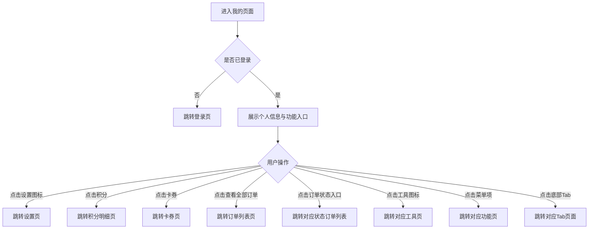

个人信息区渐变背景延伸至状态栏，底部通过圆角弧度过渡到灰色页面背景。订单状态入口支持带参数跳转（如 `order_list.html?status=pending`），直接进入对应状态的订单列表。待付款显示角标"1"、待收货显示角标"2"，角标数字来源于后端订单状态统计。

##### 4. 字段与交互

| 字段名称 | 字段标识 | 字段类型 | 必填 | 数据类型 | 长度限制 | 默认值 | 校验规则 | 取值范围 | 来源 | 错误提示 |
|----------|----------|----------|------|----------|----------|--------|----------|----------|------|----------|
| 用户头像 | user_avatar | 图片 | - | String(URL) | - | 默认头像 | 56×56圆形裁剪，白色半透明边框 | - | 后端接口 | - |
| 用户昵称 | user_name | 文本显示 | 是 | String | - | "悦享用户" | 白色加粗17px | - | 后端接口 | - |
| 会员等级 | user_level | 标签 | - | String | - | "黄金会员" | 半透明白色背景圆角标签，星形图标+等级文字 | - | 后端接口 | - |
| 设置按钮 | settings_btn | 图标按钮 | - | - | - | - | 齿轮图标，白色，点击跳转设置页 | - | - | - |
| 积分数 | points_num | 文本显示 | - | Number | - | "1,280" | 白色加粗，点击跳转积分明细页 | ≥0 | 后端接口 | - |
| 卡券数 | coupons_num | 文本显示 | - | Number | - | "5" | 白色加粗，点击跳转卡券页 | ≥0 | 后端接口 | - |
| 查看全部订单 | view_all_orders | 链接 | - | - | - | - | 灰色文字+右箭头，点击跳转订单列表页 | - | - | - |
| 待付款 | tab_pending | 图标入口 | - | - | - | - | 卡片图标+文字，右上角红色角标显示待付款数量，点击跳转待付款订单列表 | - | 后端接口 | - |
| 待发货 | tab_shipped | 图标入口 | - | - | - | - | 立方体图标+文字，无角标，点击跳转待发货订单列表 | - | - | - |
| 待收货 | tab_delivered | 图标入口 | - | - | - | - | 货车图标+文字，右上角红色角标显示待收货数量，点击跳转待收货订单列表 | - | 后端接口 | - |
| 待评价 | tab_review | 图标入口 | - | - | - | - | 点赞图标+文字，无角标，点击跳转评价页 | - | - | - |
| 退换/售后 | tab_refund | 图标入口 | - | - | - | - | 刷新图标+文字，无角标，点击跳转售后页 | - | - | - |
| 我的钱包 | tool_wallet | 工具入口 | - | - | - | - | 橙色渐变图标，点击跳转钱包页 | - | - | - |
| 我的收藏 | tool_favorites | 工具入口 | - | - | - | - | 粉色渐变图标，点击跳转收藏页 | - | - | - |
| 积分商城 | tool_points | 工具入口 | - | - | - | - | 绿色渐变图标，点击跳转积分商城页 | - | - | - |
| 邀请有奖 | tool_invite | 工具入口 | - | - | - | - | 蓝色渐变图标，点击跳转邀请有奖页 | - | - | - |
| 收货地址 | menu_address | 菜单项 | - | - | - | - | 定位图标+文字+右箭头，点击跳转地址管理页 | - | - | - |
| 卡券绑定 | menu_bind | 菜单项 | - | - | - | - | 卡券图标+文字+右箭头，点击跳转卡券绑定页 | - | - | - |
| 帮助中心 | menu_help | 菜单项 | - | - | - | - | 问号图标+文字+右箭头，点击跳转帮助页 | - | - | - |
| 意见反馈 | menu_feedback | 菜单项 | - | - | - | - | 邮件图标+文字+右箭头，点击跳转反馈页 | - | - | - |
| 关于我们 | menu_about | 菜单项 | - | - | - | - | 盾牌图标+文字+右箭头，点击跳转关于页 | - | - | - |
| 购物车角标 | cart_badge | 数字角标 | - | Number | - | 3 | 购物车Tab图标右上角显示购物车商品数量 | ≥0 | 购物车数据 | - |

##### 5. 业务规则

| 规则编号 | 规则描述 |
|----------|----------|
| RULE-PROFILE-001 | 未登录用户点击"我的"Tab时跳转登录页，登录成功后返回此页面 |
| RULE-PROFILE-002 | 订单状态角标数字来源于后端实时统计，仅待付款和待收货两个状态显示角标，无待处理订单时不显示角标 |
| RULE-PROFILE-003 | 个人信息区渐变背景延伸至状态栏，通过底部圆角弧度过渡到页面灰色背景 |

##### 6. 页面跳转

**入口**：
- 底部Tab"我的"
- 未登录时点击"我的"Tab先跳转登录页

**出口**：
- 点击设置图标 → 设置页（settings.html）
- 点击积分 → 积分明细页（points_detail.html）
- 点击卡券 → 卡券页（wallet.html）
- 点击查看全部订单 → 订单列表页（order_list.html）
- 点击订单状态入口 → 对应状态订单列表页（order_list.html?status=xxx）
- 点击我的钱包 → 钱包页（wallet.html）
- 点击我的收藏 → 收藏页（favorites.html）
- 点击积分商城 → 积分商城页（points_detail.html）
- 点击邀请有奖 → 邀请有奖页（invite_friends.html）
- 点击收货地址 → 地址管理页（address.html）
- 点击卡券绑定 → 卡券绑定页（coupon_bind.html）
- 底部Tab → 首页（home_page.html）、分类（category.html）、购物车（cart.html）、收藏（favorites.html）

---

#### 4.1.10. 我的收藏页

##### 1. 功能概述

我的收藏页展示用户收藏的所有商品列表，支持管理模式下的批量选择和删除操作，以及每件商品的快速加入购物车。用户通过底部Tab栏"收藏"或"我的"页面的"我的收藏"工具入口进入此页面。页面默认为浏览模式，点击"管理"进入编辑模式，底部出现操作栏支持全选和批量删除。

##### 2. 页面结构

页面顶部为导航栏和编辑栏，中间为可滚动商品列表，底部固定Tab导航栏。编辑模式下在Tab栏上方显示操作栏。

| 区域 | 说明 |
|------|------|
| 导航栏 | 返回按钮 + "我的收藏"标题 + 胶囊按钮 |
| 编辑栏 | 左侧显示"共X件商品"计数，右侧"管理/完成"切换按钮（橙色文字） |
| 商品列表 | 每件商品为一行白色圆角卡片：勾选框（编辑模式显示）+ 商品图片 + 商品信息（名称、标签、现价、原价）+ 加入购物车按钮 |
| 操作栏 | 编辑模式时显示于Tab栏上方（bottom: 56px），包含：全选复选框 + "全选"文案 + 删除按钮（显示已选数量） |
| 悬浮购物车按钮 | 右下角固定悬浮按钮（absolute定位），红橙渐变圆形50×50，购物车图标，黄色角标显示数量，点击跳转购物车页 |
| 空状态 | 无收藏时显示心形图标 + "暂无收藏商品" + "去逛逛"按钮（跳转首页） |
| 底部Tab栏 | 固定底部5个Tab，"收藏"Tab高亮，购物车Tab含角标 |

##### 3. 操作流程

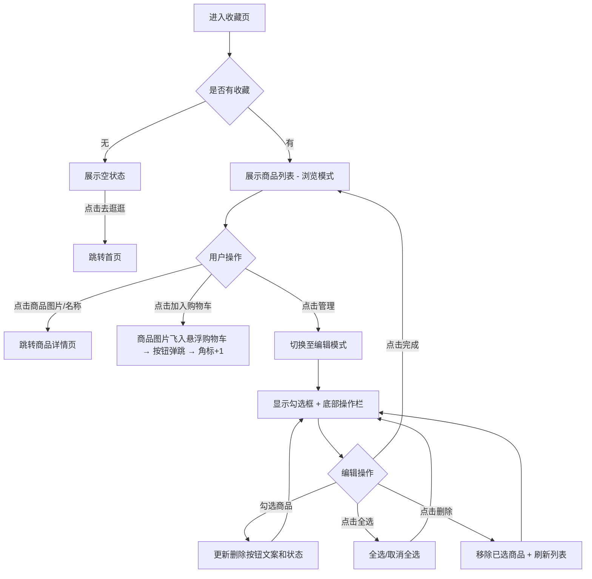

浏览模式与编辑模式互斥：点击"管理"进入编辑模式，商品卡片左侧出现圆形勾选框，底部操作栏滑出；点击"完成"退出编辑模式，勾选框隐藏（`display: none`），操作栏收起。删除按钮在无选中商品时置灰不可点击（灰色背景+`pointer-events: none`），有选中时变为红色并显示数量"删除(X)"。

点击"加入购物车"时触发飞入动画：从商品图片位置生成一个圆形缩略图克隆（40px，橙色边框），沿贝塞尔曲线飞向右下角悬浮购物车按钮（0.8s），飞行过程中逐渐缩小至20px并变透明。到达后悬浮按钮执行弹跳动画（scale 1→1.25→0.9→1.1→1，0.4s），角标数字+1。整个过程中不弹出任何提示。

##### 4. 字段与交互

| 字段名称 | 字段标识 | 字段类型 | 必填 | 数据类型 | 长度限制 | 默认值 | 校验规则 | 取值范围 | 来源 | 错误提示 |
|----------|----------|----------|------|----------|----------|--------|----------|----------|------|----------|
| 商品计数 | total_count | 文本显示 | - | Number | - | 4 | 显示"共X件商品"，删除后实时更新 | ≥0 | 系统计算 | - |
| 管理按钮 | edit_btn | 切换按钮 | - | - | - | "管理" | 浏览模式显示"管理"，编辑模式显示"完成"，点击切换模式 | 管理/完成 | 用户操作 | - |
| 商品勾选框 | item_checkbox | 复选框 | - | Boolean | - | 未选中 | 仅编辑模式显示，圆形样式，选中时渐变橙色填充+白色勾；浏览模式 `display: none` | true/false | 用户操作 | - |
| 商品图片 | fav_image | 图片链接 | 是 | String(URL) | - | - | 100×100圆角方形，点击跳转商品详情 | - | 后端接口 | - |
| 商品名称 | fav_name | 文本显示 | 是 | String | - | - | 最多2行截断省略，点击跳转商品详情 | - | 后端接口 | - |
| 商品标签 | fav_tag | 标签 | - | String | - | - | 橙色描边小标签，如"爆款""新品""限时" | - | 后端接口 | - |
| 现价 | price_now | 文本显示 | 是 | Number | - | - | 红色加粗，¥符号缩小 | >0 | 后端接口 | - |
| 原价 | price_old | 文本显示 | 否 | Number | - | - | 灰色删除线 | ≥现价 | 后端接口 | - |
| 加入购物车 | add_cart_btn | 按钮 | - | - | - | - | 红橙渐变胶囊，定位在卡片右下角，点击触发商品图片飞入悬浮购物车动画 | - | - | - |
| 悬浮购物车 | float_cart | 悬浮按钮 | - | - | - | - | absolute定位右下角，红橙渐变圆形50×50，购物车图标+黄色角标，点击跳转购物车页 | - | - | - |
| 全选 | select_all | 复选框 | - | Boolean | - | 未选中 | 所有商品均选中时自动勾选，任一取消则取消；点击切换全选/取消全选 | true/false | 用户操作 | - |
| 删除按钮 | delete_btn | 按钮 | - | - | - | - | 无选中时置灰不可点；有选中时红色背景显示"删除(X)"，点击移除已选商品 | - | - | - |
| 空状态按钮 | go_shopping | 按钮 | - | - | - | - | 无收藏时显示"去逛逛"，点击跳转首页 | - | - | - |

##### 5. 业务规则

| 规则编号 | 规则描述 |
|----------|----------|
| RULE-FAV-001 | 浏览模式和编辑模式互斥，管理按钮文案随之切换（"管理"/"完成"），勾选框和操作栏的显隐同步切换 |
| RULE-FAV-002 | 操作栏固定在Tab导航栏上方（bottom: 56px），仅编辑模式显示，浏览模式隐藏 |
| RULE-FAV-003 | 删除操作即时生效，从列表中移除商品并更新计数，无需二次确认 |
| RULE-FAV-004 | 勾选框在浏览模式下使用 `display: none` 彻底隐藏，不占用布局空间 |
| RULE-FAV-005 | 全选状态与单个勾选联动：所有商品选中时全选自动勾选，任一取消则全选取消 |
| RULE-FAV-006 | 点击"加入购物车"触发飞入动画（0.8s贝塞尔曲线），不弹出alert提示，动画结束后悬浮按钮弹跳+角标+1 |
| RULE-FAV-007 | 悬浮购物车按钮使用absolute定位在.phone-frame内，z-index:200，确保在小程序容器内正确显示 |

##### 6. 页面跳转

**入口**：
- 底部Tab"收藏"
- "我的"页面点击"我的收藏"工具入口

**出口**：
- 点击商品图片/名称 → 商品详情页（product_detail.html）
- 空状态点击"去逛逛" → 首页（home_page.html）
- 悬浮购物车按钮 → 购物车页（cart.html）
- 底部Tab → 首页（home_page.html）、分类（category.html）、购物车（cart.html）、我的（profile.html）

---

#### 4.1.11. 我的钱包页（卡券兑换）

##### 1. 功能概述

我的钱包页是用户的资产和卡券管理中心，展示账户余额、苏银豆、优惠券和红包数量，并提供充值、提现操作入口。页面还包含快捷工具入口（银行卡、积分明细、优惠券、交易记录）和最近交易流水列表。用户从"我的"页面点击"我的钱包"或点击卡券数量进入此页面。

##### 2. 页面结构

页面顶部为导航栏，下方为渐变背景的钱包卡片，再往下依次为操作按钮、工具入口和交易流水。

| 区域 | 说明 |
|------|------|
| 导航栏 | 返回按钮 + "我的钱包"标题 + 胶囊按钮 |
| 钱包卡片 | 红/橙渐变背景，带半透明圆形装饰，展示账户余额（大号白色数字）、苏银豆数量、优惠券张数、红包个数 |
| 操作按钮 | 两列并排："充值"（白底橙字）和"提现"（透明底白边白字），各带图标 |
| 快捷工具 | 白色圆角卡片，4个等距工具入口（银行卡、积分明细、优惠券、交易记录），各带渐变色图标 |
| 最近交易 | 白色圆角卡片，标题行"最近交易"+右侧"全部"链接。下方为交易流水列表，每项包含类型图标、标题、时间和金额 |

##### 3. 操作流程

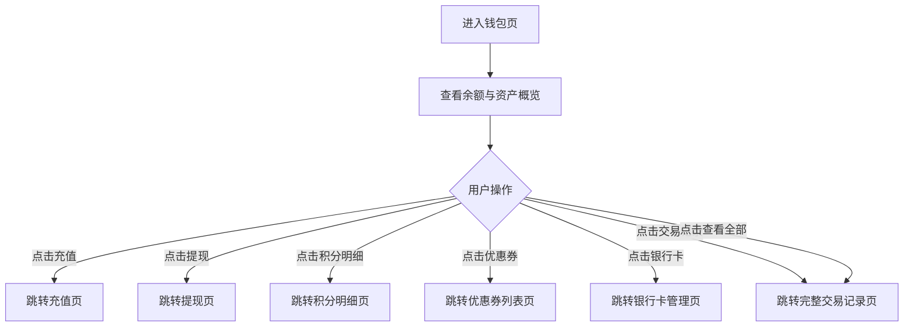

钱包卡片使用渐变背景，通过两个半透明圆形伪元素（`::before`、`::after`）营造层次感。交易流水中收入类条目图标为绿色渐变背景+加号，金额为绿色正数（如"+128"）；支出类条目图标为橙色渐变背景+减号，金额为黑色负数（如"-500"）。

##### 4. 字段与交互

| 字段名称 | 字段标识 | 字段类型 | 必填 | 数据类型 | 长度限制 | 默认值 | 校验规则 | 取值范围 | 来源 | 错误提示 |
|----------|----------|----------|------|----------|----------|--------|----------|----------|------|----------|
| 账户余额 | wallet_balance | 文本显示 | 是 | Number | - | "128.00" | 白色36px加粗，¥符号20px，保留2位小数 | ≥0 | 后端接口 | - |
| 苏银豆数量 | points_count | 文本显示 | - | Number | - | "1,280" | 白色20px加粗，千分位逗号分隔 | ≥0 | 后端接口 | - |
| 优惠券数量 | coupon_count | 文本显示 | - | Number | - | "3张" | 白色20px加粗 | ≥0 | 后端接口 | - |
| 红包数量 | redpacket_count | 文本显示 | - | Number | - | "2个" | 白色20px加粗 | ≥0 | 后端接口 | - |
| 充值按钮 | btn_recharge | 按钮 | - | - | - | - | 白底橙字胶囊按钮，加号图标，点击跳转充值页 | - | - | - |
| 提现按钮 | btn_withdraw | 按钮 | - | - | - | - | 透明底白边白字胶囊按钮，上箭头图标，点击跳转提现页 | - | - | - |
| 银行卡 | tool_bankcard | 工具入口 | - | - | - | - | 蓝色渐变图标，点击跳转银行卡管理页 | - | - | - |
| 积分明细 | tool_points | 工具入口 | - | - | - | - | 橙色渐变图标，点击跳转积分明细页 | - | - | - |
| 优惠券 | tool_coupon | 工具入口 | - | - | - | - | 粉色渐变图标，点击跳转优惠券列表页 | - | - | - |
| 交易记录 | tool_transaction | 工具入口 | - | - | - | - | 绿色渐变图标，点击跳转交易记录页 | - | - | - |
| 查看全部 | view_all_trans | 链接 | - | - | - | - | 灰色文字+右箭头，点击跳转完整交易记录页 | - | - | - |
| 交易类型图标 | trans_icon | 图标 | - | - | - | - | 收入：绿色渐变圆角方块+加号；支出：橙色渐变圆角方块+减号 | income/expense | 后端接口 | - |
| 交易名称 | trans_title | 文本显示 | 是 | String | - | - | 14px黑色，如"购物返积分""积分兑换商品" | - | 后端接口 | - |
| 交易时间 | trans_time | 文本显示 | 是 | String | - | - | 11px灰色，格式"YYYY-MM-DD HH:mm" | - | 后端接口 | - |
| 交易金额 | trans_amount | 文本显示 | 是 | String | - | - | 收入：绿色+"+"前缀；支出：黑色+"-"前缀；16px加粗 | - | 后端接口 | - |

##### 5. 业务规则

| 规则编号 | 规则描述 |
|----------|----------|
| RULE-WALLET-001 | 钱包卡片渐变背景含两个半透明圆形装饰（::before 150px右上、::after 100px左下），不遮挡文字内容 |
| RULE-WALLET-002 | 交易流水按时间倒序排列，最近交易列表默认展示5条，点击"全部"查看完整记录 |
| RULE-WALLET-003 | 收入和支出通过不同的图标颜色和金额颜色区分：收入绿色、支出橙色/黑色 |

##### 6. 页面跳转

**入口**：
- "我的"页面点击"我的钱包"工具入口
- "我的"页面点击"卡券"统计项

**出口**：
- 点击充值 → 充值页
- 点击提现 → 提现页
- 点击积分明细 → 积分明细页（points_detail.html）
- 点击优惠券 → 优惠券列表页
- 点击银行卡 → 银行卡管理页
- 点击交易记录/查看全部 → 交易记录页
- 点击返回按钮 → 返回上一页

---

#### 4.1.12. 个人资料页

##### 1. 功能概述

个人资料页展示和编辑用户的个人信息，包括头像、昵称、性别、生日、手机号、邮箱、真实姓名和身份证号。用户从设置页点击"个人资料"进入此页面，修改信息后点击"保存修改"提交。页面支持头像更换（点击触发）、性别选择（胶囊切换）、生日选择（底部滚动选择器弹窗）等交互方式。

##### 2. 页面结构

页面顶部为导航栏，中间为可滚动的表单内容区，底部无固定栏。包含一个生日选择器底部弹窗。

| 区域 | 说明 |
|------|------|
| 导航栏 | 返回按钮 + "个人资料"标题 + 胶囊按钮 |
| 头像区 | 居中展示80×80圆形头像，底部半透明遮罩层含"更换头像"文字，下方"点击更换头像"提示 |
| 基本信息 | 白色圆角卡片，包含昵称（文本输入）、性别（三选一胶囊切换）、生日（显示值+右箭头，点击弹出选择器） |
| 联系信息 | 白色圆角卡片，包含手机号（脱敏显示+右箭头）、邮箱（文本输入） |
| 身份信息 | 白色圆角卡片，包含真实姓名（文本输入）、身份证号（文本输入，18位限制） |
| 保存按钮 | 全宽红橙渐变胶囊按钮"保存修改" |
| 生日选择器 | 底部滑入弹窗，半透明遮罩+白色卡片，包含年/月/日三列滚动选择器+取消/确定按钮 |

##### 3. 操作流程

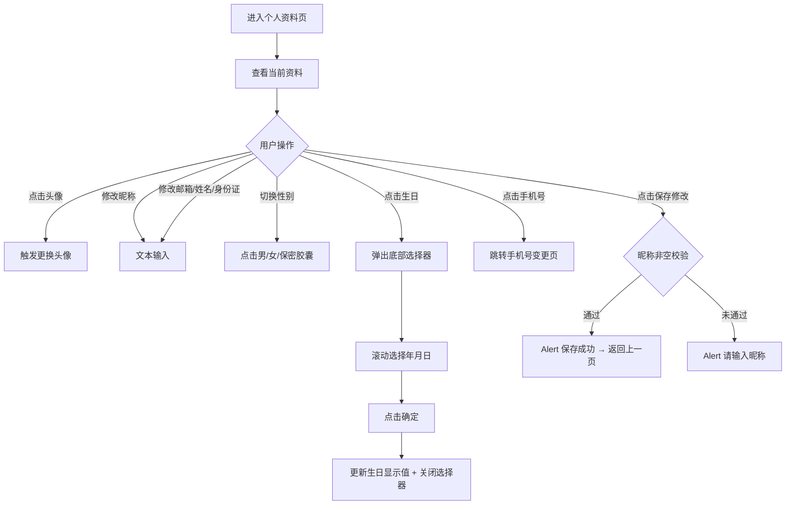

性别选择为三选一互斥：点击"男""女""保密"任一胶囊后，该项变为橙色边框+橙色背景高亮，其余两项恢复灰色。生日选择器从底部滑入（transform动画0.3s），包含年（1950-2010）、月（1-12）、日（1-31）三列滚动列表，选中项为橙色高亮。点击遮罩区域等同于点击取消。

##### 4. 字段与交互

| 字段名称 | 字段标识 | 字段类型 | 必填 | 数据类型 | 长度限制 | 默认值 | 校验规则 | 取值范围 | 来源 | 错误提示 |
|----------|----------|----------|------|----------|----------|--------|----------|----------|------|----------|
| 头像 | user_avatar | 图片+点击 | 否 | String(URL) | - | 默认头像 | 80×80圆形，底部半透明遮罩含"更换头像"文字，点击触发更换（当前为Alert） | - | 用户上传 | - |
| 昵称 | nickname | 文本输入 | 是 | String | - | "悦享用户" | 右对齐输入框，保存时校验非空 | - | 用户输入 | 请输入昵称 |
| 性别 | gender | 胶囊切换 | 否 | String | - | "男" | 三个胶囊选项：男/女/保密，互斥单选，选中项橙色边框+背景 | male/female/secret | 用户选择 | - |
| 生日 | birthday | 日期选择 | 否 | String | 10位 | "1990-01-01" | 点击弹出底部年月日选择器，确定后更新显示值，格式YYYY-MM-DD | 1950-2010年 | 用户选择 | - |
| 手机号 | phone_number | 文本显示 | 是 | String | - | "138****8888" | 脱敏显示中间四位，右侧右箭头，点击跳转手机号变更页 | - | 后端接口 | - |
| 邮箱 | email | 文本输入(email) | 否 | String | - | 空 | 右对齐输入框，placeholder"未绑定" | - | 用户输入 | - |
| 真实姓名 | realname | 文本输入 | 否 | String | - | 空 | 右对齐输入框，placeholder"未填写" | - | 用户输入 | - |
| 身份证号 | idcard | 文本输入 | 否 | String | 18位 | 空 | 右对齐输入框，maxlength=18，placeholder"未填写" | - | 用户输入 | - |
| 保存按钮 | btn_save | 按钮 | - | - | - | - | 校验昵称非空，通过后Alert"保存成功"并返回上一页 | - | - | 请输入昵称 |
| 选择器取消 | picker_cancel | 按钮 | - | - | - | - | 关闭生日选择器弹窗，不更新生日值 | - | - | - |
| 选择器确定 | picker_confirm | 按钮 | - | - | - | - | 将选中年月日更新到生日字段，关闭弹窗 | - | - | - |

##### 5. 业务规则

| 规则编号 | 规则描述 |
|----------|----------|
| RULE-PROFILEEDIT-001 | 保存时仅校验昵称非空，其他字段均为选填，不做强制校验 |
| RULE-PROFILEEDIT-002 | 性别选项为互斥单选，同一时刻仅一个胶囊为选中态 |
| RULE-PROFILEEDIT-003 | 手机号为脱敏只读展示，不可直接修改，需通过专门的手机号变更流程 |
| RULE-PROFILEEDIT-004 | 生日选择器弹窗从底部滑入，点击遮罩区域可关闭，等同于取消操作 |
| RULE-PROFILEEDIT-005 | 保存成功后自动返回上一页（history.back），无需用户手动返回 |

##### 6. 页面跳转

**入口**：
- 设置页点击"个人资料"

**出口**：
- 保存成功 → 返回上一页（设置页）
- 点击手机号 → 手机号变更页
- 点击返回按钮 → 返回上一页

---

#### 4.1.13. 设置页

##### 1. 功能概述

设置页是应用的系统配置入口，提供个人资料编辑、手机号修改、消息通知开关、缓存清理、关于我们和退出登录等功能。用户从"我的"页面右上角齿轮图标进入此页面。页面顶部展示用户信息卡片（头像+昵称+手机号），点击可跳转个人资料编辑页。退出登录需二次确认，确认后清除登录态并跳转登录页。

##### 2. 页面结构

页面顶部为导航栏，中间为可滚动的分组菜单列表，无底部固定栏。

| 区域 | 说明 |
|------|------|
| 导航栏 | 返回按钮 + "设置"标题 + 胶囊按钮 |
| 用户信息卡片 | 白色圆角卡片，展示头像（56×56圆形）+ 昵称（加粗）+ 手机号（脱敏）+ 右箭头，点击跳转个人资料页 |
| 账号设置 | 分组标题 + 两个菜单项：个人资料（蓝色渐变图标）、修改手机号（绿色渐变图标，右侧显示当前脱敏手机号） |
| 通用设置 | 分组标题 + 一个菜单项：消息通知（粉色渐变图标，右侧Toggle开关） |
| 其他 | 分组标题 + 两个菜单项：清除缓存（灰色渐变图标，右侧显示缓存大小"12.5 MB"）、关于我们（红色渐变图标） |
| 退出登录按钮 | 白色背景红色文字按钮"退出登录"，居中展示 |
| 版本信息 | 底部居中灰色小字"苏银豆商城 v1.0.0" |

##### 3. 操作流程

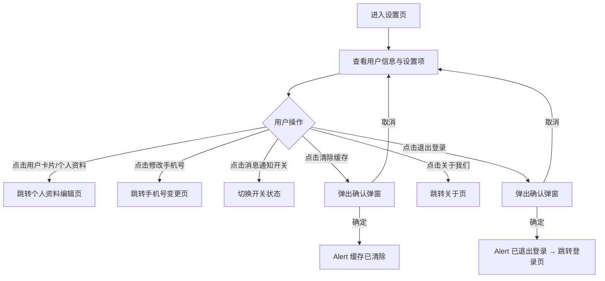

消息通知Toggle开关点击即切换：开启时橙色背景滑块右移，关闭时灰色背景滑块左移（0.2s过渡动画）。清除缓存和退出登录均使用浏览器原生 `confirm()` 弹窗二次确认。退出登录成功后清除本地登录态，跳转登录页。

##### 4. 字段与交互

| 字段名称 | 字段标识 | 字段类型 | 必填 | 数据类型 | 长度限制 | 默认值 | 校验规则 | 取值范围 | 来源 | 错误提示 |
|----------|----------|----------|------|----------|----------|--------|----------|----------|------|----------|
| 用户头像 | user_avatar | 图片 | - | String(URL) | - | 默认头像 | 56×56圆形 | - | 后端接口 | - |
| 用户昵称 | user_name | 文本显示 | 是 | String | - | "悦享用户" | 16px加粗 | - | 后端接口 | - |
| 用户手机号 | user_phone | 文本显示 | 是 | String | - | 脱敏显示 | 中间四位用*替代，灰色13px | - | 后端接口 | - |
| 个人资料 | menu_profile | 菜单项 | - | - | - | - | 蓝色渐变图标+文字+右箭头，点击跳转个人资料编辑页 | - | - | - |
| 修改手机号 | menu_phone | 菜单项 | - | - | - | - | 绿色渐变图标+文字+右侧脱敏手机号+右箭头，点击跳转手机号变更页 | - | - | - |
| 消息通知 | menu_notify | Toggle开关 | - | Boolean | - | 开启 | 粉色渐变图标+文字+右侧Toggle，点击切换开/关，橙色/灰色，0.2s过渡动画 | true/false | 用户操作 | - |
| 清除缓存 | menu_cache | 菜单项 | - | - | - | - | 灰色渐变图标+文字+右侧缓存大小+右箭头，点击弹出confirm确认，确定后Alert"缓存已清除" | - | 系统计算 | - |
| 缓存大小 | cache_size | 文本显示 | - | String | - | "12.5 MB" | 灰色文字，显示当前缓存占用量 | - | 系统计算 | - |
| 关于我们 | menu_about | 菜单项 | - | - | - | - | 红色渐变图标+文字+右箭头，点击跳转关于页 | - | - | - |
| 退出登录 | btn_logout | 按钮 | - | - | - | - | 白底红色文字，点击弹出confirm"确定要退出登录吗？"，确定后清除登录态跳转登录页 | - | - | - |
| 版本号 | version_info | 文本显示 | - | String | - | "苏银豆商城 v1.0.0" | 底部居中灰色12px | - | 系统配置 | - |

##### 5. 业务规则

| 规则编号 | 规则描述 |
|----------|----------|
| RULE-SETTINGS-001 | 退出登录需二次确认（confirm弹窗），确认后清除本地登录态并跳转登录页，取消则留在当前页 |
| RULE-SETTINGS-002 | 清除缓存需二次确认（confirm弹窗），确认后提示"缓存已清除"，缓存大小数值需重新计算 |
| RULE-SETTINGS-003 | 消息通知Toggle开关状态即时生效，无需保存操作 |
| RULE-SETTINGS-004 | 修改手机号菜单项右侧显示当前脱敏手机号，方便用户确认当前绑定号码 |

##### 6. 页面跳转

**入口**：
- "我的"页面点击右上角设置齿轮图标

**出口**：
- 点击用户卡片/个人资料 → 个人资料编辑页（profile_edit.html）
- 点击修改手机号 → 手机号变更页（change_phone.html）
- 点击关于我们 → 关于页（about.html）
- 退出登录成功 → 登录页（login.html）
- 点击返回按钮 → 返回"我的"页面

---

#### 4.1.14. 卡券包页

##### 1. 功能概述

卡券包页展示用户的实体卡和优惠券，通过Tab切换"卡包"和"优惠券包"两个分区。卡包展示电影次卡、电影积分卡等实体卡，显示卡内余额或剩余次数；优惠券包展示满减券、折扣券等，显示面额、使用条件和有效期。用户从"我的钱包"点击"优惠券"工具入口或"我的"页面点击"卡券"统计项进入此页面。

##### 2. 页面结构

页面顶部为导航栏，下方为Tab切换栏，中间为可滚动的卡片列表。

| 区域 | 说明 |
|------|------|
| 导航栏 | 返回按钮 + "卡券包"标题 + 胶囊按钮 |
| Tab栏 | 两个Tab："卡包"和"优惠券包"，当前Tab橙色高亮，底部橙色渐变下划线指示（24px宽），点击切换 |
| 卡包列表 | 每张卡为白色圆角卡片，上部渐变背景区域（卡图标+卡名称+状态标签+余额/次数），下部虚线分割（卡号+到期时间） |
| 优惠券列表 | 每张券为白色圆角卡片，横向布局：左侧金额区（红色面额+使用条件）+ 虚线分隔 + 中间信息区（名称+适用范围+有效期）+ 右侧"去使用"按钮 |
| 空状态 | 无卡券时显示空图标 + 提示文案 |

##### 3. 操作流程

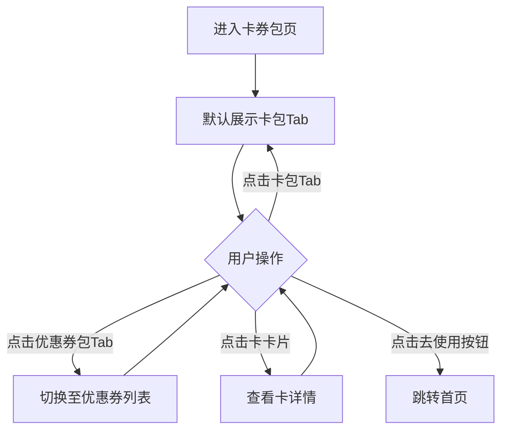

Tab切换为互斥状态：点击"卡包"显示卡包列表，点击"优惠券包"显示优惠券列表，同一时刻仅一个Tab为选中态。已使用和已过期的优惠券显示为灰色（金额文字、按钮均置灰），按钮文案分别显示"已使用"和"已过期"。

##### 4. 字段与交互

| 字段名称 | 字段标识 | 字段类型 | 必填 | 数据类型 | 长度限制 | 默认值 | 校验规则 | 取值范围 | 来源 | 错误提示 |
|----------|----------|----------|------|----------|----------|--------|----------|----------|------|----------|
| Tab切换 | coupon_tabs | Tab栏 | - | - | - | 卡包 | 两个Tab互斥切换，选中Tab橙色文字+渐变下划线 | 卡包/优惠券包 | 用户操作 | - |
| 卡图标 | card_icon | 图标 | - | - | - | - | 渐变背景圆角方块内的白色图标，不同卡类型不同图标 | - | 运营配置 | - |
| 卡名称 | card_name | 文本显示 | 是 | String | - | - | 白色15px加粗，渐变背景上 | - | 后端接口 | - |
| 卡状态标签 | card_tag | 标签 | - | String | - | - | 半透明白色背景圆角标签，如"可使用""已激活" | - | 后端接口 | - |
| 卡余额/次数 | card_balance | 文本显示 | 是 | String/Number | - | - | 白色24px加粗，苏银豆数量或次数或金额 | - | 后端接口 | - |
| 卡号 | card_no | 文本显示 | - | String | - | - | 灰色11px，格式"NO. XX000000000" | - | 系统生成 | - |
| 卡到期时间 | card_expire | 文本显示 | - | String | - | - | 灰色11px，格式"YYYY-MM-DD 到期"或"长期有效" | - | 后端接口 | - |
| 优惠券面额 | coupon_amount | 文本显示 | 是 | String | - | - | 红色28px加粗，¥符号14px；折扣券显示如"8折" | - | 后端接口 | - |
| 使用条件 | coupon_condition | 文本显示 | - | String | - | - | 灰色10px，如"满100可用" | - | 后端接口 | - |
| 券名称 | coupon_name | 文本显示 | 是 | String | - | - | 黑色14px加粗 | - | 后端接口 | - |
| 适用范围 | coupon_scope | 文本显示 | - | String | - | - | 灰色11px，如"全品类通用""仅限生活百货类" | - | 后端接口 | - |
| 券有效期 | coupon_date | 文本显示 | 是 | String | - | - | 浅灰10px，格式"YYYY.MM.DD - YYYY.MM.DD" | - | 后端接口 | - |
| 去使用按钮 | coupon_use_btn | 按钮 | - | - | - | - | 红橙渐变胶囊，点击跳转首页；已使用/已过期时灰色不可点 | - | - | - |

##### 5. 业务规则

| 规则编号 | 规则描述 |
|----------|----------|
| RULE-COUPON-001 | 卡包和优惠券包通过Tab互斥切换，选中Tab有橙色下划线指示 |
| RULE-COUPON-002 | 卡卡片上部使用不同颜色渐变区分卡类型，通过背景色和图标直观区分 |
| RULE-COUPON-003 | 已使用优惠券金额文字变灰色，按钮变为灰色"已使用"；已过期同理显示"已过期" |
| RULE-COUPON-004 | 卡卡片上下区域通过虚线分隔，优惠券列表左右区域通过竖向虚线分隔 |

##### 6. 页面跳转

**入口**：
- "我的钱包"页点击"优惠券"工具入口
- "我的"页面点击"卡券"统计项

**出口**：
- 点击"去使用" → 首页（home_page.html）
- 点击卡卡片 → 卡详情页（预留）
- 点击返回按钮 → 返回上一页

---

#### 4.1.15. 卡券绑定页

##### 1. 功能概述

卡券绑定页提供实体卡和优惠券码的绑定功能。用户选择卡券类型（实体卡或券码），输入卡券码和密码（选填），点击绑定后关联到账户。页面还包含使用须知和最近绑定记录列表。用户从"我的"页面"卡券绑定"菜单进入此页面。

##### 2. 页面结构

页面顶部为导航栏，中间为绑定表单区、温馨提示区和绑定记录区。

| 区域 | 说明 |
|------|------|
| 导航栏 | 返回按钮 + "卡券绑定"标题 + 胶囊按钮 |
| 绑定表单 | 白色圆角卡片，标题"绑定卡券"+说明文案，包含：类型选择器（实体卡/券码）、卡券码输入框、密码输入框（选填）、"立即绑定"按钮 |
| 类型选择器 | 两个等宽按钮横向排列，选中项橙色边框+淡橙背景，未选中灰色边框 |
| 温馨提示 | 白色圆角卡片，标题+4条提示（圆点列表） |
| 最近绑定记录 | 白色圆角卡片，标题行"最近绑定记录"，下方记录列表，每条包含类型图标+名称+时间+状态 |

##### 3. 操作流程

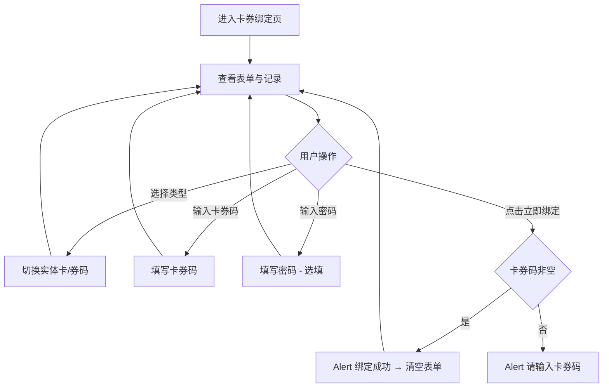

类型选择器为二选一互斥：点击"实体卡"或"券码"后，选中项变为橙色边框+淡橙背景，另一项恢复灰色。点击"立即绑定"时仅校验卡券码非空，密码为选填不校验。绑定成功后弹出Alert提示并清空表单。

##### 4. 字段与交互

| 字段名称 | 字段标识 | 字段类型 | 必填 | 数据类型 | 长度限制 | 默认值 | 校验规则 | 取值范围 | 来源 | 错误提示 |
|----------|----------|----------|------|----------|----------|--------|----------|----------|------|----------|
| 类型选择器 | type_selector | 切换按钮 | 是 | - | - | 实体卡 | 两个选项互斥，选中项橙色边框+淡橙背景+对应图标 | 实体卡/券码 | 用户操作 | - |
| 卡券码 | code_input | 文本输入 | 是 | String | 20位 | 空 | 非空校验，点击绑定时检查 | - | 用户输入 | 请输入卡券码 |
| 密码 | pwd_input | 密码输入 | 否 | String | - | 空 | 选填，placeholder"部分卡券需要输入密码" | - | 用户输入 | - |
| 立即绑定 | bind_btn | 按钮 | - | - | - | - | 全宽红橙渐变胶囊按钮，校验卡券码非空后Alert"绑定成功" | - | - | 请输入卡券码 |
| 记录类型图标 | record_icon | 图标 | - | - | - | - | 实体卡：红橙渐变背景；券码：橙色渐变背景 | card/coupon | 后端接口 | - |
| 记录名称 | record_name | 文本显示 | 是 | String | - | - | 黑色14px，如"电影次卡 MV2026***001" | - | 后端接口 | - |
| 记录时间 | record_time | 文本显示 | 是 | String | - | - | 灰色11px，格式"YYYY-MM-DD HH:mm" | - | 后端接口 | - |
| 记录状态 | record_status | 文本显示 | 是 | String | - | - | 绑定成功：绿色；失败：红色 | 成功/失败 | 后端接口 | - |

##### 5. 业务规则

| 规则编号 | 规则描述 |
|----------|----------|
| RULE-BIND-001 | 类型选择器为二选一互斥，同一时刻仅一个类型为选中态 |
| RULE-BIND-002 | 绑定时仅校验卡券码非空，密码为选填字段 |
| RULE-BIND-003 | 绑定成功后清空表单（卡券码和密码），保留当前类型选择 |
| RULE-BIND-004 | 绑定记录按时间倒序排列，状态通过颜色区分（成功绿色、失败红色） |

##### 6. 页面跳转

**入口**：
- "我的"页面点击"卡券绑定"菜单

**出口**：
- 绑定成功 → 留在当前页清空表单
- 点击返回按钮 → 返回"我的"页面
