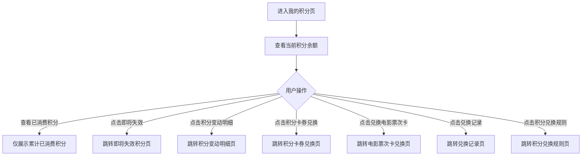

# PRD_14_我的积分页

#### 4.1.16. 我的积分页（points_center.html）

##### 1. 功能概述

我的积分页是积分体系的一级入口页面，用于展示用户当前积分余额、已消费积分和即将失效积分，并承接积分变动明细、卡券兑换、电影票次卡兑换、兑换记录和规则说明等二级能力入口。用户从“我的”页面点击“积分中心”进入此页。

##### 2. 页面结构

| 区域 | 说明 |
|------|------|
| 导航栏 | 返回按钮 + “我的积分”标题 + 胶囊按钮 |
| 积分资产卡片 | 展示当前总积分 2,860，左侧为“已消费积分 420”，右侧为“即将失效 120”；相关积分数据均由后台返回 |
| 积分服务列表 | 包含“积分变动明细”“积分卡券兑换”“兑换电影票次卡”“兑换记录”“积分兑换规则”5 个入口 |

##### 3. 操作流程

##### 4. 字段与交互

| 字段名称 | 字段标识 | 字段类型 | 说明 |
|----------|----------|----------|------|
| 当前总积分 | total_points | 文本显示 | 顶部主卡默认展示“2,860”，数据由后台返回 |
| 已消费积分 | consumed_points | 指标展示 | 默认“420”，仅展示，不可点击，数据由后台返回 |
| 即将失效积分 | expiring_points | 可点击指标 | 默认“120”，点击跳转 `points_expire.html`，数据由后台返回 |
| 积分变动明细入口 | entry_points_detail | 列表入口 | 点击跳转 `points_detail.html` |
| 积分卡券兑换入口 | entry_points_exchange | 列表入口 | 点击跳转 `points_exchange.html` |
| 兑换电影票次卡入口 | entry_points_movie | 列表入口 | 点击跳转 `points_movie.html` |
| 兑换记录入口 | entry_points_consume | 列表入口 | 点击跳转 `points_consume.html` |
| 积分兑换规则入口 | entry_points_rules | 列表入口 | 点击跳转 `points_rules.html` |

##### 5. 业务规则

| 规则编号 | 规则描述 |
|----------|----------|
| RULE-POINTS-CENTER-001 | 页面顶部优先展示当前可用积分，作为主视觉信息 |
| RULE-POINTS-CENTER-002 | “已消费积分”仅作为统计展示，不支持点击和跳转 |
| RULE-POINTS-CENTER-003 | “即将失效积分”保留跳转能力，进入近 30 天失效积分页面 |
| RULE-POINTS-CENTER-004 | 列表入口仅保留当前实际存在的积分服务能力，不展示已下线页面入口 |
| RULE-POINTS-CENTER-005 | 列表入口文案、顺序和跳转页面需与原型保持一致 |
| RULE-POINTS-CENTER-006 | 页面内所有积分展示数据均由后台返回，前端仅负责展示，不手工维护固定积分值 |

##### 6. 页面跳转

**入口：**
- 我的页面点击“积分中心”

**出口：**
- 点击“即将失效” → `points_expire.html`
- 点击“积分变动明细” → `points_detail.html`
- 点击“积分卡券兑换” → `points_exchange.html`
- 点击“兑换电影票次卡” → `points_movie.html`
- 点击“兑换记录” → `points_consume.html`
- 点击“积分兑换规则” → `points_rules.html`
