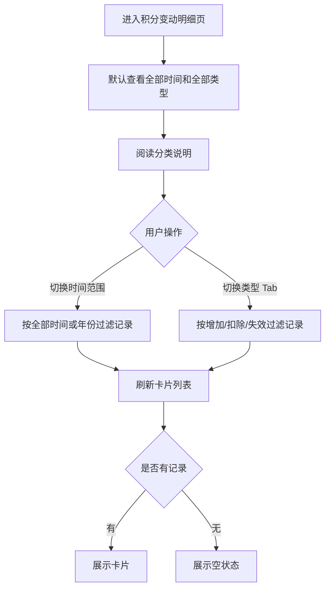

# PRD_16_积分变动明细页

#### 4.1.18. 积分变动明细页（points_detail.html）

##### 1. 功能概述

积分变动明细页用于按变动记录查看积分的增加、扣除和失效情况，支持按时间范围和变动类型筛选。页面采用卡片式结构展示记录字段，并补充统一的分类说明，降低用户对分类口径的理解成本。

##### 2. 页面结构

| 区域 | 说明 |
|------|------|
| 导航栏 | 返回按钮 + “积分变动明细”标题 + 胶囊按钮 |
| 顶部汇总卡片 | 展示当前可用积分 2,860，积分数据由后台返回 |
| 时间筛选 | 下拉选择“全部时间 / 2026年 / 2025年” |
| 类型筛选 Tab | 全部 / 增加 / 扣除 / 失效 |
| 分类说明 | 说明增加、扣除、失效三类记录的统一归类口径 |
| 明细卡片列表 | 每张卡片展示标题、积分值、时间、方式、交易内容、余额；仅有有效期的记录展示失效时间 |
| 空状态 | 当前筛选条件下无数据时显示提示文案 |

##### 3. 操作流程

##### 4. 字段与交互

| 字段名称 | 字段标识 | 字段类型 | 说明 |
|----------|----------|----------|------|
| 当前积分 | available_points | 文本显示 | 顶部汇总展示“2,860”，数据由后台返回 |
| 时间筛选 | year_select | 下拉选择 | 支持“全部时间”“2026年”“2025年” |
| 类型筛选 | filter_tab | Tab | 全部 / 增加 / 扣除 / 失效 |
| 分类说明 | record_category_desc | 文本显示 | 说明所有入账统一归增加，所有支出统一归扣除，到期作废统一归失效 |
| 记录标题 | record_title | 文本显示 | 如“订单消费扣减”“春季会员活动补发” |
| 积分值 | record_points | 文本显示 | 增加为绿色 `+N`，扣除/失效为红色 `-N`，数据由后台返回 |
| 时间 | record_time | 文本显示 | 如“2026-04-08 09:15” |
| 方式 | record_method | 文本显示 | 增加 / 扣除 / 失效 |
| 交易内容 | record_content | 文本显示 | 展示订单号、活动补发、异常修正等说明 |
| 失效时间 | record_expire_time | 文本显示 | 仅对有有效期的记录展示，如“2026-04-30 23:59” |
| 余额 | record_balance | 文本显示 | 变动后余额，数据由后台返回 |

##### 5. 业务规则

| 规则编号 | 规则描述 |
|----------|----------|
| RULE-POINTS-DETAIL-001 | 时间筛选统一支持“全部时间 + 按年份”模式 |
| RULE-POINTS-DETAIL-002 | 类型筛选与时间筛选可叠加生效 |
| RULE-POINTS-DETAIL-003 | 卡片字段需保留“时间 / 方式 / 交易内容 / 余额”，失效时间仅在记录存在有效期时展示 |
| RULE-POINTS-DETAIL-003A | 扣减类积分记录默认无失效时间，页面不展示该字段 |
| RULE-POINTS-DETAIL-004 | 所有积分入账类记录统一归为“增加”，包括订单退回、活动补发等场景 |
| RULE-POINTS-DETAIL-005 | 所有积分支出类记录统一归为“扣除”，包括订单使用、异常修正等场景 |
| RULE-POINTS-DETAIL-006 | 因有效期结束作废的记录统一归为“失效” |
| RULE-POINTS-DETAIL-007 | 当前筛选条件下无记录时，展示“当前年份下暂无对应积分明细”空状态 |
| RULE-POINTS-DETAIL-008 | 页面不展示状态标签，仅保留基础字段和分类说明 |
| RULE-POINTS-DETAIL-009 | 页面内当前积分、积分值、余额等积分相关数据均由后台返回，前端仅按字段展示 |

##### 6. 页面跳转

**入口：**
- 我的积分页点击“积分变动明细”

**出口：**
- 点击返回按钮 → 返回上一页
