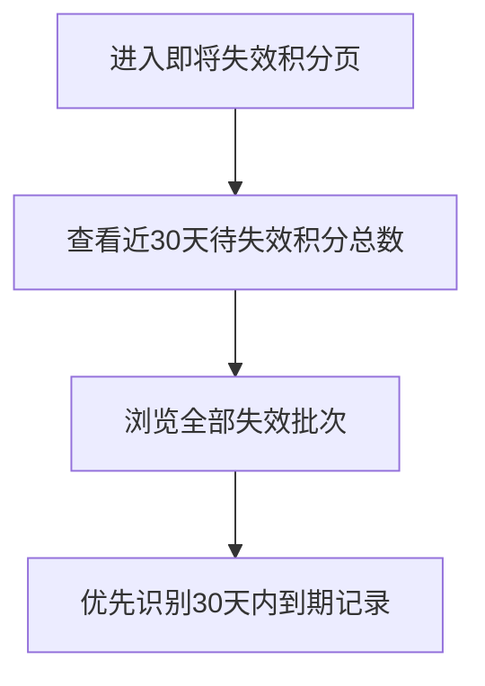

# PRD_17_即将失效积分页

#### 4.1.19. 即将失效积分页（points_expire.html）

##### 1. 功能概述

即将失效积分页用于集中提示未来 30 天内即将失效的积分批次，并同时展示更长期的失效排期，帮助用户优先使用临近到期积分。

##### 2. 页面结构

| 区域 | 说明 |
|------|------|
| 导航栏 | 返回按钮 + “即将失效积分”标题 + 胶囊按钮 |
| 顶部提示卡片 | 展示近 30 天待失效积分总数 120，积分数据由后台返回 |
| 失效列表 | 列表项展示来源、失效时间、剩余时间和积分数量 |

##### 3. 操作流程

##### 4. 字段与交互

| 字段名称 | 字段标识 | 字段类型 | 说明 |
|----------|----------|----------|------|
| 近 30 天待失效积分 | expire_total_30d | 文本显示 | 顶部卡片展示“120”，数据由后台返回 |
| 批次名称 | expire_item_title | 文本显示 | 如“活动补发积分”“新人任务积分” |
| 来源说明 | expire_item_source | 文本显示 | 展示积分来源或关联订单 |
| 失效时间 | expire_item_time | 文本显示 | 展示具体失效日期时间 |
| 剩余时间说明 | expire_item_desc | 文本显示 | 以正文形式展示“剩余时间：30天内，剩余 9 天”等说明 |
| 批次积分数 | expire_item_points | 文本显示 | 右侧数字，数据由后台返回 |

##### 5. 业务规则

| 规则编号 | 规则描述 |
|----------|----------|
| RULE-POINTS-EXPIRE-001 | 顶部卡片仅统计未来 30 天内将失效积分 |
| RULE-POINTS-EXPIRE-002 | 列表同时展示 30 天内和更长期的失效批次 |
| RULE-POINTS-EXPIRE-003 | 页面不使用状态标签样式，仅通过正文说明剩余时间 |
| RULE-POINTS-EXPIRE-004 | 页面内待失效积分总数、批次积分数等积分相关数据均由后台返回，前端仅负责展示 |

##### 6. 页面跳转

**入口：**
- 我的积分页点击“即将失效”

**出口：**
- 点击返回按钮 → 返回上一页
