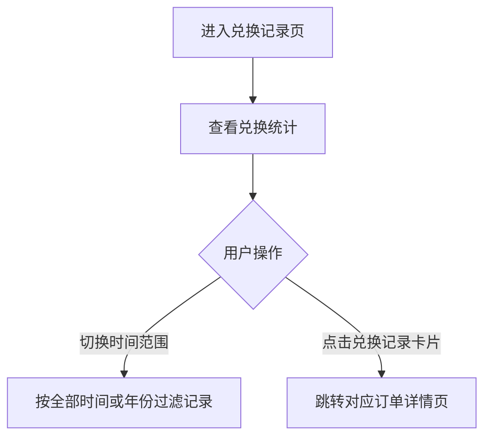

# PRD_18_兑换记录页

#### 4.1.20. 兑换记录页（points_consume.html）

##### 1. 功能概述

兑换记录页用于展示用户已使用积分兑换的商品记录，支持按时间筛选，并可直接进入对应订单详情页查看发货和支付信息。页面不再承载优惠券兑换记录，仅展示实物商品兑换。

##### 2. 页面结构

| 区域 | 说明 |
|------|------|
| 导航栏 | 返回按钮 + “兑换记录”标题 + 胶囊按钮 |
| 统计卡片 | 展示“兑换次数 3 / 已消费积分 420 / 剩余积分 2,860”；其中积分相关数据均由后台返回 |
| 时间筛选 | 下拉选择“全部时间 / 2026年 / 2025年” |
| 兑换记录列表 | 商品主图 + 商品名称 + 兑换时间 + 消耗积分，整卡点击进入订单详情 |

##### 3. 操作流程

##### 4. 字段与交互

| 字段名称 | 字段标识 | 字段类型 | 说明 |
|----------|----------|----------|------|
| 兑换次数 | exchange_times | 文本显示 | 默认“3”，按订单数统计，数据由后台返回 |
| 已消费积分 | consumed_points | 文本显示 | 默认“420”，数据由后台返回 |
| 剩余积分 | remain_points | 文本显示 | 默认“2,860”，数据由后台返回 |
| 时间筛选 | time_select | 下拉选择 | 支持“全部时间 / 2026年 / 2025年” |
| 商品主图 | exchange_goods_image | 图片 | 使用对应订单第一个商品的主图 |
| 商品名称 | exchange_goods_name | 文本显示 | 展示对应订单第一个商品名称 |
| 兑换时间 | exchange_time | 文本显示 | 如“2026-04-21 09:26” |
| 消耗积分 | exchange_points | 文本显示 | 右侧红色负值，如“-120”，数据由后台返回 |

##### 5. 业务规则

| 规则编号 | 规则描述 |
|----------|----------|
| RULE-POINTS-CONSUME-001 | 页面仅记录商品兑换，不记录优惠券兑换 |
| RULE-POINTS-CONSUME-002 | 兑换记录卡片统一进入 `order_detail.html` |
| RULE-POINTS-CONSUME-003 | 时间筛选统一支持“全部时间 + 按年份”模式 |
| RULE-POINTS-CONSUME-004 | 一次订单无论包含几个商品，兑换记录均只记为一次兑换 |
| RULE-POINTS-CONSUME-005 | 兑换记录卡片展示该订单第一个商品的主图和名称 |
| RULE-POINTS-CONSUME-006 | 兑换记录卡片不展示订单号 |
| RULE-POINTS-CONSUME-007 | 页面内兑换次数、已消费积分、剩余积分、单笔消耗积分等积分相关数据均由后台返回，前端仅负责展示 |

##### 6. 页面跳转

**入口：**
- 我的积分页点击“兑换记录”

**出口：**
- 点击兑换记录卡片 → `order_detail.html`
