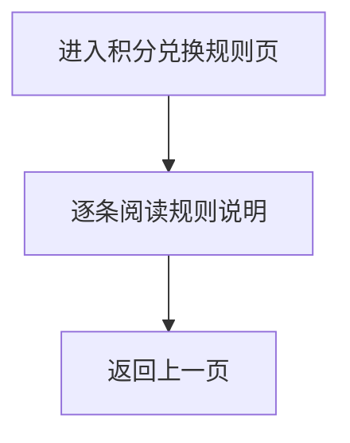

# PRD_19_积分兑换规则页

#### 4.1.21. 积分兑换规则页（points_rules.html）

##### 1. 功能概述

积分兑换规则页用于说明积分获取、使用、有效期和退单回退等基础规则，是积分体系的静态说明页面。

##### 2. 页面结构

| 区域 | 说明 |
|------|------|
| 导航栏 | 返回按钮 + “积分兑换规则”标题 + 胶囊按钮 |
| 规则列表 | 白色圆角卡片，依次展示积分获取、积分使用、有效期、退单回退等规则条目 |

##### 3. 操作流程

##### 4. 字段与交互

| 字段名称 | 字段标识 | 字段类型 | 说明 |
|----------|----------|----------|------|
| 规则标题 | rule_title | 文本显示 | 如“1. 积分获取”“2. 积分使用” |
| 规则正文 | rule_desc | 文本显示 | 多行说明文案 |

##### 5. 业务规则

| 规则编号 | 规则描述 |
|----------|----------|
| RULE-POINTS-RULES-001 | 当前页为静态说明页，不包含提交和筛选操作 |
| RULE-POINTS-RULES-002 | 规则文案应覆盖获取、使用、有效期、退单回退四类核心规则 |

##### 6. 页面跳转

**入口：**
- 我的积分页点击“积分兑换规则”

**出口：**
- 点击返回按钮 → 返回上一页
