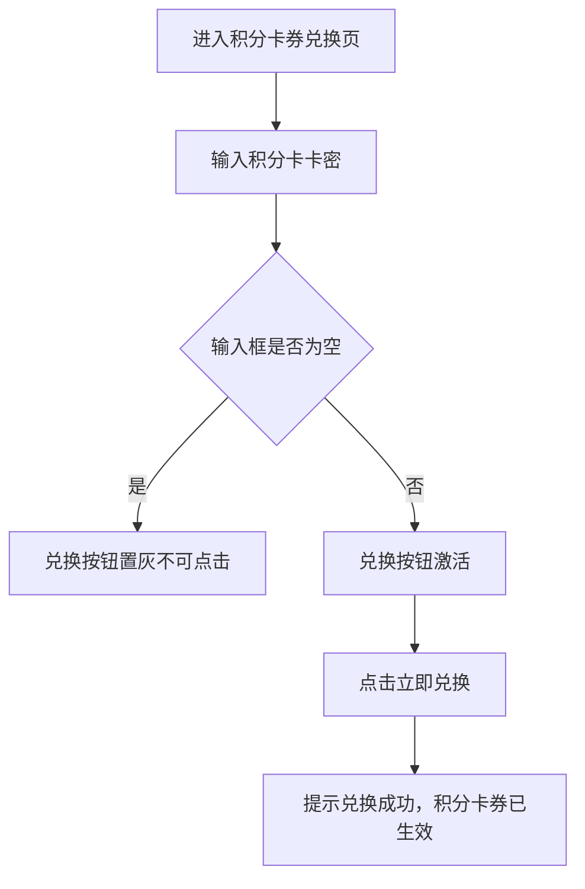

# PRD_20_积分卡券兑换页

#### 4.1.22. 积分卡券兑换页（points_exchange.html）

##### 1. 功能概述

积分卡券兑换页用于输入积分卡密完成权益兑换。页面包含卡券主题卡片、兑换输入框、提交按钮和温馨提示，用于承接卡券型积分权益发放。

##### 2. 页面结构

| 区域 | 说明 |
|------|------|
| 导航栏 | 返回按钮 + “积分卡券兑换”标题 + 胶囊按钮 |
| 顶部主题卡片 | 展示“卡券权益 / 卡券兑换”视觉主题 |
| 兑换表单 | 输入框 + “立即兑换”按钮，输入为空时按钮置灰 |
| 温馨提示 | 展示卡券使用和兑换后的说明文案 |

##### 3. 操作流程

##### 4. 字段与交互

| 字段名称 | 字段标识 | 字段类型 | 说明 |
|----------|----------|----------|------|
| 积分卡卡密 | exchange_code | 文本输入 | placeholder 为“请输入兑换码” |
| 兑换按钮 | exchange_btn | 按钮 | 输入非空时激活 |
##### 5. 业务规则

| 规则编号 | 规则描述 |
|----------|----------|
| RULE-POINTS-EXCHANGE-001 | 输入框为空时，兑换按钮保持禁用状态 |
| RULE-POINTS-EXCHANGE-002 | 输入非空后按钮高亮激活 |
| RULE-POINTS-EXCHANGE-003 | 当前原型提交后仅弹出成功提示，不做实际卡券列表回写 |

##### 6. 页面跳转

**入口：**
- 我的积分页点击“积分卡券兑换”

**出口：**
- 点击返回按钮 → 返回上一页
