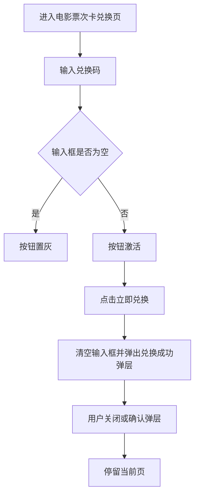

# PRD_21_兑换电影票次卡页

#### 4.1.23. 兑换电影票次卡页（points_movie.html）

##### 1. 功能概述

兑换电影票次卡页用于输入电影票次卡兑换码，兑换成功后弹出引导层，提示用户前往电影/影院页完成选片和购票。

##### 2. 页面结构

| 区域 | 说明 |
|------|------|
| 导航栏 | 返回按钮 + “兑换电影票次卡”标题 + 胶囊按钮 |
| 顶部主题卡片 | 深色影院主题卡片，展示“影院专区 / 电影票次卡兑换” |
| 兑换表单 | 兑换码输入框 + “立即兑换电影票次卡”按钮 |
| 温馨提示 | 展示电影次卡使用规则说明 |
| 兑换成功弹层 | 成功图标 + 描述文案 + 操作按钮 |

##### 3. 操作流程

##### 4. 字段与交互

| 字段名称 | 字段标识 | 字段类型 | 说明 |
|----------|----------|----------|------|
| 电影票次卡兑换码 | movie_exchange_code | 文本输入 | placeholder 为“请输入电影票次卡兑换码” |
| 兑换按钮 | movie_exchange_btn | 按钮 | 输入非空后激活 |
| 稍后再看 | close_success_btn | 按钮 | 关闭兑换成功弹层 |
##### 5. 业务规则

| 规则编号 | 规则描述 |
|----------|----------|
| RULE-POINTS-MOVIE-001 | 输入框为空时兑换按钮保持禁用，输入非空时按钮激活 |
| RULE-POINTS-MOVIE-002 | 提交成功后统一使用成功弹层引导，不使用浏览器 alert |

##### 6. 页面跳转

**入口：**
- 我的积分页点击“兑换电影票次卡”
