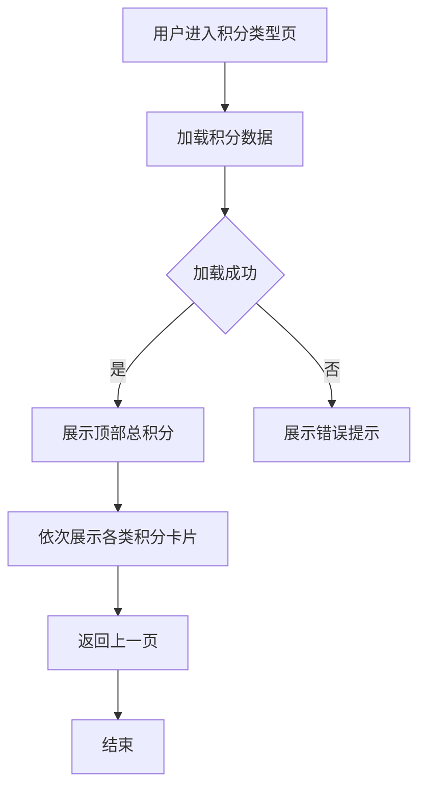

# 苏银豆商城产品需求文档

**项目名称**: 苏银豆商城小程序
**版本**: V0.2
**页面**: 积分类型页面
**文档编号**: PRD_22_积分类型页

---

# 1. 需求背景

## 1.1. 业务背景

积分类型页面是苏银豆商城小程序中"我的积分"功能的子页面，用于展示用户各类积分的余额及来源明细。该页面帮助用户清晰了解不同类型积分的构成和获取途径，提升积分体系的透明度。

## 1.2. 用户需求

用户需要查看各类型积分的余额详情，包括：
- 各积分类型的总余额
- 每类积分的具体来源（如购物返积分、签到奖励、活动补发等）
- 每个来源的积分数值和获得时间

---

# 2. 需求分析

## 2.1. 页面定位

| 页面 | 定位 |
|------|------|
| 我的积分(points_center) | 积分总览入口 |
| 积分变动明细(points_detail) | 积分变化流水记录 |
| **积分类型(points_types)** | **各类积分构成明细** |
| 积分卡券兑换(points_exchange) | 积分消耗入口 |
| 积分规则(points_rules) | 规则说明 |

## 2.2. 用户场景

1. 用户想了解自己各类积分的构成
2. 用户想查看特定积分的来源明细
3. 用户想了解积分的获得时间和途径

## 2.3. 页面类型

**纯展示页面** - 无用户输入、无复杂交互，仅展示数据

---

# 3. 系统流程图



---

# 4. 详细需求

## 4.1. 用户端功能

### 4.1.1. 积分类型展示

#### 4.1.1.1. 页面概述

| 属性 | 说明 |
|------|------|
| 页面名称 | 积分类型 |
| 页面路径 | pages/points_types.html |
| 页面类型 | 纯展示页面 |
| 导航栏 | 带返回按钮的顶部导航 |

#### 4.1.1.2. 页面结构

```
┌─────────────────────────────────┐
│  ← 积分类型              [小程序] │
├─────────────────────────────────┤
│                                 │
│  ┌───────────────────────────┐  │
│  │     当前可用积分 2,860     │  │
│  └───────────────────────────┘  │
│                                 │
│  ┌───────────────────────────┐  │
│  │ 🟠 通兑积分        1,000   │  │
│  ├───────────────────────────┤  │
│  │ 🟢 购物返积分  +600 04-08 │  │
│  │ 🟡 签到奖励    +200 04-07 │  │
│  │ 🔵 活动补发    +200 04-05 │  │
│  └───────────────────────────┘  │
│                                 │
│  ┌───────────────────────────┐  │
│  │ 🔵 品牌积分        800    │  │
│  ├───────────────────────────┤  │
│  │ 🟢 Nike       +300  04-03 │  │
│  │ 🟢 Adidas     +300  04-02 │  │
│  │ 🟢 李宁       +200  04-01 │  │
│  └───────────────────────────┘  │
│           ...                    │
└─────────────────────────────────┘
```

#### 4.1.1.3. 页面区域说明

| 区域 | 说明 |
|------|------|
| 顶部导航 | 包含返回按钮、页面标题（带积分图标） |
| Hero卡片 | 展示当前可用积分总数 |
| 积分卡片列表 | 依次展示5种积分类型及其明细 |

### 4.1.2. 积分类型定义

#### 4.1.2.1. 积分类型列表

| 类型编码 | 类型名称 | 标识颜色 | 说明 |
|----------|----------|----------|------|
| tongdui | 通兑积分 | #faad14 (橙色) | 可在全国范围使用的积分 |
| pinpai | 品牌积分 | #1677ff (蓝色) | 特定品牌专用的积分 |
| zhiding | 指定积分 | #16a34a (绿色) | 指定商品/场景使用的积分 |
| teshu | 特殊积分 | #722ed1 (紫色) | 活动期间发放的积分 |
| leimu | 类目积分 | #ea580c (橙红) | 特定类目专用的积分 |

#### 4.1.2.2. 来源类型定义

| 来源类型 | 来源标识 | 圆点颜色 | 说明 |
|----------|----------|----------|------|
| shopping | 购物消费 | #12a150 (绿色) | 购物返积分 |
| checkin | 签到奖励 | #faad14 (黄色) | 每日签到获得 |
| activity | 活动奖励 | #1677ff (蓝色) | 活动发放/补发 |
| other | 其他 | #999 (灰色) | 其他来源 |

### 4.1.3. 交互说明

#### 4.1.3.1. 页面交互

| 交互动作 | 触发元素 | 响应结果 |
|----------|----------|----------|
| 返回上一页 | 点击导航栏返回按钮 | 执行 history.back() |
| 页面滚动 | 手指滑动 | 页面内容滚动 |

#### 4.1.3.2. 页面跳转

| 跳转到 | 跳转方式 | 说明 |
|--------|----------|------|
| 上一页 | history.back() | 返回上级页面 |

---

# 5. 数据规格

## 5.1. 输出项说明

### 5.1.1. 页面数据

| 字段名称 | 字段标识 | 数据类型 | 格式说明 |
|----------|----------|----------|----------|
| 当前可用积分 | total_points | number | 整数，千位分隔符，如：2,860 |
| 积分类型列表 | type_list | array | 5种积分类型 |

### 5.1.2. 积分类型数据

| 字段名称 | 字段标识 | 数据类型 | 格式说明 |
|----------|----------|----------|----------|
| 类型名称 | type_name | string | 如：通兑积分 |
| 类型标识 | type_code | string | 如：tongdui |
| 类型颜色 | type_color | string | HEX颜色值 |
| 积分余额 | balance | number | 整数 |
| 来源列表 | sources | array | 来源明细数组 |

### 5.1.3. 来源明细数据

| 字段名称 | 字段标识 | 数据类型 | 格式说明 |
|----------|----------|----------|----------|
| 来源名称 | source_name | string | 如：购物返积分 |
| 来源类型 | source_type | string | shopping/checkin/activity/other |
| 积分数值 | points | number | 正整数 |
| 获得时间 | obtain_time | string | MM-DD 格式 |

---

# 6. 页面原型

## 6.1. 视觉规范

### 6.1.1. 颜色规范

| 用途 | 颜色值 | 说明 |
|------|--------|------|
| 导航背景 | linear-gradient(180deg, rgba(65, 67, 72, 0.96), rgba(86, 83, 77, 0.92)) | 深色渐变 |
| Hero背景 | linear-gradient(135deg, #ff8d53, #ff6034, #ee0a24) | 橙红渐变 |
| 卡片背景 | #fff | 白色 |
| 卡片阴影 | rgba(18, 32, 56, 0.08) | 柔和阴影 |
| 收入积分 | #12a150 | 绿色 |
| 次要文字 | #999 | 灰色 |

### 6.1.2. 字号规范

| 用途 | 字号 | 字重 |
|------|------|------|
| 页面标题 | 15px | 600 |
| 积分总额 | 40px | 700 |
| 类型名称 | 15px | 600 |
| 类型余额 | 28px | 700 |
| 来源名称 | 13px | 400 |
| 来源积分 | 14px | 600 |
| 来源时间 | 11px | 400 |

### 6.1.3. 间距规范

| 元素 | 间距 |
|------|------|
| 页面左右内边距 | 12px |
| 卡片间距 | 10px |
| 卡片内部间距 | 16px |
| 明细项间距 | 10px |
| 明细项内边距 | 8px 10px |

---

# 7. 非功能需求

## 7.1. 性能要求

- 页面加载时间 < 1秒
- 滚动流畅，无卡顿

## 7.2. 兼容性要求

- 适配移动端主流屏幕尺寸
- 适配 iOS 和 Android 系统

## 7.3. 埋点需求

| 事件 | 说明 |
|------|------|
| page_view | 页面浏览 |

---

# 8. 附录

## 8.1. 参考页面

| 页面名称 | 文件路径 | 说明 |
|----------|----------|------|
| 我的积分 | pages/points_center.html | 积分总览页 |
| 积分变动明细 | pages/points_detail.html | 积分流水页 |

## 8.2. 版本记录

| 版本 | 日期 | 说明 |
|------|------|------|
| V0.2 | 2026-05-08 | 新增积分类型页面 |