# 小程序商城 - PRD V0.3

> 版本：V0.3 | 最后更新：2026-04-28

---

## 一、版本概述

V0.3 为小程序商城的下单流程版本，覆盖商品详情、购物车、下单支付、订单管理共 4 个模块 9 个页面，实现从商品浏览到下单支付再到订单跟踪的完整闭环。

### 1.1 页面清单

本次PRD覆盖以下页面：

| 页面 | 文件路径 | 层级 |
|------|----------|------|
| 商品详情 | pages/product_detail.html | 二级（从首页/搜索/购物车等进入） |
| 购物车 | pages/cart.html | 一级（底部Tab） |
| 确认订单 | pages/order.html | 二级（从购物车/商品详情进入） |
| 支付成功 | pages/pay_success.html | 二级（从确认订单/订单支付进入） |
| 订单列表 | pages/order_list.html | 二级（从个人中心进入） |
| 订单支付 | pages/order_pay.html | 二级（从订单列表进入） |
| 订单详情 | pages/order_detail.html | 二级（从订单列表/支付成功进入） |
| 物流追踪 | pages/logistics.html | 二级（从订单详情/订单列表进入） |
| 取消订单 | pages/order_cancel.html | 二级（从订单列表/订单详情进入） |

共 9 个页面。

### 1.2 核心功能

V0.3 实现完整的下单支付闭环：用户在商品详情页选择规格和地址后可加入购物车或立即购买；购物车支持批量选择、库存校验和配送区域校验；确认订单页提供积分支付、现金支付和组合支付三种模式，配合收银台弹窗完成支付；订单管理覆盖订单全生命周期（待付款→待发货→待收货→已完成），支持取消、支付、物流追踪等操作。

### 1.3 数据来源说明

| 数据类型 | 来源 | 说明 |
|----------|------|------|
| 全量商品数据 | 品牌商城后台商品管理列表 | 商品信息的主数据源 |
| 组件/活动模块商品 | 魔方配置 | 组件商品数据 ≤ 全量商品数据 |
| 用户数据 | C端注册/后台批量导入 | 手机号、昵称、头像等 |
| 收货地址 | 品牌商城后台用户地址 | 当前用户已保存地址列表 |
| 配送区域支持 | 品牌商城后台运费规则 | SKU维度的地区配送白名单/黑名单 |
| 订单数据 | 品牌商城后台订单系统 | 订单全生命周期数据 |
| 物流数据 | 品牌商城后台物流系统 | 包裹、运单号、物流轨迹 |

### 1.4 统计口径

| 指标 | 计算方式 | 示例 |
|------|----------|------|
| 销量 | SKU维度已完成订单商品件数 | 500件 |
| 好评率 | SKU五星好评数 ÷ 全部评价数 × 100% | 98% |
| 折扣 | 现价 ÷ 原价 × 10，保留一位小数 | 3.9折 |
| 积分兑换比例 | 默认1:1（1积分=0.01元），比例由后台积分规则配置，前端根据配置动态计算 | 100积分=1元 |
| 库存数量 | 未指定供应商：SKU多供应商库存之和；指定供应商：该供应商库存 | 120件 |

### 1.5 示例账号

| 手机号 | 姓名 | 状态 | 用途 |
|--------|------|------|------|
| 13800001111 | 张三 | 已绑定微信 | 正常流程测试，默认收货地址北京 |
| 13800002222 | 李四 | 未绑定微信 | 未绑定场景测试，默认收货地址上海 |

验证码：任意6位数字。

**重置：** 浏览器控制台执行 `Auth.resetAccounts()` 恢复初始数据。

---

## 二、商品详情

商品详情页是商品信息的核心展示页，承载商品浏览、规格选择、收藏、加购和购买等操作。

### 2.1 商品详情（product_detail.html）

#### 2.1.1 功能概述

商品详情页展示SKU维度的商品信息，包括图片轮播、价格、规格选择、用户评价和商品详情图。用户可选择规格后加入购物车或直接购买，也可收藏商品。页面根据用户选择的收货地址实时校验配送区域，不支持配送时禁用购买操作。用户从首页、搜索结果、购物车、收藏、订单等多处入口均可进入此页面。

#### 2.1.2 页面结构

页面从上到下分为：图片轮播区、价格区、标题区、优惠券入口、配送地址区、规格已选区、评价区、商品详情图区，底部固定操作栏。另有规格选择弹窗和地址选择弹窗从底部滑出。

| 区域 | 说明 |
|------|------|
| 图片轮播区 | 支持手势左右滑动切换，显示页码指示器（如"1/3"） |
| 价格区 | 现价（红色大字）、原价（灰色删除线）、折扣标签、销量和好评率 |
| 标题区 | 商品名称、标签（正品保障/7天无理由/极速退款） |
| 优惠券入口 | 展示可用优惠券（满100减20/满200减50），无优惠券时隐藏 |
| 配送地址区 | 显示当前收货地址和预计送达时间，点击弹出地址选择 |
| 无库存提示条 | 不支持配送时显示红色提示，购买按钮置灰 |
| 规格已选区 | 显示已选规格摘要（如"白色 500ml"），点击弹出规格选择 |
| 评价区 | 展示热门评价，含头像/昵称/星级/内容/日期，无评价时隐藏 |
| 底部操作栏 | 首页/收藏/购物车图标 + 加入购物车/立即购买按钮 |
| 规格选择弹窗 | 底部滑出，含商品缩略图、价格、库存、规格选项、数量控制、确认按钮 |
| 地址选择弹窗 | 底部滑出，列出用户已保存地址，支持切换默认地址 |

#### 2.1.3 操作流程

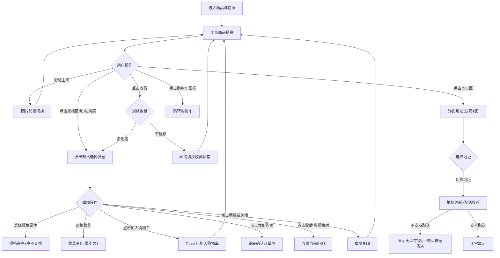

规格弹窗内确认按钮文案根据入口变化：从"加入购物车"进入时显示"加入购物车"，从"立即购买"进入时显示"立即购买"，从收藏按钮进入（多SKU时）显示"收藏"。收藏状态通过心形图标实心/空心区分。Toast提示1.5秒后自动消失。

#### 2.1.4 字段与交互

| 字段名称 | 字段标识 | 字段类型 | 必填 | 数据类型 | 长度限制 | 默认值 | 校验规则 | 取值范围 | 来源 | 错误提示 |
|----------|----------|----------|------|----------|----------|--------|----------|----------|------|----------|
| 商品图片 | swiper_images | 图片轮播 | - | Array | - | SKU主图+轮播图 | 左右滑动切换 | - | 品牌商城后台 | - |
| 现价 | price | 展示文本 | - | Number | - | SKU价格 | - | - | 品牌商城后台 | - |
| 原价 | original_price | 展示文本 | - | Number | - | SKU划线价 | - | - | 品牌商城后台 | - |
| 折扣标签 | discount | 展示文本 | - | String | - | 后端计算 | 现价÷原价×10 保留一位小数 | - | 后端计算 | - |
| 销量 | sales_count | 展示文本 | - | Number | - | - | <10000显示X件 >=10000显示Y万件 | - | 品牌商城后台统计 | - |
| 好评率 | good_rate | 展示文本 | - | String | - | - | 五星数÷总评价数×100% | - | 品牌商城后台统计 | - |
| 颜色规格 | spec_color | 单选 | 是 | String | - | 第一个颜色值 | 需选择一个颜色 | 白色/黑色/粉色 | 品牌商城后台 | - |
| 容量规格 | spec_size | 单选 | 是 | String | - | 第一个容量值 | 需选择一个容量 | 300ml/500ml/800ml | 品牌商城后台 | - |
| 购买数量 | spec_qty | 数字控制 | 是 | Number | 1-库存 | 1 | 最小为1，不超过库存 | 1-999 | 用户操作 | - |
| 收货地址 | selected_addr | 单选 | 是 | Object | - | 默认地址 | 需选择地址 | 已保存地址列表 | 品牌商城后台用户地址 | - |
| 加入购物车 | add_cart_btn | 按钮 | - | - | - | - | 需先选择规格 | - | - | - |
| 立即购买 | buy_now_btn | 按钮 | - | - | - | - | 需先选择规格 | - | - | - |
| 收藏 | fav_btn | 图标按钮 | - | Boolean | - | 未收藏 | 切换收藏状态 | true/false | 用户操作 | 已收藏/已取消收藏 |
| 确认规格弹窗 | spec_popup | 弹窗 | - | - | - | 隐藏 | 点击规格区/加购/购买触发 | - | - | - |
| 地址选择弹窗 | addr_popup | 弹窗 | - | - | - | 隐藏 | 点击地址区触发 | - | - | - |

#### 2.1.5 业务规则

| 规则编号 | 规则描述 |
|----------|----------|
| RULE-PD-001 | 配送区域校验：根据用户所选地址实时校验，不支持配送时地址下方显示红色提示，加入购物车和立即购买按钮置灰禁用 |
| RULE-PD-002 | 收藏维度为SKU级别，收藏时需确定具体规格；仅一个规格时直接收藏，多规格时弹出规格选择 |
| RULE-PD-003 | 重复收藏同一SKU不新增记录，心形保持红色 |
| RULE-PD-004 | 折扣由后端根据销售价和划线价计算：销售价÷划线价×10，保留一位小数（如39÷100×10=3.9折） |
| RULE-PD-005 | 进入页面时根据URL参数或来源页面自动选择对应的SKU规格 |
| RULE-PD-006 | 无地址场景：用户无保存地址时，地址区显示"请添加收货地址"+跳转链接，配送校验跳过，加入购物车和立即购买按钮可用（跳过配送区域校验），确认订单页拦截提交 |
| RULE-PD-007 | 进入商品详情页时校验商品上下架状态，已下架时展示缺省状态+提示"该商品已下架"，不展示购买操作栏 |
| RULE-PD-008 | 点击"立即购买"时校验商品上下架状态，已下架时展示缺省状态+提示"该商品已下架"，不展示购买操作栏 |
| RULE-PD-009 | 点击"加入购物车"时校验商品上下架状态，已下架时展示缺省状态+提示"该商品已下架"，不展示购买操作栏 |

#### 2.1.6 页面跳转

**入口**：
- 首页点击推荐商品/活动商品
- 搜索结果点击商品卡片
- 购物车点击商品图片
- 收藏页点击商品
- 订单详情/订单列表点击商品图片
- 支付成功页点击推荐商品
- 评价中心点击"再次购买"

**出口**：
- 立即购买 → 确认订单页（order.html）
- 底部购物车图标 → 购物车页（cart.html）
- 底部首页图标 → 首页（home_page.html）
- 查看全部评价 → 商品评价列表页（product_reviews.html）`V1.1`
- 返回按钮 → 来源页面（history.back()）

---

## 三、购物车

购物车页管理用户已加购的商品，支持选择、数量调整、删除和结算操作。

### 3.1 购物车（cart.html）

#### 3.1.1 功能概述

购物车页展示用户加购的所有商品，支持单选/全选、数量调整和左滑删除。页面根据用户默认地址批量校验配送区域，不支持配送的商品显示"该地区无库存"状态并提供切换地址入口。已下架和已售罄商品以半透明蒙层标识，不可勾选和结算。用户选择商品后点击结算进入确认订单页。

#### 3.1.2 页面结构

页面从上到下分为：顶部导航栏、商品件数统计栏、购物车商品列表、底部结算栏和底部Tab导航。另有地址切换弹窗和空购物车状态。

| 区域 | 说明 |
|------|------|
| 商品件数栏 | 显示有效商品件数（排除已下架/已售罄/无库存），如"共 3 件商品" |
| 商品列表 | JS动态渲染，每个商品项含图片、名称、规格、价格、勾选框、数量控制器 |
| 已下架商品 | 图片半透明+"已失效"黑色蒙层，名称/规格/价格变灰，无勾选框和数量控制 |
| 无库存商品 | 图片半透明+"无库存"黑色蒙层，底部显示"该地区无库存"+"切换地址"链接 |
| 滑动删除 | 左滑商品卡片露出红色"删除"按钮，宽度72px |
| 底部结算栏 | 全选复选框 + 合计金额 + "结算(N)"按钮 |
| 空购物车状态 | 图标 + "购物车空空如也" + "去逛逛"按钮，无商品时显示 |
| 地址切换弹窗 | JS动态创建，列出默认地址和备选地址，支持切换后重新校验配送区域 |

#### 3.1.3 操作流程

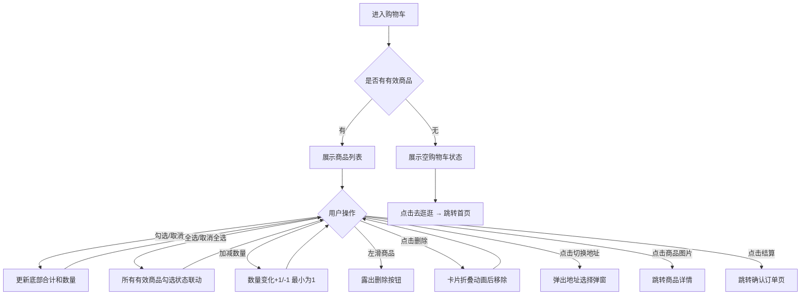

滑动互斥：已滑出一个删除按钮时再滑动另一个，前一个自动复位。删除动画0.2s高度收缩+透明度淡出。点击结算时校验库存：部分无库存——红字提示"部分商品无库存"，刷新购物车页面数据；不区分部分无库存或全部缺货。

#### 3.1.4 字段与交互

| 字段名称 | 字段标识 | 字段类型 | 必填 | 数据类型 | 长度限制 | 默认值 | 校验规则 | 取值范围 | 来源 | 错误提示 |
|----------|----------|----------|------|----------|----------|--------|----------|----------|------|----------|
| 商品勾选 | item_checked | 复选框 | 否 | Boolean | - | false | - | true/false | 用户操作 | - |
| 全选 | select_all | 复选框 | 否 | Boolean | - | false | 联动所有有效商品 | true/false | 用户操作 | - |
| 商品数量 | item_qty | 数字控制 | 是 | Number | 1-库存 | 加购数量 | 最小为1，qty=1时-按钮置灰 | 1-999 | 用户操作 | - |
| 滑动删除 | swipe_delete | 手势操作 | - | - | - | - | 滑动距离超过按钮宽度一半时吸附 | - | 用户操作 | - |
| 确认删除 | delete_btn | 按钮 | - | - | - | - | 点击后卡片折叠动画移除 | - | - | - |
| 结算 | checkout_btn | 按钮 | - | - | - | "结算(N)" | N为勾选商品总数量，需至少勾选一个有效商品 | - | - | - |
| 切换地址 | switch_addr | 链接 | - | - | - | - | 仅无库存商品显示，弹出地址弹窗 | - | - | - |

#### 3.1.5 业务规则

| 规则编号 | 规则描述 |
|----------|----------|
| RULE-CART-001 | 库存扣减漏斗策略：加购时不扣真实库存（彻底无货拦截"已售罄"，库存紧张静默加购）；结算时校验库存（红字提示"部分商品无库存"，刷新购物车页面数据，不区分部分或全部缺货）；支付时真实扣减 |
| RULE-CART-002 | 进入购物车时根据用户默认地址批量校验配送区域，不支持配送的商品标记为"该地区无库存"，切换地址后重新校验所有商品 |
| RULE-CART-003 | 已下架/已售罄/无库存商品不计入底部合计金额和商品件数 |
| RULE-CART-004 | 购物车数据存储在后端，加购需校验登录状态；不做多设备合并（V0.3不涉及本地购物车与云端合并） |
| RULE-CART-005 | 库存校验：进入购物车批量查库存，库存<购物车数量时自动调整并提示"库存仅剩X件"，库存=0时变为"已售罄"样式。点击结算时重新校验库存：红字提示"部分商品无库存"，刷新购物车页面数据；不区分部分无库存或全部缺货 |
| RULE-CART-006 | Tab栏购物车角标显示有效商品件数（排除已下架/已售罄/无库存），大于99显示99+ |
| RULE-CART-007 | 无地址场景：用户无保存地址时跳过配送区域校验，所有商品不显示"无库存"标记；结算时若仍无地址则弹窗提示"请先添加收货地址"并跳转地址管理页 |
| RULE-CART-008 | 点击结算时校验商品上下架状态，已下架商品提示"部分商品已下架"，刷新购物车页面数据 |

#### 3.1.6 页面跳转

**入口**：
- 底部Tab"购物车"
- 商品详情页底部购物车图标
- 首页/其他页面购物车入口

**出口**：
- 结算 → 确认订单页（order.html）
- 商品图片 → 商品详情页（product_detail.html）
- 地址弹窗"管理收货地址" → 收货地址页（address.html）
- Tab栏 → 首页（home_page.html）/分类（category.html）/收藏（favorites.html）/我的（profile.html）
- 空状态"去逛逛" → 首页（home_page.html）

---

## 四、下单与支付

本模块覆盖从确认订单到支付完成的完整下单流程，支持积分支付、现金支付和组合支付三种模式。

### 4.0 订单状态流转


Mermaid 源码

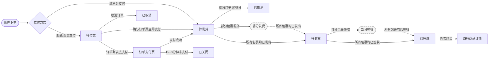

虚线框为中间态，仅在订单详情页展示，不作为订单主状态入库：部分发货对应订单主状态"待发货"，部分签收对应订单主状态"待收货"。

| 当前状态 | 可执行操作 | 入口页面 | 目标状态 |
|----------|-----------|----------|----------|
| — | 用户下单（纯积分支付） | 确认订单页 | 待发货 |
| — | 用户下单（现金/组合支付） | 确认订单页 | 待付款 |
| 待付款 | 取消订单 | 订单列表/订单详情 | 已取消 |
| 待付款 | 立即支付（含现金） | 确认订单页→收银台弹窗 | 待发货 |
| 待付款 | 去支付 | 订单列表→订单支付页 | 待发货 |
| 待付款 | 超时未支付（15分钟+3分钟缓冲期） | 系统自动 | 已关闭 |
| 待发货 | 无（等待商家发货） | — | 待收货 |
| 待发货 | 取消订单（纯积分订单） | 订单详情/订单列表 | 已取消 |
| 待收货 | 确认收货 | 订单详情 | 已完成 |
| 已完成 | 再次购买 | 订单列表 | —（跳转商品详情） |

### 4.0.1 下单与支付全流程

下单与支付涉及多个页面的联动：商品详情页和购物车页进行配送校验，确认订单页完成支付方式和积分校验，支付成功后进入订单管理。完整流程如下：


流程要点

**配送校验（商品详情页+购物车）**：根据用户收货地址校验配送区域，不支持时提示"该地区无库存"并禁用购买操作。

**积分适用校验优先级**：①积分有效期（过期直接拦截）→ ②按消费支持类型匹配：单品→标签→品牌→分类→通兑。匹配成功后计算可抵扣积分；全部不可抵扣时引导现金支付。

**支付分流**：纯积分支付下单即完成（直接扣减库存和积分），含现金支付需经收银台弹窗输入6位密码。超时未支付（15分钟+3分钟缓冲期）自动关闭订单并释放库存。

**待支付订单重新支付**：从订单列表"去支付"进入订单支付页，商品/积分锁定不可修改，仅完成现金支付环节。

### 4.1 确认订单（order.html）

#### 4.1.1 功能概述

确认订单页是下单的核心操作页，展示收货地址、商品列表、配送方式、备注和支付方式选择。用户可选择积分全额支付、现金支付或积分+现金组合支付，调整商品数量和使用的积分数量后提交订单。纯积分支付下单即完成，含现金支付时弹出收银台弹窗，输入6位支付密码完成支付。

#### 4.1.2 页面结构

页面从上到下分为：收货地址区（底部彩色锯齿线）、商品列表、配送方式、备注区、支付方式选择区、组合豆输入区（条件显示）、支付渠道选择区（条件显示）、价格汇总区和底部提交栏。另有收银台支付弹窗从中间弹出。

| 区域 | 说明 |
|------|------|
| 收货地址区 | 显示默认地址（姓名+脱敏手机号+完整地址），底部彩色锯齿线装饰，点击跳转地址管理 |
| 商品列表 | 每个商品含图片、名称、规格、价格、数量加减控制器 |
| 配送方式 | 默认"快递 免邮" |
| 备注区 | textarea，placeholder"选填，对本次交易的说明"，200字限制，显示"N/200"计数器 |
| 支付方式选择 | 三选一：积分支付、现金支付、积分+现金组合（默认选中组合） |
| 组合豆输入区 | 仅组合模式显示，积分数量输入框+"全部"快捷按钮+余额提示 |
| 支付渠道选择 | 仅现金/组合模式显示，微信支付（默认）/支付宝 |
| 价格汇总区 | 根据支付方式动态显示：商品金额、运费、积分抵扣、现金支付、实付金额 |
| 底部提交栏 | 合计金额+"立即支付"按钮（文案随支付方式变化） |
| 收银台弹窗 | 两步骤：Step1确认信息（金额+渠道+积分抵扣）→ Step2输入6位支付密码 |

#### 4.1.3 操作流程

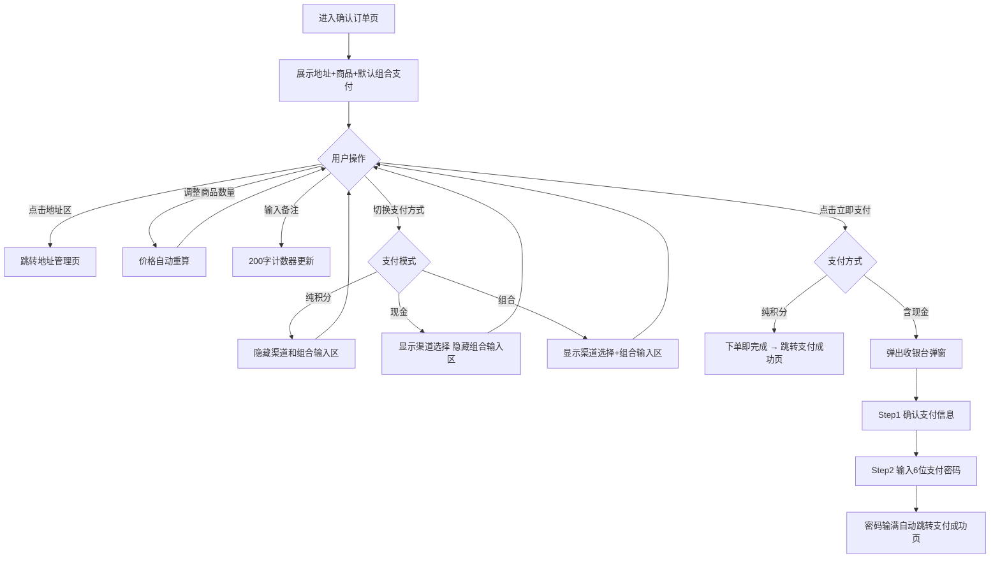

组合支付输入积分数量时，输入值不超过 `MIN(用户余额, 订单商品金额)`，超出时红字提示并自动截断。点击"全部"按钮自动填入最大可用值。支付密码为6位纯数字，每输入一位显示一个黑点，输满自动提交。

#### 4.1.4 字段与交互

| 字段名称 | 字段标识 | 字段类型 | 必填 | 数据类型 | 长度限制 | 默认值 | 校验规则 | 取值范围 | 来源 | 错误提示 |
|----------|----------|----------|------|----------|----------|--------|----------|----------|------|----------|
| 收货地址 | address | 展示+跳转 | 是 | Object | - | 默认地址 | 需选择地址 | 已保存地址 | 品牌商城后台 | - |
| 商品数量 | product_qty | 数字控制 | 是 | Number | 1-库存 | 购物车数量 | 最小为1 | 1-999 | 用户操作 | - |
| 配送方式 | delivery | 展示文本 | - | String | - | 快递 免邮 | - | - | 品牌商城后台 | - |
| 备注 | remark | 文本域 | 否 | String | 200字 | 空 | 最大200字 | - | 用户输入 | - |
| 支付方式 | pay_mode | 单选 | 是 | String | - | 组合支付 | 三选一 | beans/cash/combo | 用户选择 | - |
| 支付渠道 | pay_channel | 单选 | 条件 | String | - | 微信 | 仅现金/组合模式显示 | wechat/alipay | 用户选择 | - |
| 组合豆数量 | combo_points | 数字输入 | 条件 | Number | 1-MIN余额订单金额 | 空 | 不超过余额和订单金额 | 1-99999 | 用户输入 | 不能超过可用余额/不能超过订单金额 |
| 全部按钮 | combo_all | 按钮 | - | - | - | - | 自动填入MIN余额订单金额 | - | - | - |
| 立即支付 | submit_btn | 按钮 | - | - | - | 文案随模式变化 | 防重复提交 | - | - | - |
| 支付密码 | pay_password | 密码输入 | 是 | String | 6位 | 空 | 6位纯数字 | 0-9 | 用户输入 | - |
| 确认支付 | confirm_pay | 按钮 | - | - | - | - | 防重复提交 | - | - | - |

#### 4.1.5 业务规则

| 规则编号 | 规则描述 |
|----------|----------|
| RULE-ORDER-001 | 纯积分支付下单时直接扣减库存和积分，无待付款阶段，订单状态直接为"待发货" |
| RULE-ORDER-002 | 现金/组合支付下单时锁定库存（预扣减），支付成功后真实扣减，超时未支付则释放锁定 |
| RULE-ORDER-003 | 前端价格仅做展示，后端必须以数据库实时价格和活动规则重新计算，防篡改。价格变动时前端静默更新为最新价格，并通过Toast提示"商品价格已更新" |
| RULE-ORDER-004 | 积分抵扣由后端计算，前端仅传"拟使用积分数量"，后端校验余额并计算实际抵扣金额 |
| RULE-ORDER-005 | 积分适用校验优先级：①积分有效期（过期直接拦截）→ ②按优先级匹配：单品→标签→品牌→分类→通兑 |
| RULE-ORDER-006 | 多商品积分分摊：按商品金额比例分摊，每项保留2位小数（向下取整），最后一个商品用差值避免小数累积误差 |
| RULE-ORDER-007 | 仅对可抵扣商品计算积分上限，不可抵扣商品必须使用现金支付 |
| RULE-ORDER-008 | 下单前置校验：商品上下架状态、库存充足性、配送区域支持、积分适用规则 |
| RULE-ORDER-009 | 订单号生成规则：业务标识（渠道）+ 时间戳（精确到毫秒/秒）+ 序列号（推荐雪花算法或Redis自增） |
| RULE-ORDER-010 | 返还积分恢复原过期时间；若原积分已过期则直接作废，提示用户联系客服 |
| RULE-ORDER-011 | 无地址场景：确认订单页必须选择收货地址才可提交订单，无保存地址时地址区显示"请添加收货地址"+跳转链接，提交按钮置灰禁用 |
| RULE-ORDER-012 | 收银台弹窗关闭/取消：用户关闭弹窗不触发订单状态变更，订单保持"待付款"，积分锁定保持直到订单关闭或支付完成 |
| RULE-ORDER-013 | 支付失败处理：支付密码错误时弹窗提示"支付密码错误，请重新输入"并清空密码，不限制重试次数；网络超时提示"网络异常，请重试"，订单状态不变 |
| RULE-ORDER-014 | 组合支付部分成功：后端保证积分扣减和现金支付在同一事务中，任一失败则整体回滚；积分不单独锁定，仅在支付确认时一次性扣减 |
| RULE-ORDER-015 | 运费规则：V0.3默认全部商品包邮，运费固定为0，配送方式统一显示"快递 免邮" |
| RULE-ORDER-016 | 纯积分支付余额不足时：切换支付方式为组合支付或现金支付，纯积分选项旁红字提示"积分余额不足"；若用户强制点击纯积分支付，提交时Toast提示"积分余额不足，请选择其他支付方式" |

#### 4.1.6 页面跳转

**入口**：
- 购物车点击"结算"
- 商品详情页"立即购买"

**出口**：
- 纯积分支付成功 → 支付成功页（pay_success.html）
- 含现金支付成功 → 支付成功页（pay_success.html）
- 点击地址区 → 收货地址页（address.html）
- 返回按钮 → 来源页面（history.back()）

### 4.2 支付成功（pay_success.html）

#### 4.2.1 功能概述

支付成功页展示支付结果和订单摘要信息，提供查看订单和返回首页两个主要操作。页面底部展示"猜你喜欢"推荐商品，引导用户继续浏览。从确认订单页或订单支付页支付完成后跳转进入。

#### 4.2.2 页面结构

页面从上到下分为：顶部导航栏、成功状态区、订单信息卡片和猜你喜欢推荐区。

| 区域 | 说明 |
|------|------|
| 成功状态区 | 绿色勾选图标（scaleIn动画：0→1.1→1，0.4s）+"支付成功"+描述文字 |
| 订单信息卡片 | 订单编号、支付方式、积分抵扣、现金支付、实付金额 |
| 操作按钮 | "查看订单"（橙色描边）+"返回首页"（红色实心渐变） |
| 猜你喜欢 | 4个推荐商品网格，含标签（限时/爆款/特惠/热卖），JS动态渲染 |

#### 4.2.3 操作流程

页面进入后自动播放成功动画，无需额外操作。用户可选择查看订单、返回首页或点击推荐商品继续浏览。

#### 4.2.4 字段与交互

| 字段名称 | 字段标识 | 字段类型 | 必填 | 数据类型 | 长度限制 | 默认值 | 校验规则 | 取值范围 | 来源 | 错误提示 |
|----------|----------|----------|------|----------|----------|--------|----------|----------|------|----------|
| 订单编号 | order_id | 展示文本 | - | String | - | - | - | - | 品牌商城后台订单系统 | - |
| 支付方式 | pay_method | 展示文本 | - | String | - | - | - | 积分/现金/组合 | 品牌商城后台订单系统 | - |
| 积分抵扣 | beans_deduct | 展示文本 | - | String | - | - | - | - | 品牌商城后台订单系统 | - |
| 现金支付 | cash_paid | 展示文本 | - | String | - | - | - | - | 品牌商城后台订单系统 | - |
| 实付金额 | total_amount | 展示文本 | - | Number | - | - | 红色高亮 | - | 品牌商城后台订单系统 | - |
| 查看订单 | view_order_btn | 按钮 | - | - | - | - | - | - | - | - |
| 返回首页 | home_btn | 按钮 | - | - | - | - | - | - | - | - |
| 推荐商品 | rec_products | 商品卡片 | - | Array | - | 4个 | 点击跳转商品详情 | - | 品牌商城后台推荐系统 | - |

#### 4.2.5 业务规则

| 规则编号 | 规则描述 |
|----------|----------|
| RULE-PAYSUC-001 | 推荐商品来自品牌商城后台推荐系统或魔方配置，最多展示4个 |

#### 4.2.6 页面跳转

**入口**：
- 确认订单页支付成功后跳转
- 订单支付页支付成功后跳转

**出口**：
- 查看订单 → 订单详情页（order_detail.html）
- 返回首页 → 首页（home_page.html）
- 推荐商品 → 商品详情页（product_detail.html）

---

## 五、订单管理

本模块覆盖订单全生命周期管理，包括订单列表、订单支付、订单详情、物流追踪和取消订单。

### 5.1 订单列表（order_list.html）

#### 5.1.1 功能概述

订单列表页按状态Tab展示用户的所有订单，支持全部/待付款/待发货/待收货/已完成五种筛选。每个订单卡片展示订单号、状态标签、商品信息和操作按钮，操作按钮随订单状态变化。用户可进行去支付、取消订单、确认收货、再次购买和评价等操作。

#### 5.1.2 页面结构

页面从上到下分为：顶部导航栏、Tab筛选栏（带角标）、订单列表区域。另有空状态展示。

| 区域 | 说明 |
|------|------|
| Tab筛选栏 | 全部/待付款/待发货/待收货/已完成，选中项底部橙色下划线，待付款/待收货Tab显示红色数字角标。已取消和已关闭订单仅在"全部"Tab中展示，不计入任何筛选Tab |
| 订单卡片 | 订单号+状态标签（彩色）+商品图/名称/价格/数量+包裹摘要（部分发货时）+合计金额+操作按钮 |
| 状态颜色 | 待付款=橙色(#ff9800)、待发货=蓝色(#2196f3)、待收货=绿色(#4caf50)、已完成/已取消/已关闭=灰色(#999) |
| 操作按钮 | 按状态显示：待付款(取消订单+去支付)、待发货(取消订单+查看详情)、待收货(查看物流+确认收货)、已完成(再次购买+评价)、已取消/已关闭(查看详情) |
| 空状态 | 图标+"暂无相关订单"+"去逛逛"按钮 |

#### 5.1.3 操作流程

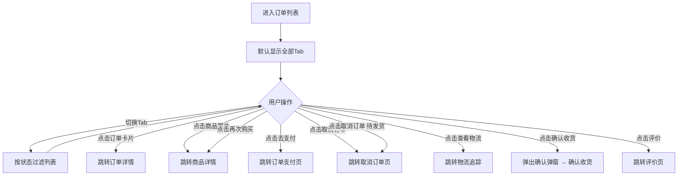

合计金额显示逻辑：纯积分显示"XX积分"，组合支付显示"XX积分+¥XX.XX"，纯现金显示"¥XX.XX"。

#### 5.1.4 字段与交互

| 字段名称 | 字段标识 | 字段类型 | 必填 | 数据类型 | 长度限制 | 默认值 | 校验规则 | 取值范围 | 来源 | 错误提示 |
|----------|----------|----------|------|----------|----------|--------|----------|----------|------|----------|
| Tab筛选 | tab_filter | Tab按钮 | - | String | - | 全部 | 点击切换 | 全部/pending/shipped/delivered/completed | 用户操作 | - |
| Tab角标 | tab_badge | 数字角标 | - | Number | - | - | 仅待付款/待收货显示 | - | 品牌商城后台统计 | - |
| 订单状态 | order_status | 标签 | - | String | - | - | 颜色随状态变化 | pending/shipped/delivered/completed/cancelled/closed | 品牌商城后台订单系统 | - |
| 合计金额 | order_total | 展示文本 | - | String | - | - | 显示格式随支付方式变化 | - | 品牌商城后台订单系统 | - |

#### 5.1.5 业务规则

| 规则编号 | 规则描述 |
|----------|----------|
| RULE-ODLIST-001 | 待收货状态签收时间15天后自动确认收货 |
| RULE-ODLIST-002 | 自动取消与手动取消退款流程不一致：未支付时均直接作废；已支付时手动取消走退款审批流程，系统自动取消（风控/超时）走免审自动原路退款 |
| RULE-ODLIST-003 | 再次购买时校验商品状态：商品已下架/已售罄时，商品详情页展示缺省状态+提示"该商品已下架"，不展示购买操作栏 |
| RULE-ODLIST-004 | 确认收货二次确认：点击"确认收货"弹出确认弹窗，标题"确认收货？"，描述"确认后订单将标记为已完成"，双按钮"再想想/确认收货" |
| RULE-ODLIST-005 | 订单列表排序规则：按下单时间倒序排列，待付款订单置顶显示；已取消/已关闭订单仅显示"查看详情"按钮 |

#### 5.1.6 页面跳转

**入口**：
- 个人中心"我的订单"
- 其他页面跳转

**出口**：
- 点击订单卡片 → 订单详情页（order_detail.html）
- 点击商品图片 → 商品详情页（product_detail.html）
- 去支付 → 订单支付页（order_pay.html）
- 取消订单 → 取消订单页（order_cancel.html?status=pending 或 ?status=paid）
- 查看物流 → 物流追踪页（logistics.html）
- 再次购买 → 商品详情页（product_detail.html）
- 评价 → 评价页（write_review.html）
- 空状态"去逛逛" → 首页（home_page.html）

### 5.2 订单支付（order_pay.html）

#### 5.2.1 功能概述

订单支付页用于待付款订单完成现金支付，从订单列表"去支付"按钮进入。页面展示锁定的订单信息（商品、数量、积分不可修改），提供支付倒计时和支付渠道选择。页面含15分钟倒计时+3分钟缓冲期保护，超时后订单自动关闭。

#### 5.2.2 页面结构

页面从上到下分为：订单头部（编号+时间+倒计时）、收货地址（只读）、商品列表（只读）、配送方式、支付信息（锁定）、支付渠道选择、价格汇总和底部提交栏。另有收银台支付弹窗。

| 区域 | 说明 |
|------|------|
| 订单头部 | 订单编号、下单时间、支付倒计时（红色数字） |
| 收货地址 | 只读展示，底部彩色锯齿线，不可点击编辑 |
| 商品列表 | 只读展示商品图/名称/规格/价格，数量以"xN"文本显示 |
| 支付信息 | 锁定显示积分抵扣金额和现金支付金额，不可修改 |
| 倒计时状态 | 正常期：红色倒计时；缓冲期：红色加粗"订单即将关闭"；过期：灰色"订单已关闭"+按钮禁用 |
| 收银台弹窗 | 与确认订单页相同的两步骤弹窗（确认信息→输入密码） |

#### 5.2.3 操作流程

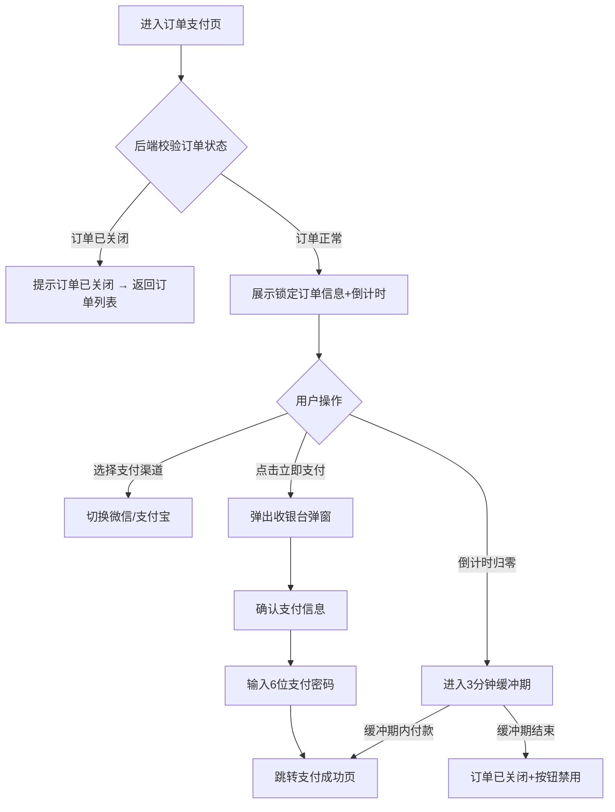

倒计时计算：前端根据订单创建时间+15分钟超时计算，归零后进入3分钟缓冲期（180秒），前端提示"订单即将关闭"但按钮仍可用，后端订单仍然有效。

#### 5.2.4 字段与交互

| 字段名称 | 字段标识 | 字段类型 | 必填 | 数据类型 | 长度限制 | 默认值 | 校验规则 | 取值范围 | 来源 | 错误提示 |
|----------|----------|----------|------|----------|----------|--------|----------|----------|------|----------|
| 支付倒计时 | countdown | 展示文本 | - | String | - | - | 15分钟+3分钟缓冲期 | - | 前端计算 | - |
| 支付渠道 | pay_channel | 单选 | 是 | String | - | 微信 | 仅微信/支付宝 | wechat/alipay | 用户选择 | - |
| 支付密码 | pay_password | 密码输入 | 是 | String | 6位 | 空 | 6位纯数字 | 0-9 | 用户输入 | - |

#### 5.2.5 业务规则

| 规则编号 | 规则描述 |
|----------|----------|
| RULE-ODPAY-001 | 进入页面时后端校验订单状态，已关闭或已支付则提示并返回订单列表 |
| RULE-ODPAY-002 | 前后端均有3分钟缓冲期保护，缓冲期内付款可正常成功，结束后才关闭订单并释放库存 |
| RULE-ODPAY-003 | 订单支付页与确认订单页的区别：商品/数量/积分不可修改，仅完成现金支付环节 |

#### 5.2.6 页面跳转

**入口**：
- 订单列表点击"去支付"

**出口**：
- 支付成功 → 支付成功页（pay_success.html）
- 订单已关闭 → 订单列表页（order_list.html）

### 5.3 订单详情（order_detail.html）

#### 5.3.1 功能概述

订单详情页展示单个订单的完整信息，包括收货地址、多包裹卡片（含物流快捷入口）、商品列表和订单信息。页面底部提供取消订单、查看物流和确认收货操作按钮，按钮随订单状态变化。一单可拆为多个包裹，按物流单号聚合显示。

#### 5.3.2 页面结构

页面从上到下分为：顶部导航栏、收货地址区、包裹卡片列表、订单信息区和底部操作栏。

| 区域 | 说明 |
|------|------|
| 收货地址区 | 收件人姓名+脱敏手机号、完整收货地址 |
| 包裹卡片 | 每个包裹独立卡片，含物流快捷入口（承运商+运单号+状态标签+最新动态）和商品列表 |
| 物流状态标签 | 运输中=橙色标签(shipping)、已签收=绿色标签(delivered) |
| 订单信息区 | 订单编号、下单时间、支付时间、支付方式、积分抵扣、现金支付、运费、实付金额、备注（有备注时显示） |
| 底部操作栏 | 按状态显示：待付款(取消订单)、待发货(取消订单)、待收货(查看物流+确认收货)、已完成(无按钮) |

#### 5.3.3 操作流程

页面以信息展示为主，用户可点击包裹卡片物流区跳转物流追踪，或通过底部按钮执行操作。

#### 5.3.4 字段与交互

| 字段名称 | 字段标识 | 字段类型 | 必填 | 数据类型 | 长度限制 | 默认值 | 校验规则 | 取值范围 | 来源 | 错误提示 |
|----------|----------|----------|------|----------|----------|--------|----------|----------|------|----------|
| 包裹信息 | packages | 卡片列表 | - | Array | - | - | 按物流单号聚合 | - | 品牌商城后台订单系统 | - |
| 备注信息 | remark | 展示文本 | - | String | - | - | 无备注时不展示该行 | - | 品牌商城后台订单系统 | - |

#### 5.3.5 业务规则

| 规则编号 | 规则描述 |
|----------|----------|
| RULE-ODDTL-001 | 包裹拆分规则：供应链侧按商品维度拆单（每个商品一个子订单），前端按物流单号聚合显示，同一订单中不同SKU聚合成一个物流包裹卡片 |
| RULE-ODDTL-002 | 订单状态由所有包裹物流状态取最滞后值推导：待发货 < 运输中 < 已签收 |
| RULE-ODDTL-003 | 部分发货和部分签收为中间态，仅在订单详情页展示，不作为订单主状态入库 |
| RULE-ODDTL-004 | 确认收货以用户手动操作为准，不依赖物流签收状态。用户可对"待收货"状态的订单主动点击确认收货（将所有未签收包裹标记为已签收）。确认收货后15天内未操作则系统自动确认 |
| RULE-ODDTL-005 | 部分发货状态下不允许取消订单，需等待所有包裹发货完成或联系客服处理 |

#### 5.3.6 订单状态与包裹物流状态映射

一单订单可拆为多个包裹，订单整体状态由**所有包裹的物流状态取最滞后值**推导而来。


Mermaid 源码

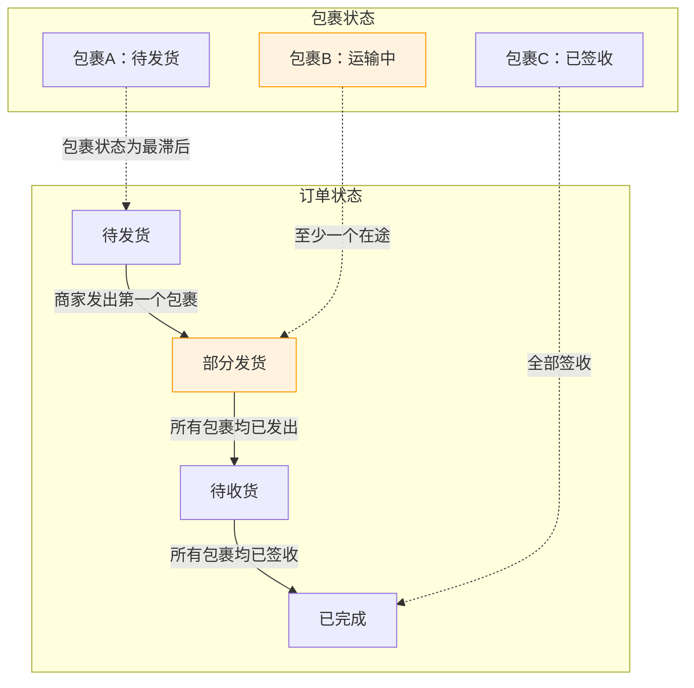

| 订单状态 | 包裹状态条件 | 订单详情页展示 |
|----------|-------------|---------------|
| 待发货 | 所有包裹 = 待发货 | 每个包裹卡片显示"待发货"橙色标签 |
| 部分发货 | 存在运输中 + 存在待发货 | 订单顶部"部分发货"蓝色标签；已发出显示"运输中"，未发出显示"待发货" |
| 待收货 | 所有包裹 = 运输中 | 每个包裹卡片显示"运输中"橙色标签 |
| 部分签收 | 存在已签收 + 存在运输中 | 订单顶部"部分签收"绿色标签；已签收绿色，在途橙色 |
| 已完成 | 所有包裹 = 已签收 | 每个包裹卡片显示"已签收"绿色标签 |

**映射规则：**
1. 订单状态 = `MIN(所有包裹状态)`，优先级：待发货 < 运输中 < 已签收
2. 只要有一个包裹未签收，订单就不会自动流转到"已完成"
3. "部分发货"和"部分签收"为中间态，仅在订单详情页展示，不作为订单主状态入库
4. 用户确认收货操作不依赖物流签收状态，用户手动确认优先于自动确认（15天后自动）
5. 部分发货状态下不允许取消订单，需等待所有包裹发货完成或联系客服处理

#### 5.3.7 页面跳转

**入口**：
- 订单列表点击订单卡片
- 支付成功页点击"查看订单"

**出口**：
- 包裹物流区/查看物流 → 物流追踪页（logistics.html）
- 取消订单 → 取消订单页（order_cancel.html）
- 返回按钮 → 来源页面（history.back()）

### 5.4 物流追踪（logistics.html）

#### 5.4.1 功能概述

物流追踪页展示订单的所有包裹物流信息，每个包裹独立卡片，包含承运商信息、包裹内商品、当前状态和可折叠的物流时间线。时间线默认折叠，点击展开后以纵向时间轴形式展示物流轨迹，最新节点橙色高亮。

#### 5.4.2 页面结构

页面由JS动态渲染的包裹卡片列表组成，每个卡片包含：

| 区域 | 说明 |
|------|------|
| 承运商头部 | 快递公司图标+名称、运单号、"复制"按钮 |
| 包裹商品 | 商品缩略图+名称+数量 |
| 包裹状态栏 | 状态圆点（运输中=橙色/已签收=绿色/待发货=橙色）+状态文字+更新时间+展开箭头 |
| 物流时间线 | 默认折叠，展开后纵向时间轴，每条含描述+时间，最新一条橙色高亮+光晕效果 |

#### 5.4.3 操作流程

页面以信息展示为主，用户可点击包裹状态栏展开/折叠物流时间线，展开箭头旋转180度动画（0.2s）。

#### 5.4.4 字段与交互

| 字段名称 | 字段标识 | 字段类型 | 必填 | 数据类型 | 长度限制 | 默认值 | 校验规则 | 取值范围 | 来源 | 错误提示 |
|----------|----------|----------|------|----------|----------|--------|----------|----------|------|----------|
| 承运商信息 | courier | 展示文本 | - | String | - | - | - | - | 品牌商城后台物流系统 | - |
| 运单号 | tracking_no | 展示文本 | - | String | - | - | 含复制按钮 | - | 品牌商城后台物流系统 | - |
| 物流时间线 | timeline | 折叠面板 | - | Array | - | 折叠 | 点击状态栏展开/收起 | - | 品牌商城后台物流系统 | - |

#### 5.4.5 业务规则

无额外业务规则。

#### 5.4.6 页面跳转

**入口**：
- 订单详情点击物流区或"查看物流"
- 订单列表点击"查看物流"

**出口**：
- 返回按钮 → 来源页面（history.back()）

### 5.5 取消订单（order_cancel.html）

#### 5.5.1 功能概述

取消订单页展示订单摘要和取消原因选择，已支付订单额外展示退款信息。用户选择取消原因后点击确认，通过二次确认弹窗确认取消操作。待付款订单隐藏退款信息区，已支付订单展示退款金额和积分返还说明。

#### 5.5.2 页面结构

页面从上到下分为：订单信息卡、取消原因选择区、退款信息区（已支付时显示）、温馨提示和底部操作栏。另有确认取消弹窗。

| 区域 | 说明 |
|------|------|
| 订单信息卡 | 商品图片/名称/规格/价格、订单编号/下单时间/订单金额 |
| 取消原因 | 5个预设选项：不想要了/信息填写错误/商品降价了/等待时间过长/其他原因 |
| 其他原因输入 | 选择"其他原因"时展开textarea，选填，最大100字 |
| 退款信息区 | 仅已支付订单显示：支付方式/支付金额/积分抵扣返还/预计到账时间 |
| 温馨提示 | 已支付：取消不可恢复+积分原路返还+联系客服；待付款：取消不可恢复+联系客服 |
| 确认取消弹窗 | 警告图标+标题"确认取消订单？"+描述+双按钮（再想想/确认取消） |

#### 5.5.3 操作流程

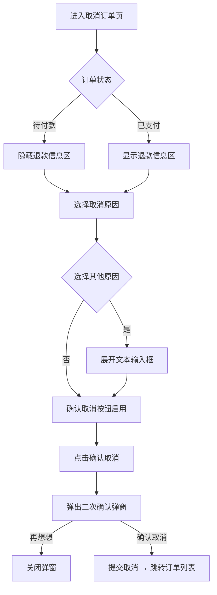

确认取消按钮需选择原因后才启用，点击后弹出二次确认弹窗。

#### 5.5.4 字段与交互

| 字段名称 | 字段标识 | 字段类型 | 必填 | 数据类型 | 长度限制 | 默认值 | 校验规则 | 取值范围 | 来源 | 错误提示 |
|----------|----------|----------|------|----------|----------|--------|----------|----------|------|----------|
| 取消原因 | cancel_reason | 单选 | 是 | String | - | 空 | 必须选择一个原因 | not_want/wrong_info/price_change/timeout/other | 用户选择 | - |
| 其他原因说明 | other_reason | 文本域 | 条件 | String | 100字 | 空 | 仅选择"其他原因"时显示 | - | 用户输入 | - |
| 确认取消 | confirm_btn | 按钮 | - | - | - | disabled | 需选择原因后启用 | - | - | - |

#### 5.5.5 业务规则

| 规则编号 | 规则描述 |
|----------|----------|
| RULE-CANCEL-001 | 待付款订单取消时隐藏退款信息区，无退款流程 |
| RULE-CANCEL-002 | 已支付订单取消后积分原路返还，返还积分恢复原过期时间；若原积分已过期则作废，提示用户联系客服 |
| RULE-CANCEL-003 | 过期积分提示文案："该笔订单积分已过期，取消订单后返还的积分将不可用，建议联系客服处理。是否确认取消？" |
| RULE-CANCEL-004 | 纯积分支付订单（待发货状态）取消时通过URL参数 `?status=paid` 传入，与现金/组合支付的待付款订单共享退款信息展示逻辑；待发货订单取消后积分原路返还 |

#### 5.5.6 页面跳转

**入口**：
- 订单列表点击"取消订单"（待付款：?status=pending，已支付：?status=paid，纯积分待发货：?status=paid）
- 订单详情点击"取消订单"（待付款/待发货，同上规则）

**出口**：
- 暂不取消 → 来源页面（history.back()）
- 确认取消 → 订单列表页（order_list.html）

---

## 六、页面导航

### 6.1 跳转关系

| # | 来源页面 | 触发条件 | 目标页面 |
|---|----------|----------|----------|
| 1 | 商品详情 | 点击规格弹窗"立即购买" | 确认订单 |
| 2 | 商品详情 | 底部购物车图标 | 购物车 |
| 3 | 商品详情 | 查看全部评价 | 商品评价列表（V1.1） |
| 4 | 购物车 | 点击"结算" | 确认订单 |
| 5 | 购物车 | 点击商品图片 | 商品详情 |
| 6 | 购物车 | 地址弹窗"管理收货地址" | 收货地址 |
| 7 | 确认订单 | 点击地址区 | 收货地址 |
| 8 | 确认订单 | 纯积分支付成功 | 支付成功 |
| 9 | 确认订单 | 含现金支付成功（收银台→密码） | 支付成功 |
| 10 | 支付成功 | 点击"查看订单" | 订单详情 |
| 11 | 支付成功 | 点击"返回首页" | 首页 |
| 12 | 支付成功 | 点击推荐商品 | 商品详情 |
| 13 | 订单列表 | 点击订单卡片 | 订单详情 |
| 14 | 订单列表 | 点击商品图片 | 商品详情 |
| 15 | 订单列表 | 点击"去支付" | 订单支付 |
| 16 | 订单列表 | 点击"取消订单"（待付款/待发货） | 取消订单 |
| 17 | 订单列表 | 点击"查看物流" | 物流追踪 |
| 18 | 订单列表 | 点击"再次购买" | 商品详情 |
| 19 | 订单支付 | 支付成功 | 支付成功 |
| 20 | 订单支付 | 订单已关闭 | 订单列表 |
| 21 | 订单详情 | 点击物流区/查看物流 | 物流追踪 |
| 22 | 订单详情 | 点击"取消订单" | 取消订单 |
| 23 | 物流追踪 | 无外链跳转 | — |

### 6.2 返回导航

所有子页面返回按钮统一使用 `history.back()` 返回来源页面。当 `document.referrer` 非同域时（如从外部链接进入），返回按钮跳转首页（home_page.html）。

### 6.3 登录拦截

受保护页面加载时通过 `auth-guard.js` 检查登录状态：

| 类型 | 页面 |
|------|------|
| 受保护页面 | 确认订单（order.html）、订单支付（order_pay.html）、订单列表（order_list.html）、订单详情（order_detail.html）、购物车（cart.html）、支付成功（pay_success.html）、物流追踪（logistics.html） |
| 公开页面 | 商品详情（product_detail.html）、取消订单（order_cancel.html） |
