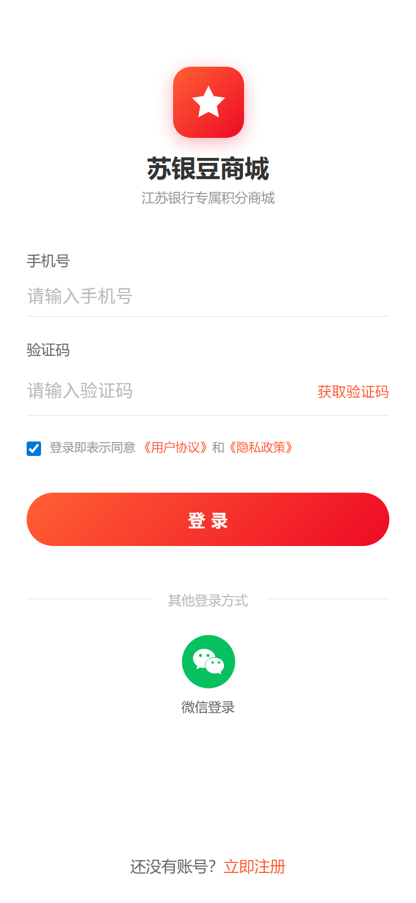
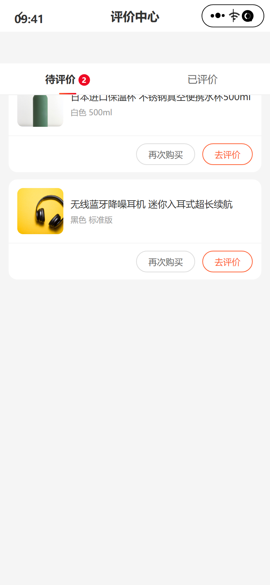
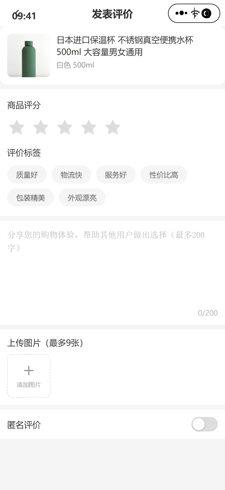
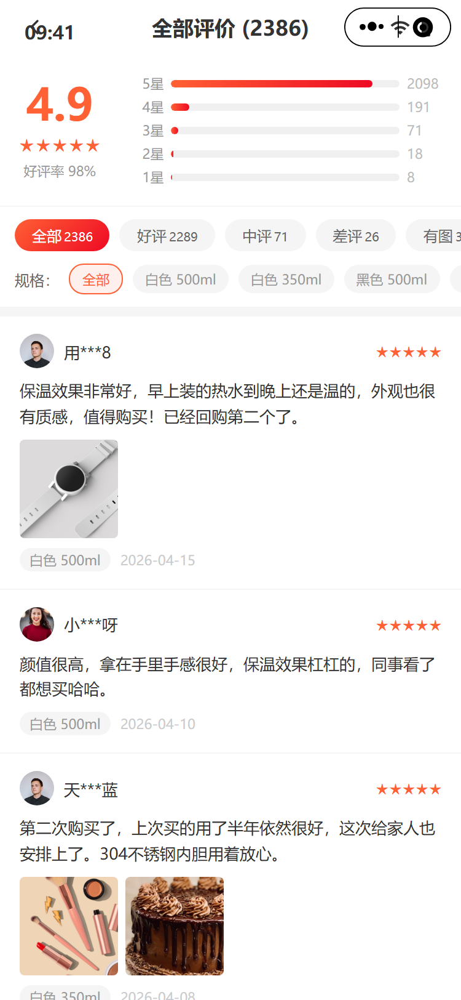
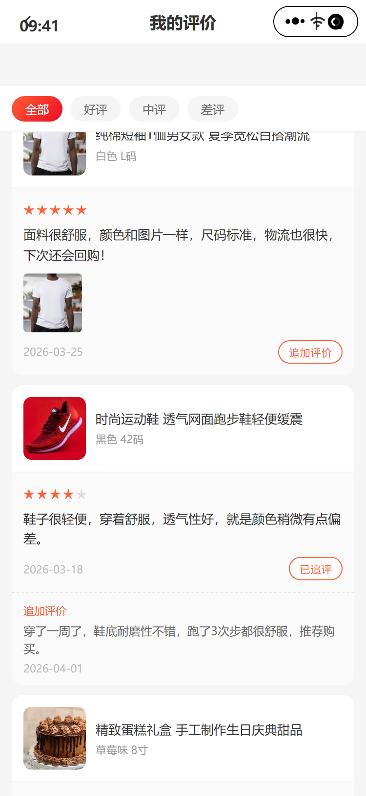

# 苏银豆商城 - 业务逻辑清单 V0.3（下单与评价流程）

> 本文档为 V0.3 版本增量业务逻辑清单，覆盖商品详情、购物车、下单支付、订单管理及评价共 12 个页面。
> 
> 测试前先在浏览器控制台执行 `Auth.resetAccounts()` 重置账号数据。
> 
> **商品数据来源：** 全量商品数据来源于品牌商城后台商品管理列表；组件/活动模块商品数据来源于魔方配置，组件商品数据 ≤ 全量商品数据。
> 
> **统计口径：** 销量=SKU维度已完成订单商品件数；好评率=SKU五星好评数÷全部评价数×100%；折扣=现价÷原价×10，后端计算保留一位小数（如3.9折）。

---

## 一、商品详情 `V0.3`

> 详细PRD文档见：[PRD_03_商品详情](./PRD_03_商品详情.md)

### 1.1 商品详情页（product_detail.html）

#### 1.1.1 功能用例表

| #   | 场景         | 操作                                  | 预期结果                       |
| --- | ---------- | ----------------------------------- | -------------------------- |
| 1   | 图片轮播       | 左右滑动主图                              | 切换图片，图片指示器更新如“1/3”更新为“2/3” |
| 2   | 打开规格弹窗     | 点击"已选规格"                            | 底部滑出规格选择弹窗                 |
| 3   | 选择规格       | 点击规格属性如颜色属性值/尺寸属性值选项                | 选中项高亮，对应的商品主图变更            |
| 4   | 弹窗内调数量     | +/-按钮                               | 数量变化，最小为1                  |
| 5   | 加入购物车      | 弹窗中点"加入购物车"                         | 提示"已加入购物车"，弹窗关闭            |
| 6   | 立即购买       | 弹窗中点"立即购买"                          | 跳转确认订单页                    |
| 7   | 收藏商品（单SKU） | 点击心形图标（仅一个规格时）                      | 心形变红，提示"已收藏"               |
| 8   | 收藏商品（多SKU） | 点击心形图标（多规格时）→ 弹出规格选择器 → 选择规格 → 确认收藏 | 心形变红，提示"已收藏"               |
| 9   | 取消收藏       | 再次点击心形                              | 心形变空心，提示"已取消收藏"            |
| 10  | 重复收藏       | 收藏已收藏的同一SKU                         | 不新增记录，心形保持红色               |
| 11  | 关闭规格弹窗     | 点击蒙层或关闭按钮                           | 弹窗滑出，不影响页面布局               |
| 12  | 点击首页图标     | 点击底部首页按钮                            | 跳转首页（`home_page.html`）     |
| 13  | 点击购物车图标    | 点击底部购物车按钮                           | 跳转购物车页（`cart.html`）        |
| 14  | 查看全部评价     | 点击"查看全部评价 >"                        | 跳转商品评价列表页（`product_reviews.html`）     |
|     |            |                                     |                            |

#### 1.1.2 关键字段数据来源

| 字段                   | 数据来源                                                             |
| -------------------- | ---------------------------------------------------------------- |
| 商品图片轮播               | 品牌商城后台商品管理 — SKU主图+SKU轮播图                                        |
| 销售价/划线价/折扣标签         | 品牌商城后台商品管理 — 销售价和划线价 折扣后端根据销售价和划线价计算，折扣=(划线价-销售价)/划线价（保留一位小数） |
| 销量                   | 品牌商城后台统计 — 销量=已完成订单的SKU件数 数量小于10000时，显示X件；数量大于等于10000件时，显示Y万件 |
| 好评率                  | 品牌商城后台统计 — 好评率=（五星数+四星数）÷总数                                      |
| 商品名称/规格（颜色/尺寸等）      | 品牌商城后台商品管理 — SPU+SKU规格属性                                         |
| 服务标签（正品保障/7天无理由等）    | 品牌商城后台运营配置，看下基础设置是否有此项                                           |
| 优惠券信息（满减规则）          | 品牌商城后台优惠券菜单，当前商品参与的优惠券和满减活动的信息                                   |
| 热门评价（头像/昵称/星级/内容/日期） | 品牌商城后台商品评价模块                                                     |
| 收藏状态（心形图标初始状态）       | 返现时需调用当前小程序用户的收藏数据                                               |
| 购物车角标数字              | 购物车有效商品SKU的件数，一个SKU可能加购多个                                        |

### 1.2 商品详情页跳转关系

| #   | 入口页面 | 触发条件        | 商品详情页               |
| --- | ---- | ----------- | ------------------- |
| 1   | 首页   | 点击推荐商品/活动商品 | product_detail.html |
| 2   | 搜索结果 | 点击商品卡片      | product_detail.html |
| 3   | 购物车  | 点击商品图片      | product_detail.html |
| 4   | 收藏   | 点击商品        | product_detail.html |
| 5   | 订单详情 | 点击商品图片      | product_detail.html |
| 6   | 订单列表 | 点击商品图片      | product_detail.html |
| 7   | 支付成功 | 点击推荐商品      | product_detail.html |
| 8   | 评价中心 | 点击"再次购买"    | product_detail.html |

---

## 二、购物车 `V0.3`

#### 2.1 功能用例表

| #   | 场景         | 操作              | 预期结果                                  |
| --- | ---------- | --------------- | ------------------------------------- |
| 1   | 单选/取消      | 点击商品圆形勾选框       | 勾选状态切换，底部总价和数量实时更新                    |
| 2   | 全选/取消全选    | 点击底部"全选"        | 所有有效商品勾选/取消，全选框联动                     |
| 3   | 增加数量       | 点击+按钮           | 数量+1，总价更新                             |
| 4   | 减少数量       | 点击-按钮           | 数量-1，最小为1，qty=1时-按钮置灰（`disabled`）     |
| 5   | 左滑删除（触屏）   | 向左滑动商品卡片        | 露出红色"删除"按钮，滑动距离超过按钮宽度一半时吸附            |
| 6   | 左滑删除（鼠标）   | 鼠标按住商品卡片左拖      | 同触屏效果，支持桌面端预览                         |
| 7   | 滑动互斥       | 已滑出一个删除按钮时滑动另一个 | 前一个自动复位，仅保留当前                         |
| 8   | 点击删除       | 点击露出的红色"删除"按钮   | 卡片折叠动画（高度→0、透明度→0）后移除，列表更新            |
| 9   | 已下架商品展示    | 查看含已下架商品        | 图片半透明+黑色"已失效"蒙层，名称/规格/价格变灰，无勾选框，无数量控制 |
| 10  | 已下架商品仅删除   | 左滑已下架商品→删除      | 可正常删除                                 |
| 11  | 已下架商品不计入总计 | 查看底部合计          | 总价/数量仅计算有效勾选商品                        |
| 12  | 商品件数统计     | 查看顶部商品件数        | 仅统计有效商品（排除已下架），例"共 3 件商品"             |
| 13  | 去结算        | 点击"结算(N)"       | 跳转确认订单页（`order.html`），N为勾选商品总数量       |
| 14  | 点击商品图片     | 点击商品缩略图         | 跳转商品详情页（`product_detail.html`）        |
| 15  | Tab栏购物车角标  | 查看底部Tab购物车图标    | 显示红色数字角标，值为有效商品件数                     |

#### 2.2 关键字段数据来源

| 字段                | 数据来源                    |
| ----------------- | ----------------------- |
| 商品信息（图片/名称/规格/价格） | 品牌商城后台商品管理 — 通过SKU ID关联 |
| 商品上下架状态           | 品牌商城后台商品管理 — 实时查询       |
| 购物车商品数量           | 用户操作 — 本地/后端购物车数据       |
| 总价/总数量            | 前端实时计算 — 基于勾选商品         |
| Tab栏角标数字          | 购物车有效商品件数 — 全局共享        |

#### 2.3 业务逻辑增强

| #   | 问题                                     | 确认结果                                                                                                                                                                                                                                                                               |
| --- | -------------------------------------- | ---------------------------------------------------------------------------------------------------------------------------------------------------------------------------------------------------------------------------------------------------------------------------------- |
| 1   | 库存不足时前端提示策略？（加入购物车时提示 / 下单时提示 / 支付时提示） | 库存漏斗策略： - 加购时（宽松）：不扣真实库存。彻底无货拦截并提示“已售罄”；库存紧张时静默加入，列表内灰字提示“库存紧张”。 - 下单时（严格）：必须在此真实扣减库存。部分缺货自动移除并红字提示；超买自动回退到最大可买数量；全部缺货弹窗阻断提交。 - 支付时（兜底）：防并发抢光。若回调失败，跳转结果页明确提示“库存不足，订单已取消/已原路退款”。绝对禁止“先提示成功再变取消”。                                                                          |
| 2   | 用户多设备同时操作购物车的合并策略？                     | 用户在未登录状态下（设备A）加了购物车，然后在另一台设备（设备B）或浏览器登录了账号，此时需要将“本地购物车”与“云端购物车”进行合并。 - 同款商品（SKU相同）：数量相加。若叠加后超出限购或库存，则截断为最大可买数量。 - 异款商品（SKU不同）：直接追加至云端购物车。 - 数量冲突（两台设备都改了同一SKU）：不叠加，以最后修改时间的数据为准。 - 失效商品（下架/无货）：不静默丢弃，合并后移至底部、“失效商品区”，由用户手动清理。 - 价格与促销：丢弃本地缓存，强制以云端返回的最新价格和活动为准重新渲染。 |

---

## 三、下单与支付 `V0.3`

### 3.1 确认订单（order.html）

#### 3.1.1 功能用例表

| #   | 场景     | 操作       | 预期结果                              |
| --- | ------ | -------- | --------------------------------- |
| 1   | 地址展示   | 查看地址区域   | 显示默认收货地址（姓名、脱敏手机号、完整地址），底部彩色锯齿线装饰 |
| 2   | 地址跳转   | 点击地址区域   | 跳转收货地址列表（`address.html`）          |
| 3   | 商品数量调整 | 点击+/-按钮  | 数量变化，qty=1时-按钮置灰                  |
| 4   | 价格自动计算 | 调整数量     | 商品金额、积分抵扣、实付金额同步重算                |
| 5   | 积分抵扣展示 | 查看积分抵扣行  | 显示"-¥5.00（5豆，优先消耗即将过期积分）"，橙色高亮    |
| 6   | 配送方式   | 查看配送方式行  | 默认显示"快递 免邮"                       |
| 7   | 留言     | 查看留言行    | 显示"选填：对本次交易的说明"                   |
| 8   | 价格明细   | 查看价格汇总区  | 逐行展示：商品金额、运费（¥0.00）、积分抵扣、实付金额     |
| 9   | 底部合计联动 | 调整数量后    | 底部栏合计金额与价格汇总区同步                   |
| 10  | 提交订单   | 点击"立即支付" | 跳转支付页（`payment.html`）             |

#### 3.1.2 关键字段数据来源

| 字段 | 数据来源 |
|------|----------|
| 默认收货地址 | 收货地址页面（address.html） — 默认地址 |
| 商品信息（图/名/规格/价格/数量） | 购物车页面传入 / 立即购买页面传入 |
| 积分抵扣金额与明细 | 品牌商城后台积分系统 — 按过期时间优先消耗 |
| 运费 | 品牌商城后台运费规则 |
| 配送方式 | 品牌商城后台配置 — 默认"快递 免邮" |
| 商品金额/实付金额 | 后端重新计算 |

#### 3.1.3 业务逻辑增强

| #   | 问题                                  | 确认结果                                                               |
| --- | ----------------------------------- | ------------------------------------------------------------------ |
| 1   | 未支付订单多久自动取消？                        | 暂定15分钟，秒杀等特殊时效订单再额外调整。                                             |
| 2   | 自动取消后库存释放时机？（立即释放 / 延迟释放）           | 立即释放。取消操作与库存回滚在同一数据库事务中完成。                                         |
| 3   | 下单时锁定库存还是支付成功后扣减？                   | 下单时锁定（预扣减），支付成功后真实扣减，超时未支付则释放锁定。                                   |
| 4   | 前端展示价格是否作为最终结算依据？后端是否重新计算？          | 否。前端价格仅做展示，后端必须以数据库实时价格和活动规则重新计算，防篡改。                              |
| 5   | 积分抵扣金额由前端传入还是后端根据规则计算？              | 后端计算。前端仅传“拟使用积分数量”，后端校验余额、计算实际抵扣金额并落库。                             |
| 6   | 订单号生成规则？（如 JS + 日期 + 自增序号）          | 时间戳（精确到毫秒/秒）+ 业务标识（如渠道/门店号）+ 序列号（推荐雪花算法或 Redis 自增）。                |
| 7   | 序号是每天重置还是全局递增？                      | 全局递增。每天重置极易引发并发冲突且不利于全局排查。                                         |
| 8   | 重复点击"提交订单"防重策略？                     | 前端按钮防抖置灰 + 后端提交 Token 机制（页面下发，提交时校验并删）+ 数据库用户 ID 唯一索引兜底。           |
| 9   | 苏银豆余额扣减与订单创建是否在同一事务？                | 是。必须在同一本地事务（或基于 TCC/消息队列的分布式事务）中，保证强一致性，防资损。                       |
| 10  | 并发下单时库存超卖的防护策略？                     | Redis Lua 脚本原子性预扣减 + 数据库乐观锁（版本号机制）或悲观锁（SELECT ... FOR UPDATE）双重防护。 |
| 11  | 订单取消/退款时积分返还时机？（立即 / 审核通过后 / 退款到账后） | 退款到账后（退款单状态为“成功”时）立即返还，与资金流保持一致。                                   |
| 12  | 返还的积分是否恢复原有过期时间？还是延长有效期？            | 恢复原过期时间。若原积分已过期则直接作废（不延长），符合财务合规与逻辑简洁性。                            |
| 13  | 返还的积分已过期时，提醒用户                      | 提示词：该笔订单积分已过期，取消订单后返还的积分将不可用，建议联系客服处理。是否确认取消？                      |

### 3.2 订单支付（payment.html）

#### 3.2.1 功能用例表

| #   | 场景      | 操作                | 预期结果                                                  |
| --- | ------- | ----------------- | ----------------------------------------------------- |
| 1   | 支付金额展示  | 查看支付金额            | 顶部大字显示"¥171.90"                                       |
| 2   | 苏银豆余额   | 查看积分信息            | 显示"可用苏银豆：1,280"，"1苏银豆 = 1元"                           |
| 3   | 默认支付方式  | 进入支付页             | 微信支付默认选中（radio高亮）                                     |
| 4   | 切换支付方式  | 点击微信/支付宝/苏银豆/组合支付 | 选中项radio高亮，其他取消                                       |
| 5   | 选择微信支付  | 点击微信支付            | 选中高亮，无额外面板展示                                          |
| 6   | 选择支付宝   | 点击支付宝             | 选中高亮，描述"H5场景可用"                                       |
| 7   | 选择苏银豆全额 | 点击苏银豆全额兑换         | 若余额充足显示"需消耗 171.90 苏银豆，余额充足"；若不足显示红色差额提示              |
| 8   | 苏银豆不足提示 | 余额不足时选择全额兑换       | 展示红色提示框"苏银豆余额不足全额兑换，缺少 15,910 豆 (¥159.10)，建议使用组合支付方式" |
| 9   | 选择组合支付  | 点击苏银豆+现金组合        | 展开组合支付明细面板（`combo-detail`）                            |
| 10  | 组合支付明细  | 查看明细面板            | 显示苏银豆抵扣总额 + 积分消耗明细（按过期时间优先消耗逐条列出）+ 现金支付 + 合计          |
| 11  | 积分过期明细  | 查看组合支付积分消耗        | 逐条列出：豆数、到期日期、抵扣金额，如"50 豆 2026-04-30 到期 - ¥50.00"      |
| 12  | 确认支付    | 点击"确认支付 ¥171.90"  | 跳转支付成功页（`pay_success.html`）                           |

#### 3.2.2 关键字段数据来源

| 字段 | 数据来源 |
|------|----------|
| 支付金额 | 确认订单页面传入 |
| 苏银豆可用余额 | 品牌商城后台积分系统 — 用户当前可用积分数 |
| 积分过期明细（批次/到期日/金额） | 品牌商城后台积分系统 — 按过期时间排序 |
| 支付方式列表 | 品牌商城后台配置 |

#### 3.2.3 业务逻辑增强

| #   | 问题                     | 确认结果                                                                         |
| --- | ---------------------- | ---------------------------------------------------------------------------- |
| 1   | 同一天过期的多批积分消耗顺序？        | 优先消耗即将过期的积分（按过期时间升序，过期时间相同则按获取时间升序，即先进先出 FIFO）。                              |
| 2   | 积分不足以全额抵扣时，是全部消耗还是不消耗？ | 按需部分消耗。剩余差额部分由现金/其他支付方式补齐，不支持“必须全抵扣或完全不抵扣”的逻辑。                               |
| 3   | 重复点击"确认支付"防重策略？        | 前端支付按钮防抖（防重复唤起收银台） + 后端基于订单号的支付单幂等生成（同一订单只生成唯一一条待支付流水）。                      |
| 4   | 支付回调超时/失败时的补偿机制？       | 主动查单机制。 后端定时任务针对“支付中”状态的订单，主动调用支付平台查询接口，若已成功则手动触发状态更新和业务流转。               |

### 3.3 支付成功（pay_success.html）

#### 3.3.1 功能用例表

| # | 场景 | 操作 | 预期结果 |
|---|---|---|---|
| 1 | 成功动画 | 支付完成进入页面 | 绿色勾选图标缩放动画（scaleIn：0→1.1→1，0.4s） |
| 2 | 成功提示文案 | 查看成功区域 | 显示"支付成功"+"感谢您的购买，商品将尽快为您发出" |
| 3 | 订单信息卡 | 查看订单信息 | 显示：订单编号、支付方式、苏银豆抵扣、现金支付、实付金额 |
| 4 | 查看订单 | 点击"查看订单" | 跳转订单详情（`order_detail.html`），橙色描边按钮 |
| 5 | 返回首页 | 点击"返回首页" | 跳转首页（`home_page.html`），红色实心按钮 |
| 6 | 猜你喜欢 | 查看底部推荐 | 显示4个推荐商品，带标签（限时/爆款/特惠/热卖），点击跳转商品详情 |

#### 3.3.2 关键字段数据来源

| 字段 | 数据来源 |
|------|----------|
| 订单编号 | 品牌商城后台订单系统 |
| 支付方式/苏银豆抵扣/现金支付/实付金额 | 品牌商城后台订单系统 — 支付结果 |
| 猜你喜欢推荐商品 | 品牌商城后台推荐系统 / 魔方配置 |
| 推荐商品标签（限时/爆款/特惠/热卖） | 品牌商城后台运营配置 |

---

## 四、订单管理 `V0.3`

### 4.1 订单列表（order_list.html）

#### 4.1.1 功能用例表

| # | 场景 | 操作 | 预期结果 |
|---|---|---|---|
| 1 | Tab筛选 | 点击全部/待付款/待发货/待收货/已完成 | 列表按状态过滤，选中Tab底部显示橙色下划线 |
| 2 | Tab角标 | 查看待付款/待收货Tab | 显示红色数字角标（如待付款"1"、待收货"2"） |
| 3 | 订单卡片展示 | 查看订单列表 | 每张卡片含：订单号、状态标签（彩色）、商品图+名称+价格+数量、合计金额、操作按钮 |
| 4 | 状态颜色 | 不同状态订单 | 待付款=橙色（`#ff9800`）、待发货=蓝色（`#2196f3`）、待收货=绿色（`#4caf50`）、已完成/已取消=灰色（`#999`） |
| 5 | 待付款操作 | 查看待付款订单 | 显示"取消订单"（灰色）+"去支付"（红色） |
| 6 | 待发货操作 | 查看待发货订单 | 显示"查看详情"（灰色） |
| 7 | 待收货操作 | 查看待收货订单 | 显示"查看物流"（灰色）+"确认收货"（橙色） |
| 8 | 已完成操作 | 查看已完成订单 | 显示"再次购买"（灰色）+"评价"（橙色） |
| 9 | 点击商品区 | 点击订单卡片商品区域 | 跳转订单详情（`order_detail.html`） |
| 10 | 点击商品图片 | 点击商品缩略图 | 跳转商品详情（`product_detail.html`） |
| 11 | 去支付跳转 | 点击"去支付"按钮 | 跳转支付页（`payment.html`） |
| 12 | 取消订单跳转 | 点击"取消订单"按钮 | 跳转取消订单页（`order_cancel.html`） |
| 13 | 查看物流跳转 | 点击"查看物流"按钮 | 跳转物流追踪（`logistics.html`） |
| 14 | 空状态 | 切换到无订单的Tab | 显示空状态图标+"暂无相关订单"+"去逛逛"按钮（跳转首页） |

#### 4.1.2 关键字段数据来源

| 字段              | 数据来源                    |
| --------------- | ----------------------- |
| 订单列表            | 品牌商城后台订单系统 — 按用户ID+状态查询 |
| 订单号/状态/下单时间     | 品牌商城后台订单系统              |
| 商品信息（图/名/价格/数量） | 品牌商城后台订单系统 — 关联商品数据     |
| 合计金额            | 品牌商城后台订单系统              |
| Tab角标数量         | 品牌商城后台订单系统 — 各状态计数      |

#### 4.1.3 业务逻辑增强

| #   | 问题                    | 确认结果                                                                      |
| --- | --------------------- | ------------------------------------------------------------------------- |
| 1   | 待收货状态多久自动确认收货？        | 签收时间15天后                                                                  |
| 2   | 自动取消与用户手动取消的退款流程是否一致？ | 不一致。未支付时两者均直接作废，无退款流程；已支付时，用户手动取消需走退款申请/审批流程，系统自动取消（如风控/超时拦截）通常走免审自动原路退款。 |
|     |                       |                                                                           |

### 4.2 订单详情（order_detail.html）

#### 4.2.1 功能用例表

| # | 场景 | 操作 | 预期结果 |
|---|---|---|---|
| 1 | 收货地址展示 | 查看地址区域 | 显示收件人姓名+脱敏手机号、完整收货地址 |
| 2 | 多包裹展示 | 查看含多包裹订单 | 每个包裹独立卡片，各有物流快捷入口和商品列表 |
| 3 | 物流快捷入口 | 查看包裹卡片物流行 | 显示承运商+运单号+状态标签+最新物流动态，点击跳转物流追踪 |
| 4 | 物流状态标签 | 查看包裹状态 | "运输中"=橙色标签（`shipping`），"已签收"=绿色标签（`delivered`） |
| 5 | 订单信息 | 查看订单信息区 | 逐行展示：订单编号、下单时间、支付方式、苏银豆抵扣、现金支付、运费、实付金额 |
| 6 | 取消订单 | 点击"取消订单" | 跳转取消订单页（`order_cancel.html`），灰色按钮 |
| 7 | 查看物流 | 点击"查看物流" | 跳转物流追踪（`logistics.html`），橙色按钮 |
| 8 | 确认收货 | 点击"确认收货" | 弹出"已确认收货"提示，红色按钮 |

#### 4.2.2 关键字段数据来源

| 字段 | 数据来源 |
|------|----------|
| 收货地址（姓名/手机/地址） | 品牌商城后台订单系统 — 下单时快照 |
| 包裹信息（承运商/运单号/状态） | 品牌商城后台物流系统 |
| 包裹内商品列表 | 品牌商城后台订单系统 — 包裹拆分后的商品映射 |
| 订单信息（编号/时间/支付/金额） | 品牌商城后台订单系统 |

#### 4.2.3 业务逻辑增强

| #   | 问题                             | 确认结果                                                           |
| --- | ------------------------------ | -------------------------------------------------------------- |
| 1   | 一个订单拆多包裹的规则？（按仓库/按商家/按商品类型）    | 按照物流订单拆分                                                       |
| 2   | 部分包裹签收后的确认逻辑？（全部签收才能确认？可部分确认？） | 支持部分确认。单包裹签收更新该包裹状态，订单整体显示“部分签收”；必须所有包裹均签收后，订单状态才流转为“已签收/待评价”。 |

### 4.3 物流追踪（logistics.html）

#### 4.3.1 功能用例表

| # | 场景 | 操作 | 预期结果 |
|---|---|---|---|
| 1 | 多包裹展示 | 查看物流页面 | 每个包裹独立卡片，包含承运商信息、商品、状态、时间线 |
| 2 | 承运商信息 | 查看包裹卡片头部 | 显示承运商图标+名称、运单号、"复制"按钮 |
| 3 | 复制运单号 | 点击"复制"按钮 | 提示"已复制单号" |
| 4 | 包裹内商品 | 查看包裹商品区 | 显示商品缩略图+名称+数量 |
| 5 | 包裹状态 | 查看包裹状态栏 | 状态圆点+状态文字（运输中=橙色/已签收=绿色/待发货=橙色）+更新时间 |
| 6 | 物流详情折叠 | 默认状态 | 时间线区域折叠隐藏，显示"物流详情"+向下箭头 |
| 7 | 展开物流详情 | 点击包裹状态栏 | 时间线展开，箭头旋转180度 |
| 8 | 收起物流详情 | 再次点击 | 时间线收起，箭头恢复 |
| 9 | 时间线展示 | 展开物流详情 | 纵向时间线，每条含物流描述+时间，最新一条橙色高亮+光晕效果 |
| 10 | 时间线圆点 | 查看时间线条目 | 最新条目=橙色圆点+阴影光晕，历史条目=灰色圆点 |

#### 4.3.2 关键字段数据来源

| 字段 | 数据来源 |
|------|----------|
| 承运商图标/名称 | 品牌商城后台物流系统 |
| 运单号 | 品牌商城后台物流系统 |
| 包裹内商品（缩略图/名称/数量） | 品牌商城后台订单系统 — 包裹关联商品 |
| 物流时间线（描述/时间） | 品牌商城后台物流系统 — 物流轨迹推送 |
| 包裹状态/更新时间 | 品牌商城后台物流系统 |

---

## 五、评价管理 `V0.3`

### 5.1 评价中心（review.html）

#### 5.1.1 功能用例表

| # | 场景 | 操作 | 预期结果 |
|---|---|---|---|
| 1 | Tab切换 | 点击"待评价"/"已评价" | 内容区切换，选中Tab底部渐变下划线 |
| 2 | 待评价角标 | 查看待评价Tab | 显示红色数字角标（如"2"） |
| 3 | 待评价列表 | 查看待评价Tab | 显示待评价商品卡片：图片+名称+规格，底部"再次购买"+"去评价"按钮 |
| 4 | 去评价 | 点击"去评价" | 跳转发表评价页（`write_review.html`），橙色按钮 |
| 5 | 再次购买 | 点击"再次购买" | 跳转商品详情（`product_detail.html`） |
| 6 | 已评价列表 | 查看已评价Tab | 显示已评价商品：图片+名称+规格+星级+评价文字+晒图+评价日期 |
| 7 | 星级渲染 | 查看已评价星级 | 实心橙色星（`★`）+空心灰色星（`☆`），总数为5 |
| 8 | 待评价空状态 | 无待评价商品 | 图标+"暂无待评价商品"+"去逛逛"按钮 |
| 9 | 已评价空状态 | 无已评价商品 | 图标+"暂无已评价商品" |

#### 5.1.2 关键字段数据来源

| 字段 | 数据来源 |
|------|----------|
| 待评价列表（商品图/名/规格） | 品牌商城后台订单系统 — 已完成未评价订单 |
| 待评价角标数量 | 品牌商城后台订单系统 — 待评价订单计数 |
| 已评价列表（商品/星级/文字/晒图/日期） | 品牌商城后台评价系统 |
| 商品信息（图/名/规格） | 品牌商城后台商品管理 — 关联商品数据 |

#### 5.1.3 业务逻辑增强

| #   | 问题            | 确认结果                                                       |
| --- | ------------- | ---------------------------------------------------------- |
| 1   | 订单完成后多久内可以评价？ | 30天（超时未评价一般系统默认好评或关闭评价入口）。                                 |
| 2   | 评价是否可以修改或删除？  | 支持修改，不支持删除。通常允许修改一次，可追加评价；用户端无直接删除按钮（防数据流失），违规评价由平台后台审核处理。 |

### 5.2 发表评价（write_review.html）

#### 5.2.1 功能用例表

| #   | 场景     | 操作       | 预期结果                                           |
| --- | ------ | -------- | ---------------------------------------------- |
| 1   | 商品信息   | 查看商品卡片   | 显示待评价商品图片+名称+规格                                |
| 2   | 星级评分   | 点击星星     | 点击第N颗星，1~N颗星变橙色实心（`active`），其余灰色空心（`inactive`） |
| 3   | 评价标签选择 | 点击标签     | 多选，选中项浅橙背景+橙色文字+橙色边框，再次点击取消                    |
| 4   | 标签列表   | 查看标签区    | 6个可选标签：质量好、物流快、服务好、性价比高、包装精美、外观漂亮              |
| 5   | 评价内容   | 输入评价文字   | textarea，最大200字，实时显示字数"N/200"                  |
| 6   | 上传图片   | 点击+号添加   | 模拟添加图片，最多9张，超出提示"最多上传9张图片"                     |
| 7   | 删除图片   | 点击图片右上角X | 图片移除，列表重新渲染                                    |
| 8   | 匿名评价切换 | 点击开关     | 开关滑块动画，关闭=灰色，开启=橙色+滑块右移                        |
| 9   | 未评分提交  | 未选星级→提交  | 提示"请选择商品评分"                                    |
| 10  | 正常提交   | 选星级→提交   | 提示"评价提交成功！"，跳转评价中心（`review.html`）              |

#### 5.2.2 关键字段数据来源

| 字段 | 数据来源 |
|------|----------|
| 商品信息（图/名/规格） | 评价中心页面传入 — 待评价订单商品 |
| 评价标签列表 | 前端固定配置 — 6个预设标签 |
| 评价内容/星级/图片 | 用户输入 |
| 匿名评价开关 | 用户选择 |

#### 5.2.3 业务逻辑增强

| #   | 问题                | 确认结果                                               |
| --- | ----------------- | -------------------------------------------------- |
| 1   | 评价内容是否需要审核/敏感词过滤？ | 根据运营后台的敏感词库过滤，先审后发，不满足时提示：评价内容包含敏感词“XXX”，请调整后重新发布。 |
| 2   | 是否支持追评？追评时间窗口？    | 支持。首次评价后的30天内可追评。                                  |
| 3   | 匿名评价后端是否保留用户关联？   | 保留。“匿名”仅前端展示脱敏；运营后台和品牌商城侧仍可基于订单/系统账号溯源，用于风控与客诉。    |

### 5.3 商品评价列表（product_reviews.html）

#### 5.3.1 功能用例表

| # | 场景 | 操作 | 预期结果 |
|---|---|---|---|
| 1 | 评分总览 | 查看页面顶部 | 显示综合评分（大字）+ 五星图标 + 好评率 + 1~5 星分布条（渐变填充+对应数量） |
| 2 | 筛选标签 | 点击 全部/好评/中评/差评/有图 | 列表按条件过滤，选中项为渐变橙色背景白字，各标签显示对应数量 |
| 3 | 规格筛选 | 点击规格标签（如"白色 500ml"） | 列表仅显示该规格的评价，选中项橙色边框+浅橙背景，"全部"为不筛选 |
| 4 | 评价列表 | 查看评价列表 | 每条评价包含：头像+昵称、星级、评价文字、晒图（如有）、规格标签、日期 |
| 5 | 晒图展示 | 查看含图评价 | 横向排列缩略图（80×80px），最多展示全部 |
| 6 | 昵称脱敏 | 查看评价者昵称 | 中间用星号替代，如"用\*\*\*8"、"小\*\*\*呀" |
| 7 | 规格标签 | 查看评价底部 | 灰色圆角标签显示评价时的SKU规格，如"白色 500ml" |
| 8 | 筛选组合 | 同时选择筛选标签+规格 | 两个维度取交集，如"好评+白色 500ml"仅显示好评中该规格的评价 |
| 9 | 空状态 | 筛选结果为空 | 显示空状态图标+"暂无符合条件的评价" |
| 10 | 返回 | 点击返回按钮 | 返回商品详情页 |

#### 5.3.2 关键字段数据来源

| 字段                   | 数据来源                          |
| -------------------- | ----------------------------- |
| 综合评分 / 好评率           | 品牌商城后台评价系统 — SPU 维度统计         |
| 星级分布（1~5 星数量）        | 品牌商城后台评价系统 — SPU 维度统计         |
| 筛选标签数量（好评/中评/差评/有图）  | 品牌商城后台评价系统 — SPU 维度统计         |
| 好评                   | 4-5星                          |
| 中评                   | 3星                            |
| 差评                   | 1-2星                          |
| 评价列表（昵称/星级/文字/晒图/日期） | 品牌商城后台评价系统 — SPU 下所有评价        |
| 评价者头像                | 品牌商城后台用户系统 — 用户头像             |
| 评价规格标签               | 品牌商城后台评价系统 — 评价时的 SKU 规格      |
| SKU 规格选项             | 品牌商城后台商品管理 — 当前 SPU 的 SKU 规格值 |

#### 5.3.3 业务逻辑增强

| #   | 问题                    | 确认结果                                                           |
| --- | --------------------- | -------------------------------------------------------------- |
| 1   | 评价列表是否分页？每页条数？        | 10条每页                                                          |
| 2   | 评价是否支持排序（按时间/按热度）？    | 时间降序                                                           |
| 3   | 商家是否可以回复评价？回复后前端如何展示？ | 可以回复（通常每个评价仅限回复一次）。 前端展示在原评价下方，带有明显的“商家回复”标签及回复时间，形成缩进嵌套结构。 |

### 5.4 我的评价列表（my_reviews.html）

#### 5.4.1 功能用例表

| # | 场景 | 操作 | 预期结果 |
|---|---|---|---|
| 1 | 评价列表展示 | 查看我的评价列表 | 每条评价含：商品图片+名称+规格、星级、评价文字、晒图（如有）、评价日期、"追加评价"按钮 |
| 2 | 筛选评价 | 点击 全部/好评/中评/差评 标签 | 列表按星级过滤，选中项为渐变橙色背景白字 |
| 3 | 点击商品 | 点击评价卡片商品区 | 跳转商品详情（`product_detail.html`） |
| 4 | 追加评价入口 | 点击"追加评价"按钮 | 底部弹出追加评价弹窗 |
| 5 | 追加评价弹窗 | 查看弹窗 | 显示标题"追加评价"+ textarea（最大200字，实时字数）+ 提交按钮 |
| 6 | 输入追加内容 | 在 textarea 输入文字 | 实时显示字数"N/200" |
| 7 | 空内容提交 | 未输入内容→点击提交 | 提示"请输入追加评价内容" |
| 8 | 正常提交追加评价 | 输入内容→点击"提交追加评价" | 弹窗关闭，提示"追加评价成功！"，对应评价卡片下方出现"追加评价"区域（虚线分隔） |
| 9 | 已追评状态 | 查看已追加评价的卡片 | 按钮文案变为"已追评"（不可再次点击），卡片下方显示追加内容+追加日期 |
| 10 | 关闭弹窗（关闭按钮） | 点击弹窗右上角关闭按钮 | 弹窗关闭，不提交 |
| 11 | 关闭弹窗（蒙层） | 点击弹窗外蒙层区域 | 弹窗关闭，不提交 |
| 12 | 空状态 | 无评价记录 | 显示空状态图标+"暂无评价记录" |

#### 5.4.2 关键字段数据来源

| 字段 | 数据来源 |
|------|----------|
| 评价列表（商品/星级/文字/晒图/日期） | 品牌商城后台评价系统 — 当前用户历史评价 |
| 商品信息（图/名/规格） | 品牌商城后台商品管理 — 关联商品数据 |
| 追加评价内容/日期 | 品牌商城后台评价系统 — 追评记录 |

#### 5.4.3 业务逻辑增强

| #   | 问题                          | 确认结果                                                         |
| --- | --------------------------- | ------------------------------------------------------------ |
| 1   | 追加评价是否有时间窗口限制？（如评价后30天内可追评） | 30天（超时未评价一般系统默认好评或关闭评价入口）。                                   |
| 2   | 追加评价是否可以修改或删除？              | 不支持修改，不支持单独删除。追评视为原评价的附属补充，若用户触发删除操作，通常会将主评价及追评一并删除。         |
| 3   | 追加评价是否影响原有评价的星级？            | 不影响。星级评分在首次评价时固化，追评仅补充文字、图片等内容，不改变已评定的星级，以保证商品评分数据的稳定性与计算公平。 |
| 4   | 追加评价是否有字数下限？（如至少10字）        | 无强制下限。允许用户仅上传图片或发表简短感受。                                      |

---

## 六、页面导航 `V0.3`

### 6.1 跳转关系

| # | 页面A | 触发条件 | 页面B |
|---|-------|----------|-------|
| 1 | 购物车 | 点击"结算" | 确认订单 |
| 2 | 购物车 | 点击商品图片 | 商品详情 |
| 3 | 确认订单 | 点击地址区域 | 收货地址 |
| 4 | 确认订单 | 点击"立即支付" | 订单支付 |
| 5 | 订单支付 | 点击"确认支付" | 支付成功 |
| 6 | 支付成功 | 点击"查看订单" | 订单详情 |
| 7 | 支付成功 | 点击"返回首页" | 首页 |
| 8 | 支付成功 | 点击推荐商品 | 商品详情 |
| 9 | 订单列表 | 点击商品区域 | 订单详情 |
| 10 | 订单列表 | 点击"去支付" | 订单支付 |
| 11 | 订单列表 | 点击"取消订单" | 取消订单 |
| 12 | 订单列表 | 点击"查看物流" | 物流追踪 |
| 13 | 订单详情 | 点击物流区 | 物流追踪 |
| 14 | 订单详情 | 点击"取消订单" | 取消订单 |
| 15 | 订单详情 | 点击"查看物流" | 物流追踪 |
| 16 | 评价中心 | 点击"去评价" | 发表评价 |
| 17 | 评价中心 | 点击"再次购买" | 商品详情 |
| 18 | 发表评价 | 提交成功 | 评价中心 |
| 19 | 商品详情 | 点击"查看全部评价" | 商品评价列表 |
| 20 | 商品评价列表 | 点击返回 | 商品详情 |
| 21 | 我的 | 点击"我的评价"快捷入口 | 我的评价列表 |
| 22 | 我的评价列表 | 点击商品区 | 商品详情 |

### 6.2 返回导航

所有子页面返回按钮统一使用 `history.back()` 返回来源页面。

### 6.3 登录拦截

受保护页面加载时通过 `auth-guard.js` 检查登录状态：

| 类型 | 页面 |
|------|------|
| 受保护 | 确认订单、订单支付、我的订单、订单详情 |
| 公开 | 购物车、支付成功、物流追踪、评价中心、发表评价 |

> 注：购物车、支付成功等页面在原型中未接入登录拦截，但实际上线时应根据业务需要接入。

---

## 七、订单状态流转 `V0.3`

| 当前状态 | 可执行操作 | 目标状态 |
|----------|-----------|----------|
| 待付款 | 取消订单 | 已取消 |
| 待付款 | 去支付 | 待发货 |
| 待发货 | 无（等待商家发货） | 待收货 |
| 待收货 | 确认收货 | 已完成 |
| 已完成 | 评价 | 已评价 |
| 已完成 | 再次购买 | —（跳转商品详情） |
