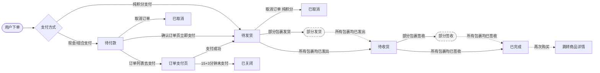
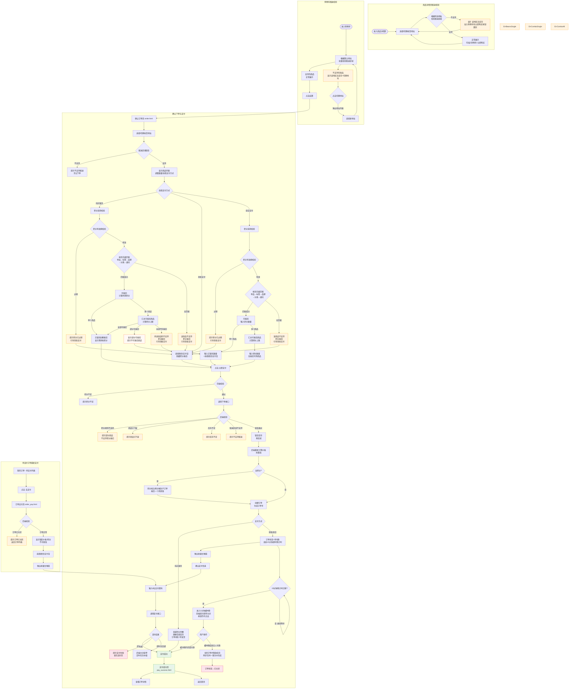
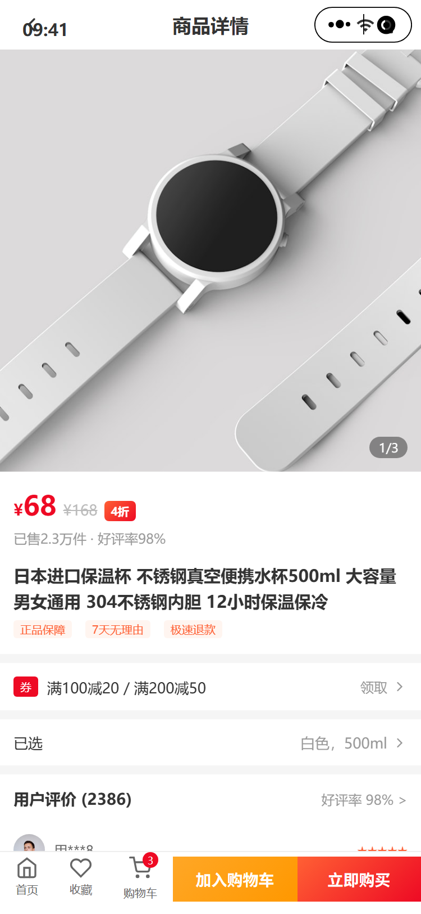
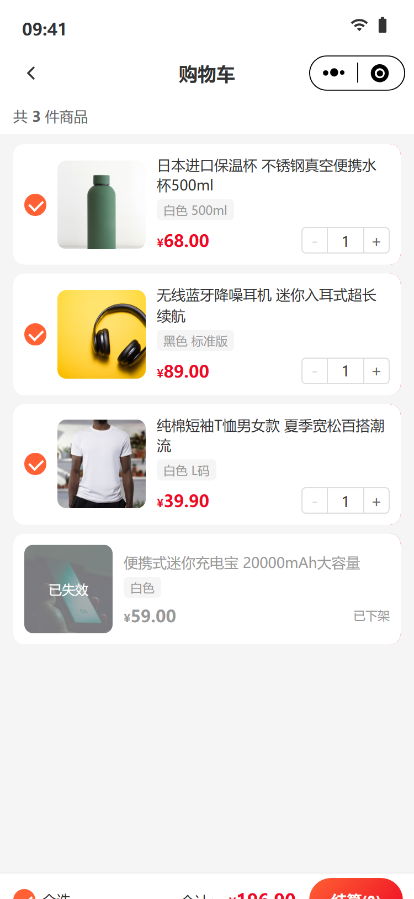
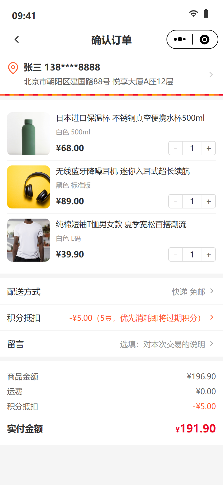
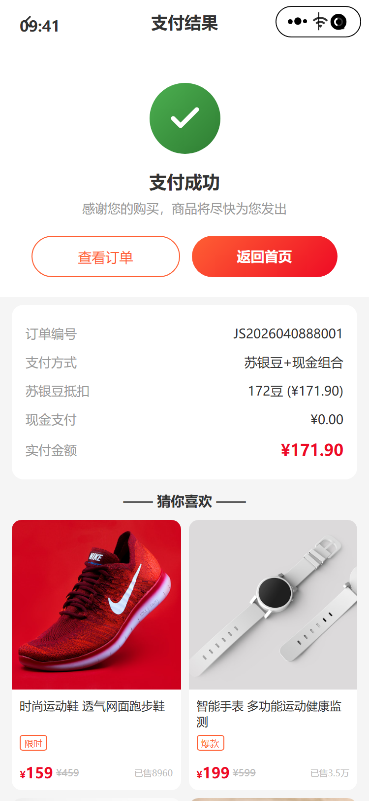
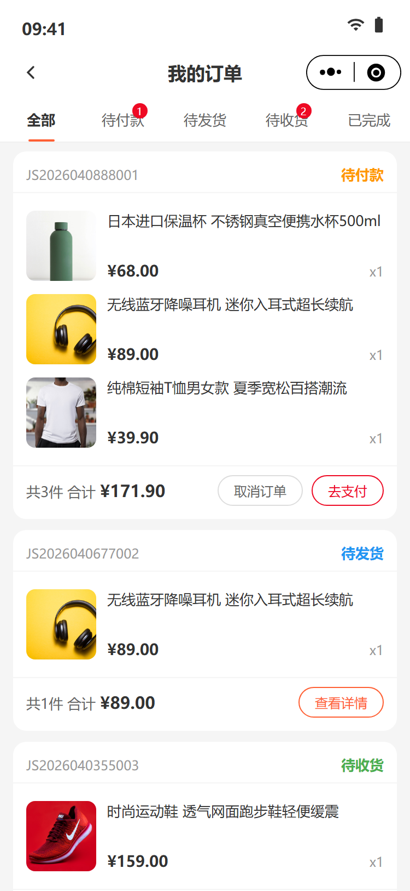
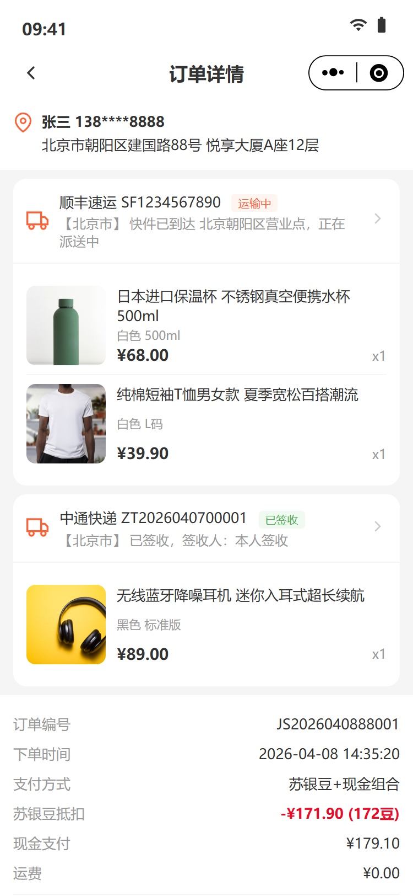
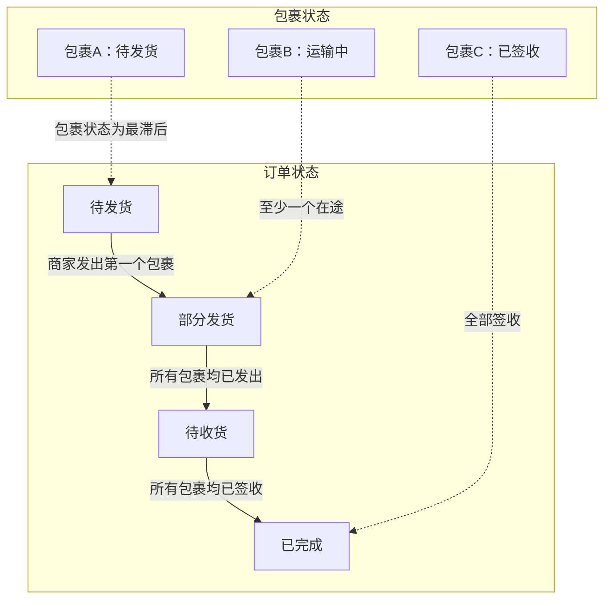
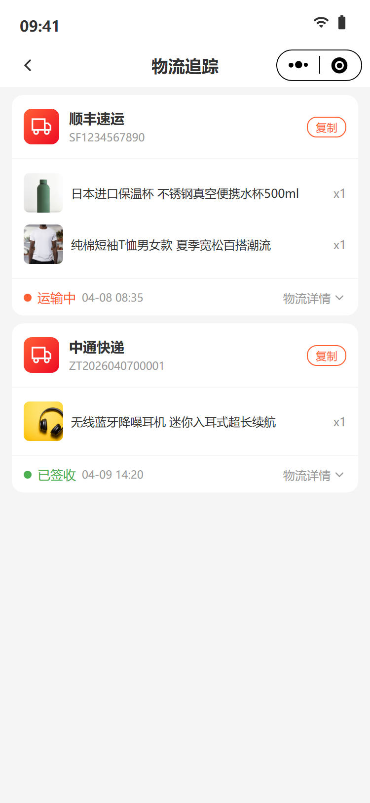

# 苏银豆商城 - 业务逻辑清单 V0.3（下单流程）

> 本文档为 V0.3 版本增量业务逻辑清单，覆盖商品详情、购物车、下单支付、订单管理共 8 个页面。
> 
> 测试前先在浏览器控制台执行 `Auth.resetAccounts()` 重置账号数据。
> 
> **商品数据来源：** 全量商品数据来源于品牌商城后台商品管理列表；组件/活动模块商品数据来源于魔方配置，组件商品数据 ≤ 全量商品数据。
> 
> **统计口径：** 销量=SKU维度已完成订单商品件数；好评率=SKU五星好评数÷全部评价数×100%；折扣=现价÷原价×10，后端计算保留一位小数（如3.9折）；积分兑换比例=默认1:1（1积分=0.01元），比例由后台积分规则配置，前端根据配置动态计算。

---

## 一、订单流转 `V0.3`

### 1.1 订单状态流转

Mermaid 源码

> **虚线框**为中间态，仅在订单详情页展示，不作为订单主状态入库：
> - **部分发货**：对应订单主状态"待发货"（存在运输中 + 存在待发货的包裹）
> - **部分签收**：对应订单主状态"待收货"（存在已签收 + 存在运输中的包裹）

| 当前状态 | 可执行操作 | 入口页面 | 目标状态 |
|----------|-----------|----------|----------|
| — | 用户下单（纯积分支付） | 确认订单（order.html） | 待发货 |
| — | 用户下单（现金/组合支付） | 确认订单（order.html） | 待付款 |
| 待付款 | 取消订单 | 订单列表 | 已取消 |
| 待付款 | 立即支付（含现金） | 确认订单 → 收银台弹窗 | 待发货 |
| 待付款 | 去支付（含现金） | 订单列表 → 订单支付页（order_pay.html） | 待发货 |
| 待付款 | 超时未支付（15分钟+3分钟缓冲期） | 系统自动 | 已关闭 |
| 待发货 | 无（等待商家发货） | — | 待收货 |
| 待发货 | 取消订单（纯积分支付） | 订单详情/订单列表 | 已取消 |
| 待收货 | 确认收货 | 订单详情 | 已完成 |
| 已完成 | 再次购买 | 订单列表 | —（跳转商品详情） |

### 1.2 下单与支付流程

Mermaid 源码

---

## 二、商品详情 `V0.3`

> 详细PRD文档见：[PRD-mini-program-V0.3](./PRD-mini-program-V0.3.md) 第二章"商品详情"

### 1.1 商品详情页（product_detail.html）

#### 1.1.1 功能用例表

| #   | 场景         | 操作                                  | 预期结果                              |
| --- | ---------- | ----------------------------------- | --------------------------------- |
| 1   | 图片轮播       | 左右滑动主图                              | 切换图片，图片指示器更新如”1/3”更新为”2/3”        |
| 2   | 打开规格弹窗     | 点击”已选规格”                            | 底部滑出规格选择弹窗                        |
| 3   | 选择规格       | 点击规格属性如颜色属性值/尺寸属性值选项                | 选中项高亮，对应的商品主图变更                   |
| 4   | 弹窗内调数量     | +/-按钮                               | 数量变化，最小为1                         |
| 5   | 加入购物车      | 弹窗中点”加入购物车”                         | 提示”已加入购物车”，弹窗关闭                   |
| 6   | 立即购买       | 弹窗中点”立即购买”                          | 跳转确认订单页                           |
| 7   | 收藏商品（单SKU） | 点击心形图标（仅一个规格时）                      | 心形变红，提示”已收藏”                      |
| 8   | 收藏商品（多SKU） | 点击心形图标（多规格时）→ 弹出规格选择器 → 选择规格 → 确认收藏 | 心形变红，提示”已收藏”                      |
| 9   | 取消收藏       | 再次点击心形                              | 心形变空心，提示”已取消收藏”                   |
| 10  | 重复收藏       | 收藏已收藏的同一SKU                         | 不新增记录，心形保持红色                      |
| 11  | 关闭规格弹窗     | 点击蒙层或关闭按钮                           | 弹窗滑出，不影响页面布局                      |
| 12  | 点击首页图标     | 点击底部首页按钮                            | 跳转首页（`home_page.html`）            |
| 13  | 点击购物车图标    | 点击底部购物车按钮                           | 跳转购物车页（`cart.html`）               |
| 14  | 查看全部评价     | 点击”查看全部评价 >”                        | 跳转商品评价列表页（`product_reviews.html`） |
| 15  | 选择收货地址     | 点击地址区域                             | 底部弹出地址选择弹窗，列出用户已保存的收货地址列表       |
| 16  | 切换收货地址     | 在弹窗中点击某个地址                        | 弹窗关闭，地址区域更新为选中地址                 |
| 17  | 新疆地址无货限制   | 选择新疆地区地址                          | 地址下方显示红色提示”该商品不支持配送至所选地址”，”加入购物车”和”立即购买”按钮置灰禁用 |
| 18  | 正常地址恢复购买   | 切换回非新疆地址                           | 提示消失，购买按钮恢复可用                    |
| 19  | 地址弹窗关闭     | 点击蒙层或关闭按钮                          | 弹窗滑出关闭                           |
| 20  | 无收货地址       | 用户无保存地址时进入页面                       | 地址区显示"请添加收货地址"+跳转链接，配送校验跳过，加入购物车和立即购买按钮可用 |
| 21  | 商品已下架（进入页面） | 进入商品详情页时商品已下架 | 展示缺省状态+提示"该商品已下架"，不展示购买操作栏 |
| 22  | 商品已下架（立即购买） | 点击"立即购买"时商品已下架 | 展示缺省状态+提示"该商品已下架"，不展示购买操作栏 |
| 23  | 商品已下架（加入购物车） | 点击"加入购物车"时商品已下架 | 展示缺省状态+提示"该商品已下架"，不展示购买操作栏 |

#### 1.1.2 关键数据来源说明

| 字段                 | 数据来源                                                                              |
| ------------------ | --------------------------------------------------------------------------------- |
| 商品图片轮播             | 品牌商城后台商品管理 — SKU主图+SKU轮播图                                                         |
| 销售价/划线价/折扣标签       | 品牌商城后台商品管理 — 销售价和划线价 折扣后端根据销售价和划线价计算，折扣=销售价÷划线价×10（保留一位小数）                  |
| 销量                 | 品牌商城后台统计 — SKU销量=已完成订单的SKU件数之和。 数量小于10000时，显示X件；数量大于等于10000件时，显示Y万件（精确到小数点后一位） |
| 好评率                | 品牌商城后台统计 — SKU好评率=（五星数+四星数）÷总评价数                                                  |
| 商品名称/规格（颜色/尺寸等）    | 品牌商城后台商品管理 — SPU名称+SKU规格属性组合                                                      |
| 评价（头像/昵称/星级/内容/日期） | 品牌商城后台商品评价模块                                                                      |
| 收藏状态（心形图标初始状态）     | 返现时需调用当前小程序用户的收藏数据                                                                |
| 购物车角标数字            | 购物车有效商品SKU的件数，一个SKU可能加购多个                                                         |
| 收货地址列表              | 品牌商城后台用户地址 — 当前用户已保存地址列表                                                            |
| 地址配送限制              | 品牌商城后台运费规则 — SKU维度的地区配送白名单/黑名单                                                       |

### 1.2 商品详情页跳转入口
以下场景均展示商品SKU卡片，用户通过以下场景进入商品详情页后，自动选择规格为上一页面的商品SKU规格。

| #   | 入口页面 | 触发条件        | 商品详情页               |
| --- | ---- | ----------- | ------------------- |
| 1   | 首页   | 点击推荐商品/活动商品 | product_detail.html |
| 2   | 搜索结果 | 点击商品卡片      | product_detail.html |
| 3   | 购物车  | 点击商品图片      | product_detail.html |
| 4   | 收藏   | 点击商品        | product_detail.html |
| 5   | 订单详情 | 点击商品图片      | product_detail.html |
| 6   | 订单列表 | 点击商品图片      | product_detail.html |
| 7   | 支付成功 | 点击推荐商品      | product_detail.html |
| 8   | 评价中心 | 点击"再次购买"    | product_detail.html |

---

## 三、购物车 `V0.3`

#### 2.1 功能用例表

| #   | 场景         | 操作              | 预期结果                                  |
| --- | ---------- | --------------- | ------------------------------------- |
| 1   | 单选/取消      | 点击商品圆形勾选框       | 勾选状态切换，底部总价和数量实时更新                    |
| 2   | 全选/取消全选    | 点击底部”全选”        | 所有有效商品勾选/取消，全选框联动                     |
| 3   | 增加数量       | 点击+按钮           | 数量+1，总价更新                             |
| 4   | 减少数量       | 点击-按钮           | 数量-1，最小为1，qty=1时-按钮置灰（`disabled`）     |
| 5   | 左滑删除（触屏）   | 向左滑动商品卡片        | 露出红色”删除”按钮，滑动距离超过按钮宽度一半时吸附            |
| 6   | 左滑删除（鼠标）   | 鼠标按住商品卡片左拖      | 同触屏效果，支持桌面端预览                         |
| 7   | 滑动互斥       | 已滑出一个删除按钮时滑动另一个 | 前一个自动复位，仅保留当前                         |
| 8   | 点击删除       | 点击露出的红色”删除”按钮   | 卡片折叠动画（高度→0、透明度→0）后移除，列表更新            |
| 9   | 已下架商品展示    | 查看含已下架商品        | 图片半透明+黑色”已失效”蒙层，名称/规格/价格变灰，无勾选框，无数量控制 |
| 10  | 已下架商品仅删除   | 左滑已下架商品→删除      | 可正常删除                                 |
| 11  | 已下架商品不计入总计 | 查看底部合计          | 总价/数量仅计算有效勾选商品                        |
| 12  | 商品件数统计     | 查看顶部商品件数        | 仅统计有效商品（排除已下架、已售罄、该地区无库存），例”共 3 件商品”             |
| 13  | 去结算        | 点击”结算(N)”       | 跳转确认订单页（`order.html`），N为勾选商品总数量       |
| 14  | 点击商品图片     | 点击商品缩略图         | 跳转商品详情页（`product_detail.html`）        |
| 15  | Tab栏购物车角标  | 查看底部Tab购物车图标    | 显示红色数字角标，值为有效商品件数                     |
| 16  | 该地区无库存商品展示 | 查看含不支持配送商品      | 图片半透明+黑色”无库存”蒙层，名称/规格/价格变灰，无勾选框，无数量控制，底部显示”该地区无库存”+”切换地址”链接 |
| 17  | 切换默认地址      | 点击”切换地址”链接       | 底部弹出地址选择弹窗，列出用户已保存地址，标注当前默认地址和可购买地址，切换后重新校验配送区域 |
| 18  | 无库存商品仅删除    | 左滑无库存商品→删除      | 可正常删除                                 |
| 19  | 无库存商品不计入总计  | 查看底部合计          | 总价/数量仅计算有效勾选商品，排除无库存商品                 |
| 20  | 无收货地址        | 用户无保存地址时进入购物车  | 跳过配送区域校验，所有商品不显示"无库存"标记；结算时若仍无地址则弹窗提示"请先添加收货地址"并跳转地址管理页 |
| 21  | 结算时商品无库存    | 点击结算（含无库存商品） | 红字提示"部分商品无库存"，刷新购物车页面数据；不区分部分无库存或全部缺货 |
| 22  | 结算时商品已下架    | 点击结算（含已下架商品） | 提示"部分商品已下架"，刷新购物车页面数据 |

#### 2.2 后端业务逻辑增强

| #   | 问题                                     | 确认结果                                                                                                                                                                                                                                                                                                              |
| --- | -------------------------------------- | ----------------------------------------------------------------------------------------------------------------------------------------------------------------------------------------------------------------------------------------------------------------------------------------------------------------- |
| 1   | 库存不足时前端提示策略？（加入购物车时提示 / 下单时提示 / 支付时提示） | 库存扣减漏斗策略： - 加购时（宽松）：不扣真实库存。彻底无货拦截并提示”已售罄”；库存紧张时静默加入，列表内灰字提示”库存紧张”。  - 点击结算时（较严格）：红字提示"部分商品无库存"，刷新购物车页面数据，不区分部分无库存或全部缺货。  - 点击支付订单时（严格）： 必须在此真实扣减库存。 部分缺货自动移除并红字提示； 超买自动回退到最大可买数量； 全部缺货弹窗阻断提交。                                                                                   |
| 2   | 库存数量口径                                 | 库存数量= 没指定供应商：SKU多个供应商填写的库存数量之和。 指定供应商：SKU供应商填写的库存数量。                                                                                                                                                                                                                                                        |
| 3   | 购物车库存计算显示策略                            | 进入购物车时批量查库存，按结果处理： - 库存充足 → 正常显示 - 库存 < 购物车数量 → 数量自动调整为库存数，商品卡片顶部加橙色提示条「库存仅剩 X 件，数量已自动调整」 - 库存 = 0 → 卡片变为「已售罄」样式（就是你刚加的那个），不可勾选、不可结算  - 点击结算时（较严格）：无库存提示XX已无库存，剔除XX商品后进入确认订单页面，全部缺货弹窗阻断进入确认订单页面。                                                                                                   |
| 4   | 用户多设备同时操作购物车的合并策略？                     | 不做合并，不存购物车本地数据，加入购物车检验登录状态。  %% 下次再做：用户在未登录状态下（设备A）加了购物车，后续登录了账号，此时需要将”本地购物车”与”云端购物车”进行合并。 - 同款商品（SKU相同）：数量相加。若叠加后超出限购或库存，则截断为最大可买数量。 - 异款商品（SKU不同）：直接追加至云端购物车。 - 数量冲突（两台设备都改了同一SKU）：不叠加，以最后修改时间的数据为准。 - 失效商品（下架/无货）：不静默丢弃，合并后移至底部、”失效商品区”，由用户手动清理。 - 价格与促销：丢弃本地缓存，强制以云端返回的最新价格和活动为准重新渲染。 %% |
| 5   | 购物车配送区域校验策略                            | 进入购物车时根据用户默认地址批量校验配送区域： - 支持配送 → 正常显示 - 不支持配送 → 卡片变为「该地区无库存」样式（图片半透明+”无库存”蒙层，名称/价格变灰），不可勾选、不可结算，显示”切换地址”链接 用户点击”切换地址”后弹出地址列表，切换默认地址后重新校验所有商品的配送区域。                                                                                                                                                       |
| 6   | 商品详情页配送区域校验策略                          | 根据用户所选地址实时校验配送区域： - 支持配送 → 正常显示，可加购/购买 - 不支持配送 → 地址下方提示”该商品不支持配送至所选地址”，”加入购物车”和”立即购买”按钮置灰禁用                                                                                                                                                                                                                 |

#### 2.3 关键数据来源说明

| 字段                | 数据来源                       |
| ----------------- | -------------------------- |
| 商品信息（图片/名称/规格/价格） | 品牌商城后台商品管理                 |
| 商品上下架状态           | 品牌商城后台商品管理 — 实时查询          |
| 配送区域支持            | 品牌商城后台运费规则 — 根据用户默认地址校验SKU维度的地区配送支持情况 |
| 用户默认收货地址          | 品牌商城后台用户地址 — 当前用户设置的默认地址   |
| 购物车商品数量           | 用户操作 — 后端购物车数据，商品件数        |
| 总价/总数量            | 基于勾选商品                     |
| Tab栏角标数字          | 购物车有效商品件数 — 全局共享，大于99显示99+ |

---

## 四、下单与支付 `V0.3`

### 4.1 确认订单（order.html）

#### 4.1.1 功能用例表

| #   | 场景          | 操作                   | 预期结果                                                                                          |
| --- | ----------- | -------------------- | ---------------------------------------------------------------------------------------------- |
| 1   | 地址展示        | 查看地址区域               | 显示默认收货地址（姓名、脱敏手机号、完整地址），底部彩色锯齿线装饰                                                              |
| 2   | 地址跳转        | 点击地址区域               | 跳转收货地址列表（`address.html`）                                                                       |
| 3   | 商品数量调整      | 点击+/-按钮              | 数量变化，qty=1时-按钮置灰                                                                               |
| 4   | 价格自动计算      | 调整数量                  | 商品金额、苏银豆抵扣、现金支付、实付金额同步重算                                                                       |
| 5   | 支付方式选择      | 点击苏银豆/现金/组合三选一       | 选中项 radio 高亮，其他取消；价格汇总区、底部按钮文案联动变化                                                             |
| 6   | 苏银豆支付模式     | 选择"苏银豆支付"            | 隐藏支付渠道选择和组合输入区；价格汇总显示苏银豆抵扣全额；底部按钮"立即支付（全部苏银豆）"                                                 |
| 7   | 现金支付模式      | 选择"现金支付"             | 展开微信/支付宝渠道选择（默认微信），隐藏组合输入区；价格汇总无苏银豆抵扣行；底部按钮"立即支付 ¥XX.XX"                                       |
| 8   | 苏银豆+现金组合模式  | 选择"苏银豆+现金组合"         | 展开渠道选择 + 苏银豆数量输入框；价格汇总显示苏银豆抵扣 + 现金支付；底部按钮"立即支付 ¥XX.XX"                                         |
| 9   | 组合支付输入苏银豆数量 | 输入框输入数值              | 输入值不超过 `MIN(用户余额, 订单商品金额)`，超出时红字提示并自动截断；价格汇总实时更新                                               |
| 10  | 组合支付"全部"按钮 | 点击"全部"               | 自动填入最大可用苏银豆数量 `MIN(用户余额, 订单商品金额)`                                                              |
| 11  | 支付渠道选择      | 点击微信/支付宝             | 选中项 radio 高亮，仅在选择现金或组合支付时展示                                                                     |
| 12  | 配送方式        | 查看配送方式行              | 默认显示"快递 免邮"                                                                                     |
| 13  | 备注          | 输入备注内容               | textarea，placeholder="选填，对本次交易的说明"，最大200字符，实时显示"N/200"计数器                                      |
| 14  | 价格明细（苏银豆）   | 苏银豆支付模式查看价格汇总区       | 逐行展示：商品金额、运费、苏银豆抵扣（-¥XX.XX（XX苏银豆））、实付金额 ¥XX.XX                                                  |
| 15  | 价格明细（现金）    | 现金支付模式查看价格汇总区        | 逐行展示：商品金额、运费、实付金额 ¥XX.XX                                                                       |
| 16  | 价格明细（组合）    | 组合支付模式查看价格汇总区        | 逐行展示：商品金额、运费、苏银豆抵扣（-¥XX.XX）、现金支付（¥XX.XX）、实付金额 ¥XX.XX                                            |
| 17  | 底部合计联动      | 调整数量或切换支付方式后         | 底部栏合计金额与价格汇总区同步：纯苏银豆显示"¥0.00"，现金/组合显示实际需支付的现金金额                                                 |
| 18  | 提交订单（纯苏银豆）  | 选择苏银豆支付→点击"立即支付（全部苏银豆）" | 订单创建即完成支付，不经过"待付款"状态，直接到"待发货"，跳转支付成功页（`pay_success.html`）                                       |
| 19  | 提交订单（含现金）   | 选择现金/组合支付→点击"立即支付"   | 底部弹出收银台弹窗，显示现金支付金额、支付渠道、苏银豆抵扣信息（组合时）                                                          |
| 20  | 收银台弹窗       | 查看收银台弹窗              | 显示：支付金额（大字）、支付渠道图标+名称（微信/支付宝，根据确认订单页选择）、苏银豆抵扣信息（组合模式时橙色面板）、"确认支付"按钮（微信绿色） |
| 21  | 收银台关闭       | 点击关闭按钮或蒙层            | 弹窗关闭，留在确认订单页                                                                                 |
| 22  | 收银台确认支付     | 点击"确认支付"             | 弹窗切换到密码输入步骤，显示支付渠道名称+支付金额+6位密码输入框                                                            |
| 23  | 支付密码输入      | 在密码框输入数字             | 每输入一位显示一个黑点（共6格），仅允许输入数字                                                                     |
| 24  | 密码输满自动提交    | 输入第6位密码               | 自动跳转支付成功页（`pay_success.html`）                                                                |
| 25  | 密码步骤返回      | 点击左上角返回箭头            | 回到收银台确认信息步骤，已输入的密码清空                                                                         |
| 26  | 无收货地址        | 用户无保存地址时进入确认订单页       | 地址区显示"请添加收货地址"+跳转链接，提交按钮置灰禁用                                                               |
| 27  | 纯苏银豆余额不足     | 选择纯苏银豆支付但余额 < 订单金额对应积分 | 纯积分选项旁红字提示"积分余额不足"；若强制点击提交，Toast提示"积分余额不足，请选择其他支付方式"                                    |
| 28  | 支付密码错误       | 输入错误密码输满6位              | 弹窗提示"支付密码错误，请重新输入"并清空密码，不限制重试次数                                                             |
| 29  | 支付网络超时       | 支付过程中网络异常              | 提示"网络异常，请重试"，订单状态不变                                                                       |
| 30  | 提交时商品已下架      | 点击"立即支付"时部分商品已下架 | 提示"部分商品已下架"，刷新确认订单页数据 |
| 31  | 提交时商品库存不足    | 点击"立即支付"时部分商品库存不足 | 提示"部分商品库存不足"，刷新确认订单页数据 |

#### 4.1.2 后端业务逻辑增强

| #   | 问题                         | 确认结果                                                               |
| --- | -------------------------- | ------------------------------------------------------------------ |
| 1   | 未支付订单多久自动取消？               | 仅适用于现金/组合支付的待付款订单（纯积分支付下单即完成，无待付款阶段）。前端倒计时15分钟。倒计时归零后进入3分钟缓冲期，前端提示”订单即将关闭，请尽快完成支付”，按钮仍可点击，此时后端订单仍然有效，保护用户正在付款但钱还没到账的情况。缓冲期结束后才真正关闭订单。                                             |
| 2   | 订单关闭后库存释放时机？               | 订单关闭（含缓冲期）后释放库存。取消订单和库存回滚同时完成，防止出现库存放了但订单没取消（或反过来）的不一致情况。                                         |
| 3   | 下单时锁定库存还是支付成功后扣减？          | 按支付方式区分： - 纯积分支付：下单时直接扣减库存和积分，无待付款阶段 - 现金/组合支付：下单时锁定库存（预扣减），支付成功后真实扣减，超时未支付则释放锁定                                   |
| 4   | 前端展示价格是否作为最终结算依据？后端是否重新计算？ | 否。前端价格仅做展示，后端必须以数据库实时价格和活动规则重新计算，防篡改。                              |
| 5   | 积分抵扣金额由前端传入还是后端根据规则计算？     | 后端计算。前端仅传”拟使用积分数量”，后端校验余额、计算实际抵扣金额并落库。                             |
| 6   | 订单号生成规则？（如 JS + 日期 + 自增序号） | 业务标识（渠道）+ 时间戳（精确到毫秒/秒）+ 序列号（推荐雪花算法或 Redis 自增）。                     |
| 8   | 重复点击”提交订单”防重策略？            | 需要，开发同事自行决定技术实现方式。           |
| 10  | 并发下单时库存超卖的防护策略？            | 需要，开发同事自行决定技术实现方式。 |
| 12  | 返还的积分是否恢复原有过期时间？还是延长有效期？   | 恢复原过期时间。若原积分已过期则直接作废（不延长），符合财务合规与逻辑简洁性。                            |
| 13  | 返还的积分已过期时，提醒用户             | 提示词：该笔订单积分已过期，取消订单后返还的积分将不可用，建议联系客服处理。是否确认取消？                      |
| 14  | 组合支付苏银豆输入规则                | 用户输入的苏银豆数量不超过 `MIN(用户余额, 订单商品金额)`。超出时红字提示具体原因（”不能超过可用余额”或”不能超过订单金额”）并自动截断。 |
| 15  | 支付渠道选择时机                   | 仅在选择”现金支付”或”苏银豆+现金组合”时展示微信/支付宝渠道选择；纯苏银豆支付时隐藏。默认微信支付。             |
| 16  | 重复点击”确认支付”防重策略？            | 需要，开发同事自行决定技术实现方式。        |
| 17  | 支付回调超时/失败时的补偿机制？           | 主动查单机制。后端定时任务针对”支付中”状态的订单，主动调用支付平台查询接口，若已成功则手动触发状态更新和业务流转。      |
| 18  | 下单时需校验哪些前置条件？               | 商品上下架状态、库存充足性、配送区域支持、积分适用规则；任一条件不满足则拦截下单并返回具体原因。 |
| 19  | 积分适用校验优先级规则？               | **校验顺序：** 1. **优先校验积分有效期** — 过期则直接拦截，提示”积分已过期” 2. **按积分消费支持类型优先级依次匹配：**    - 单品配置（优先级最高）— SKU维度精确匹配    - 标签配置 — 商品标签匹配    - 品牌配置 — 商品品牌匹配    - 分类配置 — 商品分类匹配    - 通兑配置（优先级最低）— 通用可抵扣，兜底规则  **匹配结果：** - 单个商品：按优先级匹配到任一配置即可抵扣 - 多个商品：汇总所有可抵扣商品，计算积分上限 - 全部不可抵扣：提示引导现金支付 |
| 20  | 多商品时积分如何分摊到子订单？           | 按商品金额比例分摊。最后一个商品用总积分减去前面已分配值，避免小数累积误差。 |
| 21  | 积分抵扣计算口径？                   | 仅对可抵扣商品计算积分上限。不可抵扣商品必须使用现金支付，不参与积分分摊。 |
| 22  | 积分分摊精度规则？                   | 按商品金额比例分摊，每项保留2位小数（向下取整），最后一个商品用差值避免小数累积误差。 |
| 23  | 组合支付部分成功时积分如何处理？            | 后端保证积分扣减和现金支付在同一事务中，任一失败则整体回滚；积分不单独锁定，仅在支付确认时一次性扣减。 |
| 24  | 纯积分支付但积分余额不足？              | 切换支付方式为组合支付或现金支付，纯积分选项旁红字提示"积分余额不足"；若用户强制提交，Toast提示"积分余额不足，请选择其他支付方式"。 |

#### 4.1.3 关键数据来源说明

| 字段                 | 数据来源                             |
| ------------------ | -------------------------------- |
| 默认收货地址             | 收货地址页面（address.html） — 用户设置的默认地址 |
| 商品信息（图/名/规格/价格/数量） | 贇物车页面传入 / 立即购买页面传入               |
| 支付方式（苏银豆/现金/组合）    | 用户选择                             |
| 支付渠道（微信/支付宝）       | 用户选择（仅现金/组合模式时展示）                |
| 组合支付苏银豆数量          | 用户输入（不超过余额和订单金额）                 |
| 苏银豆可用余额            | 品牌商城后台积分系统 — 用户当前可用积分数           |
| 运费                 | 品牌商城后台运费规则                       |
| 配送方式               | 品牌商城后台配置 — 默认”快递 免邮”             |
| 商品金额/实付金额          | 后端重新计算                           |

### 4.2 支付成功（pay_success.html）

#### 4.2.1 功能用例表

| #   | 场景     | 操作       | 预期结果                               |
| --- | ------ | -------- | ---------------------------------- |
| 1   | 成功动画   | 支付完成进入页面 | 绿色勾选图标缩放动画（scaleIn：0→1.1→1，0.4s）   |
| 2   | 成功提示文案 | 查看成功区域   | 显示"支付成功"+"感谢您的购买，商品将尽快为您发出"        |
| 3   | 订单信息卡  | 查看订单信息   | 显示：订单编号、支付方式、苏银豆抵扣、现金支付、实付金额       |
| 4   | 查看订单   | 点击"查看订单" | 跳转订单详情（`order_detail.html`），橙色描边按钮 |
| 5   | 返回首页   | 点击"返回首页" | 跳转首页（`home_page.html`），红色实心按钮      |
| 6   | 猜你喜欢   | 查看底部推荐   | 显示4个推荐商品，带标签（限时/爆款/特惠/热卖），点击跳转商品详情 |

#### 4.2.2 关键数据来源说明

| 字段                      | 数据来源              |
| ----------------------- | ----------------- |
| 订单编号                    | 品牌商城后台订单系统        |
| 支付方式/苏银豆抵扣/现金支付/实付金额    | 品牌商城后台订单系统 — 支付结果 |
| 猜你喜欢推荐商品                | 品牌商城后台推荐系统 / 魔方配置 |

---

## 五、订单管理 `V0.3`

### 5.1 订单列表（order_list.html）

#### 5.1.1 功能用例表

| # | 场景 | 操作 | 预期结果 |
|---|---|---|---|
| 1 | Tab筛选 | 点击全部/待付款/待发货/待收货/已完成 | 列表按状态过滤，选中Tab底部显示橙色下划线 |
| 2 | Tab角标 | 查看待付款/待收货Tab | 显示红色数字角标（如待付款"1"、待收货"2"） |
| 3 | 订单卡片展示 | 查看订单列表 | 每张卡片含：订单号、状态标签（彩色）、商品图+名称+价格+数量、合计金额、操作按钮 |
| 4 | 状态颜色 | 不同状态订单 | 待付款=橙色（`#ff9800`）、待发货=蓝色（`#2196f3`）、待收货=绿色（`#4caf50`）、已完成/已取消/已关闭=灰色（`#999`） |
| 5 | 待付款操作 | 查看待付款订单 | 显示"取消订单"（灰色）+"去支付"（红色） |
| 6 | 待发货操作 | 查看待发货订单 | 显示"取消订单"（灰色，纯积分支付订单）+"查看详情"（灰色） |
| 7 | 待收货操作 | 查看待收货订单 | 显示"查看物流"（灰色）+"确认收货"（橙色） |
| 8 | 已完成操作 | 查看已完成订单 | 显示"再次购买"（灰色）+"评价"（橙色） |
| 8.5 | 已取消/已关闭操作 | 查看已取消或已关闭订单 | 仅显示"查看详情"（灰色），已取消和已关闭订单仅在"全部"Tab中展示 |
| 9 | 点击商品区 | 点击订单卡片商品区域 | 跳转订单详情（`order_detail.html`） |
| 10 | 点击商品图片 | 点击商品缩略图 | 跳转商品详情（`product_detail.html`） |
| 11 | 去支付跳转 | 点击"去支付"按钮 | 跳转订单支付页（`order_pay.html`） |
| 12 | 取消订单跳转 | 点击"取消订单"按钮 | 跳转取消订单页（`order_cancel.html`） |
| 13 | 查看物流跳转 | 点击"查看物流"按钮 | 跳转物流追踪（`logistics.html`） |
| 14 | 空状态 | 切换到无订单的Tab | 显示空状态图标+"暂无相关订单"+"去逛逛"按钮（跳转首页） |
| 15 | 合计金额（纯苏银豆） | 查看纯苏银豆支付订单 | 合计显示"XX苏银豆" |
| 16 | 合计金额（组合支付） | 查看苏银豆+现金组合支付订单 | 合计显示"XX苏银豆+¥XX.XX" |
| 17 | 合计金额（纯现金） | 查看纯现金支付订单 | 合计显示"¥XX.XX" |
| 18 | 确认收货二次确认 | 点击"确认收货"按钮 | 弹出确认弹窗，标题"确认收货？"，描述"确认后订单将标记为已完成"，双按钮"再想想/确认收货" |
| 19 | 再次购买（商品已下架） | 点击"再次购买"但商品已下架 | 商品详情页展示缺省状态+提示"该商品已下架"，不展示购买操作栏 |
| 20 | 订单排序规则 | 查看订单列表 | 按下单时间倒序排列，待付款订单置顶显示 |

#### 5.1.2 后端业务逻辑增强

| #   | 问题                    | 确认结果                                                                      |
| --- | --------------------- | ------------------------------------------------------------------------- |
| 1   | 待收货状态多久自动确认收货？        | 签收时间15天后自动确认。用户手动确认收货优先于自动确认，用户可在15天内主动点击确认收货立即流转为已完成。                                                                  |
| 2   | 自动取消与用户手动取消的退款流程是否一致？ | 不一致。未支付时两者均直接作废，无退款流程；已支付时，用户手动取消需走退款申请/审批流程，系统自动取消（如风控/超时拦截）通常走免审自动原路退款。 |
| 3   | 订单列表排序规则？              | 按下单时间倒序排列，待付款订单置顶显示。 |

#### 5.1.3 关键数据来源说明

| 字段              | 数据来源                    |
| --------------- | ----------------------- |
| 订单列表            | 品牌商城后台订单系统 — 按用户ID+状态查询 |
| 订单号/状态/下单时间     | 品牌商城后台订单系统              |
| 商品信息（图/名/价格/数量） | 品牌商城后台订单系统 — 关联商品数据     |
| 合计金额            | 品牌商城后台订单系统  实付积分 + 实付金额 |
| 支付方式（苏银豆/现金/组合） | 品牌商城后台订单系统 — 订单支付方式       |
| Tab角标数量         | 品牌商城后台订单系统 — 各状态计数      |

### 5.2 订单支付（order_pay.html）

> 从订单列表"去支付"按钮进入，用于待支付订单完成现金支付。商品、数量、积分额均已锁定，不可修改。

#### 5.2.1 功能用例表

| #   | 场景          | 操作              | 预期结果                                                                        |
| --- | ----------- | --------------- | -------------------------------------------------------------------------- |
| 1   | 订单信息展示      | 进入页面            | 顶部显示订单编号、下单时间、支付倒计时                                                        |
| 2   | 支付倒计时       | 等待              | 前15分钟正常倒计时；归零后进入3分钟缓冲期，提示"订单即将关闭，请尽快完成支付"，按钮仍可点击；缓冲期结束后显示"订单已关闭"，按钮置灰禁用                                      |
| 3   | 收货地址展示      | 查看地址区域          | 只读展示收货人、手机号、完整地址，底部彩色锯齿线装饰，不可点击编辑                                           |
| 4   | 商品列表展示      | 查看商品区域          | 只读展示商品图、名称、规格、价格，数量以"xN"文本显示，不可调整                                           |
| 5   | 支付信息展示      | 查看支付信息区域        | 锁定显示苏银豆抵扣金额和现金支付金额，不可修改积分数量                                                |
| 6   | 支付渠道选择      | 点击微信/支付宝        | 选中项 radio 高亮，影响底部需支付金额显示渠道图标                                               |
| 7   | 价格汇总        | 查看价格汇总区         | 逐行展示：商品金额、运费、苏银豆抵扣（-¥XX.XX）、现金支付（¥XX.XX）、实付金额 ¥XX.XX                       |
| 8   | 底部合计        | 查看底部栏           | 显示"需支付：¥XX.XX"（现金部分）+"立即支付"按钮                                             |
| 9   | 提交支付        | 点击"立即支付"        | 弹出收银台弹窗，显示现金支付金额、支付渠道图标+名称、苏银豆抵扣信息（组合时）、"确认支付"按钮                           |
| 10  | 收银台确认支付     | 点击"确认支付"        | 弹窗切换到密码输入步骤，显示支付渠道名称+支付金额+6位密码输入框                                          |
| 11  | 支付密码输入      | 在密码框输入数字        | 每输入一位显示一个黑点（共6格），仅允许输入数字                                                   |
| 12  | 密码输满自动提交    | 输入第6位密码         | 自动跳转支付成功页（`pay_success.html`）                                              |
| 13  | 密码步骤返回      | 点击左上角返回箭头       | 回到收银台确认信息步骤，已输入的密码清空                                                       |
| 14  | 收银台关闭       | 点击关闭按钮或蒙层       | 弹窗关闭，留在订单支付页                                                              |
| 15  | 订单已取消时进入    | 从订单列表进入已超时取消的订单 | 后端返回订单已取消，提示"订单已取消"并返回订单列表                                                 |

#### 5.2.2 后端业务逻辑增强

| #   | 问题                             | 确认结果                                                                |
| --- | ------------------------------ | ------------------------------------------------------------------- |
| 1   | 进入页面时订单已被关闭怎么处理？               | 后端校验订单状态，若已关闭（含缓冲期结束）或已支付则提示并返回订单列表，防止重复支付                                    |
| 2   | 倒计时归零后用户还在付款怎么办？              | 前后端都有3分钟缓冲期保护。前端归零后提示"即将关闭"但按钮仍可用；后端在缓冲期内订单仍然有效，用户付款可以正常成功。缓冲期结束后才真正关闭订单并释放库存                                               |
| 3   | 与确认订单页（order.html）的区别？          | 订单支付页为已创建订单的后续支付页面：商品/数量/积分不可修改，仅完成现金支付环节；确认订单页为首次下单，可编辑商品、选择支付方式、调整积分 |

#### 5.2.3 关键数据来源说明

| 字段              | 数据来源                                      |
| --------------- | ----------------------------------------- |
| 订单编号/下单时间       | 品牌商城后台订单系统 — 待支付订单信息                      |
| 支付倒计时           | 前端根据订单创建时间 + 15分钟超时计算                      |
| 收货地址            | 品牌商城后台订单系统 — 下单时锁定的地址快照                   |
| 商品信息（图/名/规格/价格/数量） | 品牌商城后台订单系统 — 下单时锁定的商品快照                   |
| 苏银豆抵扣金额         | 品牌商城后台订单系统 — 下单时确定的积分分摊结果                 |
| 现金支付金额          | 品牌商城后台订单系统 — 商品金额 - 苏银豆抵扣                 |
| 支付渠道（微信/支付宝）    | 用户选择                                       |

### 5.3 订单详情（order_detail.html）

#### 5.3.1 功能用例表

| #   | 场景     | 操作        | 预期结果                                           |
| --- | ------ | --------- | ---------------------------------------------- |
| 1   | 收货地址展示 | 查看地址区域    | 显示收件人姓名+脱敏手机号、完整收货地址                           |
| 2   | 多包裹展示  | 查看含多包裹订单  | 每个包裹独立卡片，各有物流快捷入口和商品列表                         |
| 3   | 物流快捷入口 | 查看包裹卡片物流行 | 显示承运商+运单号+状态标签+最新物流动态，点击跳转物流追踪                 |
| 4   | 物流状态标签 | 查看包裹状态    | "运输中"=橙色标签（`shipping`），"已签收"=绿色标签（`delivered`） |
| 5   | 订单信息   | 查看订单信息区   | 逐行展示：订单编号、下单时间、支付时间、支付方式、苏银豆抵扣、现金支付、运费、实付金额 |
| 6   | 备注信息   | 查看备注行     | 显示用户下单时填写的备注内容，无备注时不展示该行                          |
| 7   | 取消订单   | 点击"取消订单"  | 跳转取消订单页（`order_cancel.html`），灰色按钮。部分发货状态下隐藏取消订单按钮              |
| 8   | 查看物流   | 点击"查看物流"  | 跳转物流追踪（`logistics.html`），橙色按钮                  |
| 9   | 确认收货   | 点击"确认收货"  | 弹出二次确认弹窗"确认收货？"+描述"确认后订单将标记为已完成"，确认后标记收货，红色按钮                               |

#### 5.3.2 后端业务逻辑增强

| #   | 问题                          | 确认结果                                |
| --- | --------------------------- | ----------------------------------- |
| 1   | 一个订单拆多包裹的规则？（按仓库/按商家/按商品类型） | 供应链侧按商品维度拆单（每个商品一个子订单），前端按物流单号聚合显示，同一个订单中不同SKU聚合显示成一个物流包裹卡片 |
| 2   | 部分发货状态下是否允许取消订单？ | 不允许。部分发货状态下隐藏取消订单按钮，需等待所有包裹发货完成或联系客服处理。 |

#### 5.3.3 关键数据来源说明

| 字段                | 数据来源                    |
| ----------------- | ----------------------- |
| 收货地址（姓名/手机/地址）    | 品牌商城后台订单系统 — 下单时快照      |
| 包裹信息（承运商/运单号/状态）  | 品牌商城后台订单系统              |
| 包裹内商品列表           | 品牌商城后台订单系统 — 包裹拆分后的商品映射 |
| 订单信息（编号/时间/支付/金额） | 品牌商城后台订单系统              |

#### 5.3.4 订单状态与包裹物流状态映射

一单订单可拆为多个包裹，订单整体状态由**所有包裹的物流状态取最滞后值**推导而来。

| 订单状态 | 包裹状态条件        | 订单详情页展示                                       |
| ---- | ------------- | --------------------------------------------- |
| 待发货  | 所有包裹 = 待发货    | 每个包裹卡片显示"待发货"橙色标签                             |
| 部分发货 | 存在运输中 + 存在待发货 | 订单顶部显示"部分发货"蓝色标签；已发出包裹显示"运输中"，未发出包裹显示"待发货"    |
| 待收货  | 所有包裹 = 运输中    | 每个包裹卡片显示"运输中"橙色标签                             |
| 部分签收 | 存在已签收 + 存在运输中 | 订单顶部显示"部分签收"绿色标签；已签收包裹显示"已签收"绿色标签，在途包裹显示"运输中" |
| 已完成  | 所有包裹 = 已签收    | 每个包裹卡片显示"已签收"绿色标签，订单状态流转为"已完成"                |

**映射规则：**

1. 订单状态 = `MIN(所有包裹状态)`，优先级：待发货 < 运输中 < 已签收
2. 只要有一个包裹未签收，订单就不会自动流转到"已完成"
3. "部分发货"和"部分签收"为中间态，仅在订单详情页展示，不作为订单主状态入库
4. 用户确认收货操作针对整个订单，不依赖物流签收状态，用户手动确认优先于自动确认（15天后自动）
5. 部分发货状态下不允许取消订单，需等待所有包裹发货完成或联系客服处理

### 5.4 物流追踪（logistics.html）

#### 5.4.1 功能用例表

| #   | 场景     | 操作       | 预期结果                                 |
| --- | ------ | -------- | ------------------------------------ |
| 1   | 多包裹展示  | 查看物流页面   | 每个包裹独立卡片，包含承运商信息、商品、状态、时间线           |
| 2   | 承运商信息  | 查看包裹卡片头部 | 显示承运商图标+名称、运单号、"复制"按钮                |
| 3   | 复制运单号  | 点击"复制"按钮 | 提示"已复制单号"                            |
| 4   | 包裹内商品  | 查看包裹商品区  | 显示商品缩略图+名称+数量                        |
| 5   | 包裹状态   | 查看包裹状态栏  | 状态圆点+状态文字（运输中=橙色/已签收=绿色/待发货=橙色）+更新时间 |
| 6   | 物流详情折叠 | 默认状态     | 时间线区域折叠隐藏，显示"物流详情"+向下箭头              |
| 7   | 展开物流详情 | 点击包裹状态栏  | 时间线展开，箭头旋转180度                       |
| 8   | 收起物流详情 | 再次点击     | 时间线收起，箭头恢复                           |
| 9   | 时间线展示  | 展开物流详情   | 纵向时间线，每条含物流描述+时间，最新一条橙色高亮+光晕效果       |
| 10  | 时间线圆点  | 查看时间线条目  | 最新条目=橙色圆点+阴影光晕，历史条目=灰色圆点             |

#### 5.4.2 关键数据来源说明

| 字段 | 数据来源 |
|------|----------|
| 承运商图标/名称 | 品牌商城后台物流系统 |
| 运单号 | 品牌商城后台物流系统 |
| 包裹内商品（缩略图/名称/数量） | 品牌商城后台订单系统 — 包裹关联商品 |
| 物流时间线（描述/时间） | 品牌商城后台物流系统 — 物流轨迹推送 |
| 包裹状态/更新时间 | 品牌商城后台物流系统 |

---

## 六、页面导航 `V0.3`

### 6.1 跳转关系

| # | 页面A | 触发条件 | 页面B |
|---|-------|----------|-------|
| 1 | 购物车 | 点击"结算" | 确认订单 |
| 2 | 购物车 | 点击商品图片 | 商品详情 |
| 3 | 确认订单 | 点击地址区域 | 收货地址 |
| 4 | 确认订单 | 点击"立即支付"（纯苏银豆） | 支付成功 |
| 5 | 确认订单 | 点击"立即支付"（含现金）→ 收银台弹窗 → 确认支付 | 支付成功 |
| 6 | 支付成功 | 点击"查看订单" | 订单详情 |
| 7 | 支付成功 | 点击"返回首页" | 首页 |
| 8 | 支付成功 | 点击推荐商品 | 商品详情 |
| 9 | 订单列表 | 点击商品区域 | 订单详情 |
| 10 | 订单列表 | 点击"去支付" | 订单支付 |
| 11 | 订单列表 | 点击"取消订单" | 取消订单 |
| 12 | 订单列表 | 点击"查看物流" | 物流追踪 |
| 13 | 订单详情 | 点击物流区 | 物流追踪 |
| 14 | 订单详情 | 点击"取消订单" | 取消订单 |
| 15 | 订单详情 | 点击"查看物流" | 物流追踪 |
| 16 | 商品详情 | 点击"查看全部评价" | 商品评价列表（`V1.1`） |
| 17 | 订单支付 | 点击"立即支付" → 收银台弹窗 → 确认支付 | 支付成功 |
| 18 | 订单支付 | 订单已取消时进入 | 订单列表 |

### 6.2 返回导航

所有子页面返回按钮统一使用 `history.back()` 返回来源页面。

### 6.3 登录拦截

受保护页面加载时通过 `auth-guard.js` 检查登录状态：

| 类型    | 页面                                          |
| ----- | ------------------------------------------- |
| 受保护页面 | 确认订单、订单支付、我的订单、订单详情、购物车、支付成功、物流追踪 |
