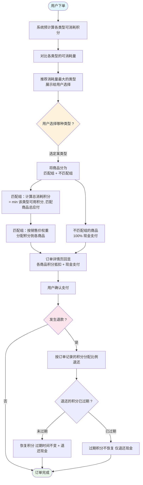

# 积分支付分配方案 V0.3

## 核心规则

1. **单类型限制**：一个订单只能使用一种限制类型的积分（指定商品积分、特殊商品积分、品牌商品积分、分类商品积分、通兑商品积分，五选一）。
2. **最大化消耗**：下单时系统自动计算哪种类型的积分能消耗最多，优先使用。计算按**批次维度**：同一类型下每个批次独立匹配商品、独立计算可消耗量，类型总可消耗量 = 各批次可消耗量之和。同一类型下有多个批次时，先按适用商品范围升序（窄范围优先），再按过期时间升序排列消耗。
3. **权重回显**：订单详情页按商品销售价权重比例分配积分到各商品。

## 一、单类型限制

### 规则

用户下单时，从所有限制类型中**只选一种**参与抵扣。选定后，该类型下的所有积分批次均可使用，其他类型的积分不参与。同一类型下有多个批次时，**按过期时间升序排列，优先消耗快过期的批次**。

| 类型     | 说明                    |
| ------ | --------------------- |
| 指定商品积分 | 仅抵扣指定SKU的商品           |
| 特殊商品积分 | 仅抵扣特殊标记的商品（如促销品、限定款等） |
| 品牌商品积分 | 仅抵扣指定品牌的商品            |
| 分类商品积分 | 仅抵扣指定分类下的商品           |
| 通兑商品积分 | 抵扣任意商品                |

### 示例

用户持有：

- 指定商品积分（SKU001）：批次P1 3000积分（过期2026-05-10）、批次P2 2000积分（过期2026-08-01）
- 分类商品积分（食品饮料）：8000积分
- 通兑商品积分：12000积分

订单包含商品A（SKU001，食品饮料，¥100）。

用户只能选一种类型：选指定商品积分则用5000抵扣，选分类商品积分则用8000抵扣，选通兑则最多用10000抵扣。

若用户选了指定商品积分，则按过期顺序消耗：先用P1（3000积分），再用P2（2000积分）。

## 二、最大化消耗

### 规则

系统预计算每种类型的积分**实际可消耗数量**，选择消耗最多的一种类型推荐给用户。不匹配所选类型的商品，不参与积分分配，全部现金支付。

**批次级计算**：同一类型下可能有多个批次，每个批次的适用范围不同（如品牌商品积分下，批次A仅匹配品牌X，批次B仅匹配品牌Y）。计算步骤：

1. 对每个批次，找出该批次能匹配到的订单商品，计算可消耗积分 = min(批次余额, 匹配商品剩余应付 × 100)
2. 按批次消耗顺序扣减商品的剩余应付，确保不超额
3. 类型总可消耗量 = 所有批次可消耗量之和
4. 取总可消耗量最大的类型推荐

**批次消耗顺序**（用于实际扣减和计算）：

- **第一优先级**：适用商品范围升序（匹配商品越少的批次越优先，避免窄范围积分被挤占）
- **第二优先级**：过期时间升序（快过期的优先）

### 示例1：不同类型对比（每类型仅一个批次）

订单包含：

- 商品A：SKU001，食品饮料，农夫山泉，¥100
- 商品B：SKU002，食品饮料，可口可乐，¥80
- 商品C：SKU003，服装，Nike，¥200

用户持有：

- 指定商品积分（SKU001）：5000积分 → 仅匹配A，最多消耗 min(5000, 10000) = 5000
- 分类商品积分（食品饮料）：8000积分 → 匹配A+B，最多消耗 min(8000, 18000) = 8000
- 通兑商品积分：12000积分 → 匹配A+B+C，最多消耗 min(12000, 38000) = 12000

系统推荐：**通兑商品积分（可消耗12000积分）** > 分类商品积分（8000） > 指定商品积分（5000）。

假设用户选择了**分类商品积分（食品饮料）**：积分只匹配A和B，商品C不匹配，100%现金支付。

### 示例2：同一类型多批次（不同品牌）

用户持有品牌商品积分：

- 批次A：匹配品牌"农夫山泉"，2000积分（过期2026-06-01）
- 批次B：匹配品牌"Nike"，3000积分（过期2026-07-15）

订单包含：

- 商品A：农夫山泉，¥100
- 商品B：可口可乐，¥80
- 商品C：Nike，¥200

逐批次计算：

| 批次 | 匹配商品 | 批次余额 | 匹配商品应付 | 可消耗 |
| ---- | ------- | ------- | ---------- | ----- |
| A | A | 2000 | ¥100（10000分） | min(2000, 10000) = 2000 |
| B | C | 3000 | ¥200（20000分） | min(3000, 20000) = 3000 |

品牌商品积分总可消耗 = 2000 + 3000 = **5000**

若与其他类型对比后用户选择了品牌商品积分：

- 批次A（2000）抵扣商品A，剩余 ¥80 现金支付
- 批次B（3000）抵扣商品C，剩余 ¥170 现金支付
- 商品B（可口可乐）无匹配批次，100%现金支付 ¥80

### 示例3：同类型多批次且匹配重叠（验证窄范围优先）

用户持有品牌商品积分：

- 批次A：仅匹配品牌"农夫山泉"，5000积分
- 批次B：匹配品牌"农夫山泉"和"可口可乐"，3000积分

订单包含：

- 商品A：农夫山泉，¥30
- 商品B：可口可乐，¥50

**按窄范围优先（批次A先消耗）：**

| 步骤 | 批次 | 匹配商品（剩余应付） | 可消耗 |
| ---- | --- | --------------- | ----- |
| 1 | A（仅农夫山泉） | A（¥30） | min(5000, 3000) = 3000，A剩余¥0 |
| 2 | B（农夫山泉+可口可乐） | A（¥0）+ B（¥50） | min(3000, 5000) = 3000 |

总消耗 = 3000 + 3000 = **6000**

**若不按窄范围优先（批次B先消耗）：**

| 步骤 | 批次 | 匹配商品（剩余应付） | 可消耗 |
| ---- | --- | --------------- | ----- |
| 1 | B（农夫山泉+可口可乐） | A（¥30）+ B（¥50），按比例分配3000：A得1125，B得1875 | 3000 |
| 2 | A（仅农夫山泉） | A剩余¥18.75（1875分） | min(5000, 1875) = 1875 |

总消耗 = 3000 + 1875 = **4875**（比6000少1125）

**结论**：窄范围优先策略能最大化消耗积分。

## 三、权重回显

### 规则

积分只分配给**匹配的商品**，不匹配的商品积分为0。在匹配的商品中，按销售价权重比例分配。用于订单详情页展示和退款计算。

公式：`商品分配积分 = floor(总消耗积分 × 商品销售价 / 匹配商品总销售价)`

最后一个商品取余数，确保总额一致。

**精度规则：** 系统中人民币保留2位小数，积分的小数位数由人民币与积分的兑换比例决定，保持精度对齐：

| 兑换比例（人民币:积分）  | 积分小数位 | 说明     |
| ------------- | ----- | ------ |
| 1:100（1分=1积分） | 整数    | 0位小数   |
| 1:10（1角=1积分）  | 1位小数  |   |
| 1:1（1元=1积分）   | 2位小数  | 与人民币一致 |

### 示例（接上例，用户选了分类商品积分）

分类商品积分匹配A和B（总应付¥180），商品C不匹配。分类商品积分8000全部用于A和B：

| 商品  | 销售价  | 匹配 | 权重      | 分配积分                  |
| --- | ---- | -- | ------- | --------------------- |
| 商品A | ¥100 | 是  | 100/180 | 8000 × 100/180 = 4444 |
| 商品B | ¥80  | 是  | 80/180  | 8000 - 4444 = 3556    |
| 商品C | ¥200 | 否  | -       | 0                     |

最终结果：

| 商品     | 销售价      | 积分抵扣       | 现金支付        |
| ------ | -------- | ---------- | ----------- |
| 商品A    | ¥100     | 4444积分     | ¥55.56      |
| 商品B    | ¥80      | 3556积分     | ¥44.44      |
| 商品C    | ¥200     | 0积分        | ¥200.00     |
| **合计** | **¥380** | **8000积分** | **¥300.00** |

## 四、退款

按订单详情页记录的各商品积分分配比例退还：

- **积分未过期**：恢复到用户账户，过期时间不变
- **积分已过期**：该部分不恢复，仅退还现金

示例：商品A退款，当时分配了3157积分 + ¥68.43现金。若积分未过期，恢复3157积分 + 退还¥68.43现金。

## 五、流程图

## 六、优缺点分析

### 优点

| # | 优点         | 说明                                    |
| - | ---------- | ------------------------------------- |
| 1 | **逻辑简单**   | 每个订单只涉及一种积分类型，分配算法只需一次权重计算，开发周期短      |
| 2 | **退款清晰**   | 每个商品只有一组积分分配记录，退款时按比例退还即可，不会出现多类型交叉回收 |
| 3 | **用户体验直观** | 用户只需做一次选择（选哪种类型），不需要理解多类型叠加的复杂逻辑      |
| 4 | **并发安全**   | 只锁定一种类型的积分，锁竞争范围小，并发下单冲突概率低           |
| 5 | **测试成本低**  | 场景组合少（5种类型 × 够/不够 × 单/多商品），用例数量可控     |

### 缺点

| # | 缺点                | 说明                                                                                                   |
| - | ----------------- | ---------------------------------------------------------------------------------------------------- |
| 1 | **积分利用率低**        | 用户有5000指定商品积分 + 8000分类商品积分，但只能选一种，另一种无法同时消耗。若指定商品积分即将过期，但选了通兑商品积分，指定商品积分可能浪费                         |
| 2 | **用户决策负担**        | 需要用户自己选类型。如果选错了（如选了指定商品积分只省了¥50，选通兑能省¥120），容易产生客诉                                                    |
| 3 | **无法应对混合场景**      | 订单中部分商品只有指定商品积分能抵扣、部分只有分类商品积分能抵扣，单类型限制导致无法同时兼顾，用户不得不选一个放弃另一个                                         |
| 4 | **最大化消耗≠最小化现金支出** | 系统推荐"消耗最多积分"的类型，但用户真正关心的是"付最少现金"。如果通兑商品积分消耗12000但只省¥120，而指定商品积分消耗5000却省了¥50且指定商品积分快过期了，推荐结果可能不符合用户利益 |
| 5 | **运营灵活性低**        | 后续如果要做"积分+积分"叠加活动（如买指定SKU送额外分类商品积分抵扣），单类型限制会成为架构瓶颈                                                   |

### 风险场景

| 场景       | 问题                                  |
| -------- | ----------------------------------- |
| 积分即将过期   | 用户选了通兑商品积分，导致即将过期的指定商品积分未使用，过期后用户投诉 |
| 部分商品无法抵扣 | 订单4个商品，只有2个匹配所选类型，另外2个完全用不上积分       |

