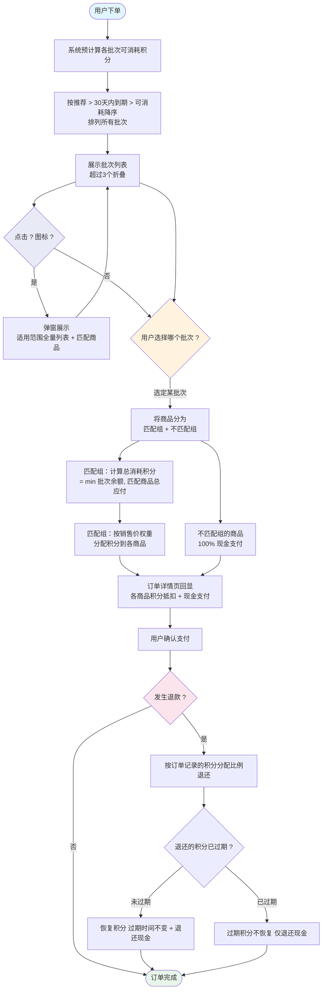

# 积分支付分配方案 V0.4

> V0.4 相对于 V0.3 的核心变化：选择维度从"积分类型"下沉到"积分批次"。用户直接选择具体的积分批次参与抵扣，每个批次有独立的名称、适用范围、余额和有效期。

## 核心规则

1. **单批次选择**：一个订单只能选择一个积分批次参与抵扣。每个批次有独立的名称、适用范围、余额和有效期。
2. **最大化消耗**：系统预计算每个批次可消耗的积分量，推荐可消耗最多的批次。排序规则：推荐优先 → 30天内到期优先（多个按到期时间升序） → 可消耗量降序 → 可消耗量相同时匹配商品数少的优先。
3. **权重回显**：订单详情页按商品销售价权重比例分配积分到各商品。

## 一、单批次选择

### 规则

用户下单时，从所有可用积分批次中**只选一个**参与抵扣。每个批次独立拥有名称、适用范围、余额和有效期，不按类型分组。同一类型下可能有多个批次（如品牌商品积分下，批次A匹配品牌X、批次B匹配品牌Y），它们作为独立选项展示。

| 批次属性 | 说明 |
| ------ | --- |
| 批次名称 | 批次的业务标识名（如"5月生活积分"、"劳动节积分"、"品牌福利积分"） |
| 类型标签 | 批次所属的类型（指定商品积分、特殊商品积分、品牌商品积分、分类商品积分、通兑商品积分） |
| 适用范围 | 该批次能抵扣的商品范围。品牌/类目类型展示"第一个+等"，弹窗展示全量列表；指定商品和特殊商品不展示适用范围 |
| 余额 | 该批次可用积分总量 |
| 有效期 | 该批次的到期时间，格式"在YYYY-MM-DD HH:mm:ss前有效" |

### 示例

用户持有以下积分批次：

- B001：**5月生活积分**，指定商品积分（蓝牙耳机），余额5000，有效期至2026-06-30 23:59:59
- B002：**劳动节积分**，特殊商品积分（热销商品），余额2000，有效期至2026-06-01 23:59:59
- B003：**品牌福利积分**，品牌商品积分（T恤品牌等），余额3000，有效期至2026-06-03 16:00:00
- B004：**家居焕新积分**，分类商品积分（家居生活等），余额8000，有效期至2026-12-31 23:59:59
- B005：**签到积分**，通兑商品积分（全场通用），余额12000，有效期至2027-01-01 00:00:00

用户只能选一个批次。系统推荐可消耗量最大的批次。

## 二、最大化消耗

### 规则

系统预计算每个批次的**实际可消耗数量**，推荐可消耗最多的批次。不匹配所选批次的商品，不参与积分分配，全部现金支付。

计算方式：对每个批次，找出该批次能匹配到的订单商品，计算可消耗积分 = min(批次余额, 匹配商品总应付 × 100)。

**展示排序**（用于批次列表展示）：

- **第一优先级**：可消耗量最大的批次标记"推荐"并置顶
- **第二优先级**：30天内到期的批次优先展示，多个30天内到期的按到期时间升序（越近越优先）
- **第三优先级**：可消耗量降序排列
- **兜底规则**：可消耗量相同时，匹配商品数少的批次优先（窄范围积分适用场景少，优先消耗避免浪费）
- **第三优先级**：按可消耗积分降序排列

### UI 交互

**批次卡片布局**（每行一个批次）：

```
┌─────────────────────────────────────────┐
│ ○  批次名称（主标题）     余额 12,000  推荐 │
│    类型标签 · 适用范围？                     │
│    匹配3件商品，可消耗12000积分              │
│    在2027-01-01 00:00:00前有效             │
└─────────────────────────────────────────┘
```

- **主标题**：批次名称（如"签到积分"）
- **副标题**：类型标签 + 适用范围，其中品牌/类目类型显示"第一个+等"（如"品牌商品积分 · T恤品牌等"）；指定商品和特殊商品仅显示类型标签
- **"?"图标**：位于副标题行末尾，点击弹窗展示适用范围详情
- **余额**：显示"余额 X,XXX"
- **有效期**：底部显示"在YYYY-MM-DD HH:mm:ss前有效"
- **折叠展开**：超过3个批次时折叠展示，点击"展开更多（N）"查看全部

**"?"弹窗内容**：

| 类型 | 弹窗标题 | 适用范围行 | 列表内容 |
| --- | ----- | ------- | ------- |
| 品牌商品积分 | 批次名称 | 适用品牌：全量品牌（如"T恤品牌、运动品牌、潮牌"） | 每个品牌一行 |
| 分类商品积分 | 批次名称 | 适用分类：全量分类（如"家居生活、数码配件、个人护理"） | 每个分类一行 |
| 通兑商品积分 | 批次名称 | 全场通用 | 全部商品均可使用 |
| 指定商品积分 | 批次名称 | 适用商品：商品名 | 匹配的商品名称 |
| 特殊商品积分 | 批次名称 | 适用标签：标签名 | 匹配的商品名称 |

### 示例

订单包含：

- 保温杯（SKU001，家居，品牌-保温杯，热销标签），¥68
- 蓝牙耳机（SKU002，数码，品牌-耳机，新品标签），¥89
- T恤（SKU003，服装，品牌-T恤，热销+新品标签），¥39.90

逐批次计算可消耗量：

| 批次 | 名称 | 类型 | 适用范围 | 匹配商品 | 可消耗 |
| ---- | --- | --- | ------ | ------ | ----- |
| B005 | 签到积分 | 通兑商品积分 | 全场通用 | 保温杯+耳机+T恤 | min(12000, 19690) = **12000** |
| B004 | 家居焕新积分 | 分类商品积分 | 家居生活等 | 保温杯 | min(8000, 6800) = **6800** |
| B001 | 5月生活积分 | 指定商品积分 | — | 蓝牙耳机 | min(5000, 8900) = **5000** |
| B003 | 品牌福利积分 | 品牌商品积分 | T恤品牌等 | T恤 | min(3000, 3990) = **3000** |
| B002 | 劳动节积分 | 特殊商品积分 | — | 保温杯+T恤 | min(2000, 10790) = **2000** |

系统推荐：**B005 签到积分（可消耗12000积分）**

## 三、权重回显

### 规则

积分只分配给**匹配的商品**，不匹配的商品积分为0。在匹配的商品中，按销售价权重比例分配。用于订单详情页展示和退款计算。

公式：`商品分配积分 = floor(总消耗积分 × 商品销售价 / 匹配商品总销售价)`

最后一个商品取余数，确保总额一致。

**精度规则：** 系统中人民币保留2位小数，积分的小数位数由人民币与积分的兑换比例决定，保持精度对齐：

| 兑换比例（人民币:积分）  | 积分小数位 | 说明     |
| ------------- | ----- | ------ |
| 1:100（1分=1积分） | 整数    | 0位小数   |
| 1:10（1角=1积分）  | 1位小数  |        |
| 1:1（元=1积分）    | 2位小数  | 与人民币一致 |

### 示例（用户选了B005签到积分）

签到积分匹配全部3件商品（总应付¥196.90），12000积分按价格权重分配：

| 商品  | 销售价    | 权重         | 分配积分                             |
| --- | ------ | ----------- | --------------------------------- |
| 保温杯 | ¥68.00 | 6800/19690  | floor(12000 × 6800/19690) = 4139 |
| 蓝牙耳机 | ¥89.00 | 8900/19690  | floor(12000 × 8900/19690) = 5413 |
| T恤  | ¥39.90 | 余数          | 12000 - 4139 - 5413 = 2448       |

最终结果：

| 商品     | 销售价        | 积分抵扣       | 现金支付        |
| ------ | ---------- | ---------- | ----------- |
| 保温杯    | ¥68.00     | 4139积分     | ¥26.61      |
| 蓝牙耳机   | ¥89.00     | 5413积分     | ¥34.87      |
| T恤     | ¥39.90     | 2448积分     | ¥15.42      |
| **合计** | **¥196.90** | **12000积分** | **¥76.90** |

## 四、退款

按订单详情页记录的各商品积分分配比例退还：

- **积分未过期**：恢复到用户账户，过期时间不变
- **积分已过期**：该部分不恢复，仅退还现金

示例：T恤退款，当时分配了2448积分 + ¥15.42现金。若积分未过期，恢复2448积分 + 退还¥15.42现金。

## 五、流程图



## 六、V0.3 → V0.4 变更对比

| 维度     | V0.3               | V0.4                    |
| ------ | ------------------ | ----------------------- |
| 选择维度   | 按类型选择（五选一）         | 按批次选择（从所有批次中选一个）        |
| 卡片主标题  | 类型名称（如"品牌商品积分"）    | 批次名称（如"品牌福利积分"）         |
| 卡片副标题  | 无                  | 类型标签 + 适用范围              |
| 适用范围展示 | 无                  | 品牌/类目显示"第一个+等"，弹窗展示全量；指定/特殊不展示 |
| 过期信息   | 特定批次显示"即将过期"警告     | 每个批次统一显示有效期             |
| 计算维度   | 先按类型汇总，再推荐类型       | 直接按批次计算，推荐可消耗最多的批次      |
| 折叠展示   | 无                  | 超过3个批次折叠，可展开            |
| 适用范围查看 | 无                  | "?" 图标弹窗展示              |

## 七、优缺点分析

### 优点

| # | 优点     | 说明                                  |
| - | ------ | ----------------------------------- |
| 1 | **选择灵活** | 用户可精确选择到具体批次，同一类型下不同范围的批次不会相互干扰      |
| 2 | **展示清晰** | 批次名称为主标题，类型和适用范围为副标题，层次分明           |
| 3 | **交互友好** | 折叠展示减少信息过载，"?"图标提供适用范围全量详情          |
| 4 | **扩展性好** | 新增批次只需增加数据条目，无需修改类型结构               |
| 5 | **有效期透明** | 每个批次统一展示有效期，用户清楚知道每笔积分何时到期          |

### 缺点

| # | 缺点       | 说明                                |
| - | -------- | --------------------------------- |
| 1 | **批次数量膨胀** | 用户持有批次较多时（如10+），即使折叠也需要多次滚动       |
| 2 | **利用率仍受限** | 单批次选择意味着用户只能用其中一个批次的积分，其他批次无法同时消耗 |
| 3 | **选择决策复杂** | 批次级别比类型级别选项更多，用户需要更多时间理解每个批次的差异   |

### 风险场景

| 场景     | 问题                                  |
| ------ | ----------------------------------- |
| 批次过多   | 用户有20个批次，列表过长，折叠后仍需频繁展开，影响下单效率      |
| 过期积分焦虑 | 多个批次即将到期，但只能选一个，用户担心其他批次过期浪费        |
