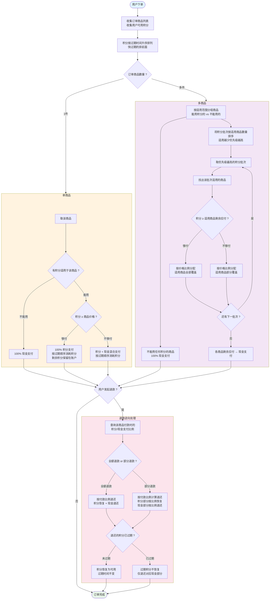

# 电商支付与积分抵扣系统设计全解析

搞清楚 **3个核心问题**，并结合订单类型，重点看\*\*“付款时怎么扣”**和**“退款时怎么退”\*\*。
这3个核心问题是：

1. **积分快过期了吗？（过期先后）**：决定先用哪笔积分（快过期的先用）。
2. **积分能不能用？（适用范围）**：决定积分能不能抵扣这个商品（全都能用 vs 只有部分商品能用）。
3. **积分够不够付？（够不够抵扣）**：决定积分能不能完全抵扣掉商品价格（够付 vs 不够付）。
   以下是单商品和多商品订单的详细拆解：

***

## 一、 只买一件商品的情况

只买一件商品很简单，不存在积分在多个商品间怎么分的问题，只需要看“积分能不能用”。

### 1. 积分不能用在这个商品上

- **怎么付**：不管积分有多少、是不是快过期，都不能用。
- **结果**：**100% 掏现金**。

### 2. 积分能用在这个商品上

这时候要看积分够不够付：

- **情况 2.1：积分够付商品价格**
  - **怎么付**：全用积分抵扣。
  - **扣款顺序**：优先用**快过期**的积分。
  - **结果**：**100% 积分支付**。（注：有的系统积分不找零，可能需要付1分钱现金，这里按全额抵扣算）
- **情况 2.2：积分不够付商品价格**
  - **怎么付**：积分抵扣一部分，剩下的掏现金。
  - **扣款顺序**：同样优先用快过期的积分。
  - **结果**：**积分 + 现金混合支付**。

***

## 二、 买多件商品的情况（核心）

买多件商品最复杂，因为订单里可能“有的商品能用积分，有的不能用”，而且积分不够时，要决定**积分优先抵扣哪个商品**。

### 1. 所有商品都能用积分

这种情况下，不用纠结积分分给谁，只看积分够不够付总价。

- **情况 1.1：积分够付所有商品总价**
  - **怎么付**：全用积分抵扣。
  - **扣款顺序**：优先用快过期的积分。
  - **结果**：**100% 积分支付**。
- **情况 1.2：积分不够付所有商品总价**
  - **怎么付**：积分抵扣一部分，剩下的掏现金。
  - **积分怎么分（关键）**：积分怎么在多个商品间分配？通常有两种做法：
    - *按价格比例分*：A商品100元，B商品100元，50元积分则A抵扣25，B抵扣25。
    - *按顺序抵扣*：先抵扣A，A抵扣完再抵扣B（一般不推荐，容易出现0元商品，退款时很麻烦）。
  - **扣款顺序**：优先用快过期的积分。
  - **结果**：**积分 + 现金混合支付**（每个商品都是混合付的）。

### 2. 只有部分商品能用积分（最复杂的情况）

**第一步：商品分组** — 把不能用任何积分的商品分离出来，它们 100% 现金支付，不再参与后续分配。

**第二步：积分批次匹配** — 能用积分的商品组内部，不同积分批次的适用范围不同，需要进一步匹配。

举例：能用积分的商品有 A 和 B，用户积分批次有 C 和 D：

- 批次 C：仅适用于商品 A
- 批次 D：适用于商品 A 和 B

这就产生了一个问题：**积分批次该按什么顺序分配？先 C 还是先 D？**

**分配规则：适用商品数量越少的积分批次，优先级越高。** 原因是窄范围积分只能用于少数商品，如果不优先消耗，可能永远用不上；而适用范围宽的积分随时可以补位。

上述例子中：C 只能用于 A（适用 1 个商品），D 可用于 A 和 B（适用 2 个商品），所以**先消耗 C，再消耗 D**。

**分配过程（以上例说明）：**

1. **先用批次 C（仅适用于 A）**：将 C 的积分全部抵扣给 A。若 C 不够抵扣 A 全价，A 剩余部分等后续批次继续抵扣。
2. **再用批次 D（适用于 A 和 B）**：此时看 A 和 B 的剩余应付，按价格比例分配 D 的积分。

**示例：**

- 商品 A：¥100，商品 B：¥100
- 批次 C：30积分（仅适用于 A）
- 批次 D：80积分（适用于 A 和 B）

| 步骤 | 批次 | 分配对象 | 分配结果 | A 剩余应付 | B 剩余应付 |
| --- | --- | --- | --- | --- | --- |
| 1 | C（仅适用A） | A | 抵扣 30积分 | ¥70 | ¥100 |
| 2 | D（适用A+B） | A 和 B | 按比例分 80积分：A 抵扣 40，B 抵扣 40 | ¥30 | ¥60 |

最终结果：

| 商品 | 销售价 | 积分抵扣 | 现金支付 |
| --- | --- | --- | --- |
| 商品 A | ¥100 | 30 + 40 = 70积分 | ¥30 |
| 商品 B | ¥100 | 40积分 | ¥60 |

- **情况 2.1：所有批次消耗完后，能用积分的商品全部被覆盖**
  - **结果**：**能用的商品 100%积分 + 不能用的商品 100%现金**。
- **情况 2.2：所有批次消耗完后，能用积分的商品仍有剩余**
  - **结果**：**能用的商品（积分+现金混合）+ 不能用的商品（100%现金）**。

> **注意**：在以上每个批次内部，仍然遵循”快过期的积分先用”规则。即”按适用范围排优先级”决定批次间的顺序，”按过期时间排优先级”决定同一批次内多条积分的消耗顺序。这是两层独立的排序规则。

***

## 三、 特殊情况

当这3个问题同时出现时，会有一些边缘情况和坑：

### 1. 账户里有多笔不同过期时间的积分，怎么扣？

- **最优解**：在所有“积分+现金”混合支付的场景中，系统必须按照\*\*“快过期的积分先用”\*\*的顺序，一笔一笔扣，直到扣够需要抵扣的金额为止。

### 2. “积分不够付+买多件商品”时，退款怎么退？（防止平台亏钱）

如果订单只退了其中一件商品，积分和现金怎么退？

- **铁律**：按付款时的比例退。比如A商品原价100元，付款时付了30积分+70现金，退款时绝不能退100现金，必须退30积分+70现金。
- **积分过期坑点**：如果退款时，当时抵扣的“快过期积分”已经过期了，怎么退？
  - *常规做法*：退回的积分统一给一个新的有效期（比如退回后30天有效），或者恢复原来的过期时间（但积分已过期的话只能作废，这容易引发客诉，需慎重）。

### 3. 积分比订单总价还多很多，怎么办？

- 如果积分（特别是快过期的积分）远大于订单金额，系统**只消耗等额的积分，剩余积分保留在用户账户中不变**。不存在找零的概念。

***

## 四、 简单总结决策流程

设计时，只需按以下4步套用即可：

1. **第一步：看积分能不能用**
   - 不能用 ➡️ 100%掏现金
   - 能用 ➡️ 进入第二步
2. **第二步：看积分够不够付（针对能用积分的部分）**
   - 够付 ➡️ 能用积分的部分 100%积分支付
   - 不够付 ➡️ 能用积分的部分 = 积分+现金混合；不能用积分的部分 = 100%现金
3. **第三步：排扣款顺序**
   - 只要用到积分，一律**优先用快过期的积分**。
4. **第四步：算商品分配**
   - 多件商品积分不够付时，**按商品价格比例分配积分**（最主流的做法，退款最好算）。

***

## 五、 全景决策流程图

以下流程图覆盖上述所有场景的完整判断链路：

