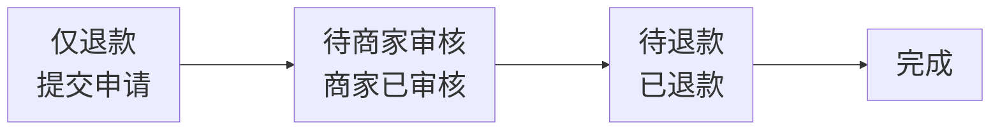
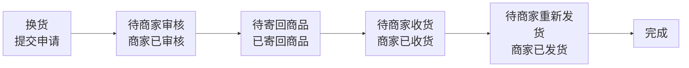
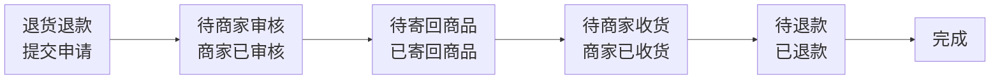
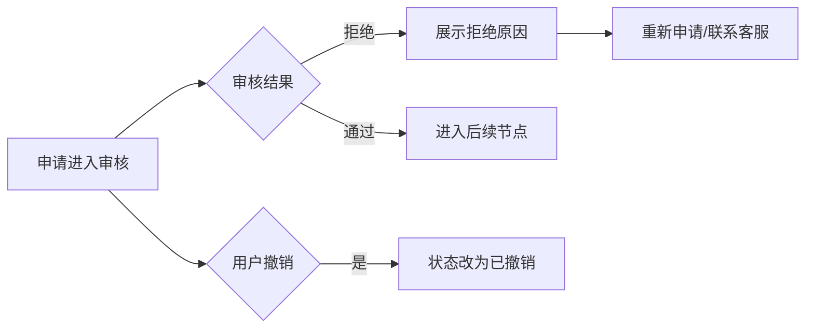

# 售后功能 PRD（模板落地版）

> 基于 `PRD模板.md` 结构，结合当前页面改动生成。  
> 页面依据：`pages/order_list.html`、`pages/refund.html`、`pages/apply_refund.html`、`pages/refund_detail.html`。

---

## 1. 文档信息与版本记录
### 1.1 文档信息
- 项目名称：苏银豆商城小程序
- 需求名称：售后能力升级（仅退款/退货退款/换货）
- 文档作者：产品&AI协同
- 评审人：产品、前端、后端、测试、客服
- 当前版本：v1.1
- 最后更新时间：2026-05-06

### 1.2 版本记录
| 版本 | 日期 | 修改人 | 变更内容 |
|---|---|---|---|
| v1.1 | 2026-05-06 | 产品&AI协同 | 补充「我的订单」两类售后入口与订单状态流转规则 |
| v1.0 | 2026-04-28 | 产品&AI协同 | 基于现有页面改动输出首版PRD |

---

## 2. 背景、问题定义与机会点
### 2.1 背景
- 当前售后入口分散、流程感知弱，用户在“申请-处理中-结果”链路上缺少统一承接。
- 不同售后类型（仅退款、退货退款、换货）规则差异大，页面上缺少统一表达和可执行交互。

### 2.2 问题定义
- 问题1：用户不知道何时可申请、申请后做什么，导致客服咨询增加。
- 问题2：售后申请页能力不足，缺商品粒度、数量、金额积分联动与必要校验。
- 问题3：售后详情缺节点状态与动作闭环，物流补充等关键动作不清晰。

### 2.3 机会点
- 通过统一售后入口和流程可视化，提升自助处理率，降低人工介入成本。
- 通过规则清晰化和校验前置，提升提交成功率与联调效率。

---

## 3. 目标与成功指标（KPI）
### 3.1 业务目标
- 建立“入口统一 + 申请清晰 + 进度透明 + 异常可回路”的售后体系。
- 支持三类售后主链路：仅退款、退货退款、换货。

### 3.2 用户目标
- 用户可快速找到售后入口并完成申请。
- 用户可在处理中和详情页清晰知道当前状态与下一步动作。

### 3.3 成功指标
| 指标 | 口径定义 | 基线值 | 目标值 | 统计周期 |
|---|---|---:|---:|---|
| 售后提交成功率 | 成功提交单数/提交尝试数 | 待补 | +15% | 周 |
| 售后相关咨询率 | 售后咨询会话/售后订单数 | 待补 | -20% | 周 |
| 详情页自助完成率 | 无客服介入完结单/售后单总数 | 待补 | +10% | 月 |

---

## 4. 范围定义（In Scope / Out of Scope）
### 4.1 In Scope（本期要做）
- 订单页「待发货 → 仅退款」「已发货 → 退换/售后」入口能力（规则见第 6 章）。
- 售后首页三Tab（售后申请/处理中/申请记录）。
- 售后申请页（标准模式 + 仅退款模式）。
- 售后详情页（状态、时间线、商品维度物流）。

### 4.2 Out of Scope（本期不做）
- 自动审核、智能判责、复杂风控决策引擎。
- 消息中心推送策略深度建设。
- 多端统一（仅覆盖当前小程序页面）。

---

## 5. 用户画像与核心场景
### 5.1 用户画像
- 普通下单用户：关注申请便捷、退款到账速度。
- 问题订单用户：关注理由说明、进度、可追溯性。

### 5.2 核心场景
- **待发货**用户在订单列表发起**仅退款**；**已发货**用户在订单列表发起**退换/售后**（退货退款/换货，不展示仅退款）。
- 已签收用户发起退货退款（可多商品、多数量）。
- 商品异常用户发起换货并补充回寄物流。
- 被拒绝用户查看拒绝原因并重新申请。

---

## 6. 业务规则与核心原则
### 6.1 核心业务原则

#### 6.1.1 「我的订单」中的两类售后方式（按履约阶段划分）

在「我的订单」列表/卡片上，按订单所处履约阶段区分为两种售后方式；**同一订单在不同阶段展示的入口与可选售后类型不同**。

| 阶段 | 订单状态（示意） | 列表入口 | 可选售后类型 |
|---|---|---|---|
| **第一种** | 已付款、**未发货**（**待发货**） | **仅退款** 按钮 | **仅退款**（本阶段不提供退货退款、换货入口） |
| **第二种** | **已发货**之后（如待收货、待签收等，以实际枚举为准） | **退换/售后** 按钮 | **退货退款**、**换货**；**不展示「仅退款」** |

补充说明：

- 第一种：仅在「待发货」场景增加 **仅退款** 按钮。
- 第二种：增加 **退换/售后** 按钮；用户申请的售后方式包含退货退款、可申请换货；**仅退款入口不显示**。

---

#### 6.1.2 第一种（待发货 · 仅退款）— 订单状态流转原则

**（1）单个商品退款，或多个商品「全部」发起仅退款**

- 订单状态由 **待发货** 流转为 **已关闭**（售后闭环或等价终态，与业务枚举对齐）。
- 若用户在 **售后详情** 中 **撤回申请**，订单状态继续流转回 **待发货**。

**（2）多个商品订单，仅对部分商品发起仅退款（部分退款）**

- **订单头状态**：仍为 **待发货**（不因部分售后而整单关闭）。
- **已申请售后的商品行**：支持展示 **查看售后详情**（或统一称为售后进度入口）；该商品行 **置灰** 或等价不可用态，表示处理中/已占用售后名额。
- **同一商品**：在本次未完结或规则限定下 **不可再次申请仅退款**（与「同一维度仅一条未完结售后」原则一致时可合并表述）。

---

#### 6.1.3 第二种（已发货 · 退换/售后）— 订单状态流转原则

**（1）整单或等价「全部包裹/全部商品」均完成退换/售后申请的情形**

适用于但不限于：

- **单个商品**订单申请退换/售后；
- **多个商品、同一物流单号**，全部商品均申请退换/售后；
- **多个商品、多个物流单号**，用户 **分批次将全部包裹** 均申请退换/售后。

上述情形：**订单状态由 待收货 流转为 已关闭**（与业务终态定义一致）。

**（2）多个商品、多个物流单号，仅「其中一个包裹」申请售后**

- **订单头状态**：**保持 待收货** 不变。
- **展示规则**：按 **不同物流单（包裹）** 区分，展示 **多个「退货/换货」**（或统一的退换入口，具体文案与按钮拆分以 UI 为准）按钮；用户仅对其中一个包裹发起申请时，其余包裹仍可继续操作。

---

#### 6.1.4 全局约束（与上文并存）

- 可申请类型仍受订单状态、时效、商品属性、商家策略等共同约束。
- 金额/积分/券以服务端结算为准，前端展示预计值与结果值。
- 同一 `orderId + skuId`（或业务约定的最小售后粒度）在规则允许范围内同时仅允许一个未完结售后单；具体「置灰」「不可再申请」与退款/撤回规则以后端校验为准。

### 6.2 业务规则
- **仅退款**：仅在 **待发货** 阶段于订单列表展示 **仅退款** 入口，走简化申请页；**已发货后** 订单列表 **不展示** 仅退款入口。
- **退货退款 / 换货**：在 **已发货后** 通过 **退换/售后** 进入申请；需选择商品与数量，退货退款支持多选/全选（受包裹与物流维度约束时按 6.1.3 展示多入口）。
- **换货**：商品维度规则保持「仅支持单件同款换货」等产品约束（与申请页一致）。

### 6.3 关键术语定义
| 术语 | 定义 |
|---|---|
| 售后单 | 用户发起的售后申请记录 |
| 未完结售后单 | 状态非 `FINISHED/CANCELLED` 的售后单 |
| 可退积分 | 当前申请范围内可按规则退回的积分 |

---

## 7. 业务流程与状态机
### 7.1 主流程






### 7.2 异常流程


### 7.3 状态机与操作映射
| 展示节点 | 状态枚举 | 角色 | 可执行操作 | 不可执行操作 |
|---|---|---|---|---|
| 提交申请 | SUBMITTED | 用户 | 撤销、联系客服 | 填物流 |
| 待商家审核 | MERCHANT_REVIEW_PENDING | 用户 | 撤销、联系客服 | 填物流 |
| 待寄回商品 | RETURN_PENDING | 用户 | 填物流、联系客服 | 撤销（默认） |
| 待商家收货 | MERCHANT_RECEIVE_PENDING | 用户 | 联系客服 | 再次填物流（默认） |
| 待退款 | REFUND_PENDING | 用户 | 联系客服 | 撤销 |
| 完成 | FINISHED | 用户 | 查看详情、联系客服 | 修改申请 |

---

## 8. 功能架构与信息架构
### 8.1 功能架构
- 入口层：订单列表「待发货 → 仅退款」「已发货后 → 退换/售后」、售后首页「退款/售后」。
- 申请层：类型选择、商品选择、表单提交、凭证上传。
- 处理层：处理中列表、详情时间线、节点动作（撤销/填物流）。
- 归档层：申请记录、拒绝重提。

### 8.2 页面/模块关系
- `order_list.html` -> `apply_refund.html?type=refund-only`
- `refund.html` -> `apply_refund.html`（售后申请）
- `refund.html` -> `refund_detail.html?case=...`（处理中/记录查看）
- `refund_detail.html` -> `customer_service.html`（客服）

### 8.3 页面规格说明（逐页）

#### 页面A：订单列表（`order_list.html`）
| 模块/元素 | 类型 | 必填/选填 | 显示条件 | 交互行为 | 异常提示 |
|---|---|---:|---|---|---|
| 订单卡片 | 列表 | - | 有订单数据 | 点击进入订单详情 | 加载失败提示重试 |
| 仅退款按钮 | 按钮 | - | **待发货**（已付款未发货），且满足仅退款规则 | 跳转 `apply_refund.html?type=refund-only` | 非待发货或不满足规则不显示 |
| 退换/售后按钮 | 按钮 | - | **已发货之后**（如待收货,已完成状态），且满足退换规则 | 跳转售后申请（退货退款/换货；不展示仅退款） | 不满足规则不显示 |
| 商品行售后详情 | 链接/行 | - | 该商品存在进行中或可追溯售后（见 6.1） | 跳转售后详情；部分场景商品行置灰、不可重复申请 | 无权限或单号无效时提示 |
| 其他操作按钮 | 按钮组 | - | 按订单状态 | 查看物流/去支付/评价等 | 状态非法时拦截 |

#### 页面B：售后首页（`refund.html`）
| 模块/元素 | 类型 | 必填/选填 | 显示条件 | 交互行为 | 异常提示 |
|---|---|---:|---|---|---|
| 三Tab切换 | 标签 | - | 页面默认展示 | 申请/处理中/记录切换 | 切换失败保留当前Tab |
| 搜索框 | 输入框 | 选填 | 申请Tab | 按订单号/商品名过滤 | 无结果显示空态 |
| 申请列表 | 列表 | - | 申请Tab有数据 | 点击“退款/售后”跳申请页 | 加载失败可重试 |
| 处理中列表 | 列表 | - | 处理中Tab有数据 | 查看详情/可撤销时撤销 | 撤销失败给提示 |
| 申请记录列表 | 列表 | - | 记录Tab有数据 | 查看详情/拒绝可重提 | 无记录显示空态 |

#### 页面C：售后申请页（`apply_refund.html`）
| 模块/元素 | 类型 | 必填/选填 | 显示条件 | 交互行为 | 异常提示 |
|---|---|---:|---|---|---|
| 售后类型切换 | 选择卡 | 必填 | 标准模式 | 换货/退货退款切换联动 | 无 |
| 商品选择区 | 列表+勾选 | 条件必填 | 标准模式 | 换货单选；退货退款多选/全选 | 未选商品禁止提交 |
| 数量调节器 | 步进器 | 条件必填 | 退货退款且商品选中 | 调整申请数量并刷新金额 | 超限拦截 |
| 原因选择 | 下拉 | 必填 | 全模式 | 选择退款/换货原因 | 未选原因禁止提交 |
| 联系方式 | 输入框 | 必填 | 全模式 | 输入手机号 | 格式错误提示 |
| 问题描述 | 文本域 | 选填 | 标准模式 | 输入补充说明 | 字数超限提示 |
| 凭证上传 | 上传组件 | 选填 | 标准模式 | 最多3张、可删除 | 超过上限提示 |
| 提交按钮 | 按钮 | - | 全模式 | 弹提醒后提交并跳售后首页 | 校验失败阻断提交 |

#### 页面D：售后详情页（`refund_detail.html`）
| 模块/元素 | 类型 | 必填/选填 | 显示条件 | 交互行为 | 异常提示 |
|---|---|---:|---|---|---|
| 状态头 | 信息区 | - | 全状态 | 展示当前状态与说明 | 状态异常使用兜底文案 |
| 时间线 | 时间轴 | - | 全状态 | 展示节点推进情况 | 数据缺失显示最小节点 |
| 商品卡片 | 列表 | - | 全状态 | 展示商品与数量信息 | 无 |
| 退回物流填写 | 弹窗+表单 | 条件必填 | 待寄回商品节点 | 填写公司+单号并提交 | 字段缺失提示 |
| 撤销申请 | 按钮 | - | 可撤销状态 | 撤销后返回上级页 | 失败提示重试 |
| 联系客服 | 按钮 | - | 全状态 | 跳转客服页 | 跳转失败提示 |

### 8.4 页面跳转矩阵
| 来源页面 | 触发动作 | 条件 | 目标页面 | 参数 | 失败处理 |
|---|---|---|---|---|---|
| `order_list.html` | 点击“仅退款” | 订单满足仅退款条件 | `apply_refund.html` | `type=refund-only` | 提示“当前订单暂不支持仅退款” |
| `refund.html` | 点击“退款/售后” | 申请Tab订单可售后 | `apply_refund.html` | 无 | 提示“当前订单不可申请” |
| `refund.html` | 点击“查看详情” | 处理中/记录列表项 | `refund_detail.html` | `case=...` | 提示“售后详情加载失败” |
| `refund.html` | 点击“重新申请” | 状态=已拒绝/已撤销 | `apply_refund.html` | 可带历史上下文参数（可选） | 提示“暂不可重新申请” |
| `apply_refund.html` | 提交成功 | 校验通过+接口成功 | `refund.html` | 默认回到“处理中”或“申请记录” | 保持当前页并提示失败原因 |
| `refund_detail.html` | 点击“联系客服” | 全状态可用 | `customer_service.html` | 可带 `afterSaleId`（可选） | 提示“客服页面暂不可用” |

---

## 9. 功能需求明细（FRD）

## FR-01 订单页仅退款入口
- 目标：在可申请场景提供快速退款入口。
- 触发条件：订单满足仅退款条件。
- 详细规则：入口文案为“仅退款”，点击带参数跳转申请页。
- 验收标准：不满足条件订单不展示入口。

## FR-02 售后首页三Tab
- 目标：统一承载售后申请、处理中、记录。
- 详细规则：
  - 售后申请：可申请订单列表 + 搜索 + 上拉加载。
  - 处理中：展示处理中状态和可执行动作。
  - 申请记录：展示历史，拒绝可重提。
- 验收标准：Tab数据不串、空态正确。

## FR-03 售后申请页（标准模式）
- 目标：支持换货/退货退款完整申请。
- 详细规则：
  - 换货：单选商品、单件处理。
  - 退货退款：支持多选、全选、数量调节。
  - 表单：原因、联系方式必填；描述选填；图片最多3张。
  - 金额积分：实时联动展示。
- 验收标准：类型切换联动正确，校验阻断生效。

## FR-04 仅退款模式
- 目标：简化未涉及退货的申请路径。
- 详细规则：
  - 隐藏类型/商品/描述等模块，仅保留原因+联系方式。
  - 标题及提交文案切换为“申请退款”。
- 验收标准：参数触发后页面结构和文案正确。

## FR-05 提交提醒与校验
- 目标：统一权益规则提示，避免争议。
- 提示文案：售后完成后，已过期积分不退回；优惠券仅未过期可返还，已过期不返还。
- 校验规则：原因必填、联系方式必填、非仅退款必须选商品。
- 验收标准：未通过校验禁止提交并提示明确。

## FR-06 售后详情页
- 目标：让用户理解当前状态并完成下一步动作。
- 详细规则：
  - 根据 `case` 渲染不同流程模板。
  - 展示状态头、金额、时间线、商品、备注、凭证。
  - 支持撤销（可撤销状态）和填写物流（待寄回状态）。
- 验收标准：节点展示正确，动作显隐正确。

## FR-07 商品维度物流回填
- 目标：支持多商品场景下精准回填物流。
- 详细规则：
  - 按商品填写物流公司和单号。
  - 提交后状态推进并在商品卡回显。
- 验收标准：字段校验生效，回显商品绑定正确。

---

## 10. 数据口径与计算规则
### 10.1 核心数据口径
- 预计可退金额：前端按当前勾选商品与数量计算。
- 实际退款金额：以后端结算返回为准。

### 10.2 计算规则
- 退货退款：`sum(商品可退现金 * 申请数量)`，积分同理。
- 换货：默认退款金额 `0`（以换货流程为主）。

### 10.3 权益处理规则
- 积分：未过期可退，过期不退。
- 优惠券：未过期可返，过期不返。
- 运费：由后端规则决定并返回展示。

---

## 11. 接口与系统交互要求
### 11.1 统一响应模型
```json
{
  "code": "0",
  "message": "ok",
  "requestId": "trace-xxx",
  "data": {}
}
```

### 11.2 接口清单
| 接口 | 方法 | 说明 | 负责人 |
|---|---|---|---|
| /api/aftersales | POST | 创建售后单 | 后端 |
| /api/aftersales | GET | 售后列表 | 后端 |
| /api/aftersales/{id} | GET | 售后详情 | 后端 |
| /api/aftersales/{id}/return-logistics | POST | 提交退回物流 | 后端 |
| /api/aftersales/{id}/cancel | POST | 撤销申请 | 后端 |

### 11.3 字段与校验（关键）
| 字段 | 类型 | 必填 | 校验规则 | 备注 |
|---|---|---:|---|---|
| afterSaleType | string | 是 | 枚举值校验 | refund_only/refund_return/exchange |
| contactPhone | string | 是 | 大陆手机号格式 | - |
| items | array | 条件必填 | 退货退款/换货必填 | 仅退款可空 |
| evidenceImages | array | 否 | 最多3张 | - |
| clientToken | string | 是 | 幂等键 | 防重复提交 |

### 11.4 错误码
| 错误码 | 含义 | 前端提示文案 |
|---|---|---|
| AFTERSALE_NOT_ALLOWED | 当前订单不满足申请条件 | 当前订单暂不支持该售后类型 |
| AFTERSALE_TIMEOUT | 超出售后时效 | 已超出售后时效 |
| AFTERSALE_DUPLICATE | 重复售后 | 该商品已有处理中售后申请 |
| INVALID_LOGISTICS | 物流信息无效 | 请填写正确的物流信息 |
| IDEMPOTENT_CONFLICT | 重复提交 | 请勿重复提交 |

---

## 12. 权限、风控与合规要求
- 权限控制：仅订单所属用户可发起/查看售后单。
- 防重复提交：创建与物流提交均使用幂等键。
- 风控策略：高频重复申请触发风控校验（后端控制）。
- 合规要求：保留操作日志与 `requestId` 追踪链路。

---

## 13. 异常与边界场景
| 场景 | 触发条件 | 系统处理 | 用户提示 |
|---|---|---|---|
| 售后超时 | 超出售后期 | 阻断提交 | 已超出售后时效 |
| 无可选商品 | 非仅退款未选商品 | 阻断提交 | 请先选择售后商品 |
| 物流未填全 | 公司/单号缺失 | 阻断提交 | 请输入完整物流信息 |
| 非法状态操作 | 完成态撤销等 | 拦截并记录 | 当前状态不可执行该操作 |

---

## 14. 交互与文案规范
- 仅退款模式统一文案：申请退款/退款原因。
- 换货模式统一文案：换货原因。
- 提交提醒文案与权益规则必须一致。
- 拒绝单必须展示拒绝原因，并给“重新申请”入口。

---

## 15. 埋点与监控方案
### 15.1 埋点清单
| 事件名 | 触发时机 | 关键属性 |
|---|---|---|
| aftersale_entry_click | 点击售后入口 | source, orderId |
| aftersale_submit_click | 点击提交 | type, selectedSkuCount |
| aftersale_submit_result | 提交结果返回 | result, errorCode |
| aftersale_logistics_submit | 提交物流 | afterSaleId, itemId |

### 15.2 监控指标
- 接口错误率、提交成功率、页面崩溃率。
- 售后咨询量变化、重提率、撤销率。

---

## 16. 验收标准（DoD）与测试用例
### 16.1 DoD
- 三类售后主流程全链路通过。
- 状态与按钮显隐符合映射规则。
- 表单校验和权益文案一致。
- 接口错误码处理与前端提示一致。

### 16.2 测试用例
| 用例ID | 场景 | 预期结果 | 优先级 |
|---|---|---|---|
| TC-001 | 仅退款模式进入 | 页面结构正确 | P0 |
| TC-002 | 退货退款多商品多数量 | 金额积分联动正确 | P0 |
| TC-003 | 换货单选约束 | 不可多选 | P0 |
| TC-004 | 提交前提醒 | 文案一致且可确认 | P0 |
| TC-005 | 物流提交流程 | 状态推进+回显成功 | P0 |
| TC-006 | 拒绝后重提 | 可跳转重新申请 | P1 |

---

## 17. 发布计划（灰度/回滚/门禁）
### 17.1 灰度计划
- 灰度节奏：5% -> 20% -> 50% -> 100%。

### 17.2 上线门禁（Go/No-Go）
- 三主流程联调通过。
- 错误码与提示映射完成。
- 客服话术与文案规则确认。

### 17.3 回滚方案
- 开关回退旧入口与旧详情模板。
- 保留已生成售后单数据与兼容展示。
- 回滚后 30 分钟内完成复盘与修复计划。

---

## 18. 依赖、风险与待确认项
### 18.1 依赖项
| 依赖项 | 负责人 | 截止时间 |
|---|---|---|
| 接口文档与Mock | 后端 | 待定 |
| 状态流转矩阵 | 后端+产品 | 待定 |
| 文案终审 | 产品+客服 | 待定 |

### 18.2 风险项
| 风险 | 影响 | 应对策略 |
|---|---|---|
| 状态口径不一致 | 联调失败 | 固化状态映射表并评审签字 |
| 退款口径争议 | 客诉增加 | 以后端结算结果为准并前置提示 |
| 异常场景遗漏 | 线上故障 | 完整异常用例回归 |

### 18.3 待确认项（Open Questions）
- 发货后仅退款的最终策略是否按商家维度可配置？
- 物流单号是否允许二次修改，次数上限是多少？
- 审核/收货超时后的自动化策略采用哪种默认方案？

---

## 附录 A：评审检查清单
- 是否明确了三类售后流程与异常闭环？
- 是否完成流程节点、状态、按钮映射对齐？
- 是否明确权益规则并与提醒文案一致？
- 是否具备联调所需接口、错误码、幂等规范？
- 是否具备灰度、回滚、门禁与验收用例？

