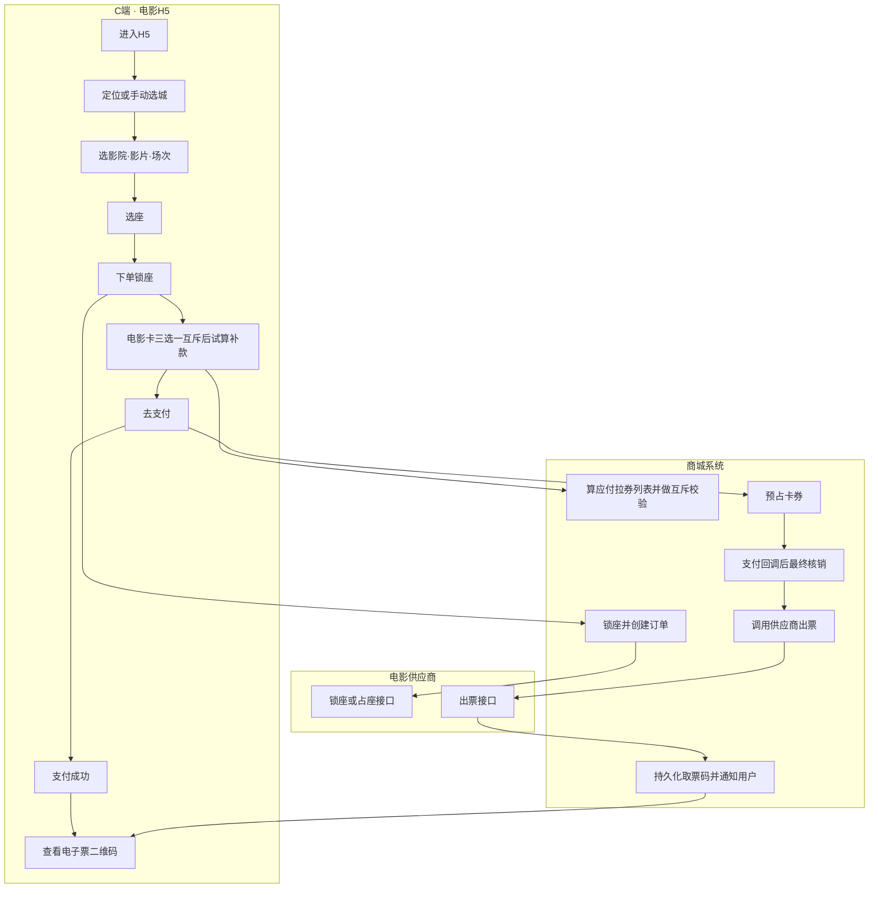
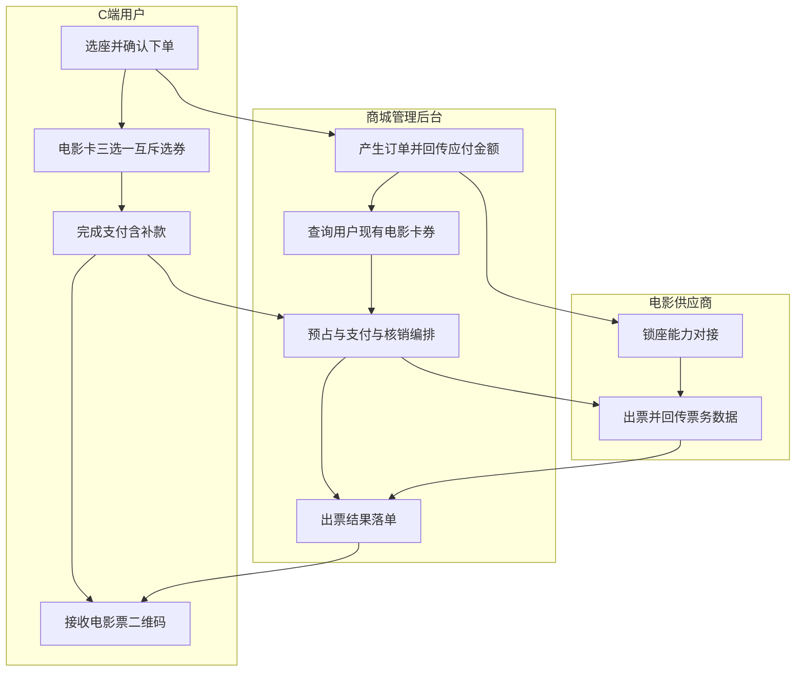
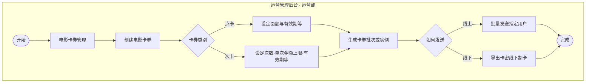
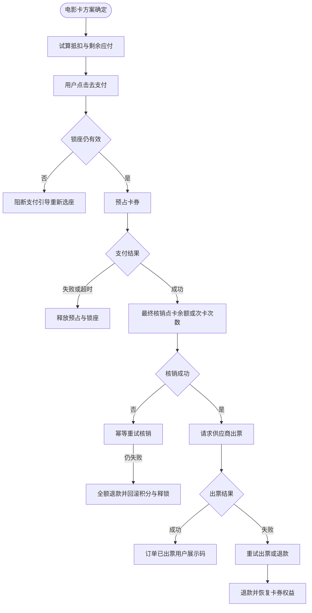
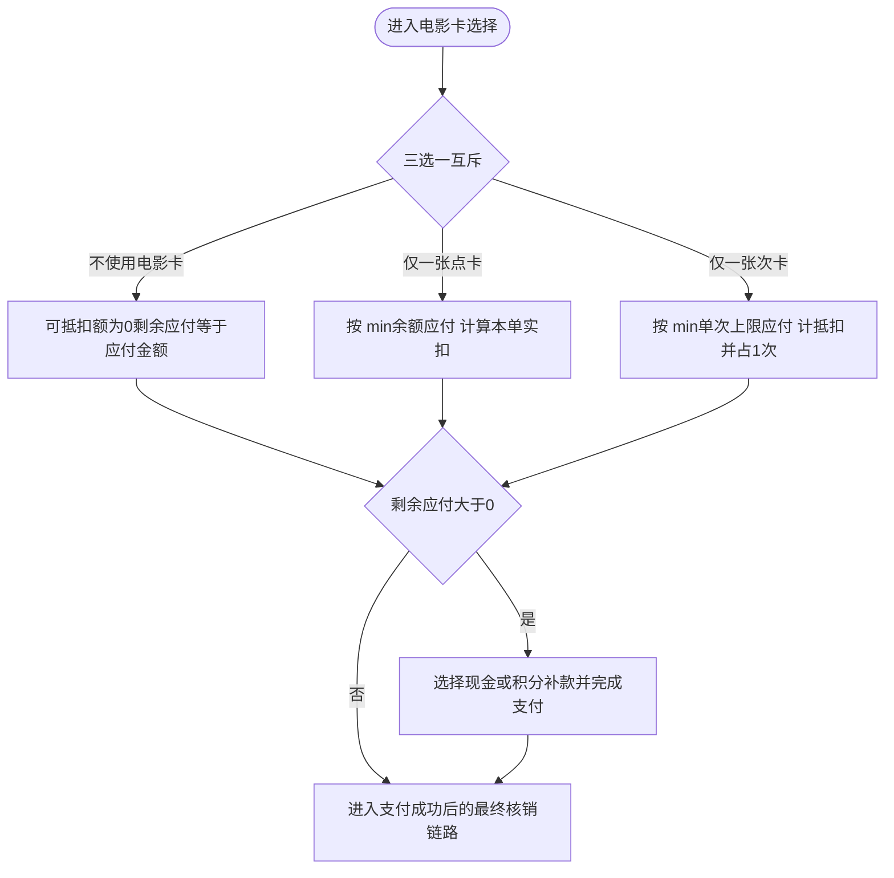
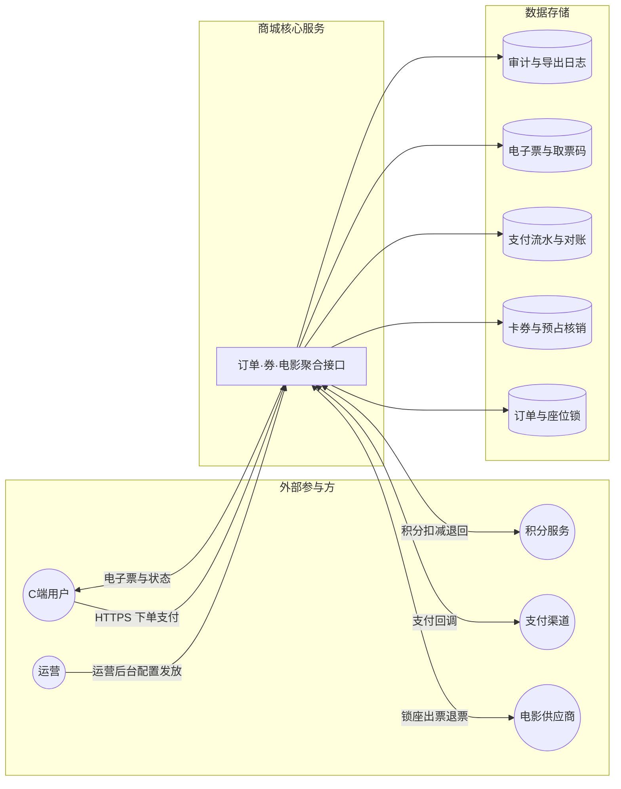

# PRD：电影票下单与电影卡券（次卡/点卡）

| 项 | 内容 |
|----|------|
| 文档版本 | v1.3 |
| 状态 | 评审稿 |
| 关联需求编号 | 15.1 电影票下单、15.2 创建电影优惠卡、15.3 次卡/点卡核销 |

---

## 1. 背景与目标

### 1.1 背景

C 端用户在品牌商城小程序内通过电影 H5 完成选座购票；订单由商城管理后台处理金额、卡券与支付，并由电影供应商出票。运营侧通过运营管理后台配置并发放**次卡、点卡**，与下单、核销、支付链路强耦合。

### 1.2 目标

- 用户可完成：定位/选城市 → 选影院影片 → 选座 → 锁座 → 选卡券 → 支付（含补款）→ 收二维码票。
- 系统保证：**锁座与库存一致性**、**卡券扣减与资金一致**、**出票失败可恢复或可退款**。
- 运营可完成：卡券创建、规则配置、线上定向发放、线下导出卡密。

### 1.3 非目标（本期不做）

- 次卡/点卡与优惠券、满减活动的叠加（明确不支持）。
- **同一订单内次卡与点卡同时使用**（明确不支持；**三选一**：不使用电影卡、仅使用一张点卡、仅使用一张次卡）。
- 单订单使用多张次卡（明确不支持，每单至多 1 张次卡）。

---

## 2. 名词解释

| 名词 | 定义 |
|------|------|
| 应付金额 | 用户本次订单需向商城支付的总额（含票价及商城侧加价/服务费，以商品配置为准）。 |
| 可抵扣金额 | 在规则允许下，卡券可从「应付金额」中抵扣的上限金额。 |
| 点卡 | 储值型卡券，有余额；按笔扣减余额，余额为 0 则失效；**与次卡互斥**，每单至多用 1 张。 |
| 次卡 | 计次型卡券，有剩余次数与「单次抵扣金额上限」；每单最多用 1 张；**与点卡互斥**。 |
| 点卡与次卡互斥 | 同一笔电影订单的抵扣维度上，**只允许绑定其中一种**或均不绑定；不可先点卡再叠次卡，亦不可反向叠加。 |
| 补款 | 在使用点卡或次卡后，若仍有剩余应付，用户以现金和/或积分支付的差额（与「次卡+点卡」无关）。 |

---

## 3. 角色与权限

| 角色 | 系统 | 能力 |
|------|------|------|
| C 端用户 | 小程序 / 电影 H5 | 浏览、选座、下单、选券、支付、查看电子票。 |
| 商城系统 | 商城管理后台 | 订单、锁座、算价、查券、核销、支付回调、对接供应商、退款。 |
| 运营 | 运营管理后台 | 电影卡券管理、创建次卡/点卡、批量发放、导出卡密（建议权限：运营部或等价角色）。 |
| 电影供应商 | 外部接口 | 锁座/占座（若与商城分工为供应商锁座则以此为准）、出票、退票接口（若合作范围包含）。 |

---

## 4. 流程图（功能 / 数据）

以下使用 [Mermaid](https://mermaid.js.org/) 描述，可在支持 Mermaid 的 Markdown 预览器或文档平台中渲染；评审时也可据此导出 PNG/SVG。

### 4.1 端到端功能总览（15.1 + 商城 + 供应商）

### 4.2 15.1 下单主链（泳道简化）

### 4.3 15.2 运营创建与发放卡券

### 4.4 支付、核销与出票（与第 6 章状态机一致）

- 若本单 **未选电影卡**（`movie_card_mode = NONE`）：**跳过**「预占卡券」与「最终核销」中的卡券分支，仅校验锁座并走全额现金/积分支付；支付成功后直接进入「请求供应商出票」。

### 4.5 15.3 电影卡互斥与分支（试算与最终核销共用算价公式）

**规则**：同一订单仅允许 **不使用 / 1 张点卡 / 1 张次卡** 三种之一，点卡与次卡**不得**同单勾选；切换类型时须释放对另一类型的任何试算状态。

### 4.6 数据流程图（主要实体与流向）

**图例说明**

- **功能图**：强调角色职责与步骤顺序；异常分支详见第 8 章。
- **数据图**：强调「谁读写哪些数据」；具体表结构由数据字典另文维护。

---

## 5. 金额与算价规则（补缺口：抵扣顺序与组成）

### 5.0 电影卡互斥与适用边界

- **范围**：本模块「电影卡」仅指**点卡**、**次卡**（不含商城通用优惠券、满减）。
- **互斥（已定稿）**：同一电影订单在抵扣维度上 **三选一**——**不使用电影卡**、**仅绑定 1 张点卡**、**仅绑定 1 张次卡**；**禁止**同单同时使用点卡与次卡，亦禁止同单绑定 2 张及以上点卡或 2 张及以上次卡。
- **订单快照**：`movie_card_mode ∈ { NONE, POINT, TIMES }` 与至多一个 `card_id`；支付与核销仅消费该快照，避免中途改券类型造成双扣。
- **C 端交互**：采用 Tab 或单选「不使用 / 点卡 / 次卡」；切换类型时清空另一类已选并重新试算；**另一类型入口置灰或隐藏**。
- **接口校验**：若请求同时携带点卡 ID 与次卡 ID，或携带 2 个点卡 ID，**拒绝下单**（HTTP 4xx + 业务错误码，文案：不可同时使用点卡与次卡）。

### 5.1 应付金额组成

**应付金额 = 票价合计（含分区价差）+ 商城服务费（若有）− 不参与卡券叠加的其他优惠（本期无）**

说明：

- 「票价合计」以选座页确认锁座成功时的**锁定价**为准；若供应商价格在锁座有效期内变更，仍以锁座回传价为准（需在供应商对接协议中约定）。
- 优惠券、满减与**次卡、点卡不同时生效**；用户若已选次卡/点卡，界面隐藏或禁用优惠券与满减入口。

### 5.2 点卡可抵扣金额

- 适用前提：本单 `movie_card_mode = POINT` 且已选唯一一张点卡（与次卡**互斥**，见第 5.0 节）。
- **单笔可抵扣金额** = `min(点卡当前余额, 应付金额)`。
- 用户可在选卡后调整「使用金额」不超过上述上限（默认拉满）。
- 抵扣后 **剩余应付** = `应付金额 − 点卡本次实扣`。

### 5.3 次卡可抵扣金额

- 适用前提：本单 `movie_card_mode = TIMES` 且已选唯一一张次卡（与点卡**互斥**，见第 5.0 节）。
- **本单次卡可抵扣金额** = `min(次卡「单次消费金额上限」, 应付金额)`。
- 每单仅允许绑定 **1** 张次卡。
- 抵扣后 **剩余应付** = `应付金额 − 本单次卡抵扣额`。

### 5.4 补款支付方式

- 剩余应付 > 0 时，用户须选择 **现金支付** 和/或 **积分支付**（若商城支持组合：优先扣积分至规则上限，不足部分现金；具体比例与积分汇率由商城统一配置，写入「积分规则」子文档）。
- 剩余应付 = 0 时，无需唤起现金支付通道（是否仍需「0 元确认」或内部关单以生成账务流水，由**财务与支付渠道**约定，并与第 6.2 节「支付成功」判定条件一致）。

---

## 6. 支付与核销时序（补缺口：先后与一致性）

### 6.1 原则

- **不在未支付成功前完成不可逆的供应商出票**（避免无款出票）。
- **卡券核销与「用户资金到账」绑定**：采用「**支付成功后再最终核销卡券**」；选券页可做**预占/试算**，锁券在「提交订单」或「发起支付」时生效，以 6.2 为准。

### 6.2 推荐状态机（与 15.1、15.3 对齐）

| 阶段 | 用户动作 | 系统动作 | 卡券状态 |
|------|----------|----------|----------|
| A | 选座完成 | 锁座成功，创建订单草稿 | 未占用 |
| B | 电影卡三选一（不用 / 点卡 / 次卡） | 试算抵扣，展示剩余应付；互斥校验 | 未占用 |
| C | 点击「去支付」 | **预占卡券**（若选了点卡/次卡：冻结余额或冻结 1 次；若未选卡则跳过；时效与支付超时一致） | 预占中 / 不适用 |
| D | 支付成功（含补款 0 元确认若需要） | **最终核销**：按订单快照仅处理一种——点卡扣减实扣金额 **或** 次卡扣减 1 次，**或**未选卡则跳过核销；余额/次数为 0 则置无效 | 已核销 / 无效 / 不适用 |
| E | 支付失败或超时 | **释放预占**（若有），锁座按超时规则释放 | 释放 |
| F | 支付成功但核销失败（极端） | **进入补偿**：自动重试核销（幂等）；仍失败则**自动全额退款**（含已扣积分回滚）并解锁座位、置订单失败 | 以补偿结果为准 |

说明：若技术实现选择「先核销再支付」，须具备**支付失败自动冲正卡券**的幂等接口；本期 PRD **默认采用上表「预占 + 支付成功后核销」**，与「支付完成后次卡/点卡核销失败」异常场景一致，且便于对账。

### 6.3 与流程图 15.1 的表述差异

原图顺序为「选券 → 15.3 核销 → 完成支付」。落地时：**15.3 拆为「预占 + 支付后最终核销」**；产品对外文案仍可为「选券后去支付」，不在 C 端拆两段技术术语。

---

## 7. 功能需求

### 7.1 15.1 电影票下单（C 端 + 商城 + 供应商）

**主流程**

1. 进入电影 H5。
2. **定位地区**：成功则带入城市；失败则提示手动选择城市，并可记忆本次手动选择（本地缓存）。
3. 选择影院、影片、场次。
4. 选座；调用锁座（商城或供应商，与接口一致）。
5. **下单锁座**：生成订单，回传应付金额（按第 5 章计算）。
6. 查询用户可用点卡、次卡列表（过滤：未过期、状态有效、渠道适用）；服务端与客户端均按第 5.0 节 **互斥** 展示。
7. 用户完成 **三选一**：不使用电影卡、绑定 1 张点卡、绑定 1 张次卡；切换类型时清空另一类选择并重新试算；展示补款额。
8. 发起支付（含预占卡券，见第 6 章）。
9. 支付成功 → 最终核销 → 调用供应商 **出票**。
10. 出票成功 → 用户收到 **二维码/取票码**；订单进入「已出票」类终态。

**定位失败**

- 提示：无法获取定位，请手动选择城市。
- 城市列表与影院数据以运营配置或供应商数据为准。

**座位锁定失败**

- 提示原因（座位被占、网络超时等）；返回选座页，不生成有效订单或仅保留失败记录。

**支付超时**

- 订单状态：「待支付」→「已关闭」；释放锁座与卡券预占；用户可重新下单。

### 7.2 15.2 创建电影优惠卡（运营后台）

**权限**：仅具备「电影卡券管理」权限的角色（如运营部）。

**流程**

1. 进入电影卡券管理 → 创建电影卡券。
2. 选择类型：**点卡** / **次卡**。
3. 设定规则：
   - 点卡：面额（初始余额）、有效期。
   - 次卡：总次数、单次消费金额上限、有效期。
4. 生成卡券实例或批次。
5. 发放方式：
   - **线上**：批量指定用户（见 7.2.1）。
   - **线下**：导出卡号+卡密（或仅卡密，视安全规范），用于制卡。

**7.2.1 批量发放用户维度（补缺口）**

- 支持：**会员 UID**、**手机号**（需 11 位校验）、**批量导入 Excel/CSV**（模板字段：`user_id` 或 `mobile` 二选一必填）。
- 校验：用户存在于商城；重复行去重；单批次上限（如 5 万条，可配置）防止误操作。
- 结果：发放成功/失败清单可下载；失败原因：用户不存在、格式错误、超出单用户持券上限（若有）。

### 7.3 15.3 次卡/点卡核销（系统逻辑）

与第 6 章结合：**预占阶段**与**支付成功核销阶段**使用同一套公式（第 5 章），仅「是否写最终账务」不同。**预占与核销均须读取订单上的 `movie_card_mode`，保证点卡与次卡逻辑分支不会在同单并发执行。**

**互斥与切换**

- 用户从点卡切换到次卡（或反向、或改为「不使用」）时：**先释放**原类型的预占（若已进入预占阶段），再按新选择试算；禁止在任一 API 中同时提交两类卡 ID。

**点卡**

- 预占：冻结「本次计划扣减金额」。
- 支付成功：从余额扣除；若扣后余额为 0 → 卡状态 **无效**。
- 若预占后用户改选更少抵扣额：须先释放预占再重新预占。

**次卡**

- 预占：冻结 **1 次**（或标记「本订单占用 1 次」）。
- 支付成功：剩余次数 −1；若为 0 → **无效**。
- 每单仅 1 张次卡；不可与同单点卡并用；不可拆分多张次卡支付同一单。

**补款**

- 当 `剩余应付 > 0`：必须选择现金/积分（或组合）并完成支付后，才视为本单支付成功，进入最终核销与出票。

**订单状态命名（与图中「待发货」对齐电影票场景）**

- 建议统一：**待支付** → **支付成功待出票**（原「待发货」语义）→ **已出票** / **出票失败** / **已关闭** / **已退款**。

---

## 8. 异常场景与 SLA（补缺口：供应商失败与核销失败）

| 场景 | 用户侧 | 系统侧 | SLA / 规则 |
|------|--------|--------|------------|
| 定位失败 | 引导手动选城 | 记录埋点 | — |
| 锁座失败 | 提示重选 | 无扣款无占券 | — |
| 支付超时 | 订单关闭提示 | 释放锁座、释放卡券预占 | 超时时间与锁座有效期一致，可配置，建议 ≤15 分钟 |
| 支付成功，核销失败 | 「订单处理中，请稍候」 | 自动重试（幂等），间隔 1s/3s/10s，最多 5 次 | 全部失败后 **30 分钟内** 自动全额退款到账；短信/订阅消息通知 |
| 支付成功且核销成功，出票失败 | 「出票失败，已为您退款」或「正在重试出票」 | 自动重试出票（与供应商约定幂等）；仍失败则退款 | 自动退款 **30 分钟内** 完成原路退回；需人工兜底工单 **T+1 工作日**；**须同步恢复卡券权益**（点卡退回本单实扣金额、次卡退回本单已扣 1 次，与第 9 章一致，避免只退现金不退权益） |
| 出票成功但展示失败 | 订单详情可重新打开二维码 | 以订单维存储取票码 | — |

退款顺序：优先原路退回实付现金；积分按商城规则退回积分账户。

---

## 9. 退票、改签与卡券回退（补缺口）

若本期**不支持**退票/改签：在订单页与购票须知中声明，本表可标「不适用」。

若**支持**（与供应商合同一致时启用）：

| 类型 | 规则 |
|------|------|
| 点卡 | 订单全额退且该笔曾用点卡抵扣：已扣金额 **退回点卡余额**，卡恢复有效（若原已无效且因退款恢复有余额则重新有效）。部分退：按商城规则比例退回现金与点卡（产品需单列子 PRD）。 |
| 次卡 | 整单取消且未核销最终次数：释放预占或退回已扣 **1 次**；若已核销仅退供应商票款部分，次卡次数是否退由「是否仍视为已消费一次」决定——**默认：供应商确认退票成功后退回 1 次**。 |
| 改签 | 视为退旧锁新：先走退票规则，再重新选座锁座；卡券按新单重新试算。 |

---

## 10. 数据与埋点（建议）

- 漏斗：进入 H5 → 选座成功 → 发起支付 → 支付成功 → 出票成功。
- 异常率：锁座失败、支付超时、核销失败、出票失败分渠道统计。
- 卡券：发放量、核销量、预占释放量、0 元单占比；**互斥违规拦截**次数（同请求携带点卡+次卡等，应为 0 或趋近于 0）。

---

## 11. 验收标准（摘要）

1. **次卡与点卡同单互斥**（三选一：不用 / 仅点卡 / 仅次卡）；与优惠券、满减亦不可叠用；任一违规组合前端不可提交，后端拒绝并返回可读错误码。
2. 次卡每单最多 1 张；点卡每单最多 1 张；超额或双类型同传时后端拒绝。
3. 次卡抵扣受「单次金额上限」约束；超额部分仅能通过现金/积分补款。
4. 点卡余额不足部分可补款；余额扣至 0 卡状态为无效（本单为「仅点卡」模式，与次卡互斥见第 1 条）。
5. 支付超时后锁座与卡券预占均被释放，用户可重新下单。
6. 支付成功出票失败时，满足第 8 章退款 SLA 或重试出票成功。
7. 运营批量导入支持模板校验与失败清单下载。
8. 线下导出文件含脱敏说明与下载审计日志（权限与次数限制）。

---

## 12. 开放问题（需业务/法务确认）

- 积分与现金组合支付的具体算法及积分发票/税务口径。
- 供应商侧锁座时长、超卖责任、票价浮动是否可能存在（若存在则需在锁座协议中封闭）。
- 是否开通退票改签；若开通，与供应商结算周期及对账方式。

---

## 13. 逻辑评审补充（仍建议收口）

以下为通读全文后发现的**额外逻辑点**或**未写死的产品决策**，建议在评审会逐条确认并吸收进正文对应章节。

### 13.1 卡券组合规则（已定稿）

- **次卡与点卡**：**不可**在同一订单内同时使用；已写入第 1.3 节、第 5.0 节及第 11 节验收标准。
- **多张点卡同单**：**不支持**，每单至多 1 张点卡（与次卡「每单 1 张」对称）。

### 13.2 锁座时效与支付预占的先后关系

- 若**锁座过期时间**短于**支付等待时间**，用户可能在支付页因锁座失效而支付成功却无法出票；须约定：**发起支付前二次校验锁座**，失效则阻断支付并引导重新选座；或 **支付超时 ≤ 锁座剩余有效期**。

### 13.3 组合支付（现金 + 积分）失败分支

- 当前仅描述「支付成功」后链路；若存在**积分已扣、现金渠道失败**等部分成功，须定义：**事务回滚**（积分回滚 + 不确认订单）、重试策略与用户提示，避免「半支付」态。

### 13.4 用户从支付页返回修改卡券

- 第 7.3 节已写「改少抵扣须先释放预占」；须补充交互：**未支付时从收银台返回选券页**应自动释放预占与支付单，避免长时间占用他人可选库存或卡券次数。

### 13.5 并发与幂等

- 同一卡券多端同时支付：预占须**互斥**（数据库行锁/分布式锁/版本号），否则可能出现超额核销；建议在技术方案章节（或附录）要求「卡维度幂等与预占唯一订单号绑定」。

### 13.6 0 元订单与对账

- 「卡券全额覆盖应付」时，是否走真实支付通道、是否生成支付单号、是否与财务凭证对齐，需在 6.2 与财务共同定稿，避免对账缺口。

### 13.7 其他可增强项（非阻塞）

- **卡券适用渠道/场次**：列表过滤写「渠道适用」但未定义枚举（仅电影 H5、全渠道等）。
- **有效期与时区**：卡「自然日到期」与「场次开场时间」跨时区时的边界（尤其节假日场次）。
- **线下卡密**：首次绑定用户、盗刷举证、导出次数与审计（正文 10 已提审计，可补风控规则）。

---

## 14. 修订记录

**维护约定**：每次对正文做实质性修订时，递增文档版本号（如 v1.2 → v1.3），并在下表**末尾追加一行**修订记录；不删除或改写历史行，便于审计与对照。

| 版本 | 日期 | 说明 |
|------|------|------|
| v1.0 | — | 初稿：合并 15.1–15.3 流程图并补全逻辑缺口 |
| v1.1 | — | 逻辑评审：修正无效引用「7.2」；出票失败补充卡券权益回退；新增待收口项（现第 13 章） |
| v1.2 | — | 新增第 4 章「流程图」：端到端功能总览、15.1 泳道、15.2 运营发放、支付核销出票、15.3 分支、数据流图（Mermaid）；原第 4–13 章顺延为第 5–14 章，并同步正文内章节引用 |
| v1.3 | — | **次卡与点卡同单互斥**定稿：新增第 5.0 节、名词与流程图 4.5 优化、状态机与 7.1/7.3/第 11 章同步；明确每单至多 1 张点卡；第 13.1 节由待收口改为已定稿 |
