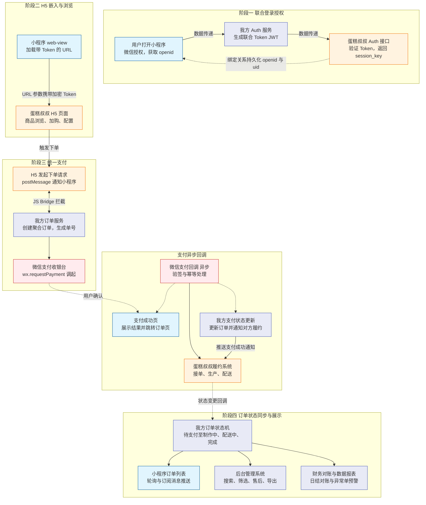

# 蛋糕叔叔 · 联调流程图

以下在支持 Mermaid 的编辑器中预览（如 VS Code / Cursor 安装「Markdown Preview Mermaid Support」、或 GitHub 直接查看）。



## 若仍无法显示

1. **必须用围栏**：上图已用 ` ```mermaid ` … ` ``` ` 包裹；纯 `graph TD` 无围栏时多数 Markdown 不会当 Mermaid 渲染。
2. **避免特殊符号**：原图边标签中的 `↔`、`&`、`+` 等已改为普通中文，减少解析器报错。
3. **子图标题**：改用 `subgraph id["标题"]` 双引号包裹，且标题内不用英文冒号 `:`，避免与子图语法冲突。
4. **节点内换行**：原 `<br/>` 在部分 Mermaid 版本中对中文不稳定，已改为空格分段；若需换行可改回 `"第一行<br/>第二行"` 并自行在本地预览验证。
