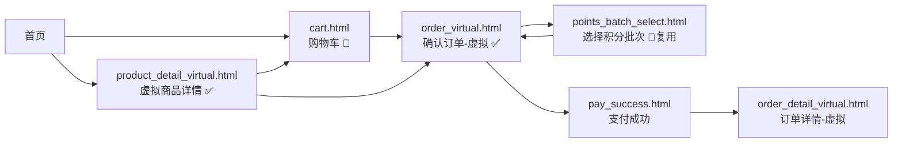
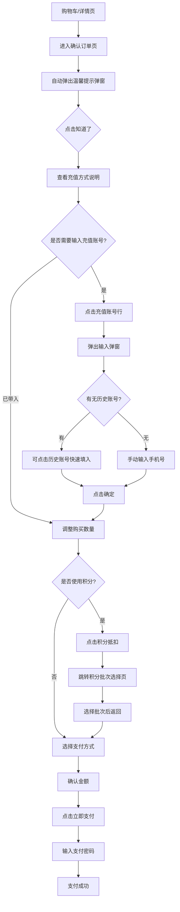
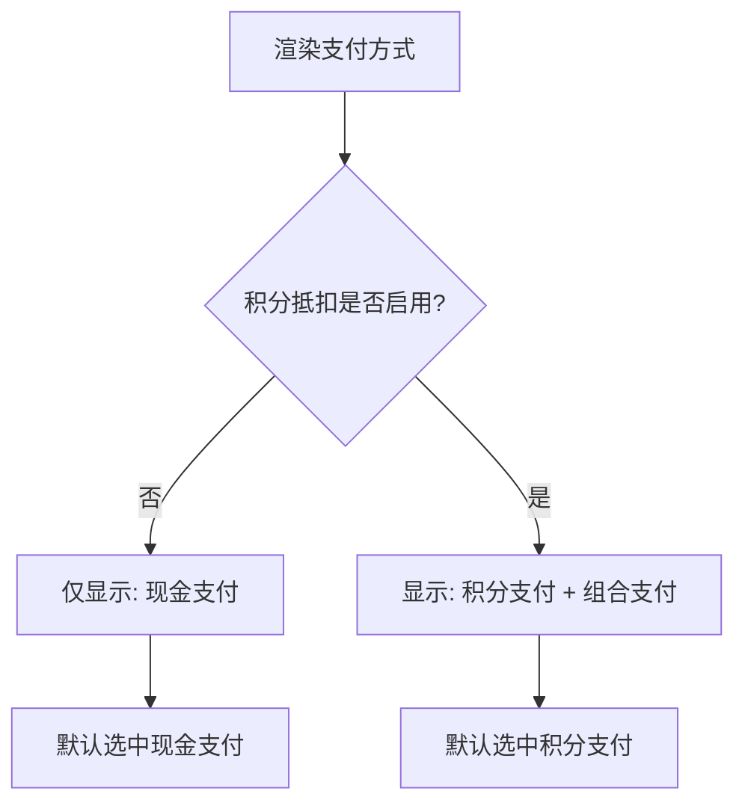
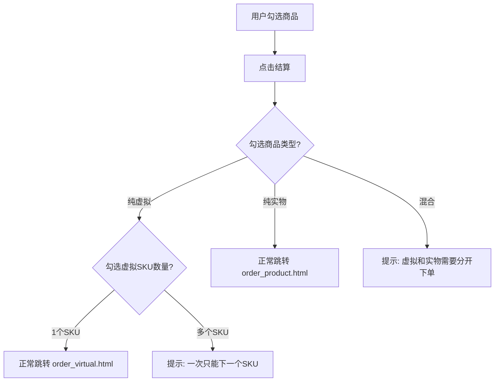
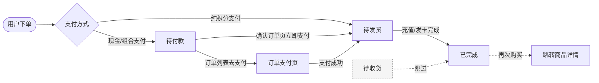
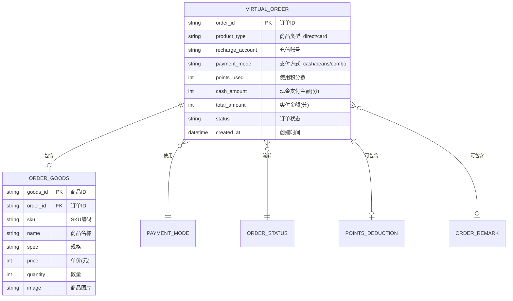

# PRD-福利商城-虚拟商品下单流程-V0.6

> **版本**: V0.6 | **日期**: 2026-07-14 | **状态**: 原型稿
>
> **原型目录**: `c:\Users\Administrator\Documents\qoder_project\mini-program\`
>
> **关联版本**: 本版本在 V0.3 实物下单流程基础上，独立新增虚拟商品下单链路，两者互不影响。

***

## 一、范围边界

| 范围            | 内容                                                                                                                                                                  |
| ------------- | ------------------------------------------------------------------------------------------------------------------------------------------------------------------- |
| **In Scope**  | 虚拟商品独立详情页（直充/卡密类型标签）；虚拟商品独立确认订单页（充值方式展示、充值账号输入、历史账号记录、温馨提示弹窗、积分抵扣选择、支付方式选择）；购物车虚拟商品校验规则（同一SKU限制、数量调整）；支付方式（积分支付、现金支付、组合支付）；跳转积分批次选择页（复用 points\_batch\_select.html） |
| **Out Scope** | 虚拟商品管理后台；虚拟商品实际发货/充值接口对接；卡密生成与管理；虚拟商品售后/退款流程；优惠券抵扣                                                                                                                  |

***

### 一.1 角色列表

| 代号     | 角色   | 说明                  |
| ------ | ---- | ------------------- |
| R-USER | 商城用户 | 福利商城终端消费者，浏览商品、下单购买 |

***

## 二、页面清单

| 序号 | 页面名称       | 文件名                           | 路由                                   | 状态    | 说明                     |
| -- | ---------- | ----------------------------- | ------------------------------------ | ----- | ---------------------- |
| 1  | 虚拟商品详情页    | product\_detail\_virtual.html | /pages/product\_detail\_virtual.html | ✅ 原型  | 独立于实物详情页，不含商品类型规格选择    |
| 2  | 确认订单（虚拟商品） | order\_virtual.html           | /pages/order\_virtual.html           | ✅ 原型  | 独立于实物确认订单页，精简订单流程      |
| 3  | 订单详情（虚拟商品）| order\_detail\_virtual.html   | /pages/order\_detail\_virtual.html   | ✅ 原型  | 独立于实物订单详情，展示卡密信息，无物流无售后 |
| 4  | 购物车        | cart.html                     | /pages/cart.html                     | 🔄 更新 | 新增虚拟商品，新增虚拟商品校验逻辑    |
| 5  | 我的订单       | order\_list.html              | /pages/order\_list.html              | 🔄 更新 | 新增虚拟商品订单卡片，不含售后入口      |
| 6  | 选择积分批次     | points\_batch\_select.html    | /pages/points\_batch\_select.html    | 🔄 复用 | 虚拟商品下单时积分抵扣选购导入该页面，不改动 |

### 二.1 页面详情

**页面1: 虚拟商品详情页（product\_detail\_virtual.html）**

- **入口**: 购物车 > 虚拟商品点击、首页虚拟商品入口
- **与普通商品详情页的区别**:
  1. 标题区域显示"直充"或"卡密"商品类型标签（商品自带属性，非可选规格）
  2. 无收货地址选择区域
  3. 无配送时效提示
- **底部操作**: 立即购买 / 加入购物车

**页面2: 确认订单（虚拟商品）（order\_virtual.html）**

- **入口**: 购物车 > 虚拟商品结算、虚拟商品详情页 > 立即购买
- **页面布局（从上到下）**:
  - 商品列表卡片（商品图片、名称、规格、单价、数量调整）
  - **充值信息卡片**（合并卡片）:
    - 充值方式：字段名 + 字段值（直充/卡密）同行展示；第二行灰色小字说明左对齐
      - 直充说明："购买后将自动充值到填写的手机号账号，充值成功后无法撤销"
      - 卡密说明："购买后将通过短信将卡密发送到填写的手机号，请注意查收"
    - 分隔线
    - 充值账号：字段名 + 已选账号/提示文案 + ">" 箭头，点击弹出输入弹窗
  - 备注卡片（点击弹出备注输入弹窗）
  - 价格明细：商品金额、积分抵扣（可点击选择）、现金支付、实付金额
  - 支付方式选择卡片：根据积分使用状态动态可选
  - 底部提交栏：显示实付金额 + 立即支付按钮
- **温馨提示弹窗**: 页面加载默认弹出，内容为充值类商品风险提示
- **充值账号输入弹窗**:
  - 历史账号选择区域（仅记录1个最近账号）
  - 输入框 + 提示文案（"请仔细核对充值账号，充值成功后无法退款"）
  - 确定按钮
- **积分抵扣**: 点击跳转 points\_batch\_select.html，选择确认后返回 order\_virtual.html

**页面3: 订单详情（虚拟商品）（order\_detail\_virtual.html）**

- **入口**: 我的订单 > 虚拟商品订单 > 查看详情；虚拟商品支付成功 > 查看订单
- **与实物订单详情页的区别**:
  1. 无收货地址区域
  2. 无物流信息区域
  3. 无售后入口
  4. 不展示订单状态头部，仅以提示条形式告知发货结果
- **页面布局（从上到下）**:
  - 发货提示条：轻量提示"卡密已发送至充值账号，请注意查收"（不展示订单状态徽标）
  - 商品卡片：商品图片、名称、规格、单价、数量
  - **卡密信息卡片**:
    - 充值方式：卡密（当前版本仅支持卡密）
    - 充值账号：用户下单时填写的手机号或QQ号，明文展示（不脱敏）
    - 卡密列表：按商品购买数量生成对应组数，每组独立展示并带序号"卡密 N / 总数"
      - 卡号：系统生成的卡号，支持复制
      - 密钥：系统生成的密钥，支持复制
      - 兑换链接：第三方兑换链接，仅支持复制（不跳转）；单行展示，超长时末尾省略号截断，复制按钮固定不被挤压
    - 多组卡密默认折叠：仅展示第 1 条卡密，底部"展开剩余 N 条卡密"按钮可展开/收起全部；仅 1 条时不显示折叠按钮
  - 订单信息卡片：订单编号、下单时间、支付方式、积分抵扣、实付金额
  - 底部操作栏：再次购买

**页面4: 购物车（cart.html）【更新】**

- **虚拟商品数据**: 包含直充和卡密两类虚拟商品，各至少一个SKU
- **虚拟商品标识**: 商品名称旁显示"虚拟"标签
- **虚拟商品校验逻辑**:
  - 购物车下单时校验：虚拟商品一次只能下一个SKU（勾选多个虚拟SKU时提示）
  - 虚拟商品一个SKU可下多个数量（数量调整正常）
  - 虚拟商品与实物商品需分开下单（同时勾选时提示）

**页面5: 我的订单（order\_list.html）【更新】**

- 新增虚拟商品订单卡片，标记 `virtual: true`
- 虚拟商品订单卡片**不展示售后入口**（无退换/售后、仅退款按钮）
- 仅显示"查看详情"操作，点击跳转 order\_detail\_virtual.html

**页面6: 选择积分批次（points\_batch\_select.html）【复用】**

- 虚拟商品确认订单页点击"积分抵扣"跳入该页面，选择确认或返回后回到来源页面
- 页面本身不做任何修改

***

### 二.2 页面跳转关系

***

## 三、业务场景（用例图）

### 三.1 虚拟商品下单模块

| UC编号     | 用例名称      | 角色     | 说明                            |
| -------- | --------- | ------ | ----------------------------- |
| UC-V-001 | 浏览虚拟商品详情  | R-USER | 查看虚拟商品详情，标题区域展示直充/卡密类型标签      |
| UC-V-002 | 查看充值方式说明  | R-USER | 在确认订单页查看充值方式对应的发货方式说明         |
| UC-V-003 | 输入充值账号    | R-USER | 输入充值手机号，可快速选择历史账号             |
| UC-V-004 | 调整商品数量    | R-USER | 在确认订单页修改购买数量                  |
| UC-V-005 | 添加订单备注    | R-USER | 输入订单备注信息（选填）                  |
| UC-V-006 | 查看温馨提示    | R-USER | 进入确认订单页自动弹出温馨提示弹窗             |
| UC-V-007 | 选择积分抵扣    | R-USER | 点击积分抵扣跳转积分批次选择页，选择后返回         |
| UC-V-008 | 选择支付方式    | R-USER | 选择积分支付/现金支付/组合支付              |
| UC-V-009 | 输入支付密码    | R-USER | 确认支付，输入6位支付密码                 |
| UC-V-010 | 购物车虚拟商品校验 | R-USER | 购物车中虚拟商品只能下单一个SKU，不可与实物商品合并下单 |
| UC-V-011 | 查看虚拟订单卡密   | R-USER | 进入虚拟订单详情查看多组卡密，复制卡号/密钥/兑换链接 |

**验收标准（AC-V）**

| AC编号     | 验收标准          |   对应用例   | Given           | When      | Then                           |
| -------- | ------------- | :------: | --------------- | --------- | ------------------------------ |
| AC-V-001 | 虚拟商品详情页展示类型标签 | UC-V-001 | 进入虚拟商品详情页       | 页面加载完成    | 标题区域显示"直充"或"卡密"标签              |
| AC-V-002 | 充值方式展示发货说明    | UC-V-002 | 商品类型为直充         | 进入确认订单页   | 充值方式显示"直充"，小字说明展示直充到手机号的描述     |
| AC-V-003 | 充值方式卡密展示发货说明  | UC-V-002 | 商品类型为卡密         | 进入确认订单页   | 充值方式显示"卡密"，小字说明展示短信发送卡密的描述     |
| AC-V-004 | 充值账号输入        | UC-V-003 | 进入确认订单页         | 点击充值账号行   | 弹出输入弹窗，可输入手机号或选择历史账号           |
| AC-V-005 | 历史账号记录        | UC-V-003 | 首次输入充值账号并确认     | 再次进入确认订单页 | 显示上次输入的账号（脱敏展示）                |
| AC-V-006 | 数量调整          | UC-V-004 | 商品数量为1          | 点击"+"按钮   | 数量增加为2，商品金额和实付金额更新             |
| AC-V-007 | 数量最小限制        | UC-V-004 | 商品数量为1          | 点击"-"按钮   | 按钮置灰不可点击，数量保持为1                |
| AC-V-008 | 温馨提示弹窗        | UC-V-006 | 进入确认订单页         | 页面加载完成    | 自动弹出温馨提示弹窗，点击"知道了"关闭           |
| AC-V-009 | 积分抵扣跳转        | UC-V-007 | 有积分余额           | 点击积分抵扣行   | 跳转积分批次选择页                      |
| AC-V-010 | 积分批次返回        | UC-V-007 | 在积分批次选择页        | 点击确认或返回   | 回到虚拟商品确认订单页，积分状态更新             |
| AC-V-011 | 不使用积分时支付方式    | UC-V-008 | 积分抵扣选择"不使用"     | 渲染支付方式    | 仅显示"现金支付"                      |
| AC-V-012 | 使用积分时支付方式     | UC-V-008 | 积分抵扣选择"使用"      | 渲染支付方式    | 显示"积分支付"和"组合支付"，用户可自由选择       |
| AC-V-013 | 支付方式无灰色说明     | UC-V-008 | 支付方式列表渲染        | 查看支付方式项   | 不放"微信/支付宝"、"可用XX积分"等灰色小字       |
| AC-V-014 | 购物车单SKU限制     | UC-V-010 | 勾选2个虚拟商品SKU     | 点击结算      | 提示"虚拟商品一次只能下单一个SKU，请取消多余商品的勾选" |
| AC-V-015 | 购物车数量不限       | UC-V-010 | 勾选1个虚拟商品SKU     | 调整数量为5后结算 | 正常跳转确认订单页                      |
| AC-V-016 | 虚拟实物分开下单      | UC-V-010 | 勾选1个虚拟商品+1个实物商品 | 点击结算      | 提示"虚拟商品和实物商品需要分开下单"            |
| AC-V-017 | 多组卡密按数量展示    | UC-V-011 | 虚拟商品购买数量为 N(N>1) | 进入订单详情页 | 卡密信息卡片展示 N 组卡密，每组带"卡密 n / N"序号，各有独立卡号/密钥/兑换链接 |
| AC-V-018 | 多组卡密默认折叠      | UC-V-011 | 订单含多组卡密        | 页面加载完成    | 默认仅展示第 1 条卡密，底部显示"展开剩余 N-1 条卡密"按钮，点击可展开/收起 |
| AC-V-019 | 兑换链接仅复制不跳转    | UC-V-011 | 进入订单详情页        | 点击兑换链接"复制" | 仅复制链接内容不跳转；链接超长单行省略号截断，复制按钮不被挤压 |
| AC-V-020 | 充值账号明文展示      | UC-V-011 | 进入订单详情页        | 查看充值账号行  | 展示完整手机号/QQ号，不脱敏                      |

***

## 四、业务流程

### 四.1 虚拟商品下单主流程

### 四.2 支付方式动态渲染流程

### 四.3 购物车虚拟商品校验流程

### 四.4 异常与边界

| 场景        | 边界条件         | 处理方式                           |
| --------- | ------------ | ------------------------------ |
| 充值账号为空    | 未输入充值账号即提交   | 前端校验，提示"请输入充值账号"               |
| 充值账号格式错误  | 输入的手机号非11位数字 | 前端校验，提示"请输入正确的手机号"             |
| 充值账号过长    | 超过20个字符    | 截断处理，最多输入20个字符                |
| 无历史账号     | 首次下单无历史充值账号  | 输入弹窗不展示历史账号区域                  |
| 历史账号脱敏    | 显示历史账号       | 按 138\*\*\*\*1111 格式脱敏展示       |
| 积分余额为0    | 用户无可用积分      | 不展示积分抵扣行，仅显示现金支付               |
| 积分不足以支付全部 | 积分余额 < 商品金额  | 额外显示"组合支付"选项                   |
| 组合支付积分超限  | 输入积分 > 可用余额  | 提示"积分数量不能超过可用余额"               |
| 组合支付积分超商品 | 输入积分 > 商品金额  | 提示"积分数量不能超过商品金额"               |
| 商品数量最大限制  | 超过库存或99件     | 前端限制最大99件                      |
| 备注超长      | 备注超过200字   | 截断处理，最多输入200字，展示已输入字数       |
| 支付密码错误    | 输入密码不匹配      | 提示密码错误                         |
| 支付密码未完整   | 未输入6位密码      | 按钮保持不可提交状态                     |
| 积分批次页返回   | 未选择批次直接返回  | 积分抵扣恢复为"不使用"状态              |
| 购物车虚拟商品混合 | 同时勾选虚拟+实物    | 禁止结算，提示分开下单                    |

---

### 四.5 订单状态机

基于 [V0.3 订单状态流转](file:///c:/Users/Administrator/Documents/qoder_project/mini-program/doc/V0.3/业务逻辑清单_V0.3.md#L15)，虚拟商品订单跳过待收货，且不支持取消：

| 当前状态 | 可执行操作 | 入口页面 | 目标状态 |
|----------|-----------|----------|----------|
| — | 用户下单（纯积分支付） | 确认订单（order_virtual.html） | 待发货 |
| — | 用户下单（现金/组合支付） | 确认订单（order_virtual.html） | 待付款 |
| 待付款 | 立即支付 | 确认订单 → 收银台弹窗 | 待发货 |
| 待付款 | 去支付 | 订单列表 → 订单支付页 | 待发货 |
| 待发货 | 无（等待系统充值/发卡） | — | 已完成 |
| 已完成 | 再次购买 | 订单列表 | —（跳转商品详情） |

**与实物订单状态机的差异**：

| 差异点 | 实物订单 | 虚拟商品订单 |
|--------|----------|-------------|
| 待收货 | 存在 | **跳过**，待发货直接进入已完成 |
| 取消订单 | 支持 | **不支持** |
| 超时关闭 | 支持（15+3分钟） | **不支持** |
| 部分发货/部分签收 | 存在（中间态） | **不存在** |

***

## 五、实体关系

### 五.1 核心实体

### 五.2 支付方式枚举

| 模式代码  | 显示名称 | 说明               |
| ----- | ---- | ---------------- |
| cash  | 现金支付 | 全额使用现金（微信/支付宝）支付 |
| beans | 积分支付 | 全额使用积分支付         |
| combo | 组合支付 | 积分抵扣部分金额，剩余用现金支付 |

### 五.3 字段说明表

#### 五.3.1 虚拟订单（VIRTUAL\_ORDER）

| 序号 | 字段名               | 显示名  | 类型           | 必填 | 唯一 | 校验规则                | 来源/口径                       |
| -- | ----------------- | ---- | ------------ | -- | -- | ------------------- | --------------------------- |
| 1  | order\_id         | 订单ID | varchar(32)  | 是  | 是  | 系统生成                | 系统自动生成                      |
| 2  | product\_type     | 商品类型 | enum         | 是  | 否  | direct=直充 / card=卡密 | 商品自带属性                      |
| 3  | recharge\_account | 充值账号 | varchar(20)  | 是  | 否  | 手机号或QQ号             | 用户输入                        |
| 4  | payment\_mode     | 支付方式 | enum         | 是  | 否  | cash/beans/combo    | 用户选择                        |
| 5  | points\_used      | 使用积分 | int          | 否  | 否  | ≥0, ≤积分余额, ≤商品金额(分) | 用户选择或系统计算                   |
| 6  | cash\_amount      | 现金金额 | int          | 否  | 否  | ≥0, 单位为分            | 商品金额(分) - 积分抵扣              |
| 7  | total\_amount     | 实付金额 | int          | 是  | 否  | ≥0                  | 积分支付时为积分数量；现金/组合支付时为现金金额（分） |
| 8  | remark            | 备注   | varchar(200) | 否  | 否  | 长度0-200             | 用户输入                        |
| 9  | status            | 状态   | enum         | 是  | 否  | 待支付/已支付/充值中/已完成/已取消 | 订单状态流转                      |
| 10 | created\_at       | 创建时间 | datetime     | 是  | 否  | 系统时间                | 系统自动记录                      |

***

*文档结束。V0.51 版本原型已完成，后续可进入评审与后端接口对接阶段。*
