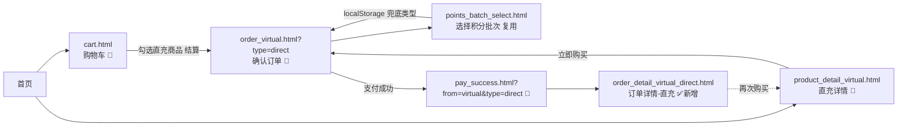

# PRD-福利商城-虚拟商品直充下单流程-V0.61

> **版本**: V0.61 | **日期**: 2026-07-28 | **状态**: 原型稿
>
> **基底版本**: V0.6（虚拟商品下单流程，仅实现卡密链路）
>
> **本版定位**: 在 V0.6 基础上补全「直充」商品下单链路，使虚拟商品形成卡密 / 直充两条并行链路。V0.6 原型与文档保留为历史档，不作改动。

---

## 一、变更背景与目标

V0.6 的虚拟商品模块仅在订单详情页实现了「卡密」类型（原文档注明"当前版本仅支持卡密"），但详情页与购物车数据中已存在「直充」商品（100元话费充值），导致直充链路断裂：

- 商品详情页（product_detail_virtual.html）渲染为直充，但"立即购买"跳入的确认订单页硬编码为卡密；
- 支付成功后"查看订单"固定跳卡密订单详情；
- 不存在直充订单详情页。

**V0.61 目标**：通过「路径参数 + 本地缓存」传递商品类型，让确认订单页按类型动态渲染文案，并新增直充专用订单详情页，形成完整直充链路，且不破坏 V0.6 卡密链路。

### 一.1 范围边界

| 范围 | 内容 |
|------|------|
| **In Scope** | 商品类型参数化传递（?type=direct\|card）；确认订单页按类型驱动 4 处文案；新增直充订单详情页（无卡密信息，展示到账面值/状态，多件多条折叠）；支付成功页按类型路由；我的订单新增直充订单卡片并按子类型路由 |
| **Out Scope** | 新建独立直充商品详情页（复用现有 product_detail_virtual.html）；卡密订单详情页改动；直充商品后台与真实充值接口；售后/退款 |

---

## 二、页面清单

| 序号 | 页面名称 | 文件名 | 路由 | 状态 | 说明 |
|------|----------|--------|------|------|------|
| 1 | 虚拟商品详情页（直充） | product_detail_virtual.html | /pages/product_detail_virtual.html | 🔄 增强 | 复用 V0.6 页面；"立即购买"改为带 `?type=direct` 跳转 |
| 2 | 确认订单（虚拟商品） | order_virtual.html | /pages/order_virtual.html?type=direct | 🔄 增强 | 按 `?type=` 驱动文案；无参默认 card，保持 V0.6 行为 |
| 3 | 订单详情（虚拟-直充） | order_detail_virtual_direct.html | /pages/order_detail_virtual_direct.html | ✅ 新增 | 直充专用，无卡密，展示到账信息，多条折叠 |
| 4 | 购物车 | cart.html | /pages/cart.html | 🔄 增强 | 虚拟商品数据加 type 字段；结算按类型带参（显示不变） |
| 5 | 支付成功 | pay_success.html | /pages/pay_success.html?from=virtual&type=direct | 🔄 增强 | "查看订单"按类型跳对应订单详情 |
| 6 | 我的订单 | order_list.html | /pages/order_list.html | 🔄 增强 | 新增直充虚拟订单卡片；虚拟订单按 virtualType 子类型路由详情页 |

---

## 三、类型传递机制

全程不把类型写死在文件中，采用「URL 参数优先 + localStorage 兜底」：

1. **入口带参**：购物车结算、商品详情"立即购买"跳转确认订单页时携带 `?type=direct` 或 `?type=card`。
2. **确认订单页读取**：进入 `order_virtual.html` 时，优先读 URL `?type=`；若有则写入 `localStorage['order_virtual_type']`。
3. **往返兜底**：用户点击"积分抵扣"会跳转 `points_batch_select.html`，返回 `order_virtual.html` 时 URL 不再带 type——此时读 `localStorage['order_virtual_type']` 恢复类型；均无则默认 `card`。
4. **下游传递**：确认订单页支付成功跳 `pay_success.html` 时携带 `?from=virtual&type=<类型>`，供支付成功页路由。

> 该机制确保直充用户在积分批次选择往返后类型不丢失；卡密链路因默认值=card 而**零回归**。

---

## 四、确认订单页类型差异（order_virtual.html）

确认订单页结构对两类商品完全一致，差异仅在以下 4 处文案 + 商品规格，由 `applyProductType()` 统一驱动：

| 驱动点 | 直充（direct） | 卡密（card） |
|--------|----------------|--------------|
| 充值方式标签 | 直充 | 卡密 |
| 充值方式说明 | 购买后将自动充值到填写的手机号账号，充值成功后无法撤销 | 购买后将通过短信将卡密发送到填写的手机号，请注意查收 |
| 商品规格 | 直充，全国通用 | 卡密，官方直充 |
| 温馨提示第 2 条 | 请仔细核对充值手机号，充值成功后无法撤销，请勿重复充值 | 刷单返利做兼职等均为常见骗术，切勿相信任何诱骗下单行为，请不要将卡密给到他人 |
| 充值账号占位符 | 请输入手机号 | 请输入充值账号 |
| 充值账号提示 | 请仔细核对充值手机号，充值成功后无法退款 | 请仔细核对充值账号，充值成功后无法退款 |

数量调整、备注、积分抵扣、支付方式动态渲染、收银台逻辑**两类完全相同**。充值账号校验沿用 `/^1\d{10}$/`（手机号），直充天然只需手机号，无需额外规则。

---

## 五、直充订单详情页（order_detail_virtual_direct.html）

### 五.1 与卡密订单详情页的差异

| 差异点 | 卡密订单详情页 | 直充订单详情页 |
|--------|----------------|----------------|
| 发货提示条 | 「卡密已发送至充值账号，请注意查收」 | 「话费已充值到充值账号，请查看到账信息」+ 成功图标 |
| 充值信息卡片 | 卡号 / 密钥 / 兑换链接（可复制） | **商品名称（取 SKU 名称） / 充值状态（已到账）**，无卡号密钥 |
| 兑换链接 | 有（仅复制不跳转） | 无 |
| 多组信息折叠 | 多组卡密默认折叠第 1 条 | 多条到账记录默认折叠第 1 条（交互一致） |

### 五.2 页面布局（从上到下）

1. **发货提示条**：轻量成功提示，带勾选图标，文案「话费已充值到充值账号，请查收到账信息」。
2. **商品卡片**：商品图片、名称、规格、单价、数量。
3. **到账信息卡片**：
   - 充值方式：直充
   - 充值账号：用户下单填写的手机号，明文展示（不脱敏）
   - 到账记录列表：按购买数量生成对应条数，每条独立展示并带序号「充值 N / 总数」
     - 商品名称：取 SKU 名称（如「100元话费充值」）
     - 充值状态：「已到账」，绿色 + 勾选图标
   - 多条默认折叠：仅展示第 1 条，底部「展开剩余 N 条充值信息」可展开/收起；仅 1 条时不显示折叠按钮
4. **订单信息卡片**：订单编号、下单时间、支付方式、积分抵扣、实付金额。
5. **底部操作栏**：再次购买（跳转 product_detail_virtual.html）。

---

## 六、页面跳转关系（直充链路）

---

## 七、数据字段补充

### 七.1 购物车商品（cartItems）

| 字段 | 类型 | 说明 |
|------|------|------|
| type | string | 虚拟商品子类型：`direct`(直充) / `card`(卡密)。仅虚拟商品携带；购物车结算时据此拼接 `?type=` |

### 七.2 订单列表项（orders）

| 字段 | 类型 | 说明 |
|------|------|------|
| virtualType | string | 虚拟订单子类型：`direct` / `card`。`getVirtualDetailUrl()` 据此返回对应订单详情页；实物订单不携带 |

---

## 八、验收标准（AC-V061）

| AC 编号 | 验收标准 | Given | When | Then |
|---------|----------|-------|------|------|
| AC-V061-001 | 详情页进入确认订单为直充 | 在直充商品详情页 | 点击立即购买 | 跳转 order_virtual.html?type=direct，充值方式显示"直充" |
| AC-V061-002 | 购物车结算进入确认订单带类型 | 购物车勾选直充商品(话费充值) | 点击结算 | 跳转 order_virtual.html?type=direct |
| AC-V061-003 | 卡密链路默认不受影响 | 直接访问 order_virtual.html（无参） | 页面加载 | 充值方式显示"卡密"，与 V0.6 一致 |
| AC-V061-004 | 直充方式说明文案 | 确认订单页类型=直充 | 查看充值方式说明 | 显示"自动充值到手机号…无法撤销" |
| AC-V061-005 | 温馨提示随类型切换 | 确认订单页类型=直充 | 查看温馨提示第 2 条 | 不出现"卡密"字样，显示手机号核对提示 |
| AC-V061-006 | 积分批次往返不丢类型 | 直充确认订单页 | 进入积分批次选择后返回 | 充值方式仍为"直充" |
| AC-V061-007 | 直充支付成功跳直充详情 | 直充确认订单页完成支付 | 进入支付成功页 | "查看订单"跳 order_detail_virtual_direct.html |
| AC-V061-008 | 卡密支付成功跳卡密详情 | 卡密确认订单页完成支付 | 进入支付成功页 | "查看订单"跳 order_detail_virtual.html |
| AC-V061-009 | 直充订单详情无卡密 | 进入直充订单详情页 | 查看到账信息卡片 | 仅显示充值方式/账号/面值/状态，无卡号密钥兑换链接 |
| AC-V061-010 | 直充多条到账折叠 | 直充订单购买数量 N>1 | 页面加载 | 仅展示第 1 条到账，底部"展开剩余 N-1 条" |
| AC-V061-011 | 订单列表直充卡片路由 | 我的订单列表 | 点击直充虚拟订单 | 跳转 order_detail_virtual_direct.html |
| AC-V061-012 | 订单列表卡密卡片路由 | 我的订单列表 | 点击卡密虚拟订单 | 跳转 order_detail_virtual.html |

---

## 九、对 V0.6 的影响评估

V0.61 为**纯增量**，不破坏 V0.6 卡密链路，依赖两个向后兼容点：

| 触点 | 兼容保证 |
|------|----------|
| order_virtual.html | 无 `?type=` 参数时默认 `card`，渲染与 V0.6 完全一致 |
| pay_success.html | 无 `type` 或 `type=card` 时跳卡密订单详情 |
| order_detail_virtual.html（卡密） | 本版不改动 |
| order_list 卡密订单 | 显式标注 virtualType=card，仍跳卡密详情 |

**已知遗留（非本版引入，暂不处理）**：购物车中"视频会员月卡"(卡密) 商品图片链接指向 product_detail_virtual.html（直充详情页）。卡密主链路经"勾选→结算"走，不依赖该图片链接。

---

*文档结束。V0.61 原型已完成，直充与卡密两条虚拟商品链路并行可用。*
