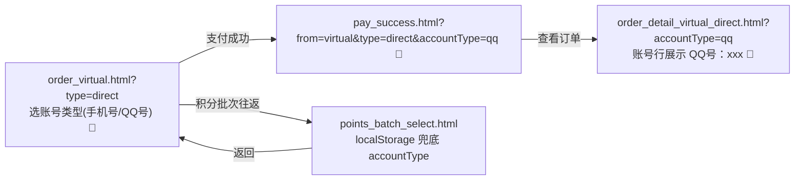

# PRD-福利商城-虚拟商品直充QQ号充值-V0.62

> **版本**: V0.62 | **日期**: 2026-07-31 | **状态**: 原型稿
>
> **基底版本**: V0.61（虚拟商品直充下单流程，直充链路仅支持手机号）
>
> **本版定位**: 在 V0.61 直充链路基础上，将充值账号类型由「仅手机号」扩展为「手机号 / QQ号」二选一，用户在确认订单页的充值账号弹窗内先选账号类型、再输入账号。V0.61 原型与文档保留为历史档，卡密链路与手机号直充链路**零回归**。

---

## 一、变更背景与目标

V0.61 打通了虚拟商品「直充」下单链路，但直充账号硬编码为手机号：占位符、温馨提示、提交校验（`/^1\d{10}$/`）均为手机号规则，无法满足话费以外的直充品类（如 Q 币、QQ 会员等以 QQ号为充值账号的虚拟商品）。

**V0.62 目标**：在充值账号输入弹窗内新增「手机号 / QQ号」账号类型切换 Tab，按所选类型动态切换占位符、温馨提示、历史账号、提交校验，并将所选 `accountType` 透传至支付成功页与直充订单详情页，使详情页正确展示「手机号：xxx / QQ号：xxx」。

### 一.1 范围边界

| 范围 | 内容 |
|------|------|
| **In Scope** | 充值账号弹窗新增账号类型 Tab（手机号/QQ号）；TYPE_COPY 直充文案按账号类型细分（direct_phone / direct_qq）；按类型渲染历史账号（localStorage 分键存储）；按类型提交校验；accountType 经支付成功页透传至直充订单详情页；详情页账号行展示类型前缀 |
| **Out Scope** | 新增 QQ 直充商品/SKU（复用现有 100元话费充值 演示数据）；卡密链路任何改动；手机号直充链路既有行为改动；直充订单详情页商品名/配图随账号类型变化（保持话费演示）；售后/退款 |

---

## 二、页面清单

| 序号 | 页面名称 | 文件名 | 路由 | 状态 | 说明 |
|------|----------|--------|------|------|------|
| 1 | 确认订单（虚拟商品） | order_virtual.html | /pages/order_virtual.html?type=direct | 🔄 增强 | 账号弹窗内新增账号类型 Tab；直充文案/校验/历史账号按类型驱动 |
| 2 | 支付成功 | pay_success.html | /pages/pay_success.html?from=virtual&type=direct&accountType=qq | 🔄 增强 | "查看订单"透传 accountType 至直充详情页 |
| 3 | 订单详情（虚拟-直充） | order_detail_virtual_direct.html | /pages/order_detail_virtual_direct.html?accountType=qq | 🔄 增强 | 充值账号行展示「手机号：/QQ号：」类型前缀 |

> 购物车（cart.html）、商品详情（product_detail_virtual.html）、我的订单（order_list.html）**本版不改动**：商品级 `type: 'direct'` 字段已足够，账号类型是用户在下单环节的输入，无需在商品/列表层提前声明。

---

## 三、账号类型传递机制

沿用 V0.61「URL 参数优先 + localStorage 兜底」思路，新增 `accountType` 维度：

1. **用户选择**：用户在确认订单页充值账号弹窗内点击「手机号 / QQ号」Tab 选择账号类型，写入 `localStorage['order_virtual_account_type']`。
2. **往返兜底**：用户进入积分批次选择（points_batch_select.html）后返回确认订单页时，URL 不带 accountType——此时读 `localStorage['order_virtual_account_type']` 恢复，保证不丢失。
3. **下游透传**：确认订单页支付成功跳支付成功页时携带 `&accountType=<phone|qq>`（仅直充）；支付成功页"查看订单"再透传至直充订单详情页。
4. **默认值**：直充默认 `phone`；卡密不区分（accountType = null，沿用 V0.6 通用充值账号）。

---

## 四、确认订单页账号类型差异（order_virtual.html）

### 四.1 账号类型切换 Tab

在充值账号输入弹窗（`#accountInputDrawer`）内、历史账号区上方，新增两个等宽 Tab：

| Tab | 文案 | 触发 |
|-----|------|------|
| 手机号（默认选中） | 手机号 | switchAccountType('phone') |
| QQ号 | QQ号 | switchAccountType('qq') |

- **仅直充商品显示**该 Tab（卡密商品隐藏，沿用 V0.6 单一充值账号交互）。
- 选中态：主色（橙）文字 + 底部 24px 主色下划线；未选中：灰色文字。
- 切换 Tab 时：更新占位符/温馨提示/账号提示（applyProductType）、切换历史账号（renderSavedAccounts）、清空输入框、重置已选账号。

### 四.2 直充文案按账号类型细分（TYPE_COPY）

原 `direct` 单键拆为 `direct_phone` / `direct_qq`，`applyProductType()` 按 `direct_<accountType>` 取文案：

| 驱动点 | 直充-手机号（direct_phone） | 直充-QQ号（direct_qq） |
|--------|-----------------------------|------------------------|
| 充值方式说明 | 购买后将自动充值到填写的手机号，充值成功后无法撤销 | 购买后将自动充值到填写的QQ号，充值成功后无法撤销 |
| 温馨提示第 2 条 | 请仔细核对充值手机号，充值成功后无法撤销，请勿重复充值 | 请仔细核对充值QQ号，充值成功后无法撤销，请勿重复充值 |
| 充值账号占位符 | 请输入手机号 | 请输入QQ号 |
| 充值账号提示 | 请仔细核对充值手机号，充值成功后无法退款 | 请仔细核对充值QQ号，充值成功后无法退款 |

> 充值方式标签（直充）、商品规格（直充，全国通用）两类账号一致。

### 四.3 历史账号分键存储

| 账号类型 | localStorage 键 | 默认兜底 |
|----------|-----------------|----------|
| 手机号 | `virtual_account_phone` | 演示账号 13800001111 |
| QQ号 | `virtual_account_qq` | 无（首次为空） |

- 每个类型仅保存最近一次确认的账号（单值覆盖）。
- 切换 Tab 即切换展示对应类型的历史账号卡片。
- 直充历史账号卡片明文展示（不脱敏）：手机号 `13800001111`；QQ号 `123456789`。卡密链路沿用 V0.6 脱敏演示账号 `138****1111`。

### 四.4 提交校验按类型分支

| 账号类型 | 校验正则 | 失败提示 |
|----------|----------|----------|
| 手机号（含卡密） | `/^1\d{10}$/` | 请输入正确的手机号 |
| QQ号 | `/^[1-9]\d{4,10}$/`（5-11 位数字，首位不为0） | 请输入正确的QQ号（5-11位数字，首位不为0） |

### 四.5 确认账号展示

确认账号后，订单页"充值账号"行展示带类型前缀的明文账号：`手机号：13800001111` / `QQ号：123456789`（卡密链路保持 V0.6 无前缀明文展示）。

---

## 五、直充订单详情页（order_detail_virtual_direct.html）

充值信息卡片「充值账号」行：**字段名称带账号类型、值为明文账号**：

- 读取 URL `?accountType=`，默认 `phone`。
- 字段名称：`充值账号(手机号)` / `充值账号(QQ号)`（按 accountType）；值：明文账号 `13800001111` / `123456789`。
- 演示数据按账号类型切换：手机号→13800001111，QQ号→123456789。

> 发货提示条、商品名/配图、到账记录折叠逻辑本版不变（保持话费演示）。

---

## 六、页面跳转关系（accountType 透传）

---

## 七、数据字段补充

### 七.1 确认订单页运行时状态（order_virtual.html）

| 字段 | 类型 | 说明 |
|------|------|------|
| currentAccountType | string \| null | 当前账号类型：`phone` / `qq`；卡密为 null。经 `order_virtual_account_type` 持久化 |

### 七.2 localStorage 键

| 键 | 作用域 | 说明 |
|----|--------|------|
| `order_virtual_account_type` | 直充确认订单页 | 用户所选账号类型，积分批次往返兜底 |
| `virtual_account_phone` | 直充-手机号 | 最近一次确认的手机号 |
| `virtual_account_qq` | 直充-QQ号 | 最近一次确认的QQ号 |

### 七.3 URL 参数

| 参数 | 出现页面 | 说明 |
|------|----------|------|
| accountType | pay_success.html、order_detail_virtual_direct.html | `phone` / `qq`，由确认订单页生成并透传 |

---

## 八、验收标准（AC-V062）

| AC 编号 | 验收标准 | Given | When | Then |
|---------|----------|-------|------|------|
| AC-V062-001 | 直充默认手机号 Tab | 进入直充确认订单页（?type=direct） | 打开充值账号弹窗 | "手机号" Tab 默认选中，占位符为"请输入手机号" |
| AC-V062-002 | 切换 QQ号 Tab 更新文案 | 直充账号弹窗 | 点击"QQ号" Tab | 占位符变"请输入QQ号"，温馨提示第2条/账号提示变为QQ号文案 |
| AC-V062-003 | 切换 Tab 交换历史账号 | 已分别确认过手机号与QQ号 | 切换 Tab | 历史账号卡片随之切换为对应类型账号 |
| AC-V062-004 | QQ号非法-非数字/位数不足/首位为0 | QQ号 Tab 下输入"1234"、"12a45"或"01234" | 点击确定/立即支付 | 提示"请输入正确的QQ号（5-11位数字，首位不为0）"，不进入支付 |
| AC-V062-005 | QQ号合法进入支付 | QQ号 Tab 下输入"123456789" | 点击立即支付 | 通过校验，进入收银台 |
| AC-V062-006 | 透传 accountType 至支付成功 | QQ号直充完成支付 | 进入支付成功页 | URL 含 accountType=qq |
| AC-V062-007 | 查看订单跳直充详情带参 | QQ号直充支付成功页 | 点击"查看订单" | 跳 order_detail_virtual_direct.html?accountType=qq |
| AC-V062-008 | 详情页账号行展示类型 | 进入直充订单详情页（?accountType=qq） | 查看充值账号行 | 字段名"充值账号(QQ号)"、值"123456789" |
| AC-V062-009 | 卡密链路零回归 | 直接访问 order_virtual.html（无参） | 打开账号弹窗 | 无账号类型 Tab，演示账号 138****1111，行为同 V0.6 |
| AC-V062-010 | 手机号直充零回归 | 进入直充确认订单页（?type=direct） | 不切换 Tab，输入手机号下单 | 占位符/校验/提示与 V0.61 完全一致 |
| AC-V062-011 | 类型不随积分往返丢失 | QQ号 Tab 下进入积分批次选择 | 返回确认订单页 | 仍为 QQ号 Tab 选中 |

---

## 九、对 V0.61 的影响评估

V0.62 为**纯增量**，依赖以下向后兼容点保证零回归：

| 触点 | 兼容保证 |
|------|----------|
| order_virtual.html | 卡密（currentAccountType=null）走原有单一账号逻辑；直充默认 accountType=phone，渲染/校验与 V0.61 手机号直充一致 |
| TYPE_COPY | 原 `direct` 键拆为 `direct_phone`，文案保持手机号语义不变 |
| confirmAccount | 卡密链路不入库、无类型前缀，与 V0.6 一致 |
| handleSubmit | 卡密与非 qq 类型统一走 `/^1\d{10}$/`，行为同 V0.61 |
| pay_success.html | 无 accountType 时直充详情链接不带该参数，详情页默认 phone |
| order_detail_virtual_direct.html | 无 accountType 参数时默认手机号展示 |

**已知遗留（非本版引入）**：直充订单详情页商品名/配图仍为话费演示，与 QQ号账号组合时为演示性不一致（不影响账号类型展示逻辑）。后续接入真实 QQ 直充 SKU 时一并替换。

---

## 十、变更记录

| 版本 | 日期 | 变更 |
|------|------|------|
| V0.62 | 2026-08-03 | QQ 号提交校验收紧为首位非 0：正则 `/^\d{5,11}$/` → `/^[1-9]\d{4,10}$/`，提示语同步"首位不为0"；AC-V062-004 补"01234"前导零用例。原型与本文档对齐（仅影响 QQ 号分支，卡密/手机号直充零回归）。 |
| V0.62 | 2026-08-03 | 直充链路历史账号改明文（不脱敏）：§4.3 直充历史账号卡片、§4.5 直充确认账号行改明文；卡密链路沿用 V0.6 脱敏不变（保零回归）。 |
| V0.62 | 2026-08-04 | 直充订单详情页「充值账号」字段名改为带类型：充值账号(手机号) / 充值账号(QQ号)，值改为明文账号（去掉"手机号：/QQ号："前缀）；§5、AC-V062-008 同步。 |

*文档结束。V0.62 原型已完成，直充链路支持手机号 / QQ号两种充值账号，卡密与手机号直充链路无回归。*
